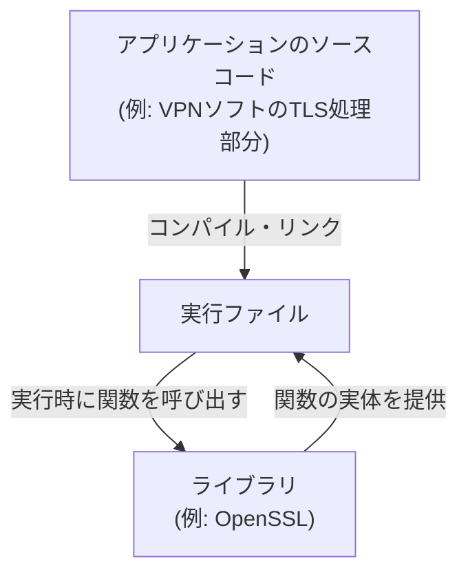
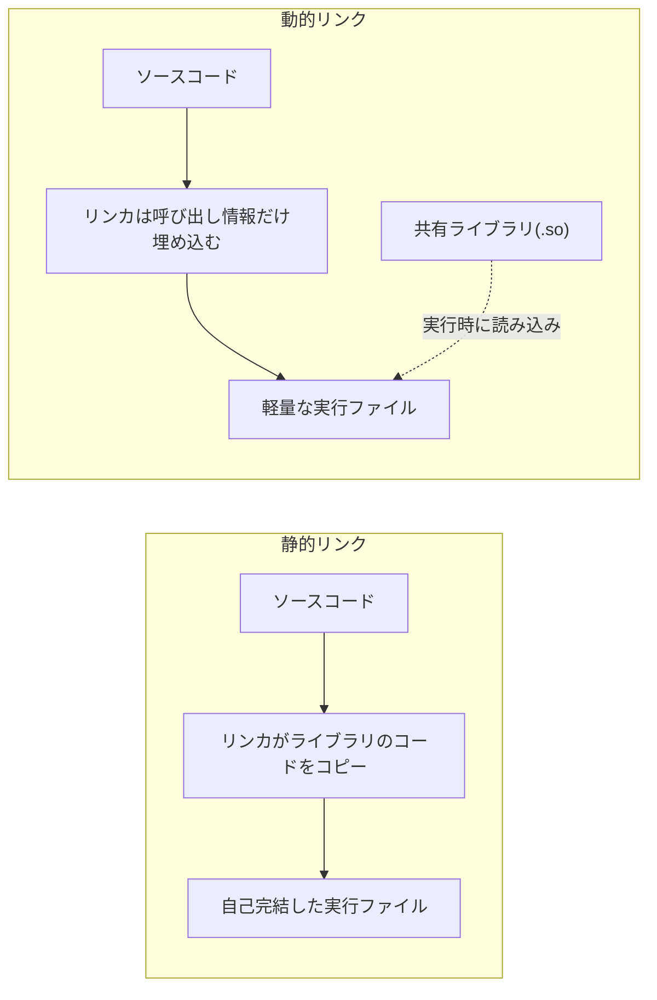

## はじめに

- **この記事で得られること**: 「ライブラリ」という言葉が指す実体——プログラムがどのようにライブラリのコードを呼び出しているのか、静的リンクと動的リンク(共有ライブラリ)がどう違うのか、「ライブラリのバージョンが合わない」という障害がなぜ起きるのかを、体系的に理解できます。
- **対象読者**: サーバー構築・運用やアプリケーション実行環境の管理に関わるインフラエンジニアで、「ライブラリ」という言葉を日常的に扱っているものの、いざ説明しようとすると「プログラムが呼び出す便利な処理のまとまり」という漠然としたイメージ止まりになってしまう方を想定しています。
- **読むのにかかる想定時間**: 約15分

この記事は[『上位1%』シリーズ 全記事ガイド](/sitemap)の一部です。

## 前提知識

- **コンパイル(compile)** : C言語などのソースコードを、CPUが直接実行できる機械語(バイナリ)に変換する処理です。
- **実行ファイル(executable)** : コンパイル・リンクを経て生成された、OS上でそのまま実行できる形式のファイルです。
- **プロセス** : 実行中のプログラムの実体です。詳しくは[デーモン(daemon)とは何か](/articles/linux-daemon-guide)で扱っています。

## 全体像をつかむ

### 一言で言うと

**ライブラリとは、複数のプログラムから共通して使われる処理(関数)をあらかじめコンパイルしてまとめておいたファイルであり、プログラム自身がその処理をゼロから実装し直さずに済むようにするための仕組みです。** 「よく使う処理を部品化して使い回す」という発想自体はプログラミング全般に共通するものですが、ライブラリという言葉は特に、**その部品が独立したファイルとして提供され、コンパイルやリンクという工程を通じて別のプログラムに組み込まれる**という、OS・ビルドシステムのレベルでの仕組みを指します。



自分でゼロから暗号アルゴリズムを実装する代わりに、OpenSSLという暗号処理ライブラリが提供する関数を呼び出すだけで、TLSによる安全な通信を実装できる——これがライブラリの最も基本的な価値です。

## 基礎から徹底解説

### 静的リンクと動的リンク:2つの「組み込み方」

ライブラリの中身(関数の機械語コード)を、実行ファイルにどう組み込むかという観点で、ライブラリは大きく2種類に分かれます。

| 方式 | ファイル形式(Linux) | 組み込むタイミング | 特徴 |
|---|---|---|---|
| 静的ライブラリ(static library) | `.a`(アーカイブ) | コンパイル・リンク時 | ライブラリのコードが実行ファイル自体にコピーされ、1つの独立したファイルになる |
| 動的ライブラリ/共有ライブラリ(shared library) | `.so`(shared object) | 実行時(一部は起動時) | 実行ファイルにはライブラリの「呼び出し方の情報」だけが記録され、実際のコードは実行時に別ファイルから読み込まれる |



**静的リンクは実行ファイルが自己完結する(配布先にライブラリ自体がなくても動く)代わりに、ファイルサイズが大きくなり、同じライブラリを使う複数のプログラムがそれぞれ重複してコードを持つ**ことになります。**動的リンクは複数のプログラムが同じ共有ライブラリファイルをディスク上でもメモリ上でも共有できる**ため、ディスク容量・メモリ使用量の両面で効率的です。多くのLinuxディストリビューションが提供するプログラムの大半は、この動的リンク方式(共有ライブラリ)を採用しています。

### プログラムはどうやってライブラリの関数を見つけるのか

動的リンクの実行ファイルを起動すると、OSは実行ファイル自体だけでなく、**動的リンカ(dynamic linker、Linuxでは`ld.so`/`ld-linux.so`)** という別のプログラムを介して、必要な共有ライブラリを読み込みます。

1. 実行ファイルの中には、「どの共有ライブラリが必要か」「どの関数(シンボル)を使うか」という情報だけが記録されています。
2. 動的リンカが、`/etc/ld.so.conf`や環境変数`LD_LIBRARY_PATH`で指定された検索パスから、必要な`.so`ファイルを探し出します。
3. 見つかった共有ライブラリをプロセスのメモリ空間にマッピングし、実行ファイル内の関数呼び出しが、実際の共有ライブラリ内のコードのアドレスを指すように結び付けます(**シンボル解決**)。

```bash
# 実行ファイルがどの共有ライブラリに依存しているかを確認する
$ ldd /usr/sbin/openvpn
        linux-vdso.so.1
        libssl.so.3 => /lib/x86_64-linux-gnu/libssl.so.3
        libcrypto.so.3 => /lib/x86_64-linux-gnu/libcrypto.so.3
        liblzo2.so.2 => /lib/x86_64-linux-gnu/liblzo2.so.2
        libc.so.6 => /lib/x86_64-linux-gnu/libc.so.6
```

このように、OpenVPNの実行ファイル自体にはTLS/暗号処理のコードは含まれておらず、**起動時にOpenSSL(`libssl`/`libcrypto`)を共有ライブラリとして読み込むことで、初めて暗号化通信を行える状態になります**。これが「OpenVPNはTLSのライブラリ(OpenSSL)を流用している」と説明されるときの、実行の仕組みレベルでの実体です。

<details>
<summary>補足: ヘッダファイルとライブラリ本体の違い</summary>

C言語などでライブラリを使う際、ソースコードには`#include <openssl/ssl.h>`のような**ヘッダファイル**の読み込みが必要です。ヘッダファイルには関数の「名前・引数・戻り値の型」といった宣言(インターフェース)だけが書かれており、実際の処理内容(実装)は含まれていません。実装の本体は`.a`や`.so`といったライブラリファイルの中にあり、コンパイラはヘッダファイルを見て「正しい呼び出し方をしているか」をチェックし、リンカがライブラリファイルから実際のコードを結びつける、という役割分担になっています。

</details>

### パッケージ管理システムとライブラリの関係

Linuxディストリビューションのパッケージ管理システム(`apt`、`dnf`など)は、多くの場合「本体パッケージ」と「開発用パッケージ(`-dev`/`-devel`サフィックス)」を分けて提供します。

- **本体パッケージ(例: `libssl3`)**: 実行に必要な共有ライブラリ(`.so`)本体のみを含みます。すでにコンパイル済みのプログラムを動かすだけならこれで十分です。
- **開発用パッケージ(例: `libssl-dev`)**: ヘッダファイルや、静的リンク用の`.a`ファイル、シンボリックリンクなどを追加で含みます。そのライブラリを使うプログラムを自分でコンパイルする場合に必要になります。

この区別を知らないと、「ソフトウェアをソースからビルドしようとしたら`fatal error: openssl/ssl.h: No such file or directory`のようなエラーが出る」という、開発用パッケージの入れ忘れによるトラブルに直面しがちです。

## プロが見ている視点(上位1%の理解)

### ABI互換性:「同じライブラリ」のはずなのに動かない理由

共有ライブラリは、**ABI(Application Binary Interface、アプリケーション・バイナリ・インターフェース)** と呼ばれる、関数の呼び出し規約やデータ構造のメモリレイアウトの取り決めを介して、実行ファイルと結びついています。ライブラリのメジャーバージョンが上がり、既存の関数のシグネチャ(引数の型・個数)やデータ構造が変わると、 **ソースコード上は互換性があっても、すでにコンパイル済みの実行ファイルは新しいバージョンのライブラリと組み合わせて正しく動作しなくなる(ABI非互換)** ことがあります。

Linuxの共有ライブラリのファイル名に`libssl.so.3`のようにバージョン番号が埋め込まれているのは、この問題への対策です。実行ファイルは「`libssl.so.3`が必要」という情報を持っているため、`libssl.so.3`とABI互換性のない`libssl.so.4`(仮に将来登場した場合)がシステムに入っていても、誤って読み込んでしまうことを防げます。逆に言えば、**「ライブラリはインストールされているのに、特定のアプリケーションだけが起動時にエラーになる」という障害の多くは、要求されているメジャーバージョンのライブラリが存在しないことが原因**です。

### 動的リンクのパフォーマンス上のトレードオフ

動的リンクには、シンボル解決の処理(前述の手順3)を実行時に行うという、静的リンクにはないオーバーヘッドがあります。多くの実装では、プログラム起動時にすべてのシンボルを一括解決するのではなく、 **実際にその関数が初めて呼び出されたタイミングで解決する(遅延バインディング、lazy binding)** ことで、起動時間への影響を抑えています。ごく短時間だけ起動して終了するプログラムを大量に実行するような場面では、この動的リンクのオーバーヘッドが無視できなくなり、あえて静的リンクの実行ファイルを選ぶ(Go言語のバイナリが標準で静的リンクになりやすいのはこの一例です)という設計判断も行われます。

## よくある誤解・つまずきポイント

- **誤解1: 「ライブラリとデーモンは同じようなものだ」**
  ライブラリはプログラムに組み込まれて呼び出される「部品」であり、それ自体が単独のプロセスとして常駐するわけではありません。バックグラウンドで常駐し続けるプロセスである[デーモン](/articles/linux-daemon-guide)とは、そもそもの実行のされ方が異なります。あるデーモンプログラムが、内部でいくつものライブラリを呼び出しながら動作する、という関係にあります。
- **誤解2: 「ライブラリさえインストールすれば、どのバージョンでもプログラムは動く」**
  前述のABI互換性の問題があるため、多くのプログラムは特定のメジャーバージョン(あるいはそれ以上)のライブラリを要求します。バージョンが古すぎても新しすぎても動かないことがあります。
- **誤解3: 「静的リンクの方が常に優れている」**
  自己完結性というメリットはありますが、複数プログラムでのメモリ・ディスクの共有ができない、セキュリティ修正が入ったライブラリに差し替えるだけでは対応できず全プログラムの再ビルドが必要になる、といったデメリットもあります。動的リンクでは、共有ライブラリ本体を1つ更新するだけで、それを利用するすべてのプログラムに修正を反映できます。

## 障害・トラブルシューティングの視点

ライブラリ関連の障害は、**「必要なライブラリが見つからない」のか「見つかったが期待するバージョン・機能ではない」のか**を切り分けるのが基本です。

1. **プログラム起動時に`error while loading shared libraries`が出る**: `ldd <実行ファイル>`で、どの共有ライブラリが「not found」になっているかを確認します。パッケージが未インストールか、`LD_LIBRARY_PATH`の設定漏れが典型的な原因です。
2. **ビルド時に`No such file or directory`(ヘッダファイルが見つからない)が出る**: 開発用パッケージ(`-dev`/`-devel`)がインストールされていないケースです。実行用パッケージとは別に導入が必要です。
3. **ライブラリはあるはずなのに、特定の関数が見つからないというエラーが出る**: インストールされているライブラリのバージョンが、プログラムが要求する関数(シンボル)を持たない古い(または互換性のない)バージョンである可能性があります。`dpkg -l | grep <ライブラリ名>`のようなコマンドでインストール済みバージョンを確認します。

### 予防策・恒久対策

- コンテナイメージや構成管理ツール(Ansibleなど)でライブラリのバージョンを明示的に固定し、「環境によって動いたり動かなかったりする」事態を防ぐ。
- OSやパッケージのアップグレード前に、依存するライブラリのメジャーバージョンアップがないかを確認し、ABI非互換によるアプリケーション停止のリスクを事前に洗い出す。
- 自作アプリケーションを配布する場合、依存ライブラリのバージョン要件を明記するか、Dockerコンテナのように依存関係ごと固定した環境で配布することを検討する。

## まとめ

- ライブラリとは、複数のプログラムから共通して使われる処理をあらかじめコンパイルしてまとめたファイルで、プログラムがゼロから実装し直す手間を省くための仕組みです。
- 静的リンクは実行ファイルにコードをコピーして自己完結させる方式、動的リンク(共有ライブラリ)は実行時に別ファイルとして読み込む方式で、それぞれ異なるトレードオフを持ちます。
- 動的リンクされたプログラムは、動的リンカがシンボル解決を行うことで、実行時に共有ライブラリの関数呼び出しを結びつけています。
- 「ライブラリはあるのに動かない」障害の多くはABI非互換、すなわち要求されているメジャーバージョンのライブラリが存在しないことが原因です。

**今日から意識すべきこと**
1. 起動時エラーに遭遇したら、まず`ldd`でどの共有ライブラリが見つかっていないのかを確認する習慣をつけましょう。
2. ソースからのビルドでヘッダファイルが見つからないというエラーが出たら、実行用パッケージとは別に開発用パッケージ(`-dev`/`-devel`)が必要であることを思い出しましょう。

## 参考文献

- [ld.so(8) — Linux manual page](https://man7.org/linux/man-pages/man8/ld.so.8.html)
- [ldd(1) — Linux manual page](https://man7.org/linux/man-pages/man1/ldd.1.html)
- [Program Library HOWTO — The Linux Documentation Project](https://tldp.org/HOWTO/Program-Library-HOWTO/index.html)
