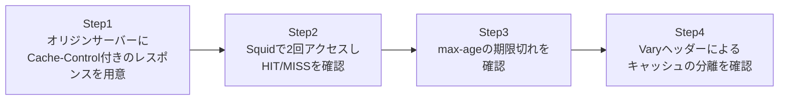

## はじめに

- **この記事で得られること**: [Cache-ControlとVaryヘッダーの仕組み](/articles/cache-control-vary-guide)で学んだ知識を、**実際にSquidをキャッシュプロキシとして構築し、HIT/MISSの挙動、max-ageによる期限切れ、Varyヘッダーによるキャッシュの分離**を、自分の手で確認することで検証します。
- **対象読者**: [Squidハンズオン](/articles/squid-proxy-handson-guide)でURL単位のアクセス制御は経験したものの、Squidのキャッシュ機能そのものを使ったことがなく、Cache-ControlやVaryの座学の内容を、具体的な動作として確認したい方を想定しています。
- **読むのにかかる想定時間**: 約25分(ハンズオン実施込み)

この記事は[『上位1%』シリーズ 全記事ガイド](/sitemap)の一部、[Webプロキシ/キャッシュ基礎シリーズ](/sitemap#シリーズ一覧)の7本目です。[ハンズオン準備マニュアル](/articles/handson-prep-guide)で作成したUbuntu Server環境が2台(プロキシ用に1台、オリジンサーバー用に1台)あれば実施できます。

## 前提知識

- **Squidの基本構築**: [Squidで明示的プロキシを構築するハンズオン](/articles/squid-proxy-handson-guide)で扱った、Squidのインストールとクライアント側の設定です。
- **Cache-ControlとVaryの座学**: [Cache-ControlとVaryヘッダーの仕組み](/articles/cache-control-vary-guide)で扱った、各ディレクティブの意味です。

## 全体像をつかむ

このハンズオンで行うことは、次の4ステップです。



## ハンズオン手順

### Step 1: オリジンサーバーに、Cache-Control付きのレスポンスを用意する

オリジンサーバー役のUbuntu Serverで、`max-age`とVaryヘッダーを付けて応答する、簡易的なサーバーを起動します。

```python
import time
from http.server import BaseHTTPRequestHandler, HTTPServer

class Handler(BaseHTTPRequestHandler):
    def do_GET(self):
        self.send_response(200)
        self.send_header('Cache-Control', 'max-age=10')
        self.send_header('Vary', 'Accept-Language')
        self.end_headers()
        lang = self.headers.get('Accept-Language', 'default')
        body = f"Response generated at {time.time():.2f}, lang={lang}"
        self.wfile.write(body.encode())

HTTPServer(('0.0.0.0', 8080), Handler).serve_forever()
```

```bash
python3 origin_server.py &
```

このサーバーは、**レスポンスを生成した時刻を本文に含める**ことで、キャッシュから返されたのか、オリジンサーバーが新たに生成したのかを、自分の目で区別できるようにしています。

### Step 2: Squidを経由して2回アクセスし、HIT/MISSを確認する

[前のSquidハンズオン](/articles/squid-proxy-handson-guide)で構築したSquidを、このオリジンサーバーへの明示的プロキシとして使います。

```bash
curl -x http://<Squidのアドレス>:3128 -s -D - http://<オリジンサーバーのアドレス>:8080/ -o /dev/null | grep -i x-cache
sleep 2
curl -x http://<Squidのアドレス>:3128 -s -D - http://<オリジンサーバーのアドレス>:8080/ -o /dev/null | grep -i x-cache
```

**実行結果:**

```
X-Cache: MISS from squid
X-Cache: HIT from squid
```

**1回目のアクセスは`MISS`、つまりキャッシュに存在せず、オリジンサーバーへ実際に問い合わせが発生したことが分かります。2回目のアクセスは`HIT`、つまりSquidが保持しているキャッシュから、オリジンサーバーへ一切問い合わせることなく、即座に応答が返っている**ことが確認できました。本文を確認すると、1回目と2回目で、レスポンス生成時刻の値が完全に一致していることでも、これを裏付けられます。

### Step 3: max-ageによる期限切れを確認する

`max-age=10`、つまり10秒でキャッシュが古くなる設定にしているため、**10秒以上待ってから、再度アクセスします。**

```bash
sleep 11
curl -x http://<Squidのアドレス>:3128 -s -D - http://<オリジンサーバーのアドレス>:8080/ -o /dev/null | grep -i x-cache
```

**実行結果:**

```
X-Cache: MISS from squid
```

**10秒を超えてから再アクセスすると、再び`MISS`に戻り、オリジンサーバーへの問い合わせが発生したことが確認できました。** [座学で学んだ`max-age`](/articles/cache-control-vary-guide)という数値が、実際にはSquid内部で、この具体的な期限切れ判定として機能していることが、ここで裏付けられました。

### Step 4: Varyヘッダーによるキャッシュの分離を確認する

**異なる`Accept-Language`ヘッダーを付けて、同じURLへアクセスします。**

```bash
curl -x http://<Squidのアドレス>:3128 -s -D - -H "Accept-Language: ja" http://<オリジンサーバーのアドレス>:8080/ -o /tmp/res_ja.txt | grep -i x-cache
curl -x http://<Squidのアドレス>:3128 -s -D - -H "Accept-Language: en" http://<オリジンサーバーのアドレス>:8080/ -o /tmp/res_en.txt | grep -i x-cache
cat /tmp/res_ja.txt
cat /tmp/res_en.txt
```

**実行結果:**

```
X-Cache: MISS from squid
X-Cache: MISS from squid
Response generated at 1760000001.23, lang=ja
Response generated at 1760000001.45, lang=en
```

**`Accept-Language: ja`と`Accept-Language: en`、それぞれ異なるヘッダーでのアクセスが、両方とも`MISS`になり、それぞれ別々の(生成時刻が異なる)レスポンスとして扱われている**ことが確認できました。[座学で扱った`Vary`ヘッダー](/articles/cache-control-vary-guide)が、「URLが同じでも、指定したヘッダーの値が異なれば、別々のキャッシュとして管理する」という挙動を、実際にSquidの内部で引き起こしていることが、ここで裏付けられました。

<details>
<summary>Varyの指定を外すと、何が起きるか</summary>

試しに、オリジンサーバー側のコードから`self.send_header('Vary', 'Accept-Language')`の行を削除し、サーバーを再起動してから、同じ手順をもう一度試してみてください。**`Accept-Language: ja`でキャッシュを作った後、`Accept-Language: en`でアクセスしても、`X-Cache: HIT`が返り、`lang=ja`のレスポンス(本来は英語ユーザー向けであるべきではない内容)が、そのまま配信されてしまうことが確認できます。** これが、[座学で扱った](/articles/cache-control-vary-guide)「Varyの指定漏れが引き起こす、実務上よくある障害」の、具体的な再現です。

</details>

## プロが見ている視点(上位1%の理解)

### X-Cacheヘッダーは、本来のレスポンスには存在しない、デバッグ専用の情報である

このハンズオンで確認した`X-Cache`ヘッダーは、**オリジンサーバーが生成したものではなく、Squid自身が、デバッグ・運用調査のために、レスポンスへ追加で付与しているヘッダーです。** 実務でキャッシュの挙動がおかしいと疑われる場面では、まずこの`X-Cache`のようなデバッグ用ヘッダーが有効になっているかを確認し、**「サーバーが遅いのか」「キャッシュがMISSし続けているのか」「キャッシュが意図せずHITしているのか」を、憶測ではなく、ヘッダーの値という具体的な証拠に基づいて切り分ける**ことが、トラブルシューティングの第一歩になります。

## よくある誤解・つまずきポイント

- **誤解1: 「HITとMISSは、オリジンサーバー自身が判断して返す情報である」**
  HIT/MISSの判定と、X-Cacheヘッダーの付与は、キャッシュプロキシ(Squid)自身が行っています。オリジンサーバーは、この判定に関与していません。
- **誤解2: 「max-ageの期限が切れると、キャッシュは即座に削除される」**
  期限が切れたキャッシュは、次にリクエストが来たタイミングで、オリジンサーバーへの再取得が発生するだけです。期限切れ自体を監視して、能動的に削除する処理が常に動いているわけではありません。
- **誤解3: 「Varyヘッダーを指定すればするほど、キャッシュの効率が上がる」**
  Varyで指定する条件を増やすほど、キャッシュが細かく分割され、同じ内容がキャッシュに乗る確率(ヒット率)は、むしろ下がっていきます。本当に必要な条件だけを指定することが重要です。

## 障害・トラブルシューティングの視点

1. **期待通りにキャッシュがHITしない**: `X-Cache`ヘッダーで実際の判定結果を確認し、`Cache-Control`の`max-age`や`no-store`の設定を見直します。
2. **異なる条件のユーザーに、同じキャッシュが返ってしまう**: `Vary`ヘッダーの指定が、実際にレスポンスを変化させている条件(言語、デバイスなど)を、すべて正しくカバーしているかを確認します。
3. **キャッシュの効率(ヒット率)が低い**: `Vary`で指定している条件が、過剰に細かくなっていないかを確認します。

## まとめ

- Squidは、`X-Cache`という独自のヘッダーを使い、HIT(キャッシュから応答)とMISS(オリジンへ問い合わせ)を、デバッグ用の情報として明示的に示します。
- `Cache-Control`の`max-age`で設定した期限が切れると、次回のアクセスで再び`MISS`となり、オリジンサーバーへの問い合わせが発生します。
- `Vary`ヘッダーを指定すると、同じURLでも、指定したリクエストヘッダーの値が異なれば、別々のキャッシュとして正しく分離されます。
- `Vary`の指定を忘れると、本来別々であるべきレスポンスが、同じキャッシュとして誤って配信されてしまいます。

**今日から意識すべきこと**
1. キャッシュの挙動を調査する際は、X-Cacheのようなデバッグ用ヘッダーの有無を、まず確認する習慣をつけましょう。
2. Varyヘッダーを設定する際は、本当にレスポンスを変化させている条件だけを、必要最小限に絞り込みましょう。

## 参考文献

- [Squid: Configuring Cache Peers and Debugging | Squid Wiki](https://wiki.squid-cache.org/)
- [RFC 7234 - HTTP/1.1 Caching](https://datatracker.ietf.org/doc/html/rfc7234)
