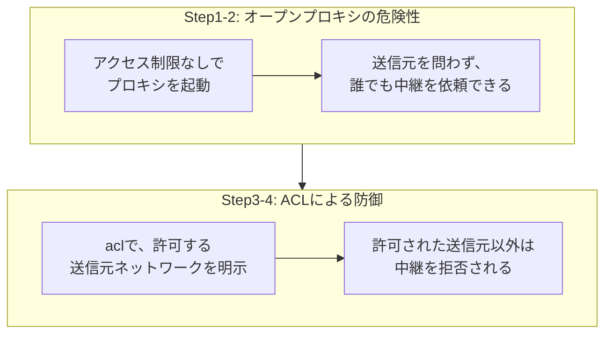

## はじめに

- **この記事で得られること**: [Squidで明示的プロキシを構築するハンズオン](/articles/squid-proxy-handson-guide)で構築したプロキシが、**アクセス制限を一切設定しないと、インターネット上の誰からでも中継依頼を受け付けてしまう「オープンプロキシ」になってしまう**という危険性を、安全な検証環境の中だけで再現し、**Squidの`acl`設定**で、送信元ネットワークを明示的に許可・拒否することによる防御を確認します。
- **対象読者**: Squidの基本的な設定方法は理解しているものの、プロキシへのアクセス制限が、具体的にどういう設定で実現されているのかを説明できない方を想定しています。
- **重要な注意**: **このハンズオンは、自分が管理する検証環境の防御力を高めるための、教育・防御目的のものです。** 実運用中の他者の環境に対して、許可なくこの手順を実行しないでください。本記事で使う検証環境は、自分自身で用意したサーバーに対してのみ通信を送るものであり、第三者のシステムへの攻撃手順は一切含まれていません。
- **読むのにかかる想定時間**: 約22分(ハンズオン実施込み)

この記事は[『上位1%』シリーズ 全記事ガイド](/sitemap)の一部、[Webプロキシ・キャッシュシリーズ](/sitemap#シリーズ一覧)の10本目です。[ハンズオン準備マニュアル](/articles/handson-prep-guide)で作成したUbuntu Server環境が1台あれば実施できます。

## 前提知識

- **Squidの基本操作**: [Squidで明示的プロキシを構築するハンズオン](/articles/squid-proxy-handson-guide)で扱った、Squidの基本的な設定方法です。

## 全体像をつかむ

このハンズオンでは、次の2段階を確認します。



## ハンズオン手順

### Step 1: アクセス制限を一切設定せずに、Squidを起動する

```bash
sudo apt install -y squid
```

`/etc/squid/squid.conf`の、デフォルトで用意されているアクセス制限のルール(`http_access deny !Safe_ports`などを除く、送信元ネットワークに関するルール)を、意図的にすべて無効化します。

```
http_access allow all
http_port 3128
```

```bash
sudo systemctl restart squid
```

### Step 2: 検証用の別ネットワークから、中継を依頼する

このプロキシが構築された検証環境とは別のネットワーク(検証用の、もう1台のクライアント)から、このプロキシ経由で通信を試みます。

```bash
curl -x http://<プロキシのIPアドレス>:3128 http://example.com/ -o /dev/null -s -w "%{http_code}\n"
```

**実行結果:**

```
200
```

**このプロキシを構築した本人以外の、まったく無関係なネットワークからのリクエストが、何の制限もなく中継されてしまいました。** これが**オープンプロキシ**です。もしこのプロキシがインターネット上に公開されていれば、**第三者が、このプロキシを経由して、自分の身元(IPアドレス)を隠しながら、別のサーバーへの不正なアクセスを行う踏み台**として、悪用されてしまう危険性があります。

<details>
<summary>なぜ、意図せずオープンプロキシが生まれてしまうのか</summary>

**Squidの設定は、「何を許可するか」を明示的に書き加えていく形式であり、送信元に関する制限を書き忘れると、デフォルトの挙動次第で、意図せず全世界からのアクセスを許可してしまう構成になり得ます。** 「とりあえず動かしたい」という理由で、検証中に`http_access allow all`のような、広すぎる許可を一時的に設定し、本番運用前にそれを元に戻す作業を忘れてしまうことが、オープンプロキシが生まれる典型的な経緯です。

</details>

### Step 3: ACLで、許可する送信元ネットワークを明示する

```bash
sudo tee /etc/squid/squid.conf << 'EOF'
acl allowed_network src 192.168.1.0/24
http_access allow allowed_network
http_access deny all
http_port 3128
EOF
sudo systemctl restart squid
```

**`acl allowed_network src 192.168.1.0/24`は、「このIPアドレス範囲からの通信だけを、`allowed_network`という名前で識別する」という定義です。** そして、`http_access allow allowed_network`で、その範囲からの通信だけを許可し、`http_access deny all`で、それ以外のすべてを明示的に拒否しています。

### Step 4: 許可されていないネットワークからのアクセスが、拒否されることを確認する

```bash
curl -x http://<プロキシのIPアドレス>:3128 http://example.com/ -o /dev/null -s -w "%{http_code}\n"
```

**実行結果:**

```
403
```

**先ほどとは異なり、許可されていないネットワークからのリクエストが、403(Forbidden)として拒否されました。** `allowed_network`に指定したネットワーク範囲内のクライアントから、同じリクエストを送ると、正常に中継されることも確認してください。

## プロが見ている視点(上位1%の理解)

### アクセス制御は、「許可を書き加える」ではなく「最後に全拒否で締める」ことが前提になる

このハンズオンの最大の教訓は、**許可したいルールだけを書き並べても、最後に明示的な拒否ルール(`http_access deny all`)がなければ、想定外の送信元からのアクセスを、確実に拒否できるとは限らない**という点です。**アクセス制御のルールは、上から順に評価され、最初にマッチしたルールが適用されるため、「想定した許可ルールに、どの送信元もマッチしなかった場合に、最終的にどう扱われるか」を、常に明示的に定義しておく必要があります。** これは、[DNS増幅攻撃への防御(レスポンスレートリミティング)](/articles/dns-amplification-rrl-handson-guide)や、[メールのオープンリレー対策](/articles/mail-open-relay-handson-guide)とも共通する、**「サービスを第三者に無制限に開放してしまう構成は、構築者の意図とは無関係に、容易に生まれてしまう」という、プロキシ・DNS・メールといった、中継型のサービス全般に共通するリスク構造**です。上位1%のエンジニアは、新しい中継サービスを構築するたびに、「このサービスは、誰からの利用を想定していて、それ以外は、本当に拒否されるようになっているか」を、明示的に確認します。

## よくある誤解・つまずきポイント

- **誤解1: 「Squidを導入した時点で、自動的にアクセス制限がかかる」**
  アクセス制限の設定は、明示的に記述しなければ有効になりません。検証用の緩い設定を、本番運用前に見直し忘れることが、オープンプロキシの典型的な原因です。
- **誤解2: 「許可したいネットワークのルールだけ書けば、それ以外は自動的に拒否される」**
  ルールの末尾に、明示的な拒否ルール(`http_access deny all`)がなければ、意図しない挙動になる可能性があります。
- **誤解3: 「オープンプロキシは、プロキシサーバー自身への攻撃にしかならない」**
  オープンプロキシの本当の危険性は、第三者が、このプロキシを踏み台として、別の第三者への攻撃の身元を隠す手段に悪用されることです。

## 障害・トラブルシューティングの視点

1. **想定した送信元からのアクセスまで、拒否されてしまう**: `acl`で定義したIPアドレス範囲が、実際の送信元のIPアドレスと一致しているかを確認します。
2. **設定を変更したのに、挙動が変わらない**: Squidの設定変更後、`systemctl restart squid`(または`reload`)を実行し、変更が反映されているかを確認します。
3. **外部に公開しているプロキシの不正利用が疑われる**: アクセスログを確認し、想定していない送信元からの、大量または異常なパターンのリクエストがないかを調査します。

## まとめ

- アクセス制限を一切設定していないプロキシは、送信元を問わず誰からでも中継を依頼できる、「オープンプロキシ」になってしまいます。
- オープンプロキシは、第三者が身元を隠しながら別のサーバーへ不正アクセスするための、踏み台として悪用される危険性があります。
- Squidの`acl`設定で、許可する送信元ネットワークを明示的に定義し、それ以外を明示的に拒否することで、この危険性を防ぐことができます。
- アクセス制御のルールは、許可ルールを並べるだけでなく、最後に明示的な拒否ルールで締めることが前提になります。

**今日から意識すべきこと**
1. 新しいプロキシやその他の中継サービスを構築する際は、必ずアクセス制限のルールを、最初の設計段階から組み込みましょう。
2. アクセス制御のルールを書く際は、「どのルールにもマッチしなかった場合、最終的にどう扱われるか」を、常に明示的に確認しましょう。

## 参考文献

- [Squid: ACLs](https://wiki.squid-cache.org/SquidFaq/SquidAcl)
- [Open Proxy | OWASP](https://owasp.org/www-community/attacks/Open_Proxy)
