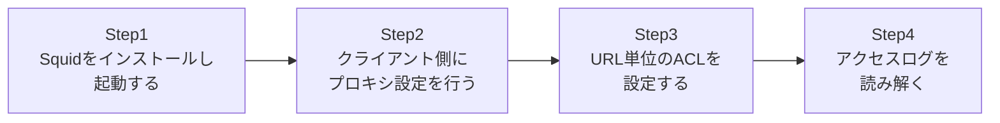

## はじめに

- **この記事で得られること**: [プロキシとファイアウォールの使い分けを『上位1%』の視点で理解する](/articles/proxy-firewall-guide)で扱った「プロキシは通信の中身(URLなど)を理解して制御する」という仕組みを、OSSのプロキシソフトウェア**Squid**を使って実際に構築し、体験します。クライアント側にプロキシ設定を行い、URL単位でアクセスを許可・拒否するACL(アクセス制御リスト)を設定し、実際にどの通信が中継され、どの通信が拒否されたのかを、アクセスログから読み解きます。
- **対象読者**: プロキシという概念は理解しているが、実際にプロキシサーバーを構築し、クライアント側から利用したことがない方を想定しています。
- **読むのにかかる想定時間**: 約25分(実際に構築しながら進める場合は45分程度を見込んでください)

この記事は[『上位1%』シリーズ 全記事ガイド](/sitemap)の一部、[Webプロキシ・キャッシュ基礎シリーズ](/sitemap#シリーズ一覧)の3本目です。[ハンズオン準備マニュアル](/articles/handson-prep-guide)で作成したUbuntu Server環境で実施できます。

## 前提知識

- [プロキシとファイアウォールの使い分けを『上位1%』の視点で理解する](/articles/proxy-firewall-guide): 明示的プロキシと透過型プロキシの違いが、この記事の前提になっています。

## 全体像をつかむ

このハンズオンで行うことは、次の4ステップです。



## ハンズオン手順

### Step 1: Squidをインストールし、起動する

Ubuntu ServerにSquidをインストールします。

```bash
sudo apt update
sudo apt install -y squid
sudo systemctl status squid
```

**既定の設定のままでも、Squidは3128番ポートで、明示的プロキシとして動作を開始しています。** ただし既定では、`localhost`からのアクセスなど、限定的な範囲しか許可されていません。

### Step 2: クライアント側にプロキシ設定を行う

別の端末(または同じVM内の別ターミナル)から、このSquidサーバーを明示的プロキシとして使うよう設定します。

```bash
export http_proxy="http://<Squidサーバーのアドレス>:3128"
export https_proxy="http://<Squidサーバーのアドレス>:3128"
curl http://example.com/
```

**[プロキシとファイアウォールの使い分け](/articles/proxy-firewall-guide)で扱った通り、これが「明示的プロキシ」です。** クライアント(この場合は`curl`)が、自分がSquidを経由していることを、環境変数を通じて明示的に認識しています。まだACLを設定していない状態では、既定の設定次第で、意図した通りにアクセスできる場合とできない場合があります。

### Step 3: URL単位のACLを設定する

`/etc/squid/squid.conf`を編集し、特定のドメインへのアクセスだけを拒否するACLを追加します。

```bash
sudo nano /etc/squid/squid.conf
```

```
acl blocked_sites dstdomain .blocked-example.test
http_access deny blocked_sites
http_access allow localnet
http_access allow localhost
http_access deny all
```

**`acl blocked_sites dstdomain .blocked-example.test`が、`blocked-example.test`というドメイン(およびそのサブドメイン)を、`blocked_sites`という名前のグループとして定義しています。** その上で`http_access deny blocked_sites`が、そのグループへのアクセスを拒否しています。**この`http_access`のルールは、上から順に評価され、最初にマッチしたルールが適用される**という点に注意してください。設定を反映します。

```bash
sudo systemctl reload squid
```

### Step 4: アクセスログを読み解く

Squid経由で、許可されているサイトと、拒否したサイトの両方へアクセスしてみます。

```bash
curl http://example.com/
curl http://blocked-example.test/
```

2つ目のコマンドは、`403 Forbidden`などのエラーになるはずです。Squidのアクセスログを確認します。

```bash
sudo tail -f /var/log/squid/access.log
```

**ログの各行には、タイムスタンプ・クライアントのIPアドレス・処理結果(`TCP_DENIED`など)・アクセス先のURLが記録されています。** `TCP_DENIED`という結果と共に`blocked-example.test`への行が記録されていれば、ACLが意図通りに機能していることが確認できます。

## プロが見ている視点(上位1%の理解)

### http_accessルールの評価順序という、実務で頻出する落とし穴

Step 3で設定した`http_access`のルールは、**上から順に評価され、最初にマッチしたルールで即座に確定します。それ以降のルールは一切評価されません。** これは、[Kerberoastingハンズオン](/articles/ad-kerberoasting-handson-guide)などで扱ったACLの評価順序と、発想としてよく似ています。もし`http_access allow all`のような広いルールを、`deny`ルールより先に書いてしまうと、それ以降の`deny`ルールは永久に評価されず、意図しない全許可の状態になってしまいます。**Squidの設定でアクセス制御が意図通りに機能しない場合、最初に疑うべきは、ルールの記述順序**です。

### プロキシのACLは「アプリケーション層の知識」があって初めて実現できる

このハンズオンで設定した`dstdomain`によるACLは、[プロキシとファイアウォールの使い分け](/articles/proxy-firewall-guide)で扱った、「プロキシはHTTPリクエストの中身(この場合はホスト名)を実際に理解して制御している」ということの、具体的な実装例です。ファイアウォールがIPアドレスだけを見て判断するのに対し、Squidは、同じIPアドレスを持つサーバーであっても、リクエストの中の`Host`ヘッダーやSNI(TLSの場合)を見て、ドメイン名単位で許可・拒否を判断できます。この違いこそが、プロキシとファイアウォールの根本的な役割の違いです。

## よくある誤解・つまずきポイント

- **誤解1: 「http_accessのルールは、すべて評価された上で、最も厳しい判定が適用される」**
  実際には上から順に評価され、最初にマッチしたルールで即座に確定します。ルールの記述順序が結果を左右します。
- **誤解2: 「ACLで拒否したドメインへのアクセスは、ネットワークレベルで到達不能になる」**
  Squidが返しているのはHTTPレベルの拒否応答(403など)であり、プロキシを経由しない別の経路(直接接続など)からは、依然として到達できる可能性があります。
- **誤解3: 「Squidを起動しただけで、既定の設定のまま安全に本番利用できる」**
  既定の設定は検証用途を想定した最小限のものであり、実運用では、許可する送信元ネットワークの範囲などを、目的に応じて明示的に設定する必要があります。

## 障害・トラブルシューティングの視点

1. **`curl`が`Connection refused`になる**: Squidサービスが実際に起動しているか、`sudo systemctl status squid`で確認してください。ファイアウォール(ufwなど)で3128番ポートがブロックされていないかも確認します。
2. **ACLで拒否したはずのサイトにアクセスできてしまう**: `http_access`のルールの順序を確認してください。許可ルールが拒否ルールより先に書かれていると、拒否ルールは評価されません。
3. **設定変更後、`reload`してもACLが反映されない**: `squid -k parse`(または`squid -k reconfigure`前の構文チェック)で、設定ファイルに構文エラーがないかを確認してください。

## まとめ

- Squidは、明示的プロキシとして、クライアントからの通信を中継するOSSのプロキシソフトウェアです。
- `dstdomain`のようなACLを使うことで、IPアドレスではなくドメイン名単位でのアクセス制御が可能になります。
- `http_access`のルールは上から順に評価され、最初にマッチしたルールが適用されるため、記述順序が非常に重要です。
- アクセスログには、実際にどの通信が許可・拒否されたかが記録され、ACLの動作確認に使えます。

**今日から意識すべきこと**
1. Squidの`http_access`ルールを書くときは、より具体的な拒否ルールを、より広い許可ルールより先に書く習慣をつけましょう。
2. ACLが意図通りに機能しているかは、必ずアクセスログで実際の結果を確認しましょう。

## 参考文献

- [Squid: ACLs](https://www.squid-cache.org/Doc/config/acl/)
- [Squid: http_access](https://www.squid-cache.org/Doc/config/http_access/)
