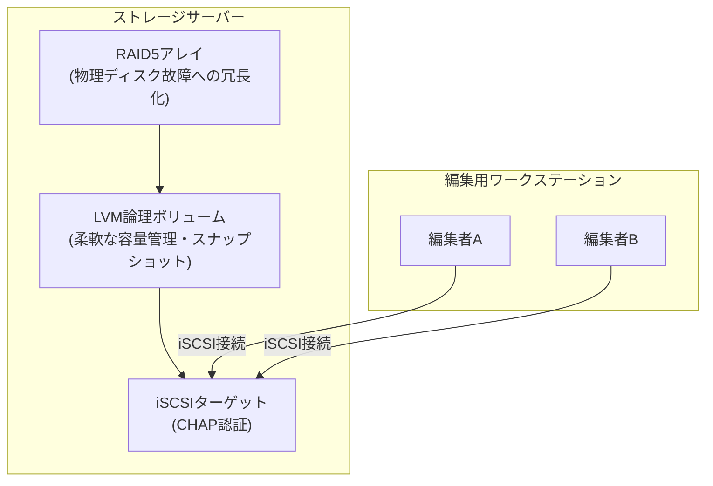

## はじめに

- **この記事で得られること**: ここまでのハンズオンで、1つずつ個別に習得してきた技術(RAID1・RAID5による冗長化とパリティの仕組み、iSCSIによるSANの構築とCHAP認証、LVMによる論理ボリューム管理とスナップショット)を、**1つの架空の映像制作スタジオの共有ストレージ基盤へ、自分の力で統合する**、ストレージ学科の卒業制作です。これまでの記事が「手順をなぞって、1つの技術を確実に身につける」ことを目的としていたのに対し、この記事は**要件だけを提示し、どの技術を、どう組み合わせるかを、自分で設計する**という、実務そのものに近い形式を取ります。
- **対象読者**: ストレージ学科の3年生・4年生・大学院の内容を一通り終え、個々のハンズオンは実施できるが、それらを組み合わせて1つのストレージ基盤を設計した経験がない方を想定しています。
- **読むのにかかる想定時間**: 設計・構築・文書化を含めて、数日〜1週間程度を想定しています(1回のハンズオンとしては最も重量級です)。

この記事は[『上位1%』シリーズ 全記事ガイド](/sitemap)の一部です。[ストレージ学科の全カリキュラム](/university#ストレージ学科)の、卒業制作にあたる位置づけです。

## 前提知識

このハンズオンは、新しい技術を教えるものではありません。**以下の、すでに実施済みのハンズオンで習得した技術を、組み合わせて使います。**

- [RAIDとWindowsのディスク管理の関係を『上位1%』の視点で理解する](/articles/disk-raid-fundamentals-guide)
- [mdadmでLinuxソフトウェアRAID1を構築し、ディスク障害とリビルドを自分の手で再現するハンズオン](/articles/mdadm-raid-handson-guide)
- [RAID5とRAID6のパリティ計算の仕組みを『上位1%』の視点で理解する](/articles/raid5-parity-guide)
- [mdadmでRAID5を構築し、パリティによるデータ復元を自分の手で確認するハンズオン](/articles/mdadm-raid5-handson-guide)
- [iSCSIの仕組みを『上位1%』の視点で理解する](/articles/iscsi-guide)
- [シンプロビジョニングの仕組みを『上位1%』の視点で理解する](/articles/thin-provisioning-guide)
- [LVMスナップショットを自分の手で作成し、コピーオンライトの正体を確認するハンズオン](/articles/lvm-snapshot-handson-guide)
- [iSCSIが認証なしで乗っ取られる危険性を自分の手で再現し、CHAP認証による防御を確認するハンズオン](/articles/iscsi-chap-hardening-handson-guide)

## 課題設定:架空の映像制作スタジオの共有ストレージ基盤

**あなたは、架空の映像制作スタジオ「KoiKoi Studio」のインフラエンジニアです。この会社では、これまで編集者が各自のノートPCのローカルディスクに素材を抱え込んでおり、ディスク故障による素材の消失や、複数人での同時編集ができないという課題を抱えていました。あなたに与えられた課題は、次の要件をすべて満たす、複数の編集用ワークステーションが共有できるストレージ基盤を、自分の手で構築することです。**

### 要件1: 1台のディスクが故障しても、素材データが失われないようにする

**物理ディスクが1台故障しても、映像素材のデータが失われず、サービスを継続できる構成を構築してください。** なぜRAID1ではなく、あるいはなぜRAID1を選ぶのか、採用した方式の理由を、容量効率と復元時の処理コストの両面から説明できるようにしてください。

### 要件2: 複数の編集用ワークステーションが、安全に同じストレージへ接続できるようにする

**編集用ワークステーションから、ネットワーク経由でストレージへ接続できる仕組みを構築してください。** 接続できる相手を、正しい認証情報を持つワークステーションだけに制限してください。

### 要件3: 将来の素材データの増加に備え、柔軟に容量を管理できるようにする

**ストレージの容量を、後から柔軟に拡張・再編成できる構成にしてください。** 単純にRAIDアレイをそのままファイルシステムとして使うのではなく、間に1段階、柔軟性を持たせるための層を挟む設計を検討してください。

### 要件4: リスクのある作業の前に、安全に元の状態へ戻せる体制を作る

**ファイルシステムの変換や、大規模なデータ移行など、失敗のリスクがある作業を行う前に、作業直前の状態へ、短時間で戻せる仕組みを用意してください。** この仕組みが、物理障害そのものへの対策にはならないことも、設計書の中で明記してください。

### 要件5: ストレージの利用効率と、容量不足のリスクのバランスを検討する

**複数の編集プロジェクトへ、それぞれ余裕を持った容量のボリュームを割り当てたいが、実際にすぐ使われる容量は、プロジェクトごとに大きく異なることが分かっています。** この状況に対して、どのような容量割り当ての方針を取るべきか、そのリスクとあわせて検討してください。

### 要件6: 障害が発生したことに、運用者が気づける体制を作る

**RAIDアレイが縮退状態になった場合に、運用者が気づかないまま放置されることがないようにしてください。** 具体的な検知の方法を、設計書に記載してください。

## 成果物の要件:ポートフォリオとしてまとめる

**このハンズオンの最終的な成果物は、実際に動いた構成の確認結果だけではありません。** GitHubなどのリポジトリに、次の内容を含む形でまとめてください。

- **README.md**: このシナリオの概要、あなたが採用したストレージ基盤の全体像(mermaidなどの図を含む)
- **設計判断の記録**: 「なぜその技術・構成を選んだのか」という、判断の理由。特に、RAID方式の選定理由と、容量効率とのトレードオフが発生した箇所について
- **実施手順**: 実際に実行した設定や、検証コマンドの記録
- **障害対応手順書**: 縮退状態を検知した際に、運用者が取るべき具体的な手順
- **振り返り**: 実施してみて分かった課題、実際の実務であれば追加で検討すべき点(バックアップとの役割分担、監視ツールとの連携など)

**この成果物こそが、転職活動やポートフォリオとして提示できる、具体的な実績になります。** 単に「mdadmでRAIDを構築しました」と説明するよりも、「複数のワークステーションが共有する実運用環境という現実的な制約の中で、複数の技術を組み合わせて設計し、容量効率と安全性のトレードオフを言語化できる」ことを示せる方が、はるかに説得力があります。

## プロが見ている視点(上位1%の理解)

### 「手順をなぞる力」と「要件から設計する力」は、まったく別のスキルである

これまでのハンズオンは、いずれも「Step 1、Step 2……」という、決められた手順をなぞる形式でした。**しかし、実際の実務で評価されるのは、手順書通りに作業を実行する力ではなく、与えられた要件(この記事でいう「要件1〜6」)から、どの技術を、どう組み合わせるべきかを、自分で設計する力です。** この2つは、似ているようでまったく別のスキルです。個々のハンズオンをすべて完了していても、それらを組み合わせて1つの一貫したストレージ基盤を設計した経験がなければ、実務での即戦力にはなりません。この卒業制作は、その橋渡しを行うための、意図的な設計になっています。

### なぜ「複数ワークステーション共有+将来の拡張」という設定なのか

このハンズオンが、単発の技術デモではなく、あえて「複数の利用者が同時にアクセスし、将来的にデータが増え続ける」という、現実的なプロジェクトを模した設定にしているのには理由があります。**実務のストレージ基盤構築の多くは、単一の目的だけで完結せず、物理障害への冗長性・アクセス制御の安全性・将来の拡張性・運用時の安全性という、複数の軸を同時に満たす必要があります。** RAIDの基本的な冗長化だけを知っていても、その先にあるiSCSIによる安全な共有・LVMによる柔軟な容量管理・スナップショットによる安全な運用までを見通せなければ、実際のプロジェクトでは通用しません。この卒業制作を通じて、個々の技術の知識を、**ストレージ基盤全体のライフサイクルを見通す設計力**へと昇華させることが、最終的な狙いです。

## よくある誤解・つまずきポイント

- **誤解1: 「このハンズオンは、決められた1つの正解の構成が存在する」**
  このハンズオンには、唯一の正解はありません。要件を満たす設計であれば、複数の妥当なアプローチが存在します。README.mdに、あなたが選んだ設計とその理由を記録することが重要です。
- **誤解2: 「成果物は、動作した証拠の確認結果だけで十分である」**
  動作確認は重要ですが、それだけでは不十分です。設計判断の理由を言語化できることが、このハンズオンの本当の価値です。
- **誤解3: 「個々のハンズオンをすべて完了していれば、このハンズオンも簡単に終わる」**
  個々の技術を知っていることと、それらを1つの一貫した設計へ統合することの間には、大きな距離があります。多くの時間を要することを想定しておいてください。

## 障害・トラブルシューティングの視点

このハンズオンは、個々の技術的なトラブルシューティングよりも、**設計上の手戻り**が主な課題になります。

1. **要件を満たしているつもりが、後から矛盾に気づく**: 実装を始める前に、README.mdの設計部分だけを先に書き上げ、要件1〜6のすべてを満たせているかを、文章の段階で確認してください。
2. **個々のハンズオンの手順を忘れてしまっている**: 各要件に対応する前提記事のリンクを、遠慮なく読み返してください。この卒業制作は、暗記力ではなく設計力を試すものです。
3. **どこまで作り込めばよいか分からない**: 「転職活動で、初対面の面接官にこのREADME.mdを見せて、設計判断を説明できるか」を、完成度の目安にしてください。

## まとめ

- この卒業制作は、ストレージ学科でこれまで個別に習得した技術を、1つの架空の映像制作スタジオの共有ストレージ基盤へ統合する、総合演習です。
- 求められているのは、手順をなぞる力ではなく、要件から自分で設計する力です。
- 成果物は、動作確認の結果だけでなく、設計判断の理由を言語化した文書として、ポートフォリオにまとめてください。

**今日から意識すべきこと**
1. 個々のハンズオンを学ぶときも、「これは、将来どんな要件の中で使うことになるか」を意識する習慣をつけましょう。
2. 技術的な成果物だけでなく、容量効率と安全性のトレードオフを言語化する習慣を、日々の業務でも意識しましょう。

## 参考文献

- [ストレージ学科の全カリキュラム](/university#ストレージ学科)
