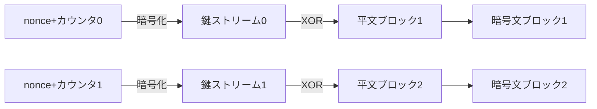
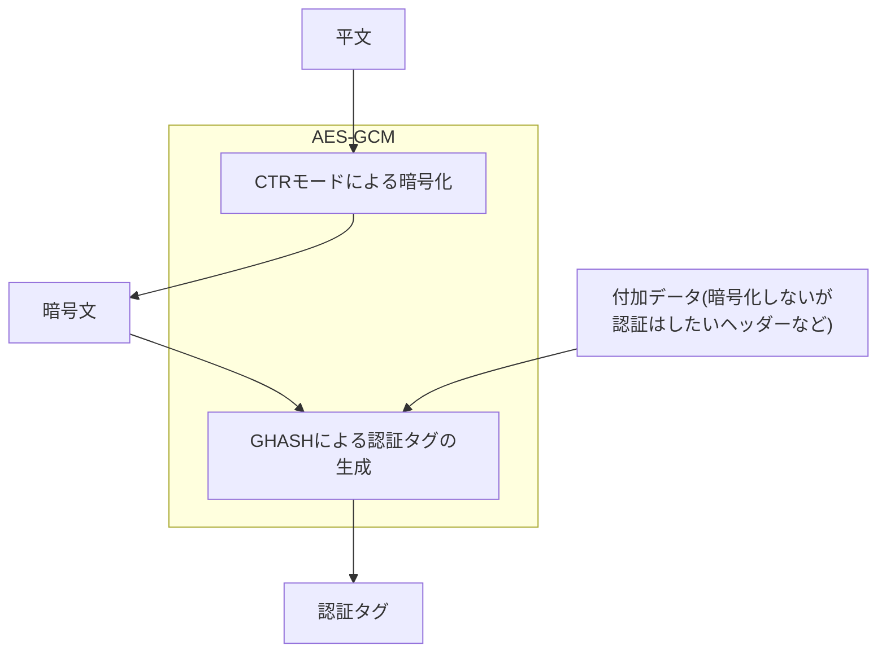

## はじめに

- **この記事で得られること**: TLSやVPN(IPsec)などの実データ暗号化の主役である共通鍵暗号(AES)が、実際には何をどう暗号化しているのか——ブロック単位で暗号化する仕組み、同じ平文でも毎回違う暗号文になる理由(暗号利用モードとIV)、CBC・CTR・GCMというモードの違い、そして「暗号化されているのに改ざんされていないか」をどう確認しているのか(HMAC・AEAD)を、体系的に理解できます。
- **対象読者**: インフラエンジニアとして「AESで暗号化されている」「HMACで改ざんを検知している」という言葉は知っているものの、その裏側の処理(暗号利用モード、IV/nonceの役割、認証付き暗号)までは説明できない方を想定しています。
- **読むのにかかる想定時間**: 約20分

この記事は[『上位1%』シリーズ 全記事ガイド](/sitemap)の一部です。

## 前提知識

- **公開鍵暗号(非対称鍵暗号)**: 暗号化と復号に別々の鍵(公開鍵・秘密鍵)を使う暗号方式です。計算コストが高い代わりに、事前に鍵を共有していない相手とも安全に通信を始められます。
- **ハッシュ関数**: 任意の長さのデータから固定長のハッシュ値を生成する一方向性の関数です。同じ入力からは常に同じ出力が得られ、入力が1ビットでも変わればハッシュ値はまったく別物になります。
- **XOR(排他的論理和)**: 2つのビット列を1ビットずつ比較し、異なっていれば1、同じであれば0を返す演算です。同じ値で2回XORすると元の値に戻る(`A XOR B XOR B = A`)という性質が、多くの暗号アルゴリズムの土台になっています。

## 全体像をつかむ

### 一言で言うと

**共通鍵暗号とは、暗号化と復号に同じ1つの鍵を使う暗号方式**です。代表格である**AES(Advanced Encryption Standard)**は、公開鍵暗号(RSA、ECDSAなど)に比べて計算コストが圧倒的に低く、TLSの実データやVPNのトンネル内容など、**大量のデータを高速に暗号化する場面**で標準的に使われています。

暗号化と復号に同じ鍵を使うという単純さの裏で、実務上は2つの課題が生まれます。**1つ目は「同じ平文を2回暗号化すると、毎回同じ暗号文になってしまってよいのか」という課題**——これに答えるのが後述の**暗号利用モード**です。**2つ目は「暗号化されてはいるが、経路上で1ビットでも改ざんされていないかをどう確認するか」という課題**——これに答えるのが**HMAC**や**AEAD(認証付き暗号)**です。この記事では、この2つを中心に掘り下げます。

## 基礎から徹底解説

### ブロック暗号とは何か

AESは**ブロック暗号**と呼ばれる種類の暗号アルゴリズムです。ブロック暗号は、データを**固定長のブロック(AESの場合は128ビット=16バイト)単位**に区切り、ブロックごとに暗号化を行います。

AESの暗号化処理そのものは、次の4種類の変換処理を「ラウンド」として複数回(鍵長128ビットなら10ラウンド、256ビットなら14ラウンド)繰り返すことで、平文のパターンを徹底的にかき混ぜます。

| 処理 | 役割 |
|---|---|
| SubBytes | ブロック内の各バイトを、あらかじめ定められた変換表(S-box)に基づいて非線形に置き換える |
| ShiftRows | ブロックを行列とみなし、各行をずらして(シフトして)バイトの位置を入れ替える |
| MixColumns | 各列のバイトを数学的に混ぜ合わせ、1バイトの変化がブロック全体に波及するようにする |
| AddRoundKey | 鍵から生成した「ラウンド鍵」を、ブロックの内容とXORする |

この一連の処理は**SP構造(Substitution-Permutation Network、置換・拡散構造)**と呼ばれる設計思想に基づいています。**置換(Substitution、SubBytes)で規則性を崩し、拡散(Permutation、ShiftRows/MixColumns)で1バイトの変化を全体に波及させる**ことを繰り返すことで、暗号文から平文や鍵の情報を統計的に推測することが極めて困難になります。この「1ビットの入力の違いが出力全体に無関係に波及する」性質は**雪崩効果(Avalanche Effect)**と呼ばれ、優れたブロック暗号の必須条件とされています。

なぜ鍵長が長いほど安全とされるのか

AESの鍵長は128・192・256ビットの3種類が規格化されています。鍵の総当たり攻撃(ブルートフォース)にかかる計算量は鍵長のビット数に対して指数関数的に増加するため、鍵長が長いほど理論上の安全性は高くなります。ただし鍵長が長いほどラウンド数も増え、暗号化・復号にかかる計算コストもわずかに増加するため、「用途に対して十分な安全性を確保しつつ、必要以上に長い鍵長を使わない」というバランスが実務上の判断になります。現在AES-128は実用上十分な強度を持つとされていますが、より長期的な安全性(将来の計算能力の向上や、耐量子計算機の観点)を重視する場面ではAES-256が選ばれます。

### 暗号利用モード：ブロックをどう繋げて使うか

平文は通常16バイトより長いため、複数のブロックに分割して暗号化する必要があります。この「ブロックをどう繋げて処理するか」を決めるのが**暗号利用モード**です。モードの選び方次第で、安全性が大きく変わります。

#### ECBモード(絶対に使ってはいけない例として)

最も単純な発想は、**各ブロックを完全に独立して、同じ鍵でそれぞれ暗号化する**ことです。これを**ECB(Electronic Codebook)モード**と呼びます。

ECBモードには致命的な弱点があります。**同じ平文ブロックは、常に同じ暗号文ブロックになる**ため、暗号文を見るだけで元データの繰り返しパターン(たとえば画像データの背景の塗りつぶし部分など)がそのまま透けて見えてしまいます。この現象は「ECBペンギン」という有名な例(ペンギンの画像をECBモードで暗号化すると、暗号化後もペンギンのシルエットがはっきり見えてしまう)で広く知られています。実務でECBモードが選ばれることはほぼなく、後述するCBCやCTR、GCMといったモードが使われます。

#### CBCモード：前のブロックを次の暗号化に混ぜ込む

**CBC(Cipher Block Chaining)モード**は、ECBの弱点を解消するために、**あるブロックの暗号化結果を、次のブロックを暗号化する前にXORで混ぜ込む**という「連鎖(チェーン)」の仕組みを持ちます。

最初のブロックには「前のブロック」が存在しないため、代わりに**IV(Initialization Vector、初期化ベクトル)**というランダムな値をXORします。IVを毎回変えることで、**同じ平文を同じ鍵で暗号化しても、毎回まったく異なる暗号文になる**ようになり、ECBのパターン漏洩問題が解消されます。IV自体は秘密にする必要はなく、暗号文と一緒に相手に送られるのが一般的です(ただし後述の通り、IVには「予測不可能性」が求められる場面があります)。

CBCモードでは、平文の長さがブロックサイズ(16バイト)の倍数でない場合、末尾に**パディング**(埋め草データ)を追加してブロック境界に揃える必要があります。広く使われる**PKCS#7パディング**は、「あと何バイト埋めが必要か」という数値そのものを埋め草の値として繰り返し詰める方式です(たとえば3バイト足りなければ`0x03 0x03 0x03`を追加)。

パディングオラクル攻撃という古典的な弱点

CBCモードでパディングを使う実装では、「復号したデータのパディングが正しい形式かどうか」をエラーメッセージや応答時間の違いから攻撃者が判別できてしまうと、**パディングオラクル攻撃**と呼ばれる手法で、鍵を知らなくても暗号文を少しずつ復号できてしまうことが知られています(2000年代に指摘され、TLS実装(POODLE攻撃など)にも影響しました)。この対策として、復号エラーの詳細を外部に漏らさない実装や、後述するAEAD(認証付き暗号)への移行が推奨されています。

#### CTRモード：ブロック暗号をストリーム暗号のように使う

**CTR(Counter)モード**は発想が異なります。平文そのものを暗号化するのではなく、**「鍵+カウンタ値」を暗号化した結果を、平文とXORするための使い捨ての鍵ストリームとして使う**方式です。

CTRモードの利点は、**各ブロックの鍵ストリーム生成が互いに独立している**ことです。CBCのように「前のブロックの結果を待ってから次を処理する」という連鎖がないため、複数のブロックを並列に処理でき、高速です。また各ブロックの長さがブロックサイズの倍数である必要もなく(端数はそのままXORすればよい)、パディングも不要です。

CTRモードで**絶対に守らなければならない条件**は、**同じ鍵で「nonce+カウンタ」の組み合わせを二度と使い回さないこと**です。もし同じ鍵ストリームが2つの異なる平文に使われてしまうと、2つの暗号文をXORするだけで両方の平文のXORが得られてしまい、暗号としての安全性が完全に崩壊します。

### HMAC：改ざんを検知する仕組み

ここまでの暗号化は、いずれも**秘匿性(第三者に読まれないこと)**を提供するものであり、**完全性(経路上で改ざんされていないこと)**は別の仕組みで確認する必要があります。この役割を担うのが**MAC(Message Authentication Code、メッセージ認証符号)**であり、ハッシュ関数を使って構成したものを**HMAC(Hash-based MAC)**と呼びます。

HMACは、**送信者と受信者だけが知る共有鍵**と**メッセージ**を組み合わせてハッシュ値を計算します。

1. 送信者は、メッセージと共有鍵からHMAC値を計算し、メッセージと一緒に送ります。
2. 受信者は、届いたメッセージと自分が持つ同じ共有鍵から、同じ手順でHMAC値を計算し直します。
3. 届いたHMAC値と、自分で計算し直したHMAC値が一致すれば、**「共有鍵を持つ者が確かに作成したメッセージであり(送信元の正当性)、送信後1ビットも改ざんされていない(完全性)」**ことが証明されます。

**単純なハッシュ値(共有鍵を使わないもの)だけでは改ざん検知にならない**点に注意してください。共有鍵を使わないハッシュ値は誰でも計算し直せてしまうため、攻撃者がメッセージを改ざんした上でハッシュ値も計算し直して付け替えれば、改ざんを検知できません。HMACが共有鍵を計算に組み込むことで、**その鍵を知らない攻撃者には、改ざん後の正しいHMAC値を計算し直すことができない**、という性質が成立します。

### AEAD：暗号化と改ざん検知を1つにまとめる

暗号化(秘匿性)とHMAC(完全性)は本来別々の処理ですが、これを**1つのアルゴリズムの中で同時に行う**ことで効率化と安全性を両立させたものが**AEAD(Authenticated Encryption with Associated Data、認証付き暗号)**です。代表例が**AES-GCM(Galois/Counter Mode)**です。

GCMは、内部的には前述の**CTRモードで暗号化**を行いつつ、**GHASH**という専用の計算によって暗号文全体(および暗号化しない付加データ)から**認証タグ**を生成します。この認証タグが、CBC+HMACの組み合わせにおけるHMAC値と同じ役割を果たします。

AEADが優れている点は、**「暗号化しないが改ざんされては困るデータ(Associated Data、たとえば宛先アドレスなどのヘッダー情報)」も含めて、1回の処理で認証タグに組み込める**ことです。これにより、暗号化する部分としない部分が混在するパケット(ESPヘッダーなど)でも、全体の完全性を1つのアルゴリズムでまとめて保証できます。

GCMモードもCTRモードと同様、**同じ鍵でnonceを再利用してはいけない**という制約を引き継いでいます。GCMの場合、nonceの再利用は暗号文の秘匿性が崩れるだけでなく、**認証タグを偽造できてしまう**(=改ざん検知そのものが機能しなくなる)という、CTR単体よりもさらに深刻な結果につながることが知られています。

## プロが見ている視点（上位1%の理解）

### Encrypt-then-MAC、MAC-then-Encrypt、Encrypt-and-MAC

AEADが普及する以前、多くのプロトコルは「暗号化」と「HMAC」を別々の処理として組み合わせていました。この組み合わせ方には3つのパターンがあり、安全性が異なります。

| 方式 | 手順 | 評価 |
|---|---|---|
| MAC-then-Encrypt | 平文にMACを付けてから、その全体を暗号化する | 復号してMAC検証するまで改ざんの有無が分からず、前述のパディングオラクル攻撃などの温床になりやすい |
| Encrypt-and-MAC | 平文を暗号化するのと並行して、平文自体のMACを計算し、暗号文とは別に付与する | MAC自体が平文の情報を漏らす可能性があり、方式によっては安全性の証明が難しい |
| Encrypt-then-MAC | 平文を暗号化し、その**暗号文に対して**MACを計算する | 受信側は復号する前にMAC検証で改ざんの有無を確認でき、改ざんされたデータを復号処理に渡さずに済む。現在最も安全とされる方式 |

現在の暗号設計のベストプラクティスは一貫して**Encrypt-then-MAC**、あるいはそれを1つのアルゴリズムに統合した**AEAD**を使うことです。「復号する前に、改ざんされていないことを確認できる」という性質は、パディングオラクル攻撃のような「復号処理の挙動の違いから情報が漏れる」タイプの攻撃全般への根本的な対策になります。

### なぜnonce/IVの再利用がここまで致命的なのか

CTR/GCMのようなモードでnonceを使い回すと安全性が崩壊する、という話をもう一段掘り下げます。CTRモードの本質は「鍵ストリームを平文とXORする」という、原理的には**ワンタイムパッド(使い捨ての鍵で完全な安全性を持つ暗号方式)と同じ構造**です。ワンタイムパッドの安全性は「鍵ストリームが本当に一度きりしか使われない」という前提の上に成り立っており、この前提が崩れる(=同じ鍵ストリームが2つの平文に使われる)と、2つの暗号文`C1 = P1 XOR K`、`C2 = P2 XOR K`をXORするだけで`C1 XOR C2 = P1 XOR P2`が得られ、鍵`K`を経由せずに2つの平文の関係が漏れてしまいます。実務で使われる自然言語のテキストやXMLのような構造化データは統計的な偏りが大きいため、`P1 XOR P2`が得られれば、そこから`P1`と`P2`をかなりの精度で復元できてしまうことが知られています。**「nonceは秘密にする必要はないが、同じ鍵の下では絶対に再利用してはならない」**という一見矛盾した要件は、この数学的な構造に由来しています。

## よくある誤解・つまずきポイント

- **誤解1: 「暗号化されていれば改ざんもされていないはず」**
  暗号化(秘匿性)と改ざん検知(完全性)は別の性質です。CTRモードのように暗号文の特定のビットを反転させると、復号結果の対応するビットもそのまま反転する(ビット単位で予測可能に変化する)モードでは、攻撃者が平文の内容を知らなくても意図通りに暗号文を改ざんできてしまいます。HMACやAEADのような明示的な完全性保証の仕組みがなければ、改ざんは検知されません。
- **誤解2: 「IV/nonceは秘密にしなければならない」**
  IV/nonceの多くは秘密にする必要はなく、暗号文と一緒に平文で送られるのが一般的です。重要なのは「予測不可能であること」(CBCの場合)や「同じ鍵の下で重複しないこと」(CTR/GCMの場合)であり、秘匿性そのものではありません。
- **誤解3: 「鍵長が長いほど無条件に良い」**
  鍵長が長いほど理論上の耐ブルートフォース性は上がりますが、計算コストも増加します。また、鍵長よりも暗号利用モードの選択やnonce管理の誤りの方が、実際のインシデントでは深刻な脆弱性につながることが多く、鍵長だけを見て安全性を判断するのは不十分です。

## 障害・トラブルシューティングの視点

暗号化まわりの不具合は、**「復号できないのか、復号はできるが改ざん検知で弾かれているのか」**を切り分けるのが基本です。

1. **復号自体が失敗する**: 鍵の不一致、IV/nonceの取り違え、モードの設定不一致(送信側はGCM、受信側はCBCとして復号しようとしているなど)が典型的な原因です。
2. **復号はできるが認証タグ/HMACが一致しない**: 経路上での実際の改ざん・破損の可能性に加え、実装バグ(付加データの範囲の解釈違いなど)によって送受信双方の計算対象がずれているケースも少なくありません。
3. **同じ設定なのに一部のセッションだけ失敗する**: nonce/IVのカウンタ管理に不具合があり、稀に重複が発生している可能性があります。再現性のある形で発生する場合は、実装側のカウンタ管理ロジックを疑います。

### 予防策・恒久対策

- 新規実装では、可能な限りAES-GCMやChaCha20-Poly1305のようなAEADを選択し、暗号化とMACを別々に組み合わせる自前実装は避ける。
- CTR/GCM系のモードを使う場合、nonceの生成・管理を実装のごく初期段階でレビューし、重複が起こり得ない設計(カウンタの単調増加を保証する、乱数長を十分に取るなど)にする。
- CBC+パディングを使わざるを得ない場合は、復号エラーの詳細を外部に一切漏らさない実装にする。

## まとめ

- AES(ブロック暗号)は16バイト単位でSubBytes/ShiftRows/MixColumns/AddRoundKeyを繰り返し、雪崩効果によって平文のパターンを徹底的にかき混ぜます。
- 暗号利用モードの選択が安全性を左右します。ECBはパターンが透けるため使うべきではなく、CBCはIVによる連鎖、CTR/GCMはnonce+カウンタによる鍵ストリーム生成でこれを解決しています。
- HMACは共有鍵を使ってメッセージの改ざんを検知する仕組みであり、暗号化(秘匿性)とは独立した完全性の保証です。AEAD(AES-GCMなど)はこの2つを1つのアルゴリズムに統合したものです。
- CTR/GCM系のモードでは、同じ鍵の下でnonceを再利用すると、秘匿性だけでなく認証タグの偽造可能性という形で完全性まで崩壊する、致命的な結果につながります。

**今日から意識すべきこと**
1. 「暗号化されている」という言葉を見たら、それが秘匿性だけを指しているのか、完全性(改ざん検知)まで含んでいるのかを意識して区別しましょう。
2. 暗号関連の設定を見る機会があれば、使われている暗号利用モード(CBC/CTR/GCMなど)とnonce/IVの生成方法を確認する習慣をつけましょう。

## 参考文献

- [Advanced Encryption Standard (AES) | NIST FIPS 197](https://nvlpubs.nist.gov/nistpubs/FIPS/NIST.FIPS.197.pdf)
- [Recommendation for Block Cipher Modes of Operation | NIST SP 800-38A](https://nvlpubs.nist.gov/nistpubs/Legacy/SP/nistspecialpublication800-38a.pdf)
- [Recommendation for Block Cipher Modes of Operation: Galois/Counter Mode (GCM) | NIST SP 800-38D](https://nvlpubs.nist.gov/nistpubs/Legacy/SP/nistspecialpublication800-38d.pdf)
- [HMAC: Keyed-Hashing for Message Authentication | RFC 2104](https://datatracker.ietf.org/doc/html/rfc2104)
- [PKCS #7: Cryptographic Message Syntax | RFC 2315](https://datatracker.ietf.org/doc/html/rfc2315)
- [AES-GCM Authenticated Encryption in the Internet Key Exchange Protocol Version 2 (IKEv2) | RFC 5282](https://datatracker.ietf.org/doc/html/rfc5282)
