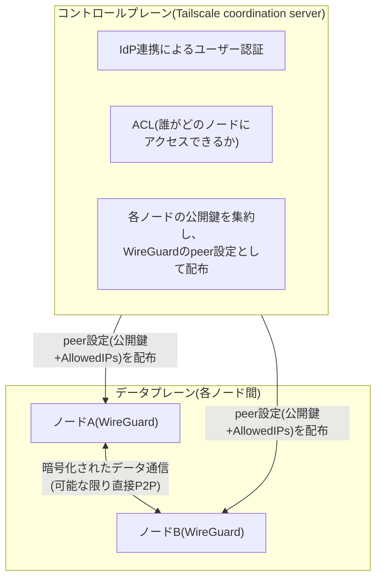
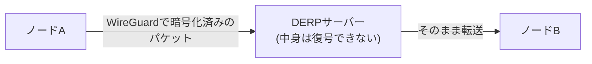

## はじめに

- **この記事で得られること**: Tailscaleが[WireGuard](/articles/wireguard-internals-guide)を内部プロトコルとして使いながら、なぜ「configファイルを手で書かなくても、複数の端末間のVPNメッシュがほぼ自動で組める」のかという疑問に対し、**コントロールプレーン(鍵配布・アクセス制御・認証)とデータプレーン(実際の暗号化通信)を分離する**という設計、NATの背後にいる端末同士が直接通信を確立するための**NATホールパンチング**、それが失敗したときの**DERPリレー**の仕組みまでを、体系的に理解できます。
- **対象読者**: 自宅PCと自宅サーバーの間などでTailscaleを導入し、動くことは確認できたものの、「内部でWireGuardが使われている」という以上に、実際に何が行われているのかを説明できない方を想定しています。
- **読むのにかかる想定時間**: 約18分

この記事は[『上位1%』シリーズ 全記事ガイド](/sitemap)の一部です。

## 前提知識

- **WireGuard**: 公開鍵とAllowedIPsを結びつけたCryptokey Routingで経路制御を行う、現代的なVPNプロトコルです。詳しくは[WireGuardの仕組み](/articles/wireguard-internals-guide)で扱っています。
- **NAT(Network Address Translation)** : プライベートIPアドレスをグローバルIPアドレスに変換する仕組みです。詳しくは[NAT/NAPTの仕組み](/articles/nat-guide)で扱っています。
- **IdP(Identity Provider)** : Google Workspace・Okta・Microsoft Entra IDなど、ユーザーの認証を一元的に担う外部サービスです。

## 全体像をつかむ

### 一言で言うと

**Tailscaleの本質は、WireGuardという「データを暗号化して運ぶ仕組み(データプレーン)」自体には手を加えず、その手前に「誰が・どの端末に・どこまでアクセスしてよいかを決め、それをWireGuardの設定として各端末に配布し続ける仕組み(コントロールプレーン)」を新たに用意したことにあります。** [WireGuardの内部動作の記事](/articles/wireguard-internals-guide)で扱った「公開鍵の事前配布を誰がどう行うか」という運用課題を、IdP連携によるユーザー認証と、coordination server(調整サーバー)による鍵の自動配布で解決しています。



## 基礎から徹底解説

### コントロールプレーンとデータプレーンの分離という設計

Tailscaleに参加する各端末(**ノード**、Tailscale用語では**tailnet**のメンバー)は、自分自身でWireGuardの鍵ペアを生成します。**秘密鍵は一度もその端末の外に出ません。** 公開鍵だけがTailscaleのcoordination serverに送られ、coordination serverは「誰がこのtailnetに参加してよいか」「どのノードがどのノードにアクセスしてよいか」というACL(アクセス制御リスト)に照らして、各ノードに配布すべき情報——他のノードの公開鍵とAllowedIPs——を計算します。

各ノード上で動くTailscaleクライアント(`tailscaled`)は、coordination serverから受け取ったこの情報をもとに、**OSのWireGuardインターフェースのpeer設定を裏側で動的に書き換え続けます。** ユーザーが目にする`tailscale up`のようなコマンドは、この一連のやり取りをまとめて行っているに過ぎず、実際にトラフィックを暗号化して運ぶのは、あくまでも素のWireGuardと同じ処理です。**「WireGuardを置き換えるのではなく、WireGuardの運用上の弱点(鍵配布・ACL管理)だけを別のレイヤーで肩代わりする」** という設計思想が、Tailscaleの正体です。

### NATホールパンチング:P2P接続をなるべく直接確立する

自宅・オフィスの端末の多くはNATの背後にあり、インターネットから直接そのプライベートIPアドレス宛にパケットを送ることはできません。それでもTailscaleは、**可能な限り2つのノード間で直接WireGuardパケットをやり取りする(リレーサーバーを経由しない)ことを優先します**。これを実現するのが**NATホールパンチング**です。

```mermaid
sequenceDiagram
    participant A as ノードA(NAT配下)
    participant Server as STUNサーバー的な役割<br/>(DERPサーバーが兼務)
    participant B as ノードB(NAT配下)

    A->>Server: 自分のグローバルIP:ポートを問い合わせ
    Server-->>A: NAT変換後のIP:ポートを通知
    B->>Server: 自分のグローバルIP:ポートを問い合わせ
    Server-->>B: NAT変換後のIP:ポートを通知
    Note over A,Server,B: coordination server経由でお互いの<br/>IP:ポート情報を交換
    A->>B: 直接パケットを送信(NATに穴を開ける)
    B->>A: 直接パケットを送信(NATに穴を開ける)
    Note over A,B: 双方向にパケットが届いた時点で<br/>直接のP2P経路が確立
```

各ノードは、STUN(Session Traversal Utilities for NAT)に類する仕組みで「自分がNATを通過した後、外部からはどのIPアドレス・ポート番号に見えているか」を調べ、その情報をcoordination server経由で相手ノードと交換します。その上で、**双方が同時に相手の(NAT変換後の)アドレス宛にパケットを送り合う**ことで、多くの家庭用・企業用NATは「自分から送信したことのある宛先からの応答パケット」を通過させる挙動を持つため、結果的にNATに「穴」が開き、直接の経路が確立します。

<details>
<summary>補足: すべてのNATでホールパンチングが成功するわけではない</summary>

NATの実装方式によっては(特に企業のシンメトリックNATと呼ばれる方式)、ホールパンチングが成功しない組み合わせも存在します。この場合にTailscaleがどう振る舞うかが、次のDERPリレーの話です。

</details>

### DERPリレー:直接接続できないときの「ゼロ知識」な中継

NATホールパンチングが失敗する組み合わせ(双方が厳格なシンメトリックNAT配下にある場合など)では、Tailscaleは**DERP(Designated Encrypted Relay for Packets)** と呼ばれる中継サーバーを経由して通信します。

DERPサーバーは、単に**WireGuardによってすでに暗号化されたパケットをそのまま右から左へ転送するだけ**の存在です。DERPサーバー自体はTailscaleのノードが使うWireGuardの秘密鍵を一切持たないため、中継しているトラフィックの中身(暗号化されたペイロード)を復号することができません。この性質から、DERPは**ゼロ知識リレー**と呼ばれます。



ただし、**DERPサーバーは通信の中身を見られなくても、「いつ・どのノードとどのノードが・どれくらいの量の通信をしたか」というメタデータは観測できる立場にあります。** 完全な匿名性を提供する仕組みではなく、あくまで「暗号化された通信内容の機密性」を保ったまま接続性を確保するための、可用性優先のフォールバック機構だと理解しておく必要があります。

### IdP連携とACL:誰が・どこにアクセスできるかを宣言的に管理する

Tailscaleがエンタープライズ用途で使われる最大の理由が、**IdP(Google Workspace、Okta、Microsoft Entra IDなど)と連携したユーザー認証**です。ユーザーは自分のTailscaleクライアントで既存の会社アカウントを使ってSSOログインし、そのアカウントに紐づく形でノード(自分のPC・サーバーなど)がtailnetに登録されます。

アクセス制御は、**誰が(ユーザー・グループ・タグ)・どのノードに・どのポートでアクセスできるか**を宣言的に記述するACL設定(JSON形式)で管理され、coordination serverはこの設定を実際のWireGuardのAllowedIPs・ファイアウォールルールへと変換して各ノードに配布します。素のWireGuardでは、新しいメンバーの参加や退職者の鍵失効を管理者が手作業でconfigに反映する必要がありましたが、Tailscaleでは**IdP側でユーザーを無効化するだけで、そのユーザーに紐づくノードのアクセス権がtailnet全体から自動的に失効します**。

## プロが見ている視点(上位1%の理解)

### なぜ「コントロールプレーンとデータプレーンの分離」がTailscaleの本質なのか

ネットワークの世界には、SDN(Software-Defined Networking)のように、「実際にパケットを転送する処理(データプレーン)」と「どう転送すべきかを決定する処理(コントロールプレーン)」を分離するという設計思想が古くからあります。Tailscaleはこの発想をVPNメッシュに適用した実例だと理解すると、単体の製品としてではなく、より一般的な設計パターンの一適用例として位置づけられます。**WireGuardというデータプレーンの実装を一切変更せずに、その上に位置するコントロールプレーンだけを差し替え可能にした**ことが、TailscaleがWireGuardのセキュリティ特性(Noiseフレームワークによるハンドシェイク、ChaCha20-Poly1305による暗号化)をそのまま引き継ぎながら、運用上の弱点だけを解決できている理由です。

### DERPが「可用性」のために設計上の妥協をしている点

DERPリレーは、ゼロ知識ではあるものの、通信メタデータがDERPサーバーの運営者(Tailscale社、またはセルフホストする場合は自組織)から見える立場にあることは、セキュリティ設計上正しく理解しておくべき妥協点です。金融機関や政府機関のような極めて高い機密性が求められる環境では、DERPサーバーを自組織内にセルフホストする、あるいはNATホールパンチングが確実に成功するネットワーク設計(対称NATを避けるなど)を優先するといった追加の検討が必要になります。

## よくある誤解・つまずきポイント

- **誤解1: 「Tailscaleを使うと、すべての通信が必ずTailscaleの中継サーバーを経由する」**
  基本は直接のP2P接続(NATホールパンチング)が優先され、DERPリレーはそれが失敗したときのフォールバックです。`tailscale status`コマンドで、各ピアとの接続が直接(`direct`)かリレー経由(`relay`)かを確認できます。
- **誤解2: 「Tailscaleは独自の暗号化プロトコルを使っている」**
  データの暗号化自体は素のWireGuardと同じ仕組みです。Tailscaleが追加しているのは、鍵配布・NAT越え・ACL管理といったコントロールプレーンの機能です。
- **誤解3: 「Tailscaleはクローズドソースの商用製品なので、中身がブラックボックスだ」**
  クライアントソフトウェア自体はオープンソースで公開されています。またcoordination serverのオープンソース実装として**Headscale**という互換プロジェクトも存在し、Tailscale社のサーバーに依存しない自前運用も可能です(coordination serverのマネージドサービス自体は商用です)。

## 障害・トラブルシューティングの視点

Tailscaleの接続トラブルは、**「そもそも直接接続できているか、DERP経由か」を切り分ける**ことが出発点になります。

1. **通信は成立するが速度が極端に遅い**: `tailscale status`や`tailscale ping <相手のホスト名>`で、その接続が`relay`経由になっていないかを確認します。DERP経由の通信は、地理的に遠いDERPサーバーを経由する場合や、DERPサーバー自体の帯域制限の影響で速度が落ちることがあります。
2. **特定のノードにだけアクセスできない**: ACL設定の記述ミス(タグ・グループの指定漏れなど)が典型的な原因です。coordination server側の管理画面でACLのシミュレーション・検証機能を使い、意図した通りの権限になっているかを確認します。
3. **社内ネットワークからだけ接続できない**: 社内ファイアウォールがDERP用のポート(TCP 443など)やNATホールパンチングに使われるUDPポートを遮断している可能性があります。DERPはTCP 443(HTTPSと同じポート)にフォールバックできるよう設計されているため、多くの場合はここまで確認すれば接続性の問題は解消します。

### 予防策・恒久対策

- 機密性の要件が高い環境では、DERPサーバーをセルフホストする選択肢を事前に検討し、通信メタデータが外部の第三者から見える範囲を最小化する。
- ACL設定は、変更のたびに管理画面のシミュレーション機能で影響範囲を確認してから適用する運用ルールを設ける。
- 退職者・異動者が出た際に、IdP側でのアカウント無効化がTailscale側のノードアクセス権失効に確実に反映されることを、定期的な棚卸しで確認する。

## まとめ

- Tailscaleは、WireGuardというデータプレーンの実装を変更せず、その手前にコントロールプレーン(鍵配布・ACL管理・IdP連携)を新設することで、WireGuard単体が抱えていた運用上の弱点(鍵配布・失効の手動管理)を解決しています。
- ノード間の通信は、NATホールパンチングによる直接のP2P接続を優先し、それが失敗した場合にのみDERPリレー(暗号化済みパケットをそのまま中継する、ゼロ知識な中継サーバー)を経由します。
- DERPは通信内容こそ復号できませんが、通信メタデータ(いつ・誰と誰が通信したか)は観測できる立場にあり、完全な匿名性を提供する仕組みではありません。
- IdP連携により、ユーザーの入退社に応じたアクセス権の付与・失効を、素のWireGuardの手動config管理と比べて大幅に自動化できることが、エンタープライズ導入の主な理由です。

**今日から意識すべきこと**
1. Tailscaleの速度低下に遭遇したら、まず`tailscale status`でDERP経由になっていないかを確認する習慣をつけましょう。
2. 高い機密性が求められる環境を設計する際は、DERPリレーが通信メタデータを観測できる立場にあることを踏まえ、セルフホストの要否を検討しましょう。

## 参考文献

- [How Tailscale works | Tailscale公式ドキュメント](https://tailscale.com/blog/how-tailscale-works/)
- [How NAT traversal works | Tailscale公式ブログ](https://tailscale.com/blog/how-nat-traversal-works/)
- [Encrypted TCP relays (DERP) | Tailscale公式ドキュメント](https://tailscale.com/kb/1232/derp-servers)
