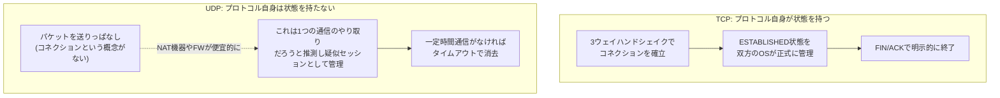
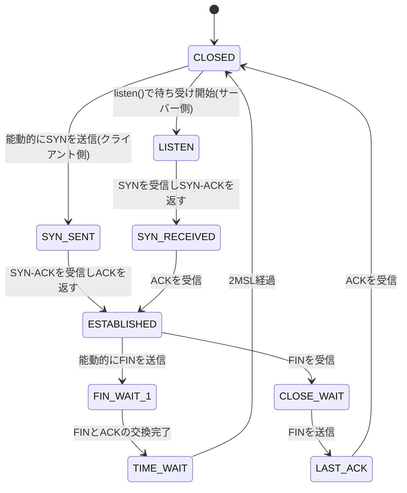

## はじめに

- **この記事で得られること**: 「TCP/UDPのセッション」という言葉の中身——TCPのコネクションはなぜ・どうやって状態を管理しているのか、コネクションを持たないはずのUDPで「セッション」という言葉が使われるのはなぜか、そして「プロトコルとポート番号」の関係(1対1ではないこと、ポート番号を持たないプロトコルがあること)を、体系的に理解できます。
- **対象読者**: インフラエンジニアとして「TCPはコネクション型、UDPはコネクションレス型」ということは知っているものの、「セッション」という言葉が文脈によって指すものが変わることに戸惑ったことがある方、あるいはポート番号を持たないプロトコル(ESPなど)に「なぜ任意にポート番号を割り当てられないのか」を説明できない方を想定しています。
- **読むのにかかる想定時間**: 約20分

この記事は[『上位1%』シリーズ 全記事ガイド](/sitemap)の一部です。

## 前提知識

- **TCP/UDPの基本的な違い**: TCPはコネクション型で到達確認・再送制御を行い、UDPはコネクションレスで送りっぱなしのプロトコルです。この違いの詳細は、別記事「[ネットワークスタックの仕組みを『上位1%』の視点で理解する](/articles/network-stack-guide)」の「トランスポート層」で扱っています。
- **カプセル化**: あるデータの前後にヘッダー(制御情報)を付け加えて、別のプロトコルの中に包んで運ぶことです。
- **IPヘッダー**: 送信元・宛先のIPアドレスに加え、「この中身が何のプロトコルか」を示す8ビットの**プロトコル番号**フィールドを持ちます(例: TCP=6、UDP=17)。

## 全体像をつかむ

### 一言で言うと

**「セッション」とは、通信の当事者間で交わされる一連のやり取りを、ひとまとまりの単位として管理するための状態(ステート)、またはその状態を模した管理単位** です。ここで重要なのは、この「状態」を**誰が・どうやって**持っているかがレイヤーごとにまったく異なるという点です。TCPはプロトコル自体が正真正銘の状態機械(ステートマシン)としてコネクションを管理しますが、UDPにはプロトコルレベルの状態が一切なく、NAT機器やファイアウォールが実務上の都合で「疑似的なセッション」として扱っているに過ぎません。

### プロトコル番号とポート番号は別物

もう1つ、この記事で明確にしたいのが**プロトコル番号とポート番号は、そもそも別のヘッダーに属する別の情報である**という点です。プロトコル番号はIPヘッダーが持つ8ビットのフィールドで「この中身がTCPかUDPかESPか」を示す情報、ポート番号はTCPヘッダー・UDPヘッダーがそれぞれ独自に持つ16ビットのフィールドで「そのTCP(またはUDP)の中身がどのアプリケーション宛か」を示す情報です。この2つは階層が異なり、「プロトコルとポート番号」は1対1で対応する関係ですらありません。そもそも **「ポート番号はTCP/UDPというプロトコルの内部にだけ存在する、局所的なフィールドである」** という前提を押さえることが出発点になります。

## 基礎から徹底解説

### TCPにおける「セッション(コネクション)」:状態機械としての実体

TCPの仕様(RFC 9293)では、"session"という言葉ではなく **"connection"(コネクション)** という用語が正式に使われます。TCPコネクションは、送信元IP・送信元ポート・宛先IP・宛先ポート・プロトコル番号(TCP=6)の組み合わせ、いわゆる **5-タプル** によって一意に識別されます(この5-タプルは、NAT機器がセッションテーブルの管理に使うキーとしても登場します。詳しくは別記事「[NAT/NAPTの仕組みを『上位1%』の視点で理解する](/articles/nat-guide)」の「NAPTの変換テーブル」で扱っています)。

TCPコネクションの実体は、送受信双方のOSが **カーネル内に保持する状態機械(ステートマシン)** です。主な状態遷移は次の通りです。

**「なぜコネクションが確立している間、双方のOSはこの状態を保持し続けなければならないのか」** ——これが、TCPが「セッション」という言葉にもっとも忠実な実体を持つ理由です。到達確認(ACK)・再送制御・順序保証・輻輳制御はいずれも、「今このコネクションで、どこまでのデータが送受信済みで、送信ウィンドウはどれだけ空いているか」という状態を前提に成立する機能であり、この状態を保持している間だけ、TCPは「1本の連続した会話」として振る舞えます。

TIME_WAITはなぜ必要なのか(2MSLという待機時間の意味)

コネクションを能動的にクローズした側は、最後のACKを送った後もすぐには状態を破棄せず、**TIME_WAIT**という状態でしばらく待機します。この待機時間は伝統的に**2MSL(Maximum Segment Lifetime、パケットがネットワーク上に存在しうる最大時間の2倍)** とされ、実装によりますが数十秒〜数分程度です。

これには2つの目的があります。1つは、**最後に送ったACKが相手に届かなかった場合に備える**ことです。相手(LAST_ACK状態側)がACKを受け取れずFINを再送してきた場合、TIME_WAIT状態でなければ「知らないコネクションからのパケット」として不正なパケット(TCP RST)を返してしまい、正常なクローズシーケンスが完了しません。もう1つは、**同じ5-タプルを使った新しいコネクションが、前のコネクションの遅延パケット(ネットワーク上を彷徨っていた古いセグメント)を誤って受信しないようにする**ことです。2MSL待てば、そのコネクションに関する古いパケットはネットワーク上から確実に消えている、という前提に立っています。

サーバーで大量の短命なコネクションを処理する(HTTPの初期実装など)場合、TIME_WAIT状態のソケットが大量に滞留して新規接続用のポートが枯渇する、という運用上の問題が起きることがあり、`SO_REUSEADDR`のようなソケットオプションで一部緩和されます。

### UDPには「セッション」がない:だからこそ生まれる疑似セッション

UDPはコネクションレスなプロトコルであり、TCPのような状態機械はプロトコル仕様(RFC 768)のどこにも存在しません。1つのUDPパケットは、それ単体で完結した独立したデータグラムとして扱われ、「前のパケットと今回のパケットが同じ会話に属する」という認識はUDP自身にはありません。

ところが実務では「UDPセッション」という言葉が普通に使われます。これは、**NAT機器やステートフルファイアウォールが、UDPパケットの往復を観測して便宜的に「セッションらしきもの」を管理している**ためです。具体的には、「送信元IP:ポート+宛先IP:ポートの組が、一定時間内に反復して観測された」場合にこれを1つの疑似セッションとみなし、無通信状態が一定時間(実装により数十秒〜数分)続くとエントリを破棄する、という方式です。この仕組み自体は別記事「[NAT/NAPTの仕組みを『上位1%』の視点で理解する](/articles/nat-guide)」の「NAPTの変換テーブル」で詳しく扱っていますが、ここで押さえておきたいのは、**この「UDPセッション」はUDPというプロトコル自身が持つ状態ではなく、あくまで中間機器(NAT・FW)が運用上の都合で外側から見て推測している状態に過ぎない**、という点です。UDP自身にコネクション確立・終了のシグナルが一切ないため、中間機器は「いつセッションが終わったか」を正確には知りようがなく、タイムアウトという推測に頼らざるを得ません。

### なぜ同じ「セッション」という言葉が文脈によって指すものが変わるのか

ここまでの整理を踏まえると、「セッション」という言葉が実務で複数のレイヤーにまたがって使われていることが分かります。

| 使われる文脈 | 実体 | 状態を持つ主体 |
|---|---|---|
| TCPコネクション | 5-タプルで識別される、双方のOSカーネルが管理する状態機械 | TCPプロトコル自身(送受信双方のOS) |
| NAT/ファイアウォールの「セッション」 | 5-タプルをキーにした変換・許可テーブルのエントリ(TCP/UDP問わず使われる用語) | 中間機器(NAT機器、ステートフルファイアウォール) |
| OSI参照モデルのセッション層(L5) | 通信の開始・維持・終了を管理する教科書的な層の概念 | 理論上の分類(実装上はTCP/UDPやアプリケーション層に吸収されていることが多い) |
| アプリケーションの「ログインセッション」 | Cookie(セッションID)やトークンでサーバー側が管理する、ユーザーのログイン状態 | アプリケーション層のソフトウェア(Webアプリなど) |

特に紛らわしいのが3つ目です。別記事「[ネットワークスタックの仕組みを『上位1%』の視点で理解する](/articles/network-stack-guide)」のOSI参照モデルの図で示した通り、OSI参照モデルには独立した「セッション層(L5)」が存在しますが、実際のTCP/IPスタックの実装では、この層に相当する明示的な独立実装はほとんど存在せず、セッションの開始・維持・終了はTCP自身(コネクション管理)やアプリケーション層のプロトコル(HTTPのCookieなど)が担っています。「セッション」という同じ単語が、**プロトコル本来の状態機械(TCP)・中間機器の便宜的な推測(NAT/FW)・理論上の分類(OSI L5)・アプリケーションの独自実装(Cookie)** という、まったく性質の異なる4つのものを指して使われているために、文脈を明示せずに「セッション」とだけ言うと話が噛み合わなくなりやすい、というのがこの言葉の厄介さの正体です。

### プロトコル番号とポート番号の関係を掘り下げる

ここからは、もう1つの主題である **「プロトコル番号」と「ポート番号」の関係** を掘り下げます。

**プロトコル番号**は、IPヘッダーの中にある8ビットのフィールドで、正式には**Protocol**フィールドと呼ばれ、IANAが管理する[Protocol Numbers](https://www.iana.org/assignments/protocol-numbers/)レジストリで値が割り当てられています。代表的な値は次の通りです。

| プロトコル番号 | プロトコル | 備考 |
|---|---|---|
| 1 | ICMP | pingなどで使われる制御メッセージ用プロトコル |
| 6 | TCP | コネクション型トランスポート層プロトコル |
| 17 | UDP | コネクションレス型トランスポート層プロトコル |
| 47 | GRE | 汎用的なトンネリングプロトコル |
| 50 | ESP | IPsecの暗号化・完全性保証(前述の記事群で扱っています) |
| 51 | AH | IPsecの改ざん検知・送信元認証(暗号化なし) |

一方**ポート番号**は、TCPヘッダー・UDPヘッダーそれぞれの内部にある16ビットのフィールドで、「送信元ポート番号」「宛先ポート番号」として格納されています。ここで見落とされがちな重要な事実が2つあります。

1. **ポート番号は、IPプロトコル全体で共有される「1つの名前空間」ではなく、TCPとUDPそれぞれが独自に持つ、完全に独立した名前空間である**ということです。「TCPの80番」と「UDPの80番」は、たまたま同じ数字を使っているだけの、本質的には無関係な別々の識別子です(実際にはHTTP=TCP/80、DNS=UDP/53が代表的ですが、DNSはゾーン転送などでTCP/53も使うなど、同じ番号がTCP・UDPの両方で意味を持つケースもあります)。
2. **ポート番号は、ポート番号というフィールドを持つプロトコル(TCP・UDP、そしてSCTPなど一部の限られたプロトコル)にしか存在しない**ということです。前節の表にあるICMP・GRE・ESP・AHには、そもそもヘッダーの中に「ポート番号」という名前のフィールドが存在しません。

つまり、 **「プロトコルとポート番号は1対1でない」というのは、より正確には「ポート番号はそもそも一部のプロトコル(TCP/UDP)にしか存在しない、局所的な内部フィールドに過ぎない」** という理解が実態に近いということです。1つのプロトコル(TCP)の中に65536個のポート番号があり、そこにHTTP・SSH・SMTPなど多数のアプリケーションプロトコルがそれぞれ別のポート番号で乗っている、という「多対1」の関係はありますが、これはあくまでTCP・UDPというプロトコルの**内部**の話です。

### なぜESPにポート番号がないのか、任意に割り当てることはできないのか

ここまでの整理を踏まえると、[L2TP/IPsecの仕組みを『上位1%』の視点で理解する](/articles/l2tp-ipsec-guide)や[NAT/NAPTの仕組みを『上位1%』の視点で理解する](/articles/nat-guide)で触れた「ESP自体にポート番号の概念がない」という事実について、 **「プロトコルとポート番号が1対1でないなら、ESPにも任意のポート番号を割り当てればよいのでは」** という疑問に正面から答えられます。

答えは、**ポート番号は「プロトコルの外側から後付けで割り当てられる汎用的な識別子」ではなく、「TCPまたはUDPというヘッダーフォーマットの中に、あらかじめ定義されたフィールドの1つ」に過ぎない**、という点にあります。ESPのヘッダーフォーマット(RFC 4303)は、SPI(Security Parameters Index)・Sequence Number・Payload Data・Padding・Next Headerといったフィールドで構成されており、この中に「ポート番号」という名前のフィールドは存在しません。「ESPにポート番号を割り当てる」ということは、実質的に**ESPというプロトコルの仕様そのもの(RFC 4303が定めるヘッダー構造)を書き換えて、新しいフィールドを追加する**ことを意味してしまい、単に「空いている番号をどれか割り当てればよい」という単純な話では済みません。ポート番号はTCP/UDPというヘッダー構造に紐づく情報であって、IPプロトコル全体に共通する外付け可能なメタデータではない、ということです。

だからこそ、NAT-T(前述の記事群で扱っています)が採用しているのは「ESPにポート番号を割り当てる」というアプローチではなく、 **「ESPパケット全体を、もともとポート番号フィールドを持っているUDPというヘッダーでまるごと包んでしまう(カプセル化する)」** というアプローチです。ESP自身の仕様は一切変更せず、その外側にUDPヘッダーという「ポート番号を持つ皮」をもう1枚被せることで、既存のNAPTの変換テーブルにポート番号ベースで乗せられるようにしている、というのがNAT-Tの本質です。ESPに新しいフィールドを追加するのではなく、既存のプロトコル(UDP)を再利用してポート番号を「借りてくる」形になっている点が、この設計のポイントです。

## プロが見ている視点(上位1%の理解)

### ウェルノウンポート・登録済みポート・動的ポートの3区分

IANAは、TCP/UDPそれぞれのポート番号(0〜65535)を、用途に応じて3つの範囲に区分しています。

| 範囲 | 名称 | 用途 |
|---|---|---|
| 0〜1023 | ウェルノウンポート(Well-Known Ports) | HTTP(80)・HTTPS(443)・SSH(22)・DNS(53)など、広く合意された標準サービス用。多くのOSでは1024未満のポートを使うにはroot/管理者権限が必要 |
| 1024〜49151 | 登録済みポート(Registered Ports) | IANAに申請・登録された、特定のアプリケーション・サービス用のポート |
| 49152〜65535 | 動的・プライベートポート(Dynamic/Private Ports、エフェメラルポート) | 特定の用途に固定されておらず、クライアントが通信のたびに一時的に使う送信元ポート用 |

**クライアントの送信元ポートがランダムな値になる**のは、この動的ポート(エフェメラルポート)の仕組みによるものです。クライアントが宛先(サーバー)のウェルノウンポート(例: HTTPS/443)に接続する際、自分側の送信元ポートはOSが未使用のエフェメラルポートから自動的に払い出します。これにより、同じクライアントから同じサーバーの同じポートへ複数のコネクションを同時に張っても、送信元ポートが異なる限り5-タプルが重複せず、それぞれ別々のコネクションとして区別できます。

### コネクションの多重化:1本のTCPコネクションに複数の「やり取り」を詰め込む

TCPコネクション(5-タプル)は1本でも、その中で実質的に複数の独立したやり取りが多重化されることがあります。これも「セッション」という言葉が指すものの粒度がさらに細分化される例です。

- **HTTP/1.1のKeep-Alive**: 1本のTCPコネクションを張ったままにし、複数のHTTPリクエスト/レスポンスを順番に流します。コネクション確立(3ウェイハンドシェイク)のコストを毎回払わずに済む代わりに、リクエストは基本的に順番待ち(HoLブロッキング、Head-of-Line Blocking)になります。
- **HTTP/2以降のストリーム多重化**: 1本のTCPコネクションの中に、複数の独立した「ストリーム」という論理的な通信単位を持たせ、リクエスト/レスポンスを並行してやり取りできるようにしています。TCP自体は1本のコネクションのままですが、アプリケーション層(HTTP/2)が独自の多重化・優先度制御の仕組みを実装しています。

### QUIC/HTTP3:UDPの上に独自のコネクション管理を実装する新しいアプローチ

近年のQUIC(HTTP/3が使うトランスポートプロトコル)は、あえてTCPではなくUDPの上に実装されています。UDP自体には前述の通りコネクションの概念がありませんが、QUICはアプリケーション層(トランスポート層のすぐ上、あるいは実装によってはユーザー空間のトランスポート実装)で**独自のコネクションID**を管理し、TCPが5-タプル(特に送信元IP・ポート)に依存していたコネクション識別を、IPアドレスやポートが変化しても継続できる形に作り替えています。これにより、Wi-Fiからモバイル回線に切り替わるといったクライアント側のIPアドレス変化があっても、コネクション(セッション)を継続できるという利点が生まれます。「UDPの上に、TCPとは異なる形で独自のセッション管理を実装する」という設計は、この記事で見てきた「セッションはプロトコルごとに実装のされ方が違う」という原則の、最新の実例といえます。

## よくある誤解・つまずきポイント

- **誤解1: 「ポート番号はネットワーク全体で共有された、1つの名前空間である」**
  実際にはTCPとUDPはそれぞれ独立したポート番号の名前空間を持っています。「TCPの80番」と「UDPの80番」は数字が同じだけの別物です。
- **誤解2: 「どんなプロトコルにも、必ずポート番号がある」**
  ポート番号はTCP/UDP(および一部のプロトコル)のヘッダーフォーマットが持つ固有のフィールドです。ICMP・GRE・ESP・AHなど、ポート番号という概念自体を持たないプロトコルは珍しくありません。
- **誤解3: 「セッションと言えばTCPコネクションのことだ」**
  実務では、TCPコネクション・NAT機器の疑似セッション・アプリケーションのログインセッションなど、複数の異なる実体が同じ「セッション」という言葉で呼ばれます。文脈を確認しないと話が噛み合わなくなります。

## 障害・トラブルシューティングの視点

「セッション」「ポート」関連のトラブルは、**どのレイヤーの「セッション」の話をしているのかをまず切り分ける**のが基本です。

1. **ファイアウォールルールの設定ミス**: 「TCP 80番は許可したがUDP 80番は許可し忘れた(あるいはその逆)」といったミスは、TCPとUDPが別々のポート名前空間であることの理解不足から起きやすい典型例です。ルール設定時にプロトコル種別とポート番号の両方を必ず明示的に確認します。
2. **NAT機器のセッションテーブル枯渇**: UDPの疑似セッションが大量に滞留してテーブルが枯渇するケースは、別記事「[NAT/NAPTの仕組みを『上位1%』の視点で理解する](/articles/nat-guide)」の「障害・トラブルシューティングの視点」で扱っています。
3. **TCPのTIME_WAIT大量滞留によるポート枯渇**: 短命なコネクションを大量に処理するサーバーで、送信元ポート(エフェメラルポート)が一時的に枯渇し新規接続ができなくなることがあります。`ss -tan | grep TIME-WAIT | wc -l`のようなコマンドで滞留数を確認します。
4. **セッションの実体を取り違えた調査**: 「アプリケーションのログインセッションが切れた」という報告に対して、TCPコネクションレベルの調査(`ss -tunp`)をしても手がかりが得られないことがあります。これはアプリケーション層のセッション管理(Cookie・トークンの有効期限など)の問題であり、調べるべきレイヤーがそもそも異なるためです。

### 予防策・恒久対策

- ファイアウォール・NATのルールを設計する際は、プロトコル種別(TCP/UDP/ESPなど)とポート番号を必ずセットで明記し、レビューする。
- 短命なTCPコネクションを大量に扱うサーバーでは、エフェメラルポートの範囲設定(`net.ipv4.ip_local_port_range`)とTIME_WAITの挙動(`net.ipv4.tcp_tw_reuse`など)を事前に確認しておく。
- 障害調査時は、「TCPコネクションの話か、NAT/FWの疑似セッションの話か、アプリケーションのログインセッションの話か」を最初に切り分けてから、対応するレイヤーのログ・コマンドで調査する。

## まとめ

- TCPの「セッション(コネクション)」は、5-タプルで識別され双方のOSカーネルが状態機械として管理する、プロトコル自身が持つ本物の状態です。
- UDPにはプロトコルレベルの状態が一切なく、実務で使われる「UDPセッション」は、NAT機器やファイアウォールが便宜的にタイムアウト管理している疑似的な状態に過ぎません。
- 「セッション」という言葉は、TCPコネクション・NAT/FWの疑似セッション・OSI参照モデルのセッション層・アプリケーションのログインセッションという、性質の異なる複数のものを指して使われます。
- プロトコル番号(IPヘッダー)とポート番号(TCP/UDPヘッダー)は別の階層の情報であり、ポート番号はTCP/UDPなど一部のプロトコルのヘッダーフォーマットが持つ固有のフィールドに過ぎません。ESPのようにポート番号を持たないプロトコルに任意の番号を割り当てることはできず、NAT-Tはこれを「UDPヘッダーで包む」ことで解決しています。

**今日から意識すべきこと**
1. 「セッション」という言葉が出てきたら、それがTCPコネクションの話か、NAT/FWの疑似セッションの話か、アプリケーションのログインセッションの話かをまず切り分ける習慣をつけましょう。
2. ファイアウォール・NATのルールを書くときは、プロトコル種別とポート番号を必ずセットで確認し、「ポートを持たないプロトコル」の存在を忘れないようにしましょう。

## 参考文献

- [Transmission Control Protocol | RFC 9293](https://datatracker.ietf.org/doc/html/rfc9293)
- [User Datagram Protocol | RFC 768](https://datatracker.ietf.org/doc/html/rfc768)
- [IP Encapsulating Security Payload (ESP) | RFC 4303](https://datatracker.ietf.org/doc/html/rfc4303)
- [Protocol Numbers | IANA](https://www.iana.org/assignments/protocol-numbers/)
- [Service Name and Transport Protocol Port Number Registry | IANA](https://www.iana.org/assignments/service-names-port-numbers/service-names-port-numbers.xhtml)
- [QUIC: A UDP-Based Multiplexed and Secure Transport | RFC 9000](https://datatracker.ietf.org/doc/html/rfc9000)
