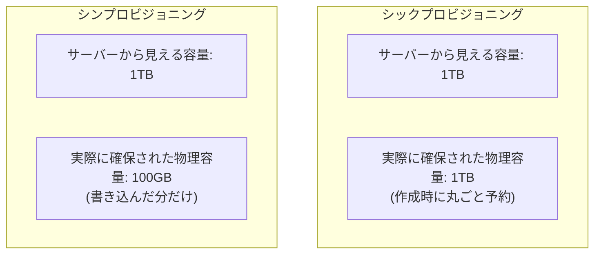

## はじめに

- **この記事で得られること**: [NTFSファイルシステムの仕組み](/articles/ntfs-mft-internals-guide)で扱った、フォーマット済みのボリュームという概念を前提に、**シンプロビジョニングが、「サーバーに見せている容量」と「ストレージ装置側が実際に確保している容量」を、どうやって分離しているのか**、そしてこの仕組みが生み出す「**オーバーコミット**」というリスクを体系的に理解します。
- **対象読者**: 「シンプロビジョニング」という言葉を聞いたことはあるものの、「見せかけの容量」が、具体的にどういう仕組みで実現されているのかを説明できない方を想定しています。
- **読むのにかかる想定時間**: 約16分

この記事は[『上位1%』シリーズ 全記事ガイド](/sitemap)の一部、[ストレージ基礎シリーズ](/sitemap#シリーズ一覧)の8本目です。

## 前提知識

- **ボリュームとフォーマットの基礎**: [RAIDとWindowsのディスク管理の関係](/articles/disk-raid-fundamentals-guide)で扱った、ボリュームという単位と、フォーマットによってファイルシステムの構造が書き込まれるという基礎です。本記事では、このボリュームの「容量」そのものが、どう管理されているのかを扱います。

## 全体像をつかむ

従来の、**シックプロビジョニング**(厚い割り当て)という方式では、「1TBのボリュームを作成する」と指示した瞬間に、ストレージ装置側は、**実際に1TB分の物理的な領域を、丸ごと予約・確保します。** これに対し、**シンプロビジョニング**(薄い割り当て)は、「1TBのボリュームに見せる」という宣言だけを行い、**実際にデータが書き込まれた分だけ、物理的な領域を、後から少しずつ割り当てていく**という方式です。

## 基礎から徹底解説

### 見せかけの容量と、実際の消費量は、別々に管理されている

シンプロビジョニングのボリュームに対して、サーバー(OS)側は、**「これは1TBのディスクだ」として、通常のボリュームと同じように認識し、使用します。** しかし、**ストレージ装置の内部では、実際にデータが書き込まれたブロックの分だけが、物理的な領域として消費されています。** まだ何も書き込まれていない部分は、ストレージ装置内部では、物理的な領域を一切占有していません。

**この仕組みが成立する鍵は、「サーバー側が認識している論理的な容量」と、「ストレージ装置が実際に消費している物理的な容量」という、2つの別々の数字を、ストレージ装置の内部で、個別に管理している**ことにあります。サーバー側からの問い合わせには、常に「1TB」という論理容量を答えつつ、内部的には、実際に使われている物理容量だけを、別の帳簿で管理し続けています。

この仕組みは、NTFSの「レジデント属性」と、発想として何が似ているのか

[NTFSファイルシステムの仕組み](/articles/ntfs-mft-internals-guide)で扱った、**小さなファイルのデータが、別の場所に実体を持つのではなく、MFTレコードの中に直接収まっている**という仕組みと、シンプロビジョニングには、**「見かけ上の構造(ファイルの実体がある、という前提/ボリュームが1TBある、という前提)と、実際のデータの配置(本当にどこに、どれだけのデータがあるか)を、分離して管理する」という、根底で共通する発想**があります。ストレージの分野では、「表面的に見えている容量・構造」と、「実際に消費されているリソース」とを分離し、必要になった時点で初めて実体を割り当てる、という設計パターンが、レイヤーを問わず繰り返し登場します。

### オーバーコミット:「見せかけの容量の合計」が、「実際の総容量」を超えてしまう状態

シンプロビジョニングの最大のリスクが、**オーバーコミット**です。ストレージ装置の実際の総容量が10TBしかないにもかかわらず、**シンプロビジョニングを使えば、「1TBのボリューム」を、20個作成することができてしまいます。** それぞれのボリュームは「1TB」と見えていますが、実際にはまだ、ごく一部しか使われていないため、合計20TB分の「見かけの容量」を、10TBの実容量の上に、問題なく共存させることができます。

**しかし、これらのボリュームの利用者が、同時に、それぞれ本当に1TBずつデータを書き込み始めると、実際の総容量である10TBを、すぐに使い切ってしまいます。** この場合に起きるのは、**サーバー側からは「ディスクにまだ十分な空き容量がある(論理容量ではまだ余裕がある)」と見えているにもかかわらず、ストレージ装置側の実際の物理容量が枯渇し、書き込みそのものが失敗する**という、深刻な障害です。

## プロが見ている視点(上位1%の理解)

### シンプロビジョニングは、「効率化の技術」であると同時に、「監視を前提とした技術」である

シンプロビジョニングは、使われない容量を、事前に無駄に確保しないことで、ストレージの利用効率を大きく高めてくれます。**しかし、この効率化は、「実際の物理容量の消費状況を、継続的に監視し、枯渇する前に、実容量を追加する、あるいは利用者の書き込みを制限する」という、運用上の責任と、常にセットになっています。** この監視を怠ると、オーバーコミットによる容量枯渇という、サーバー側の論理容量の表示だけを見ていては、絶対に予測できない障害に突き当たります。**「見かけの数字だけを見て安心しない」という姿勢が、シンプロビジョニングを安全に運用するための、最も重要な前提**です。

## よくある誤解・つまずきポイント

- **誤解1: 「シンプロビジョニングのボリュームは、サーバー側から見て、シックプロビジョニングと何か違う挙動をする」**
  サーバー(OS)側から見ると、シンプロビジョニングとシックプロビジョニングのボリュームは、通常の使用において、まったく同じように振る舞います。違いは、ストレージ装置の内部での、容量の管理方法だけです。
- **誤解2: 「論理容量に空きがあれば、書き込みは必ず成功する」**
  オーバーコミットが発生している環境では、論理容量に空きがあっても、ストレージ装置の実際の物理容量が枯渇していれば、書き込みは失敗します。
- **誤解3: 「シンプロビジョニングを使えば、ストレージの監視は不要になる」**
  シンプロビジョニングは、効率化と引き換えに、むしろ監視の重要性を高める技術です。

## 障害・トラブルシューティングの視点

1. **サーバー側では空き容量があるのに、書き込みが失敗する**: ストレージ装置側が、オーバーコミットによって、実際の物理容量を使い果たしていないかを確認します。
2. **ストレージ全体の使用率が、想定より早く上昇している**: 複数のシンプロビジョニングボリュームの、実際の消費量の合計を、個別に確認します。論理容量の合計だけを見ていると、この傾向に気づけません。
3. **特定のボリュームだけ、書き込み性能が低下している**: シンプロビジョニングでは、新しい物理領域を割り当てる処理(通常、シックプロビジョニングでは発生しない)が、書き込みのたびに追加で発生することがあります。

## まとめ

- シンプロビジョニングは、サーバーに見せる論理容量と、実際にストレージ装置が消費する物理容量を、別々に管理する仕組みです。
- 実際にデータが書き込まれた分だけ、物理的な領域が後から割り当てられるため、ストレージの利用効率が大きく向上します。
- 複数のボリュームの「見かけの容量」の合計が、実際の総容量を超えてしまう状態を、オーバーコミットと呼びます。
- オーバーコミットが進行すると、サーバー側の論理容量に空きがあるように見えても、実際の物理容量の枯渇によって、書き込みが失敗する障害が発生します。

**今日から意識すべきこと**
1. シンプロビジョニングを使っているストレージでは、論理容量の空き状況だけでなく、実際の物理容量の消費状況を、必ず別途監視しましょう。
2. 「ディスクに空きがある」という表示を見たときは、それが論理容量なのか、実際の物理容量なのかを、常に意識して区別しましょう。

## 参考文献

- [Thin Provisioning | VMware Docs](https://docs.vmware.com/)
- [Storage Overcommit | SNIA Dictionary](https://www.snia.org/education/dictionary)
