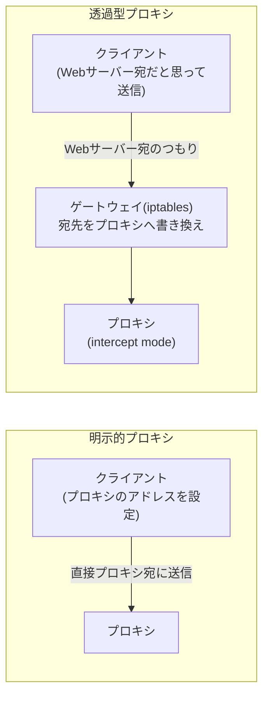

## はじめに

- **この記事で得られること**: [Squidで明示的プロキシを構築するハンズオン](/articles/squid-proxy-handson-guide)で構築した、**クライアント側でプロキシのアドレスを設定する「明示的プロキシ」とは異なり**、**クライアントが何も設定しなくても、通信が自動的にプロキシを経由させられる**「透過型プロキシ」の仕組みを、iptablesによる通信の横取りと、Squidのintercept modeを組み合わせて、自分の手で構築します。
- **対象読者**: 明示的プロキシのハンズオンは経験したものの、「透過型プロキシ」が、具体的にどういう仕組みでクライアントの設定なしにプロキシを強制しているのかを説明できない方を想定しています。
- **読むのにかかる想定時間**: 約25分(ハンズオン実施込み)

この記事は[『上位1%』シリーズ 全記事ガイド](/sitemap)の一部、[Webプロキシ・キャッシュシリーズ](/sitemap#シリーズ一覧)の9本目です。[ハンズオン準備マニュアル](/articles/handson-prep-guide)で作成したUbuntu Server環境が1台あれば実施できます。

## 前提知識

- **明示的プロキシの基本操作**: [Squidで明示的プロキシを構築するハンズオン](/articles/squid-proxy-handson-guide)で扱った、Squidの基本的な設定方法です。
- **iptablesの基本**: [iptables(netfilter)の仕組み](/articles/linux-iptables-guide)で扱った、パケットフィルタリングの基礎です。

## 全体像をつかむ

明示的プロキシでは、**クライアント自身が「このアドレス宛のHTTP通信は、プロキシサーバーへ送る」と知っている**必要がありました。透過型プロキシは、この前提を覆します。**クライアントは、いつものように宛先のWebサーバーへ直接通信しているつもりのまま、その通信を、ネットワークの途中(ゲートウェイ)で、気づかれないようにプロキシへ横取りする**という発想です。



## ハンズオン手順

### Step 1: Squidをintercept modeで起動する

```bash
sudo apt install -y squid
```

`/etc/squid/squid.conf`に、intercept modeの設定を追加します。

```
http_port 3129 intercept
```

**通常のSquidは、クライアントから「プロキシ宛」として届いたリクエストを処理しますが、`intercept`を指定すると、Squid自身が、宛先を偽装された(実際にはWebサーバー宛だった)リクエストを受け取っても、正しく中継できるようになります。**

```bash
sudo systemctl restart squid
```

### Step 2: iptablesで、HTTP通信をSquidへ横取りする

```bash
sudo iptables -t nat -A PREROUTING -i eth0 -p tcp --dport 80 -j REDIRECT --to-port 3129
sudo iptables -t nat -L PREROUTING -n -v
```

**実行結果(該当部分):**

```
REDIRECT   tcp  --  eth0   *       0.0.0.0/0            0.0.0.0/0            tcp dpt:80 redir ports 3129
```

**このルールは、`eth0`から入ってきた、80番ポート(HTTP)宛のすべての通信を、ローカルの3129番ポート(Squid)へ転送する、という設定です。** これは、[iptablesの仕組み](/articles/linux-iptables-guide)で学んだ、netfilterへのルール登録そのものです。

### Step 3: クライアント側で、プロキシ設定を一切行わずに通信を確認する

別の端末(クライアント)から、このゲートウェイを経由するように設定し、プロキシ設定を一切行わずに通信します。

```bash
curl -v http://example.com/ 2>&1 | grep -E "Connected to|X-Cache"
```

**実行結果(該当部分):**

```
* Connected to example.com (203.0.113.1) port 80
```

**クライアント側は、`example.com`へ直接接続しているつもりのままです。** しかし、Squidのログを確認すると、実際にはSquidがこの通信を中継していることが分かります。

```bash
sudo tail -f /var/log/squid/access.log
```

**実行結果(該当部分):**

```
... TCP_MISS/200 ... GET http://example.com/ ...
```

**クライアントには一切見えないところで、Squidがこの通信を受け取り、キャッシュを確認し、実際のWebサーバーへ通信を中継していた**ことが、ログから確認できます。

<details>
<summary>なぜ、宛先が書き換えられたのに、クライアントは気づかないのか</summary>

**iptablesのREDIRECTターゲットは、パケットの宛先IPアドレス・ポートを、カーネル内部で書き換えますが、クライアント側のTCP接続自体は、`example.com`に対して張られたものとして、クライアント側のOSには認識され続けます。** この書き換えは、クライアントから送信された後、ゲートウェイを通過する際に行われるため、**クライアント自身が、この書き換えに関与する余地も、気づく手段も、通常はありません。** これが、「透過」型と呼ばれる理由です。

</details>

## プロが見ている視点(上位1%の理解)

### 透過型プロキシは、「便利さ」と「通信の信頼性」を交換する設計である

透過型プロキシの最大の利点は、**社内の全端末に対して、個別の設定を行わずに、プロキシ経由の通信を一括して強制できる**ことです。しかし、この便利さには代償があります。**クライアントが「このプロキシを経由している」ことを意識できないため、HTTPSのように暗号化された通信に対しては、宛先を書き換えて中身を覗き見ることが原理的にできません(証明書の検証で失敗するため)。** 透過型プロキシが機能するのは、暗号化されていないHTTP通信、あるいは、別途TLS復号の仕組みを組み合わせた場合に限られます。**「クライアントに気づかれない」という設計上の利点は、同時に「クライアントが、通信が横取りされていることを検証する手段を持たない」という、信頼性の面でのトレードオフと常に隣り合っている**ことを、上位1%のエンジニアは理解しています。

## よくある誤解・つまずきポイント

- **誤解1: 「透過型プロキシは、明示的プロキシよりも常に優れている」**
  透過型プロキシは、クライアント側の設定を省略できる利点がありますが、暗号化された通信の扱いなど、明示的プロキシにはない制約も抱えています。
- **誤解2: 「iptablesのREDIRECTは、パケットの内容そのものを書き換える」**
  REDIRECTは、パケットの宛先IPアドレスとポート番号だけを書き換えます。パケットのペイロード(実際のデータ)は変更されません。
- **誤解3: 「透過型プロキシを構築すれば、HTTPS通信も自動的に中継・キャッシュできる」**
  HTTPSは、クライアントが接続先の証明書を検証するため、宛先を黙って書き換えると、証明書の検証に失敗し、通信そのものが成立しなくなります。

## 障害・トラブルシューティングの視点

1. **透過型プロキシを設定した後、HTTPS通信が失敗するようになった**: 証明書の検証エラーが発生していないかを確認します。透過型プロキシは、暗号化されていないHTTP通信を前提とした仕組みです。
2. **iptablesのルールを設定したのに、Squidに通信が届かない**: Squid側の`http_port`に`intercept`が正しく指定されているかを確認します。通常のポート指定のままでは、横取りされた通信を正しく処理できません。
3. **意図しない通信まで、プロキシへ転送されてしまう**: iptablesのルールの、インターフェースやポート番号の指定が、意図した範囲に正確に絞られているかを確認します。

## まとめ

- 透過型プロキシは、クライアント側の設定なしに、ネットワークの途中でHTTP通信をプロキシへ横取りする仕組みです。
- iptablesのREDIRECTターゲットが、パケットの宛先をローカルのSquidへ書き換え、Squidのintercept modeが、その書き換えられた通信を正しく処理します。
- クライアント側は、通信が横取りされていることに気づく手段を、通常持ちません。
- 透過型プロキシは、便利さと引き換えに、暗号化された通信を扱えないという制約を抱えています。

**今日から意識すべきこと**
1. 透過型プロキシを検討する際は、対象がHTTP通信に限られることを、必ず前提として確認しましょう。
2. iptablesでネットワーク通信を書き換える設計に出会ったら、「クライアント側からは、これがどう見えているか」を、常に問い直しましょう。

## 参考文献

- [Squid: Feature: Transparent Proxying / Interception Proxying](https://wiki.squid-cache.org/Features/Tproxy4)
- [iptables(8) Manual Page](https://man7.org/linux/man-pages/man8/iptables.8.html)
