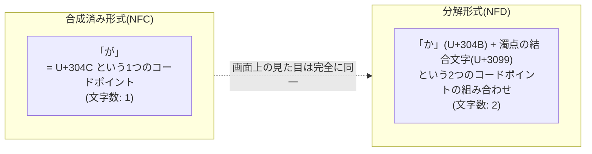
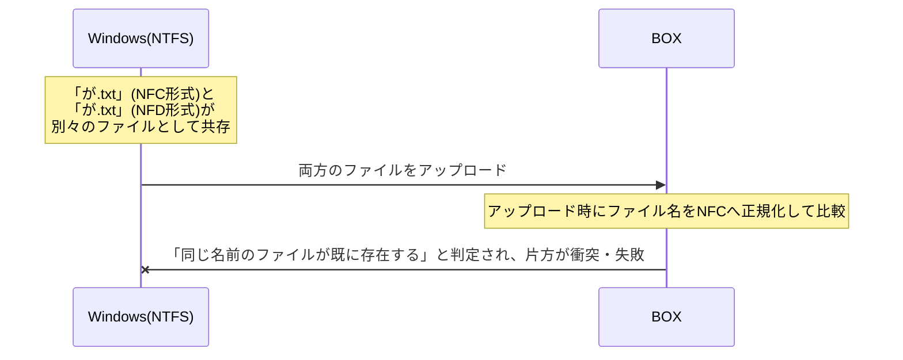

## はじめに

- **この記事で得られること**: エクスプローラー上では完全に同じ名前に見える2つのファイルが、PowerShellの`Get-ChildItem`で文字数を確認すると異なる数値を返す、という不思議な現象を出発点に、<strong>Unicode正規化(NFC/NFD)</strong>という観点から、その正体を体系的に理解します。あわせて、なぜWindows上ではこれらが別々のファイルとして共存できてしまい、BOXなどのクラウドストレージへの移行時には「同じ名前のファイル」と判定されて衝突・失敗するのかまでを解説します。
- **対象読者**: ファイルサーバーからクラウドストレージへの移行作業に携わったことがあるものの、見た目は同じなのに文字数が異なるファイル名という現象の原因を説明できない方を想定しています。
- **読むのにかかる想定時間**: 約16分

この記事は[『上位1%』シリーズ 全記事ガイド](/sitemap)の一部、[Windowsクライアント運用シリーズ](/sitemap#シリーズ一覧)の3本目です。

## 前提知識

- **Unicode**: 世界中の文字を、それぞれ一意の番号(コードポイント)に対応させる文字コードの規格です。
- **コードポイント**: Unicodeにおいて、1つの文字(または文字を構成する要素)に割り当てられた番号です。

## 全体像をつかむ

### 一言で言うと

**濁点・半濁点を含む日本語の文字(「が」「ぱ」など)やアクセント記号を含むラテン文字(「é」など)には、Unicode上で「1つのコードポイントで表現する方法」と「複数のコードポイントの組み合わせで表現する方法」という、2つの異なる表現方法が存在します。** この2つは、画面上の見た目(グリフ)としては完全に同一ですが、内部的なコードポイントの並び(=文字数としてカウントされる数)は異なります。



## 基礎から徹底解説

### なぜ文字数が異なって表示されるのか

PowerShellで次のようなコマンドを実行し、見た目が同じファイル名の文字数を比較すると、実際に異なる数値が返ってくることがあります。

```powershell
Get-ChildItem | Select-Object Name, @{Name="Length"; Expression={$_.Name.Length}}
```

このコマンドの`.Length`が返しているのは、**その文字列を構成しているコードポイント(より正確には、.NET内部の文字列表現であるUTF-16の符号単位)の数**です。前述の通り、濁点を含む文字が<strong>合成済み形式(NFC、Normalization Form C)</strong>で保存されていれば1文字としてカウントされ、<strong>分解形式(NFD、Normalization Form D)</strong>で保存されていれば、ベースの文字と結合文字を合わせて2文字(以上)としてカウントされます。**画面上の表示(グリフ)は、どちらの形式でもまったく同じ「が」に見える**ため、目視だけではこの違いに気づくことができません。

<details>
<summary>結合文字とは何か</summary>

<strong>結合文字(Combining Character)</strong>は、単体では表示されず、直前の文字に対して「濁点を付ける」「アクセント記号を付ける」といった装飾を加えるための、特殊なコードポイントです。日本語の濁点・半濁点だけでなく、フランス語のアクサン記号やドイツ語のウムラウトなど、多くの言語のアクセント記号付き文字が、この結合文字を使った分解形式で表現できます。

</details>

### なぜWindows上では、これらが別々のファイルとして共存できるのか

ここで実務上重要なのが、**Windows(NTFS)のファイルシステムが、ファイル名を比較する際にUnicode正規化を行わない**、という点です。NTFSは、ファイル名の大文字・小文字を区別しない比較は行いますが、**合成済み形式と分解形式という異なるコードポイント列を「同じ名前」として扱う正規化処理は行いません。** そのため、見た目が完全に同一の「が.txt」というファイル名であっても、片方が合成済み形式、もう片方が分解形式でエンコードされていれば、**OSからは2つの異なるファイル名として認識され、同じフォルダー内に別々のファイルとして共存できてしまいます。**

### なぜBOXでは同じ名前のファイルとして判定されるのか

一方、多くのクラウドストレージサービス(BOXなど)は、ファイルのアップロード・同期処理においてファイル名を比較する際、**Unicode正規化を行った上で比較する**実装になっていることが一般的です(多くの場合、NFC形式に正規化してから比較します)。正規化処理を行うと、合成済み形式・分解形式のどちらでエンコードされていたファイル名も、**同じ正規化形式(たとえばNFC)へ変換された上で比較される**ため、見た目が同じ2つのファイル名は、**この時点で完全に同一の文字列として判定されます。**

**この2つのシステムの正規化方針の違いこそが、移行トラブルの正体です。** Windows上では正規化を行わないため別々のファイルとして問題なく共存していたものが、BOXへアップロードする段階で正規化された結果、「同じ名前のファイルが既に存在する」という衝突が発生し、移行が失敗する、という流れになります。



### なぜ分解形式のファイル名がそもそも生まれるのか

実務では、**macOSから作成・コピーされたファイル**で、このような分解形式のファイル名に遭遇することが多くあります。macOSが伝統的に採用しているファイルシステム(HFS+など)は、ファイル名を分解形式(NFD)で正規化して保存する仕様を持っていた歴史的経緯があり、その名残が現在でも一部の運用で残っています。また、特定のスキャナー機器やOCRソフトウェア、一部の古いシステムが生成するファイル名も、意図せず分解形式でエンコードされることがあります。**Mac環境とWindows環境の間でファイルをコピー・共有する機会が多い組織では、この問題に遭遇するリスクが特に高くなる**、という実務上の傾向を押さえておくと、原因調査の際に有効な手がかりになります。

## プロが見ている視点(上位1%の理解)

### PowerShellで正規化形式を統一する

移行前に分解形式のファイル名を検出し、合成済み形式(NFC)へ統一しておくことで、この種の衝突を未然に防げます。PowerShellの`.Normalize()`メソッドを使うと、文字列を指定した正規化形式へ変換できます。

```powershell
# 現在のファイル名をNFC形式へ正規化した上でリネームする例
Get-ChildItem -Recurse | ForEach-Object {
    $normalizedName = $_.Name.Normalize([System.Text.NormalizationForm]::FormC)
    if ($_.Name -ne $normalizedName) {
        Rename-Item -Path $_.FullName -NewName $normalizedName
    }
}
```

**大規模な移行作業の前には、こうしたスクリプトで対象フォルダー全体をスキャンし、正規化形式が統一されていないファイルを事前に検出・修正しておく**ことが、移行失敗のリスクを大きく減らします。目視での確認では気づけないため、スクリプトによる機械的な検出が実務上不可欠です。

### 正規化方針はツール・サービスによって異なる

**「OSやアプリケーションが自動的に正規化してくれるはずだ」という期待は禁物**です。正規化を行うかどうか、行う場合にどの正規化形式(NFC/NFD/NFKC/NFKDなど)を使うかは、OS・ファイルシステム・クラウドサービス・アプリケーションによって方針が異なります。複数のシステムをまたいでファイルを扱う実務では、**それぞれのシステムがどの正規化方針を採用しているかを事前に確認しておく**ことが、同種のトラブルを避ける上で重要です。

## よくある誤解・つまずきポイント

- **誤解1: 「見た目が同じファイル名であれば、内部的にも完全に同一である」**
  合成済み形式と分解形式という、内部的なコードポイント列が異なる2つの表現方法が存在するため、見た目が同じでも内部データは異なる場合があります。
- **誤解2: 「Windowsは、ファイル名の表記が異なる場合を自動的に正規化して統一してくれる」**
  NTFSは大文字・小文字を区別しない比較は行いますが、Unicode正規化(合成済み形式と分解形式の統一)は行いません。
- **誤解3: 「この問題は、日本語環境だけで発生する特殊な現象である」**
  濁点・半濁点だけでなく、フランス語やドイツ語などのアクセント記号付きラテン文字でも同様の現象が発生しうる、Unicode正規化全般に関わる問題です。

## 障害・トラブルシューティングの視点

見た目は同じなのにファイル名が別々に扱われる現象は、<strong>「文字数(コードポイント数)を比較して、正規化形式の違いを機械的に検出する」</strong>のが基本的な切り分け方法です。

1. **BOXなどへの移行時に「同名ファイルが既に存在する」というエラーが出る**: 移行元のフォルダーで、`Get-ChildItem`の`.Length`プロパティを使い、見た目が同じファイル名同士で文字数に差異がないかを確認します。
2. **文字数の差異が見つかった場合**: `.Normalize()`メソッドで正規化形式を統一した上で、リネーム処理を行い、再度アップロード・同期を試します。
3. **原因となるファイルの発生源を特定したい場合**: そのファイルの作成日時・変更履歴や、組織内でMac環境からファイルがコピーされた経路がないかを確認します。

### 予防策・恒久対策

- クラウドストレージへの大規模移行を計画する際は、事前にファイル名の正規化形式を統一するスクリプトをチェックリストに組み込む。
- Mac環境とWindows環境の間でファイルを共有する運用がある場合、定期的に正規化形式の不整合をスキャンする仕組みを検討する。
- 複数システムをまたいでファイルを扱う場合、それぞれのシステムの正規化方針(行うかどうか、どの形式か)を事前に確認しておく。

## まとめ

- 濁点・アクセント記号付きの文字には、合成済み形式(NFC)と分解形式(NFD)という、見た目は同一だがコードポイント数が異なる2つの表現方法が存在します。
- Windows(NTFS)はファイル名比較の際にUnicode正規化を行わないため、この2つの形式のファイル名が別々のファイルとして共存できます。
- BOXなどのクラウドストレージは、アップロード・同期時にUnicode正規化を行った上で比較するため、Windows上で共存していたファイルが「同じ名前」と判定され、移行時に衝突・失敗します。
- 分解形式のファイル名は、主にmacOS由来のファイルなどで発生しやすく、PowerShellの`.Normalize()`メソッドで移行前に検出・統一できます。

**今日から意識すべきこと**
1. クラウドストレージへの移行時に原因不明の「同名ファイル」エラーに遭遇したら、`Get-ChildItem`の`.Length`プロパティで文字数の差異を確認しましょう。
2. Mac環境とファイルを共有する機会がある場合は、正規化形式の不整合が発生しやすいことを念頭に置いておきましょう。

## 参考文献

- [Unicode Normalization Forms | Unicode Standard Annex #15](https://unicode.org/reports/tr15/)
- [String.Normalize Method | Microsoft Learn](https://learn.microsoft.com/en-us/dotnet/api/system.string.normalize)
- [Naming Files, Paths, and Namespaces | Microsoft Learn](https://learn.microsoft.com/en-us/windows/win32/fileio/naming-a-file)
