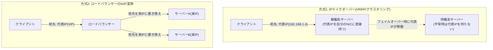
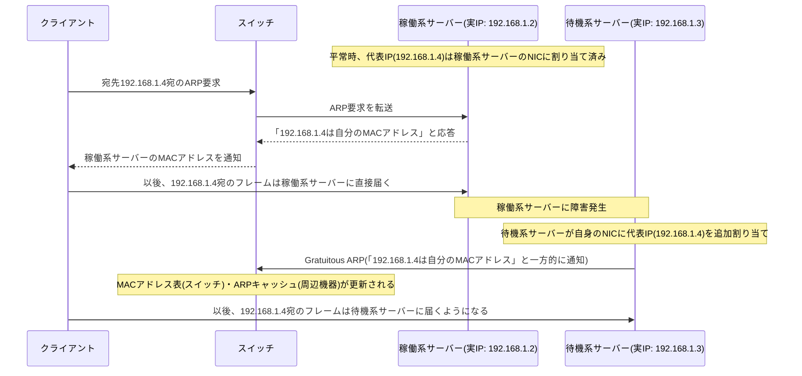
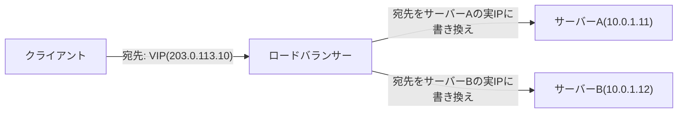
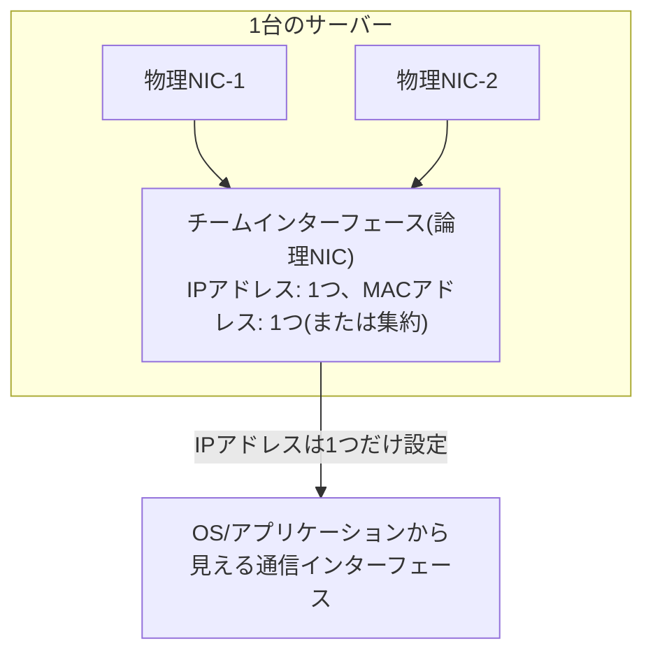

## はじめに

- **この記事で得られること**: 冗長化されたサーバー群にクライアントがアクセスする際に使う「代表IP(VIP、Virtual IP Address)」が、実際に稼働している物理サーバーのIPアドレスとどう対応しているのか——これを「変換(NAT)」で実現する方式と、「そのIPアドレス自体を稼働系サーバーに直接持たせる(IPテイクオーバー)」方式という、性質の異なる2つの実現方法があること、そしてもう1つの「仮想IP」であるNICチーミングの仕組みと、この2つがどう違うのかを体系的に理解できます。
- **対象読者**: インフラエンジニアとして、冗長化されたサーバー(クラスタ構成、ロードバランサー配下のサーバー群)を利用したことはあるものの、「代表IP宛の通信が、実際にはどのサーバーにどうやって届いているのか」を具体的に説明できない方を想定しています。
- **読むのにかかる想定時間**: 約20分

この記事は[『上位1%』シリーズ 全記事ガイド](/sitemap)の一部です。

## 前提知識

- **IPアドレス/MACアドレス**: IPアドレスはネットワーク層(L3)の論理的な住所、MACアドレスはデータリンク層(L2)でNICに割り当てられた物理的な住所です。同一のL2セグメント内で通信する際、送信側はARP(Address Resolution Protocol)で宛先IPアドレスに対応するMACアドレスを解決します。
- **デフォルトゲートウェイ**: 端末が、自分と異なるネットワーク宛のパケットを送る際に、最初の転送先として指定するルーターのIPアドレスです。
- **冗長化(HA、High Availability)** : 1台の機器・回線が故障しても、サービス全体は継続できるように、予備の系統をあらかじめ用意しておく設計思想です。

## 全体像をつかむ

### 一言で言うと

**代表IP(VIP)とは、複数の物理サーバー(あるいは複数の物理NIC)を、クライアントからは「1つの論理的な宛先」として見せるためのIPアドレス**です。これを実現する方法には、性質がまったく異なる2つのアプローチがあります。

**方式1(IPテイクオーバー)では、代表IPと実IPの間に「変換」は一切存在しません。** 代表IPそのものが、その瞬間に稼働している物理サーバーのNICへ直接割り当てられているだけです。**方式2(ロードバランサーのNAT変換)では、文字通りNAT(宛先アドレス変換)によって代表IP宛のパケットが実IPへ書き換えられます。** どちらも「クライアントからは1つの代表IPに見える」という結果は同じですが、内部の実現方法は根本的に異なります。この違いを区別できることが、この記事の core です。

## 基礎から徹底解説

### 方式1: IPテイクオーバー——代表IPを稼働系サーバーが直接持つ

**IPテイクオーバー**は、Windows ServerのフェイルオーバークラスタリングやLinuxのKeepalived(VRRP)、Cisco機器のHSRPなどで使われる方式です。ここでは代表IPと実IPの間に変換処理は存在せず、**代表IPというIPアドレス自体が、稼働系(アクティブ)のサーバーのNICに追加で割り当てられている**というのが実態です。

ポイントは次の2つです。

1. **平常時、代表IPは常にどちらか1台(稼働系)のサーバーだけが持っている**ことです。2台が同時に同じIPアドレスを名乗ることはなく(名乗ってしまうと後述の「IPアドレス重複」の問題が起きます)、クラスタリングソフトウェア(Windows Server Failover Clustering、keepalivedなど)が「今どちらが稼働系か」を常に監視し、代表IPの割り当てを排他的に制御しています。
2. **フェイルオーバー(切り替え)が起きると、新しく稼働系になったサーバーが自分のNICに代表IPを追加し、Gratuitous ARP(自発的ARP、要求されていないのに「このIPは自分のMACアドレスだ」と一方的に送信するARPパケット)を送信**します。これにより、スイッチのMACアドレス表や周辺機器のARPキャッシュが即座に更新され、以後代表IP宛の通信は新しい稼働系サーバーに届くようになります。

**この方式では「代表IPと実IPの変換テーブル」のようなものは、どこにも存在しません。** 代表IP(192.168.1.4)は、ある瞬間には稼働系サーバーのIPアドレスの1つそのものであり、実IP(192.168.1.2や192.168.1.3)とは、同じNIC上に**複数のIPアドレスが同時に割り当てられている**という関係にあります。

VRRP/HSRPという標準化されたプロトコル

**VRRP(Virtual Router Redundancy Protocol、RFC 5798)** は、主にルーター・ゲートウェイの冗長化のために標準化されたプロトコルで、Ciscoの独自プロトコルであるHSRP(Hot Standby Router Protocol)とほぼ同じ発想に基づきます。複数台のルーターが「仮想ルーター」という1つの論理的な存在を構成し、そのうち優先度が最も高い1台がマスターとして仮想IP(代表IP)と仮想MACアドレスを保持します。マスターが一定間隔で送るアドバタイズメント(生存通知)が届かなくなると、次に優先度の高いルーターが新しいマスターとなり、仮想IP・仮想MACアドレスを引き継ぎます。ここでもGratuitous ARPが、切り替え後の即時反映を担う重要な役割を果たしています。サーバークラスタリングとルーターの冗長化は用途こそ違いますが、「複数の実体が1つの仮想的なアドレスを排他的に共有し、Gratuitous ARPで切り替えを周知する」という基本構造は共通しています。

### 方式2: ロードバランサーのNAT変換——代表IPを実IPへ書き換える

一方、 **ロードバランサー(F5 BIG-IPやHAProxy、クラウドのマネージドロードバランサーなど)** が使う方式は、前述のNAT(Network Address Translation)そのものです。ロードバランサー自身が代表IP(VIP)を持ち、クライアントからのパケットを受け取った上で、**宛先IPアドレスを、実際にリクエストを処理させたいサーバーの実IPアドレスに書き換えて**転送します。

この方式には、IPテイクオーバー方式にはない特徴があります。

- **複数の実サーバーに、同時にトラフィックを振り分けられる**(ロードバランシング)ことです。IPテイクオーバーは「常にどちらか1台だけが代表IPを持つ」ため基本的に1対1の切り替えですが、ロードバランサーは1つの代表IP宛の通信を、その都度異なる実サーバーへ振り分けることができます。
- **ロードバランサー自身が単一障害点になりうる**ことです。このため、ロードバランサー自体もペアで冗長化し、ロードバランサーのペアの間で前述のIPテイクオーバー方式によって代表IPを引き継ぐ、という**2つの方式を組み合わせた構成**が一般的です(「ロードバランサーの代表IPはIPテイクオーバーで、その先のサーバーへの振り分けはNAT変換で」という2段構え)。

### なぜ「変換」と「テイクオーバー」を混同しやすいのか

冗長化されたシステムを外から観察すると、どちらの方式でも「クライアントは1つの代表IPだけを見ており、実際にどのサーバーが応答しているかは意識しない」という結果は同じです。しかし**裏側の仕組みは全く別物**です。

| 観点 | IPテイクオーバー(VRRP/クラスタリング) | ロードバランサーのNAT変換 |
|---|---|---|
| 代表IPの実体 | ある瞬間には、稼働系サーバー自身のIPアドレスの1つ | ロードバランサーが保持する、実サーバーとは別のIPアドレス |
| 変換処理 | なし(代表IPがそのままサーバーのIPとして使われる) | あり(宛先アドレスをその都度実IPに書き換える) |
| 同時に代表IPで応答できるサーバー数 | 常に1台のみ | 複数台(ロードバランシング可能) |
| 切り替えの仕組み | Gratuitous ARPによるMACアドレスの周知 | ロードバランサー内部の振り分けテーブル(ヘルスチェックの結果など) |

Windows Serverのフェイルオーバークラスタリングにおける **クラスタIPアドレス(Client Access Point)** は、この方式1(IPテイクオーバー)に該当します。「代表IPがどのように実IPへ変換されているのか」という疑問に対しては、**構成によっては変換は存在せず、代表IP自体が稼働系サーバーに直接割り当てられているだけ、という場合が多い**、というのが実務上の正確な答えになります。

### NICチーミングの仮想IP：複数の物理NICを1つに見せる

ここまでの「代表IP」は、いずれも**複数の物理サーバー(あるいは物理ルーター)を1つに見せる**話でした。これとは別に、**1台のサーバーが持つ複数の物理NICを、OSより上位のレイヤーからは1つの論理NICとして見せる**技術が**NICチーミング**(Windows Serverでは**LBFO: Load Balancing/Failover**、Linuxでは**bonding**、標準化された規格としては **IEEE 802.3ad(LACP)** )です。

NICチーミングでOSやアプリケーションに見えるのは、**物理NICの数にかかわらず、1つのIPアドレスを持つ1つの論理インターフェース**だけです。複数の物理NICは、この論理インターフェースの「配下」で負荷分散(送信元によって使うNICを振り分けるなど)や冗長化(1本のケーブル・NICが故障しても残りのNICで通信を継続)のために使われますが、**IPアドレスの管理という観点では変換も切り替えもクライアントからは一切見えず、常に1つのIPアドレスとして振る舞います。**

チーミングの構成方式には大きく2種類あります。

- **スイッチ非依存モード**: 接続先のスイッチ側に特別な設定を必要とせず、サーバー側だけでチーミングを構成します。通常は1つの物理NICだけがアクティブに送受信し、残りは待機系として振る舞う(あるいは受信のみ有効にする)構成が多く、仕組みとしては前述のIPテイクオーバーに近い性質を持ちます。
- **スイッチ依存モード(LACPなど)** : 接続先のスイッチ側でもチーミングの設定(ポートチャネル/LAG)を行い、スイッチとサーバーの双方が「複数の物理リンクを束ねた1本の論理リンク」として認識します。複数の物理NICを同時にアクティブな状態で使い、フローごとに負荷分散できるため、帯域を実質的に拡張できます。

**NICチーミングの仮想IPと、前述の代表IP(VIP)は、「複数の実体を1つに見せる」という抽象化の発想は共通していますが、抽象化している対象(1台のサーバー内の複数NICか、複数台のサーバーか)がまったく異なる**、別のレイヤーの技術である点を区別してください。

## プロが見ている視点（上位1%の理解）

### なぜ同じセグメントの中に複数のIPアドレス(実IP+代表IP)を共存させられるのか

IPテイクオーバー方式では、1台のサーバー(1枚のNIC)が実IPと代表IPという**複数のIPアドレスを同時に持つ**ことに違和感を覚えるかもしれません。しかしこれはIPアドレスの割り当て上、何も特殊なことではありません。1枚の物理NICに複数のIPアドレスを割り当てること(**IPエイリアス**、Windowsでは単に「複数のIPアドレスを追加」、Linuxでは`ip addr add`で複数アドレスを1つのインターフェースに付与)は標準的にサポートされている機能であり、NICは自分宛のIPアドレス宛のフレームであれば、どのIPアドレス宛かにかかわらず受信処理を行います。稼働系サーバーは「自分自身の実IP宛の通信」と「代表IP宛の通信」を、同じ1枚のNICで同時に受け付けている、というのが実態です。

### なぜフェイルオーバー後に「反映されるまでのタイムラグ」が起こりうるのか

Gratuitous ARPは、スイッチのMACアドレス表や、同一セグメント内の機器のARPキャッシュを能動的に更新する仕組みですが、これが**確実に全機器に届く保証はありません**。パケットロスや、一部の機器・ネットワーク機器の実装によってはGratuitous ARPを受け取っても即座にキャッシュを更新しない(あるいは無視する)ケースがあり、この場合は該当機器のARPキャッシュのタイムアウト(通常数分程度)を待つまで、古いMACアドレス(旧稼働系サーバー)宛に送り続けてしまうことがあります。フェイルオーバー直後に一部のクライアントだけ数十秒〜数分間繋がらない、という現象の背景には、しばしばこのARPキャッシュの反映タイムラグがあります。

### なぜ物理NICに「元から」割り当てられていないIPでアプリケーションにアクセスできるのか

前述の通り、1枚の物理NICには複数のIPアドレスを同時に割り当てられます(IPエイリアス)。この性質は、代表IPのようなクラスタ用途に限らず、**Webサーバーやアプリケーションを、NICが最初に持っていた「メイン」のIPアドレスとは別のIPアドレスで公開したい場合**にも、そのまま使われています。IPアドレスは物理的な配線ではなく、あくまでOSがそのネットワークインターフェースに対して設定する論理的な値であり、アプリケーション(Webサーバーなど)は、OSが認識しているローカルIPアドレスであれば、それがNIC本来の「1つ目」のIPかどうかに関わらず、任意のIPアドレスにソケットをバインドしてリクエストを待ち受けられます。したがって、後から追加したセカンダリIPや代表IP宛のリクエストであっても、同じ1枚の物理NICが受信し、OSのTCP/IPスタックが宛先IPアドレスに応じて正しいソケット(アプリケーション)へ振り分ける、という形で成立します。

### 冗長化以外に、IPアドレスごとに物理NIC・ケーブルを分ける意味はあるのか

複数のIPアドレスは1枚のNICに共存できるとはいえ、実務では**冗長化とは別の目的で、あえて物理的に異なるNIC・ケーブル・スイッチに用途ごとのIPアドレスを分離する**構成もよく見られます。代表的な理由は次の通りです。

- **トラフィックの物理的な分離**: サーバー管理用のインターフェース(iDRACやIPMIの管理ポートなど)と、業務データを流すインターフェースを物理的に別のNIC・別のスイッチに分けることで、業務トラフィックの輻輳が管理アクセスに影響しないようにできます。
- **セキュリティゾーンの分離**: インターネットに公開するDMZ側のNICと、社内LAN側のNICを物理的に分離することで、たとえVLANやファイアウォールの設定に誤りがあっても、物理的に配線されていない経路へは(その気になっても)通信しようがない、という多層防御が成立します。
- **帯域の物理的な確保**: 特定用途(バックアップ通信、ストレージ通信など)のために1本の物理リンクを専有させることで、他のトラフィックとの帯域の奪い合いを構造的に避けられます。

いずれも「論理的にはVLANやファイアウォールルールだけでも同じことを実現できる場合がある」点がポイントですが、物理的に配線自体を分けることで、設定ミスに起因する誤った経路の混信リスクを、そもそも配線レベルで排除できるという安心感があるため、特に管理ネットワークやセキュリティ要件の高い環境では、物理的な分離が好まれる傾向があります。

## よくある誤解・つまずきポイント

- **誤解1: 「代表IPは必ずNAT(アドレス変換)によって実現されている」**
  Windows Serverのフェイルオーバークラスタリングやkeepalived(VRRP)のようなIPテイクオーバー方式では、変換は一切行われず、代表IP自体が稼働系サーバーのNICに直接割り当てられているだけです。NAT変換が行われるのは、ロードバランサーを使う方式に限られます。
- **誤解2: 「NICチーミングの仮想IPと、クラスタの代表IPは同じ仕組み」**
  NICチーミングは1台のサーバー内の複数物理NICを1つの論理NICに見せる技術、代表IP(VIP)は複数台のサーバーを1つの論理的な宛先に見せる技術であり、抽象化している対象のレイヤーが異なります。
- **誤解3: 「フェイルオーバーすれば即座に全クライアントから新しいサーバーに繋がる」**
  Gratuitous ARPによる周知は、経路上のすべての機器に確実かつ即座に届く保証はありません。機器の実装やネットワーク構成によっては、ARPキャッシュのタイムアウトを待つまで数十秒〜数分のタイムラグが生じることがあります。

## 障害・トラブルシューティングの視点

代表IP関連のトラブルは、 **「IPアドレスの割り当てそのものの問題か、周知(ARP)の問題か」** を切り分けるのが基本です。

1. **フェイルオーバー後に代表IPへ繋がらない**: 新しい稼働系サーバーに実際に代表IPが割り当てられているか(`ipconfig`/`ip addr`相当のコマンドで確認)、クラスタリングソフトウェア側でフェイルオーバー自体が正常に完了しているかを確認します。
2. **一部のクライアントだけ旧サーバーに送り続けてしまう**: 前述のARPキャッシュの反映タイムラグが疑われます。該当クライアント側で`arp -d`相当のコマンドでARPキャッシュを手動削除すると即座に復旧することがあり、これが原因の切り分けにも使えます。
3. **平常時から通信が不安定・同じIPアドレスの重複を示すエラーが出る**: クラスタリングソフトウェアの排他制御に不具合があり、2台が同時に代表IPを名乗ってしまっている(スプリットブレイン)可能性があります。両サーバーのクラスタサービスの状態、ハートビート通信(死活監視用の通信路)が正常かを確認します。
4. **ロードバランサー配下の特定のサーバーにだけ振り分けられない**: ロードバランサーのヘルスチェック設定と、対象サーバー側の応答(ヘルスチェック用エンドポイントの状態)を確認します。

### 予防策・恒久対策

- クラスタリング構成では、ハートビート通信専用のネットワーク経路を業務通信と分離し、誤ったスプリットブレイン判定を防ぐ。
- フェイルオーバーの動作確認(実際に切り替えて意図通り反映されるか)を、構築時だけでなく定期的な訓練としても行う。
- ロードバランサー自体も冗長化し、単一障害点にしない構成を基本とする。

## まとめ

- 代表IP(VIP)の実現方式には、代表IPを稼働系サーバーに直接割り当てる「IPテイクオーバー」と、ロードバランサーがNATで宛先を実IPに書き換える「NAT変換」という、性質の異なる2つの方式があります。
- IPテイクオーバー方式では、代表IPと実IPの間に変換処理は存在せず、1枚のNICが複数のIPアドレスを同時に持っているだけです。切り替えはGratuitous ARPによるMACアドレスの周知で実現されます。
- NICチーミングの仮想IPは、1台のサーバー内の複数物理NICを1つの論理NICに見せる技術であり、複数台のサーバーを1つに見せる代表IPとはレイヤーが異なります。
- フェイルオーバー直後の一時的な接続不良は、多くの場合Gratuitous ARPの反映タイムラグに起因します。

**今日から意識すべきこと**
1. 「代表IP」という言葉に出会ったら、それがIPテイクオーバー方式か、ロードバランサーのNAT変換方式かをまず区別しましょう。
2. フェイルオーバー関連のトラブルに遭遇したら、IPアドレスの割り当て自体の問題か、ARPキャッシュの反映タイムラグの問題かを切り分けましょう。

## 参考文献

- [Virtual Router Redundancy Protocol (VRRP) Version 3 | RFC 5798](https://datatracker.ietf.org/doc/html/rfc5798)
- [IEEE Standard for Link Aggregation (802.1AX, LACP)](https://standards.ieee.org/ieee/802.1AX/7237/)
- [Failover Clustering Overview | Microsoft Learn](https://learn.microsoft.com/en-us/windows-server/failover-clustering/failover-clustering-overview)
- [NIC Teaming Overview | Microsoft Learn](https://learn.microsoft.com/en-us/windows-server/networking/technologies/nic-teaming/nic-teaming)
