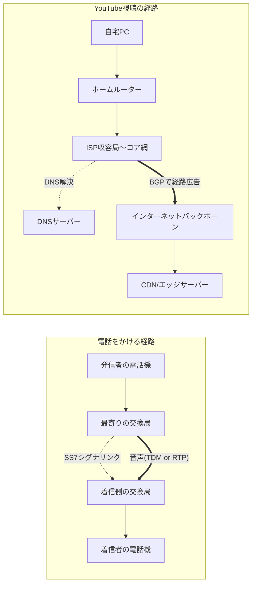
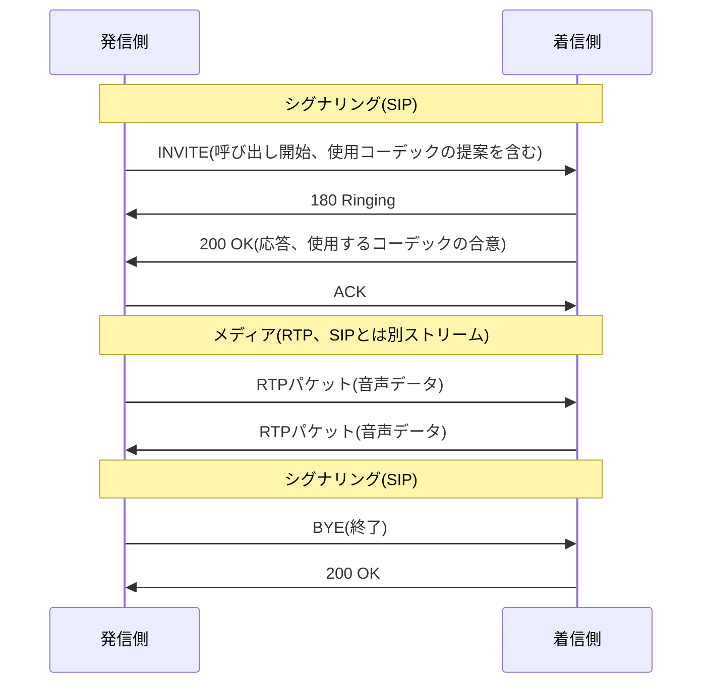

## はじめに

- **この記事で得られること**: VoIP技術が音声をどうデジタル化・パケット化してIPネットワーク上で運んでいるのか（コーデック・RTP・SIP）、SS7（共通線信号方式）が呼の確立・切断・課金・番号管理といった「呼制御（シグナリング）」をどう担っているのか、そしてなぜシグナリング（制御）と実際の音声（メディア）が別チャネルに分離されているのかという設計思想を理解できます。さらに、自宅のPCが実際にインターネット上のサービスにアクセスする際、どのような経路・プロトコルの積み重ねを経由しているのかを、電話をかける経路との対比を通して体系的に理解できます。
- **対象読者**: インフラエンジニアとして就業しており、「VoIP」「SS7」という言葉を聞いたことはあってもそれぞれが具体的に何を行っているのか説明できない方、また普段何気なく使っているインターネット接続が、実際にはどのような経路とプロトコルの積み重ねで成立しているのかを一度整理しておきたい方を想定しています。
- **読むのにかかる想定時間**: 約20分

この記事は[『上位1%』シリーズ 全記事ガイド](/sitemap)の一部です。

## 前提知識

- **コーデック**: アナログの音声信号を、デジタルデータへ変換（符号化）・逆変換（復号）する方式です。圧縮率と音質・遅延の間にトレードオフがあります。
- **UDP/TCP**: どちらもIPの上で動くトランスポート層のプロトコルです。TCPは順序保証・再送を行いますが、その分遅延が生じます。UDPは順序保証や再送を行わない代わりに低遅延で、音声や映像のようにリアルタイム性を重視する通信で好まれます。
- **DNS（Domain Name System）** : `youtube.com`のような人間が読めるドメイン名を、通信に必要なIPアドレスへ変換する、階層的な名前解決の仕組みです。
- **BGP（Border Gateway Protocol）** : インターネットを構成する無数のネットワーク（ISPなど）同士が、互いに「このIPアドレス帯へはこちらを経由してください」という経路情報を交換し合うためのルーティングプロトコルです。

## 全体像をつかむ

### 一言で言うと

**現代の電話網のコア（交換局間の基幹網）では、SS7という伝統的な共通線信号方式、あるいはSIPというIPネットワーク向けの呼制御プロトコルが「呼の確立・管理（シグナリング）」を担い、実際の音声はRTPというプロトコルでIPパケット化されて運ばれます（VoIP）。** ここで一貫しているのは、 **「経路を制御するメッセージ（シグナリング）」と「実際に運ばれるデータそのもの（メディア）」を別チャネルに分離する** という設計思想です。一方、私たちが日常的に行うインターネット利用（例えばYouTube視聴）は、この電話網とは別の経路——自宅ルーター→アクセス回線→ISP→インターネットバックボーン→CDN——を通っており、両者を対比することで「通信経路」という概念そのものの理解が深まります。

## 基礎から徹底解説

### SS7とは何か：電話網の「共通線信号方式」

**SS7（Signaling System No. 7、共通線信号方式）** は、電話網において呼の確立・応答・切断、番号ポータビリティの問い合わせ、課金情報の伝達といった「呼制御（シグナリング）」を専門に担う、プロトコル群の総称です。SS7は複数のコンポーネントで構成されており、代表的なものに、メッセージの伝達そのものを担う **MTP（Message Transfer Part）** と、呼の確立・切断など電話サービス固有の手続きを担う **ISUP（ISDN User Part）** があります。

SS7の設計上の大きな特徴は、**実際の音声を運ぶチャネル（ベアラチャネル）とは物理的に別の、シグナリング専用のリンク**を使って動作する点です（アウトオブバンドシグナリングと呼ばれます）。これにより、まだ音声用の回線が確立していない段階から、交換機同士がメッセージ形式で呼制御情報をやり取りできます。かつての電話網では、ダイヤルされた番号そのものを音声帯域内のトーン信号（MF信号）として送出するイン・バンドシグナリングが使われていましたが、この方式は音声回線を占有しながら制御情報を送るため非効率であるうえ、音声帯域を模倣した信号で不正に交換機を操作される（いわゆるフリーキング）という脆弱性も抱えていました。SS7への移行は、この両方の問題を解決するものでした。

SS7自体は「回線交換」ではなく「メッセージ交換」である、という見落とされがちな事実

「電話網＝回線交換」というイメージが強いために見落とされがちですが、**SS7そのものは、あらかじめ確保された固定の伝送路を流れるのではなく、メッセージ単位で交換機から交換機へリレーされていくメッセージ交換型のプロトコルスタック**です。つまり電話網は、実際の音声を運ぶ部分（ベアラ）こそTDMによる回線交換方式ですが、その経路を制御する呼制御（シグナリング）の部分は、古くからパケット交換に近い発想——宛先情報を含んだメッセージを、経由するノードがそれぞれ次のノードへリレーしていく方式——で作られていた、という点は意外に見落とされがちです。「回線交換方式の電話網の内部にも、パケット交換的な要素が古くから存在していた」と捉えると、電話網とIPネットワークの対比がより立体的に理解できます。

### VoIPとは何か：音声をIPパケットとして運ぶ技術

**VoIP（Voice over IP）** は、しばしばSkypeやLINE通話のような「インターネット電話サービス」そのものの名称だと誤解されますが、正確には**音声をデジタル化・パケット化し、IPネットワーク上で伝送する技術全般**を指す言葉です。通信キャリアの基幹網（コア網）内部の伝送がIP化されているのも、この意味でのVoIPです。

VoIPを支える代表的な要素技術は次の2つです。

- **コーデック**: アナログの音声をデジタルデータへ変換する方式です。電話網で伝統的に使われてきた**G.711**は、圧縮をほとんど行わず音質を優先する方式（64kbps）である一方、**G.729**や**Opus**は、圧縮率を高めて必要な帯域を抑える方式です。帯域とCPU負荷・音質の間にトレードオフがあります。
- **RTP（Real-time Transport Protocol、RFC 3550）** : コーデックで符号化された音声データを、実際にIPパケットとして運ぶプロトコルです。低遅延を優先するためUDPの上で動作し、パケットごとにシーケンス番号とタイムスタンプを付与することで、受信側がパケットの喪失や到着順序の乱れ、再生タイミングのズレ（ジッタ）を検出・補正できるようにしています。RTPと対になる **RTCP（RTP Control Protocol）** は、パケットロス率や遅延といった通信品質の統計情報を定期的にやり取りするための制御プロトコルです。

### SIP：IPネットワーク版の「呼制御」

電話網でSS7が担っていた「呼の確立・管理（シグナリング）」の役割を、IPネットワークの世界で担うのが **SIP（Session Initiation Protocol、RFC 3261）** です。SIPは、`INVITE`（呼び出し開始）・`200 OK`（応答）・`ACK`（確認）・`BYE`（終了）といった、HTTPに似たテキストベースのメッセージをやり取りすることで、通話の開始から終了までのセッションを管理します。

**ここでもSS7と同じ設計思想が繰り返されている**点に注目してください。SIPはあくまで「どの相手と通話を始めるか、どのコーデックを使うか」といったセッションの制御（シグナリング）だけを担い、実際の音声データそのものは、SIPのやり取りとは別に確立されたRTPのストリームとして流れます。制御（SIP）とデータ（RTP）を分離するというこの構造は、電話網における「SS7（シグナリング）とTDMのベアラチャネル（データ）の分離」と、驚くほど同じ発想の上に成り立っています。

伝統的なSS7網とIPベースのSIP網は、どうやってつながっているのか

固定電話・携帯電話の交換網は、すでにコア網のIP化が進んでいるとはいえ、いまだにSS7ベースの機器や隣接事業者が数多く存在します。そのため実際の通信キャリアの設備では、**シグナリングゲートウェイ**と呼ばれる装置が、SS7のメッセージとSIPのメッセージを相互に変換する橋渡し役を担っています。モバイル通信の世界では、この考え方をさらに発展させ、音声通話を含むあらゆるサービスをIPベースの単一のアーキテクチャに統合する **IMS（IP Multimedia Subsystem）** という枠組みが、4G/5Gネットワークの音声通話（VoLTE/VoNRなど）の基盤として採用されています。

### 実際の通信経路の具体例：自宅PCでYouTube動画を見るとき

ここまでの電話網の話と対比しながら、私たちが日常的に行っている「自宅のPCでYouTube動画を見る」という通信が、実際にどのような経路とプロトコルを経由しているのかを順に追ってみます。

1. **自宅内（L1/L2）** : PCは、Wi-Fiまたはイーサネットケーブルを通じてホームルーターへ接続します。ここではMACアドレスに基づくL2の転送が行われています。
2. **アクセス回線を通じてISPへ（L1/L2）** : ホームルーターは、ADSLや光回線といったアクセス回線を通じて、契約しているISP（インターネットサービスプロバイダー）の収容局へ接続します。
3. **DNS解決（L7）** : PCはまず、`youtube.com`というドメイン名に対応するIPアドレスを、DNSサーバーへ問い合わせて解決します。多くの場合、地理的に近い、応答の速いDNSサーバーへ誘導される仕組み（Anycast）が使われています。
4. **ISPのコア網からインターネットバックボーンへ（L3）** : ISPの内部ネットワークを経由したパケットは、 **BGP（Border Gateway Protocol）** によって世界中のネットワーク同士が交換し合っている経路情報に従い、インターネットバックボーンへと転送されていきます。
5. **CDN（Content Delivery Network）への到達（L3〜L7）** : YouTubeのような大規模サービスは、世界中に分散配置された**CDNのエッジサーバー**（Googleの場合はGGC: Google Global Cacheなどと呼ばれる仕組み）にコンテンツをキャッシュしており、DNS解決の時点、あるいはHTTPレベルのリダイレクトによって、利用者から地理的・ネットワーク的に近いエッジサーバーへ誘導されます。
6. **TLSハンドシェイクとHTTPS通信（L4〜L7）** : エッジサーバーとの間で、TCP（あるいは近年はQUIC/HTTP3）によるコネクションが確立され、TLSによる暗号化ハンドシェイクを経たのち、HTTPSで実際の動画データがやり取りされます。

**電話をかける経路と比べてみると、設計思想の違いが際立ちます。** 電話網では、電話番号という専用の名前空間に対し、SS7によるシグナリングが交換機を1台ずつリレーしながら、着信側までの経路を1本の呼として確立・維持します。一方インターネットの経路は、DNSによる階層的な名前解決、BGPによる無数のネットワーク間の動的な経路広告、CDNによる地理的な最適化という、複数の独立した仕組みが組み合わさって、宛先ごと・パケットごとに動的に決まっていきます。「1つの通話に対して1本の専用経路」という電話網の発想に対し、インターネットには、そもそも「この通信のための専用経路」という概念自体が存在しない、という違いを押さえておくと、両者の設計思想の違いがより明確になります。

## プロが見ている視点（上位1%の理解）

### SS7の脆弱性：なぜ「電話番号があれば追跡・傍受されうる」と言われるのか

SS7は1970年代、 **「信頼できる限られた事業者だけが接続する閉域網」であることを前提に設計されたプロトコル** です。そのため、メッセージの送信元を強く認証する仕組みや、内容を暗号化する仕組みが標準では組み込まれていません。しかし現在では、国際的な相互接続の拡大や、SS7網へのアクセスを提供する事業者の存在により、当初想定されていなかった第三者がSS7網にメッセージを送り込めてしまうケースが報告されており、これを悪用して **利用者のおおよその位置情報を取得したり、SMSで送られる2要素認証コードを傍受したりする攻撃（いわゆるSS7ハック）** が知られています。これは、「設計当時の前提（閉じた信頼関係の中でしか使われない）が、後年の相互接続の拡大によって崩れてしまった」という、インフラの歴史ではしばしば見られるパターンの典型例です。

### VoIPの通信品質はネットワーク側の優先制御に左右される

RTPはUDPの上で動作するため、TCPのような輻輳制御・再送は行われません。そのため、大容量のファイル転送のような他のバルクなトラフィックとIPネットワークを共有していると、音声パケットが後回しにされ、**ジッタ（到着間隔のばらつき）や遅延、パケットロス**が悪化し、通話品質が劣化しやすくなります。企業内でVoIP（IP電話）を導入する際に、 **QoS（Quality of Service）** の仕組み（DiffServによる優先度マーキングなど）を使って音声トラフィックを優先的に扱う設定がしばしば必要になるのは、この特性に起因します。

## よくある誤解・つまずきポイント

- **誤解1: 「VoIPはSkypeやLINE通話のような、インターネット電話サービスだけを指す言葉である」**
  VoIPは音声をIPパケット化して運ぶ技術全般を指す言葉であり、通信キャリアの基幹網（コア網）内部の伝送もこの意味でのVoIP化が進んでいます。私たちが「固定電話」だと思ってかけている通話の一部も、内部的にはVoIPで運ばれています。
- **誤解2: 「SS7は回線交換方式そのものであり、パケット交換とは無縁の技術である」**
  SS7自体は、固定の伝送路ではなくメッセージ単位で交換機間をリレーされる、メッセージ交換型のプロトコルです。電話網は「音声を運ぶ部分（回線交換）」と「呼制御を行う部分（メッセージ交換に近い発想）」が分かれています。
- **誤解3: 「インターネットの通信経路は、電話のように決まった1本道である」**
  インターネットの経路は、DNSによる名前解決、BGPによる動的な経路広告、CDNによる地理的な最適化という複数の独立した仕組みの組み合わせによって、宛先ごと・パケットごとに動的に決まります。電話網のような「1つの通信に対する専用経路」という概念自体がありません。

## 障害・トラブルシューティングの視点

### VoIPの通話品質劣化の切り分け

通話が途切れる・音質が悪いといった症状は、原因によって対処が異なるため、**ジッタ・パケットロス・遅延のどれが支配的かをまず特定する**ことが基本です。RTCPが定期的にやり取りする統計情報（受信パケット数、ロス率、ジッタ値など）を確認できる管理画面や、`tcpdump`などによるパケットキャプチャで、RTPストリームのシーケンス番号の欠落やタイムスタンプの間隔の乱れを直接確認します。原因がネットワークの輻輳であればQoS設定の見直し、特定区間の遅延であれば経路（トレースルート）の確認、というように切り分けていきます。

### インターネット接続不良の切り分け

「サイトに繋がらない」という症状も、 **「DNS解決に失敗しているのか」「経路上のどこかで到達できていないのか」「TLSハンドシェイクで失敗しているのか」** のどの段階かをまず切り分けます。`nslookup`/`dig`でDNS解決ができているかを確認し、`traceroute`/`mtr`で経路上のどこで応答が途絶えているかを確認し、それでも解決しない場合はTLS証明書の有効期限やSNI設定など、より上位のレイヤに原因がないかを確認する、という順序で切り分けるのが基本です。

## まとめ

- SS7は電話網の呼制御（シグナリング）を担うプロトコル群であり、実際の音声チャネルとは別のリンクでメッセージ交換方式によって動作します。電話網は「音声を運ぶ部分（回線交換）」と「呼制御を行う部分（メッセージ交換に近い発想）」に分かれています。
- VoIPはSkypeなどのサービス名ではなく、音声をデジタル化・パケット化してIPネットワーク上で伝送する技術全般を指し、通信キャリアの基幹網内部の伝送にも使われています。RTPが音声データを、SIPが呼制御（SS7に相当する役割）を担います。
- SIP/RTPにおいても、SS7/TDMと同じ「制御（シグナリング）とデータ（メディア）を別チャネルに分離する」という設計思想が繰り返されています。
- 自宅PCからのインターネット利用は、DNSによる名前解決・BGPによる動的な経路広告・CDNによる地理的最適化が組み合わさって宛先ごとに経路が決まる仕組みであり、電話網のような「1つの通話に対する専用経路」という概念自体がありません。

**今日から意識すべきこと**
1. 「VoIP」という言葉を見たら、それがインターネット電話サービスに限らず、音声をIPパケット化して運ぶ技術全般を指すことを思い出しましょう。
2. 通信のトラブルに遭遇したら、「シグナリング（経路・セッションの確立）」と「実際のデータ伝送」のどちらの段階で問題が起きているかをまず切り分ける癖をつけましょう。

## 参考文献

- [SIP: Session Initiation Protocol | RFC 3261](https://datatracker.ietf.org/doc/html/rfc3261)
- [RTP: A Transport Protocol for Real-Time Applications | RFC 3550](https://datatracker.ietf.org/doc/html/rfc3550)
- [Signalling System No. 7 (SS7); Overview | ITU-T Q.700](https://www.itu.int/rec/T-REC-Q.700)
- [ISDN User Part (ISUP) | ITU-T Q.761-Q.767](https://www.itu.int/rec/T-REC-Q.761)
