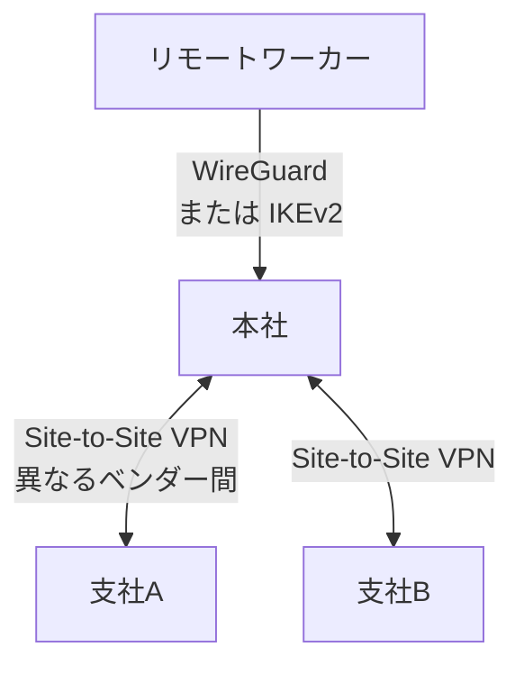

## はじめに

- **この記事で得られること**: ここまでのハンズオンで、1つずつ個別に習得してきた技術(Site-to-Site VPN、WireGuard、L2TP/IPsec、IKEv2によるPSK強化、障害時のトラブルシューティング)を、**1つの架空の多拠点企業のVPN基盤へ、自分の力で統合する**、VPN学科の卒業制作です。これまでの記事が「手順をなぞって、1つの技術を確実に身につける」ことを目的としていたのに対し、この記事は**要件だけを提示し、どの技術を、どう組み合わせるかを、自分で設計する**という、実務そのものに近い形式を取ります。
- **対象読者**: VPN学科の3年生・4年生・大学院の内容を一通り終え、個々のハンズオンは実施できるが、それらを組み合わせて1つのVPN基盤を設計した経験がない方を想定しています。
- **読むのにかかる想定時間**: 設計・構築・文書化を含めて、数日〜1週間程度を想定しています(1回のハンズオンとしては最も重量級です)。

この記事は[『上位1%』シリーズ 全記事ガイド](/sitemap)の一部です。[VPN学科の全カリキュラム](/university#vpn学科)の、卒業制作にあたる位置づけです。

## 前提知識

このハンズオンは、新しい技術を教えるものではありません。**以下の、すでに実施済みのハンズオンで習得した技術を、組み合わせて使います。**

- [L2TP/IPsecサーバーを自作し、理論を自分の目で検証するハンズオン](/articles/l2tp-ipsec-lab-guide)
- [L2TP/IPsecトラブルシューティング演習](/articles/l2tp-ipsec-troubleshooting-lab)
- [WireGuardトンネルを自分の手で構築し、Cryptokey Routingを体感するハンズオン](/articles/wireguard-handson-guide)
- [strongSwanで異なるベンダー間のSite-to-Site IPsecトンネルを模擬構築するハンズオン](/articles/site-to-site-vpn-handson-guide)
- [IKE Aggressive ModeとPSKに対するオフライン辞書攻撃を再現し、IKEv2への移行で防ぐハンズオン](/articles/ike-psk-cracking-handson-guide)
- [SD-WANとエッジルーター選定を『上位1%』の視点で理解する](/articles/sdwan-edge-router-guide)

## 課題設定:架空の多拠点企業のVPN基盤

**あなたは、架空の物流企業「KoiKoi Logistics」のネットワークエンジニアです。この会社は、本社と2つの支社を持ち、さらに近年リモートワークを導入したことで、複数の拠点とリモートワーカーを安全につなぐ必要が生じました。あなたに与えられた課題は、次の要件をすべて満たす、VPN基盤を、自分の手で構築することです。**

### 要件1: 本社と支社間を、異なるベンダーの機器同士でも接続できるようにする

**本社と支社Aは異なるベンダーのVPN機器を使っています。ベンダーに依存しない、標準規格に基づいたSite-to-Siteトンネルを構築してください。**

### 要件2: リモートワーカー向けに、現代的で軽量なVPNを提供する

**リモートワーカーの端末には、設定が複雑で、接続に時間のかかる旧来のVPNクライアントではなく、より軽量で高速な現代的なVPN技術を採用してください。**

### 要件3: 既存のレガシークライアントとの共存を考慮する

**一部の古いデバイスは、新しいVPN技術に対応していません。そうしたデバイスでも接続できる、従来からの仕組みを、並行して維持してください。**

### 要件4: 事前共有鍵(PSK)に対するオフライン辞書攻撃のリスクを排除する

**旧来のIKEフェーズでは、弱い実装のもとでPSKがオフライン辞書攻撃にさらされるリスクがあります。このリスクを構造的に排除できる方式を採用してください。**

### 要件5: 障害発生時に、自力でログから原因を切り分けられる体制を整える

**VPN接続のトラブルが発生した際に、どのログを、どういう手順で確認すれば、原因を迅速に特定できるかを、手順書としてまとめてください。**

### 要件6: 将来の拠点拡大を見据えた、ネットワーク設計の方向性を示す

**今後、支社がさらに増える可能性があります。個別のVPNトンネルを拠点ごとに手作業で増やし続ける現在の方式が、将来どこかで限界を迎えることを見越した、設計の方向性を文書として示してください。**

## 成果物の要件:ポートフォリオとしてまとめる

**このハンズオンの最終的な成果物は、実際に接続できたという動作確認の記録だけではありません。** GitHubなどのリポジトリに、次の内容を含む形でまとめてください。

- **README.md**: このシナリオの概要、あなたが採用したVPN基盤の全体像(mermaidなどの図を含む)
- **設計判断の記録**: 「なぜその技術・プロトコルを選んだのか」という、判断の理由。特に、ベンダー間の互換性と、セキュリティ強度のトレードオフが発生した箇所について
- **実施手順**: 実際に実行した設定コマンドや、構成ファイルの記録(事前共有鍵や秘密鍵などの機密情報は必ず除去してください)
- **振り返り**: 実施してみて分かった課題、実際の実務であれば追加で検討すべき点(集中管理されたVPNコンセントレーター、ZTNAへの移行など)

**この成果物こそが、転職活動やポートフォリオとして提示できる、具体的な実績になります。** 単に「WireGuardのハンズオンをやりました」と説明するよりも、「複数拠点とリモートワーカーが混在する現実的な制約の中で、複数の技術を組み合わせて設計し、互換性とセキュリティのトレードオフを言語化できる」ことを示せる方が、はるかに説得力があります。

## プロが見ている視点(上位1%の理解)

### 「手順をなぞる力」と「要件から設計する力」は、まったく別のスキルである

これまでのハンズオンは、いずれも「Step 1、Step 2……」という、決められた手順をなぞる形式でした。**しかし、実際の実務で評価されるのは、手順書通りに作業を実行する力ではなく、与えられた要件(この記事でいう「要件1〜6」)から、どの技術を、どう組み合わせるべきかを、自分で設計する力です。** この2つは、似ているようでまったく別のスキルです。個々のハンズオンをすべて完了していても、それらを組み合わせて1つの一貫したVPN基盤を設計した経験がなければ、実務での即戦力にはなりません。この卒業制作は、その橋渡しを行うための、意図的な設計になっています。

### なぜ「多拠点+リモートワーク」という設定なのか

このハンズオンが、単発の技術デモではなく、あえて「複数拠点と、複数世代のクライアントが混在する」という、現実的なプロジェクトを模した設定にしているのには理由があります。**実務のVPN導入の多くは、単一の技術だけで完結せず、ベンダー間の互換性、クライアント世代の違い、将来の拡張性という、複数の制約を同時に満たす必要があります。** Site-to-Site VPNの構築方法だけを知っていても、その先にあるリモートアクセスの選定・レガシー共存・将来設計までを見通せなければ、実際のプロジェクトでは通用しません。この卒業制作を通じて、個々の技術の知識を、**複数の制約を同時に満たす設計力**へと昇華させることが、最終的な狙いです。

## よくある誤解・つまずきポイント

- **誤解1: 「このハンズオンは、決められた1つの正解の技術選定が存在する」**
  このハンズオンには、唯一の正解はありません。要件を満たす設計であれば、複数の妥当なアプローチが存在します。README.mdに、あなたが選んだ設計とその理由を記録することが重要です。
- **誤解2: 「成果物は、接続できたことの確認結果だけで十分である」**
  動作確認は重要ですが、それだけでは不十分です。設計判断の理由を言語化できることが、このハンズオンの本当の価値です。
- **誤解3: 「個々のハンズオンをすべて完了していれば、このハンズオンも簡単に終わる」**
  個々の技術を知っていることと、それらを1つの一貫した設計へ統合することの間には、大きな距離があります。多くの時間を要することを想定しておいてください。

## 障害・トラブルシューティングの視点

このハンズオンは、個々の技術的なトラブルシューティングよりも、**設計上の手戻り**が主な課題になります。

1. **要件を満たしているつもりが、後から矛盾に気づく**: 実装を始める前に、README.mdの設計部分だけを先に書き上げ、要件1〜6のすべてを満たせているかを、文章の段階で確認してください。
2. **個々のハンズオンの手順を忘れてしまっている**: 各要件に対応する前提記事のリンクを、遠慮なく読み返してください。この卒業制作は、暗記力ではなく設計力を試すものです。
3. **どこまで作り込めばよいか分からない**: 「転職活動で、初対面の面接官にこのREADME.mdを見せて、設計判断を説明できるか」を、完成度の目安にしてください。

## まとめ

- この卒業制作は、VPN学科でこれまで個別に習得した技術を、1つの架空の多拠点企業のVPN基盤へ統合する、総合演習です。
- 求められているのは、手順をなぞる力ではなく、要件から自分で設計する力です。
- 成果物は、動作確認の記録だけでなく、設計判断の理由を言語化した文書として、ポートフォリオにまとめてください。

**今日から意識すべきこと**
1. 個々のハンズオンを学ぶときも、「これは、将来どんな要件の中で使うことになるか」を意識する習慣をつけましょう。
2. 技術的な成果物だけでなく、互換性とセキュリティのトレードオフを言語化する習慣を、日々の業務でも意識しましょう。

## 参考文献

- [VPN学科の全カリキュラム](/university#vpn学科)
