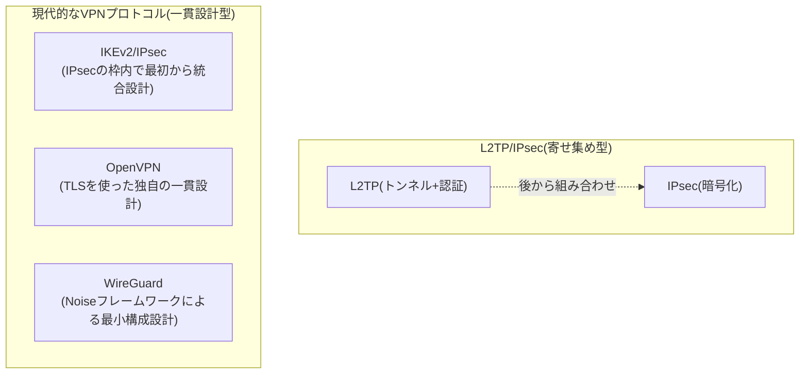

## はじめに

- **この記事で得られること**: 「L2TP/IPsecはレガシーだ」という評価の中身——具体的にどの部分が古い設計とされているのか、そして現在リモートアクセスVPNで広く使われているIKEv2/IPsec・OpenVPN・WireGuardがそれぞれどのような設計思想を持ち、どのような基準で選定すべきかを、体系的に理解できます。
- **対象読者**: リモートアクセスVPNの構築・選定に関わるインフラエンジニアで、「L2TP/IPsecは古い」と聞いたことはあるものの、具体的に何が違うのか、なぜ新しいプロトコルの方が優れているとされるのかを説明できない方を想定しています。
- **読むのにかかる想定時間**: 約20分

この記事は[『上位1%』シリーズ 全記事ガイド](/sitemap)の一部です。

## 前提知識

- **VPN(Virtual Private Network)** : インターネットのような公衆網の上に、あたかも専用線のような論理的な通信路を作る技術の総称です。
- **共通鍵暗号/公開鍵暗号**: 共通鍵暗号は同じ鍵で暗号化・復号を行う方式、公開鍵暗号は暗号化用と復号用に異なる鍵ペアを使う方式です。VPNでは、鍵交換や認証に公開鍵暗号を、実データの暗号化には高速な共通鍵暗号を使うのが一般的です。
- **UDP/TCP**: UDPはコネクションレスで再送制御を行わない軽量なプロトコル、TCPはコネクション型で到達確認・再送制御を行うプロトコルです。

## 全体像をつかむ

### 一言で言うと

**L2TP/IPsecが「レガシー」と評される最大の理由は、暗号化を持たないトンネリング技術(L2TP)とユーザー認証機能を持たなかった暗号化技術(IKEv1ベースのIPsec)という、本来別々の目的で設計された2つの規格を後から組み合わせた「寄せ集め」であるのに対し、現在主流のプロトコルは最初から1つの目的(安全なリモートアクセスVPN)のために一貫した設計で作られている**、という設計思想そのものの違いにあります。

4つのプロトコルの主な違いを一覧にすると、次のようになります。

| プロトコル | 標準化・登場時期 | 動作するトランスポート | 実装コード規模の目安 | モバイル環境での耐性 |
|---|---|---|---|---|
| L2TP/IPsec | L2TP: 1999年(RFC 2661)、IPsec: 1995年〜(複数のRFC) | UDP(500/1701/4500) | 大規模(IKEデーモン+L2TPデーモン+PPPデーモンが別々に必要) | 弱い(IPアドレス変化でIKE SAの再確立が必要になりやすい) |
| IKEv2/IPsec | 2005年〜(RFC 7296、L2TPを介さない構成) | UDP(500/4500) | 大規模(IKEデーモンのみで完結するが、実装自体はIKEv1時代からの複雑さを引き継ぐ) | 強い(MOBIKE拡張によりIPアドレス変化に対応) |
| OpenVPN | 2001年〜 | UDPまたはTCP(ポート番号は任意設定可能) | 中〜大規模(OpenSSLに依存するユーザー空間実装) | 実装依存(標準ではセッション再確立が必要になりやすい) |
| WireGuard | 2020年にLinuxカーネルへマージ | UDP | 小規模(コアはおよそ4,000行程度) | 強い(接続の識別に公開鍵を使い、IPアドレスの変化に依存しない) |

## 基礎から徹底解説

### なぜL2TP/IPsecは「レガシー」と評されるのか

L2TP/IPsecが古い設計とされる根拠は、主に次の3点に整理できます。

1. **複数の独立した規格の組み合わせによる実装・運用の複雑さ**: L2TP/IPsecを成立させるには、IKE/ESPを処理するIPsecデーモン(例: strongSwan)、L2TPのトンネル・セッションを処理するL2TPデーモン(例: xl2tpd)、PPPのネゴシエーションを処理するPPPデーモン(例: pppd)という、本来別々に開発された3つのソフトウェアコンポーネントが連携して動作する必要があります。1つの接続シーケンスが複数のプロセス・プロトコルスタックをまたぐため、障害時の切り分けが難しく、実装間の相互運用性の不具合も歴史的に多く報告されてきました。
2. **モバイル環境でのネットワーク切り替えへの弱さ**: L2TP/IPsecが前提とするIKEv1ベースのIPsecでは、SA(Security Association)がクライアントのIPアドレスに強く結びついています。Wi-Fiからモバイル回線に切り替わるなど、クライアント側のIPアドレスが変化すると、既存のIKE SA・ESP SAはそのままでは使えなくなり、多くの実装ではフェーズ1からの再ネゴシエーションが必要になります。これは、モバイル端末を多用する現在の利用形態とは相性がよくありません。
3. **鍵交換・認証まわりの既知の弱点**: IKEv1のAggressive Modeにおける事前共有鍵(PSK)のオフライン総当たり攻撃リスクや、PPP認証で使われるMS-CHAPv2の暗号強度の弱点など、個別に見れば緩和策(Main Modeの使用、証明書ベース認証への移行など)は存在するものの、そもそも設計上「弱い構成を選べてしまう」余地が大きいことが、セキュリティ監査で繰り返し指摘される要因になっています。

これらはいずれも「L2TP/IPsecでは絶対に安全な通信ができない」という意味ではなく、**適切な設定(証明書認証・Main Mode・MOBIKE非依存の運用など)を行えば実務上は十分な安全性を確保できます**。しかし、そのために管理者側の細心の注意が必要な構成が多いという点が、最初から安全側に倒した設計を持つ後続のプロトコルと比較したときの相対的な弱みになっています。

### IKEv2/IPsec:L2TPを介さない「進化系」

**IKEv2(RFC 7296)** は、IKEv1の後継として標準化された鍵交換プロトコルです。L2TP/IPsecとの決定的な違いは、**L2TPを介さずIKEv2単体でリモートアクセスVPNに必要な機能を完結できる**ことです。

- **EAP認証の標準サポート**: IKEv1時代にはベンダー独自拡張(XAuthなど)に頼っていたユーザー単位の認証を、IKEv2はEAP(Extensible Authentication Protocol)として標準仕様に組み込みました。これにより、L2TPが担っていたPPP認証の役割を、L2TPを挟まずにIKEv2自身が担えます。
- **Configuration Payload**: L2TPのIPCPが担っていた「仮想IPアドレス・DNSサーバーの払い出し」も、IKEv2はConfiguration Payloadという仕組みで標準的にサポートしています。
- **MOBIKE(RFC 4555)** : IKEv2の拡張機能で、クライアントのIPアドレスが変化しても、既存のIKE SA・IPsec SAを保持したまま新しいIPアドレスに付け替えることができます。これが、前述の「モバイル環境への弱さ」を直接解消する仕組みです。

つまりIKEv2/IPsecは、 **「IPsec単体にはユーザー認証・仮想IP払い出しの仕組みがなかった」というL2TP/IPsecが生まれた根本原因そのものを、IPsecの標準仕様側を拡張することで解消した** 構成だと理解できます。WindowsやiOS、macOS、Androidの標準VPNクライアントの多くが、L2TP/IPsecと並んでIKEv2/IPsecをネイティブサポートしているのは、この設計上の優位性が理由です。

### OpenVPN:TLSを流用した汎用VPN

**OpenVPN** は、Webのhttps通信で広く使われるTLS(SSL)のライブラリ(OpenSSL)をそのまま流用し、鍵交換・認証・暗号化を一貫した1つのプロトコルスタックとして実装したVPNソフトウェアです。IPsecのような「複数の別規格の組み合わせ」ではなく、TLSハンドシェイクをベースにした単一の設計で、証明書認証・PSK認証のどちらにも対応します。

OpenVPNの実務上の大きな特徴は、**UDPだけでなくTCPの上でも動作でき、使用するポート番号も自由に設定できる**ことです。TCPの443番ポート(通常のHTTPS通信用)を使うように設定すれば、経路上のファイアウォールやプロキシからは一見「ただのHTTPS通信」に見えるため、UDPやIPsec関連のプロトコルが遮断されがちな制限の厳しいネットワーク環境でも接続を確立しやすいという利点があります。ただし、実装がユーザー空間で動作する(仮想ネットワークインターフェースであるTUN/TAPデバイスを介してカーネルとやり取りする)ため、パケットごとにユーザー空間とカーネル空間を行き来するコンテキストスイッチのオーバーヘッドが発生し、後述のWireGuardと比べるとスループット面では不利になりやすい特性があります。

### WireGuard:最小構成を追求した現代的設計

**WireGuard** は、2020年にLinuxカーネル本体(5.6)にマージされた、比較的新しいVPNプロトコル・実装です。設計思想はIPsecやOpenVPNとは対照的で、 **「選べる暗号アルゴリズムの種類を極力減らし、モダンで実績のある暗号方式に固定することで、設定ミスやダウングレード攻撃の余地そのものをなくす」** という考え方に立っています。

- **暗号スイートの固定**: 鍵交換にCurve25519(楕円曲線Diffie-Hellman)、暗号化にChaCha20、完全性検証にPoly1305、ハッシュ関数にBLAKE2sを使うと、あらかじめ1種類に固定されています。IPsecのように「IKEのネゴシエーションでどのアルゴリズムを使うか合意する」という手順自体が存在しないため、弱いアルゴリズムを選んでしまうリスクや、ネゴシエーション処理自体に潜むバグの余地が構造的に排除されています。
- **極めて小さい実装規模**: WireGuardのカーネル実装のコアはおよそ4,000行程度とされ、10万行を超えるとされるOpenVPNや、同じく大規模なstrongSwanなどのIPsec実装と比べて、コードレビュー・セキュリティ監査がしやすいという実務上の利点があります。
- **公開鍵による接続識別**: WireGuardは、通信相手を「IPアドレス」ではなく「事前に交換した公開鍵」で識別します。クライアントのIPアドレスが変化しても、正しい公開鍵ペアによる認証さえ成立すれば通信を継続でき、IKEv2のMOBIKEのような専用の拡張機能を別途持たなくても、設計そのものがモバイル環境の変化に強い構造になっています。

## プロが見ている視点(上位1%の理解)

### 「複雑さ」がなぜそのままセキュリティ上のリスクになるのか

VPNプロトコルの世界では、 **「実装・仕様が複雑であること自体が攻撃対象領域(アタックサーフェス)を広げる」** という考え方が重視されます。IKEのネゴシエーションで対応しなければならないメッセージの種類・拡張仕様の数が多いほど、実装のどこかにバグが潜むリスクは高まり、実際にstrongSwanやOpenVPNの実装では、過去に複数の重大な脆弱性(リモートコード実行やDoSにつながるものを含む)が報告されてきました。WireGuardが暗号アルゴリズムの選択肢をあえて排除し、コードベースを最小限に絞り込んでいるのは、この「複雑さ=攻撃対象領域」という教訓を明確に踏まえた設計判断です。Linuxカーネル本体にマージされる際、著名な暗号学者・セキュリティ研究者による査読を経ていることも、この設計思想の実効性を裏付けています。

### パフォーマンス特性の違い:ユーザー空間実装とカーネル空間実装

VPNの実装は大きく、OSカーネルの外側(ユーザー空間)で動くものと、カーネル内部(カーネル空間)で動くものに分かれます。OpenVPNはユーザー空間実装であり、パケットを処理するたびにカーネルとユーザー空間の間でコンテキストスイッチとメモリコピーが発生します。一方WireGuardはLinuxカーネルに直接組み込まれたカーネル空間実装であり、この行き来のオーバーヘッドが小さく済むため、同条件であればスループット・レイテンシの両面で有利になりやすいとされています。IPsec(L2TP/IPsec、IKEv2/IPsecいずれも)も多くのOSでカーネル空間の暗号処理(XFRMフレームワークなど)を活用できるため、パフォーマンス面ではOpenVPNよりIPsec系・WireGuardの方に分があるのが一般的な傾向です。

### 企業導入における選定基準

どのプロトコルが「絶対的に優れている」ということはなく、要件によって最適解は変わります。

| 選定基準 | 適したプロトコル | 理由 |
|---|---|---|
| Windows/iOS/macOS/Androidの標準クライアントだけで運用したい | IKEv2/IPsec | 追加のクライアントアプリ導入が不要で、OS標準機能として長期サポートされやすい |
| 制限の厳しいネットワーク(ホテル・公共Wi-Fiなど)からの接続性を重視したい | OpenVPN(TCP443設定) | 一般的なHTTPS通信に偽装でき、UDP/ESPが遮断される環境でも接続しやすい |
| 自己ホスト環境で最高のパフォーマンスとシンプルな構成を重視したい | WireGuard | 実装がシンプルで高速、設定項目も少なく運用負荷が低い |
| 既存の商用VPNアプライアンスがL2TP/IPsecにしか対応していない | L2TP/IPsec(証明書認証+Main Mode必須) | 既存資産をそのまま活かしつつ、既知の弱点を回避する構成で運用する |

**既存のL2TP/IPsec環境をすぐに置き換えられない場合**でも、事前共有鍵の使い回しを避けて証明書ベースの認証に切り替える、IKEフェーズ1をMain Modeに固定する、といった対策で、既知の弱点の多くは実務上緩和できます。プロトコルの刷新そのものよりも、まずは現行構成の弱点を潰すことが優先度の高い対応になるケースも少なくありません。

## よくある誤解・つまずきポイント

- **誤解1: 「新しいプロトコルなら常に選ぶべきだ」**
  WireGuardが技術的に洗練されているからといって、標準ユーザー認証(ユーザー名・パスワードでのログイン管理)やエンタープライズ向けの集中管理機能を仕様として持たないため、そのままでは大規模な組織のアクセス管理要件を満たせないことがあります(WireGuardをベースにIdP連携やユーザー管理機能を追加した商用実装が別途存在するのはこのためです)。要件に対する適合性で選ぶべきであり、新しさだけを基準にすべきではありません。
- **誤解2: 「L2TP/IPsecはもう危険で使うべきではない」**
  極端な結論です。証明書ベースの認証・Main Modeの徹底など、適切な設定を行えば実務上十分な安全性を確保できます。「設計上、安全でない構成を選べてしまう余地が大きい」ことと「必ず安全でない」こととは別問題です。
- **誤解3: 「WireGuardにはユーザー認証の概念がまったくない」**
  WireGuard自体は公開鍵ペアによる端末認証の仕組みしか持たず、確かに「ユーザー名・パスワードでのログイン」という概念は仕様に含まれません。ただしこれは意図的な設計上の割り切りであり、必要であれば外部のID基盤(IdP)と連携するラッパー実装・商用サービスを組み合わせることで、ユーザー単位の認証・管理機能を追加できます。

## 障害・トラブルシューティングの視点

VPNプロトコルの移行やモバイル環境での接続トラブルは、 **「そのプロトコルがどのイベントに弱い設計になっているか」** を軸に切り分けるのが有効です。

1. **移行期にプロトコルが混在している環境での接続失敗**: 一部のクライアントは旧プロトコル(L2TP/IPsec)、一部は新プロトコル(IKEv2/IPsecなど)を使っている場合、VPNサーバー側で両方のプロトコルを同時に有効化しているか、それぞれに対応するファイアウォールルール(UDP 500/1701/4500、あるいはIKEv2固有の設定)が正しく分離されているかを確認します。
2. **モバイル回線とWi-Fiの切り替えで頻繁に切断される**: MOBIKE非対応のIKEv1ベースのIPsec(L2TP/IPsecを含む)では、IPアドレス変化のたびにフェーズ1からの再接続が発生し、体感的な切断として現れやすくなります。IKEv2(MOBIKE有効)やWireGuardへの切り替えで改善するかを切り分けの1つの基準にできます。
3. **特定のネットワーク環境(ホテル・カフェなど)からだけ接続できない**: UDPやESP(プロトコル番号50)が遮断されている可能性が高く、OpenVPNのTCP443設定のような「一般的なHTTPS通信に偽装できる」構成が使えるかどうかで、接続性の差が生まれます。

### 予防策・恒久対策

- 新規に構築するリモートアクセスVPNでは、要件(クライアントの種類、ネットワーク環境の制約、運用負荷)を整理した上でプロトコルを選定し、可能であればモバイル耐性のある構成(IKEv2+MOBIKE、WireGuard)を優先する。
- 既存のL2TP/IPsec環境をすぐに刷新できない場合は、証明書ベースの認証への切り替えとMain Modeの徹底を優先的に実施する。
- 複数プロトコルを並行運用する移行期間は、監視・ログ収集の対象をすべてのプロトコルに広げ、片方だけ障害を見落とすことがないようにする。

## まとめ

- L2TP/IPsecが「レガシー」と評される根拠は、複数の独立した規格を後から組み合わせた実装・運用の複雑さ、モバイル環境でのIPアドレス変化への弱さ、鍵交換・認証まわりの既知の弱点にあります。
- IKEv2/IPsecは、IPsecの標準仕様自体を拡張(EAP認証・Configuration Payload・MOBIKE)することで、L2TPを介さずにリモートアクセスVPNを完結させ、モバイル耐性も獲得しています。
- OpenVPNはTLSを流用した一貫設計で、TCP443での偽装接続などファイアウォール耐性に優れますが、ユーザー空間実装ゆえのオーバーヘッドがあります。
- WireGuardは暗号アルゴリズムを固定し実装規模を最小化することで攻撃対象領域を減らし、公開鍵ベースの接続識別によってモバイル耐性とパフォーマンスを両立しています。
- どのプロトコルが最適かは要件次第であり、新しさだけで選ぶべきではありません。既存のL2TP/IPsec環境も、適切な設定を行えば実務上十分な安全性を確保できます。

**今日から意識すべきこと**
1. VPNプロトコルを選定・見直す際は、クライアントの種類・ネットワーク環境の制約・モバイル利用の有無という3つの軸で要件を整理してから比較しましょう。
2. 既存のL2TP/IPsec環境が残っている場合は、刷新を待つ前に、証明書ベースの認証への切り替えとMain Modeの徹底という即効性のある対策から着手しましょう。

## 参考文献

- [Internet Key Exchange Protocol Version 2 (IKEv2) | RFC 7296](https://datatracker.ietf.org/doc/html/rfc7296)
- [IKEv2 Mobility and Multihoming Protocol (MOBIKE) | RFC 4555](https://datatracker.ietf.org/doc/html/rfc4555)
- [Extensible Authentication Protocol (EAP) | RFC 3748](https://datatracker.ietf.org/doc/html/rfc3748)
- [WireGuard: Next Generation Kernel Network Tunnel | WireGuard 公式論文](https://www.wireguard.com/papers/wireguard.pdf)
- [OpenVPN Community Resources](https://openvpn.net/community-resources/)
- [Security Architecture for the Internet Protocol | RFC 4301](https://datatracker.ietf.org/doc/html/rfc4301)
