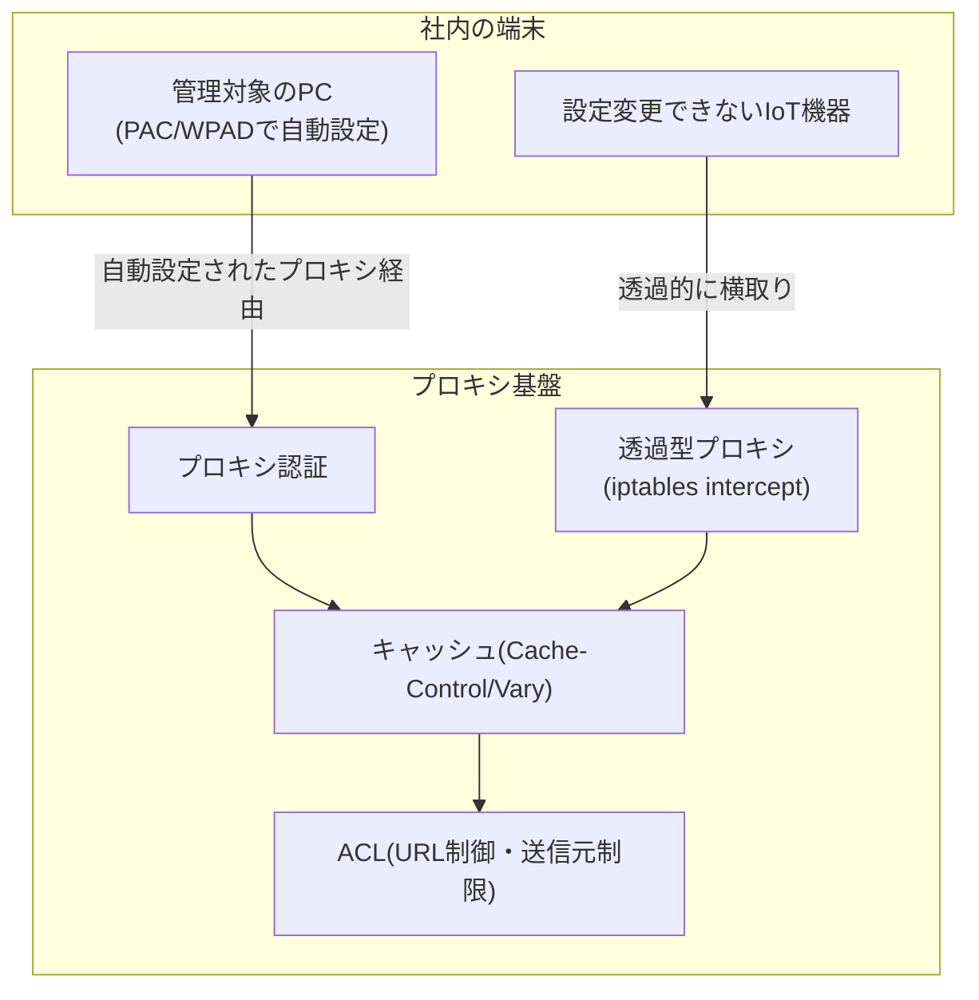

## はじめに

- **この記事で得られること**: ここまでのハンズオンで、1つずつ個別に習得してきた技術(Squidによる明示的プロキシ構築とURL単位のアクセス制御、Cache-Control/Varyによるキャッシュ制御、iptablesとSquidによる透過型プロキシ、オープンプロキシ化対策)と、座学で学んだ知識(PACファイル/WPADによる自動設定、Basic/NTLM/Kerberosによるプロキシ認証)を、**1つの架空の多拠点企業の社内インターネットアクセス基盤へ、自分の力で統合する**、Webプロキシ・キャッシュ学科の卒業制作です。これまでの記事が「手順をなぞって、1つの技術を確実に身につける」ことを目的としていたのに対し、この記事は**要件だけを提示し、どの技術を、どう組み合わせるかを、自分で設計する**という、実務そのものに近い形式を取ります。
- **対象読者**: Webプロキシ・キャッシュ学科の3年生・4年生・大学院の内容を一通り終え、個々のハンズオンは実施できるが、それらを組み合わせて1つのプロキシ基盤を設計した経験がない方を想定しています。
- **読むのにかかる想定時間**: 設計・構築・文書化を含めて、数日〜1週間程度を想定しています(1回のハンズオンとしては最も重量級です)。

この記事は[『上位1%』シリーズ 全記事ガイド](/sitemap)の一部です。[Webプロキシ・キャッシュ学科の全カリキュラム](/university#webプロキシキャッシュ学科)の、卒業制作にあたる位置づけです。

## 前提知識

このハンズオンは、新しい技術を教えるものではありません。**以下の、すでに実施済みの座学・ハンズオンで習得した技術を、組み合わせて使います。**

- [Squidで明示的プロキシを構築し、URL単位のアクセス制御を体験するハンズオン](/articles/squid-proxy-handson-guide)
- [PACファイルとWPADの仕組みを『上位1%』の視点で理解する](/articles/pac-wpad-guide)
- [プロキシ認証(Basic/NTLM/Kerberos)の違いを『上位1%』の視点で理解する](/articles/proxy-auth-guide)
- [Cache-ControlとVaryヘッダーの仕組みを『上位1%』の視点で理解する](/articles/cache-control-vary-guide)
- [Squidをキャッシュプロキシとして構築し、X-CacheヘッダーでHIT/MISSを確認するハンズオン](/articles/squid-caching-handson-guide)
- [iptablesとSquidで透過型プロキシを構築し、クライアント設定なしでプロキシを強制する仕組みを体験するハンズオン](/articles/transparent-proxy-handson-guide)
- [Squidのオープンプロキシ化の危険性を自分の手で再現し、ACLによるアクセス制限で防御するハンズオン](/articles/squid-open-proxy-hardening-handson-guide)

## 課題設定:架空の多拠点企業の社内インターネットアクセス基盤

**あなたは、架空の多拠点企業「KoiKoi Retail」のインフラエンジニアです。この会社は、複数の店舗とオフィスを展開していますが、各端末が直接インターネットへ接続しており、通信量の増大やアクセス状況の把握ができないという課題を抱えていました。あなたに与えられた課題は、次の要件をすべて満たす、社内インターネットアクセス基盤を、自分の手で構築することです。**

### 要件1: 社員のPCに、手動設定を一切要求せずに、プロキシ設定を行き渡らせる

**数百台規模の社内PCに対して、個別にプロキシのアドレスを設定する作業を発生させずに、全社で同じプロキシ設定が使われるようにしてください。**

### 要件2: 誰が、どのサイトへアクセスしたかを、記録できるようにする

**プロキシを経由する通信に対して、アクセスした社員を特定できる仕組みを導入してください。** パスワードをネットワーク上に生のまま流さない方式を選んでください。

### 要件3: よく使われるコンテンツをキャッシュしつつ、社員ごとに異なる内容を、誤って混在させない

**通信量を削減するため、プロキシにキャッシュ機能を持たせてください。** ただし、言語設定など、リクエストヘッダーの違いによって本来は異なる内容が返されるべきコンテンツが、誤って同一のキャッシュとして配信されないようにしてください。

### 要件4: プロキシの設定ができない、あるいはしたくない機器にも、通信を経由させる

**店舗に設置された、設定変更ができないIoT機器についても、そのネットワーク経由の通信を、プロキシを経由させてください。** この機器に対しては、個別の設定作業を一切要求しないでください。

### 要件5: このプロキシ基盤が、意図せず第三者に開放されてしまわないようにする

**社外の第三者が、このプロキシを経由して、別のサーバーへ不正アクセスするための踏み台として悪用できないようにしてください。** どの範囲からのアクセスを許可し、それ以外をどう扱うかを、明確に設計してください。

### 要件6: 特定のカテゴリのサイトへのアクセスを、URL単位で制限する

**業務に関係のない特定のサイトへのアクセスを、URL単位で制限する仕組みを組み込んでください。**

## 成果物の要件:ポートフォリオとしてまとめる

**このハンズオンの最終的な成果物は、実際に動いた構成の確認結果だけではありません。** GitHubなどのリポジトリに、次の内容を含む形でまとめてください。

- **README.md**: このシナリオの概要、あなたが採用した社内インターネットアクセス基盤の全体像(mermaidなどの図を含む)
- **設計判断の記録**: 「なぜその技術・構成を選んだのか」という、判断の理由。特に、自動設定の方式と、キャッシュの正確性のトレードオフが発生した箇所について
- **実施手順**: 実際に実行した設定や、検証コマンドの記録
- **アクセス制御方針書**: どの送信元・どのURLを許可し、それ以外をどう扱うかの明確な方針
- **振り返り**: 実施してみて分かった課題、実際の実務であれば追加で検討すべき点(証明書配布を伴うTLS復号、監視ツールとの連携など)

**この成果物こそが、転職活動やポートフォリオとして提示できる、具体的な実績になります。** 単に「Squidでプロキシを構築しました」と説明するよりも、「数百台規模の端末が利用する実運用環境という現実的な制約の中で、複数の技術を組み合わせて設計し、自動設定とキャッシュ正確性のトレードオフを言語化できる」ことを示せる方が、はるかに説得力があります。

## プロが見ている視点(上位1%の理解)

### 「手順をなぞる力」と「要件から設計する力」は、まったく別のスキルである

これまでのハンズオンは、いずれも「Step 1、Step 2……」という、決められた手順をなぞる形式でした。**しかし、実際の実務で評価されるのは、手順書通りに作業を実行する力ではなく、与えられた要件(この記事でいう「要件1〜6」)から、どの技術を、どう組み合わせるべきかを、自分で設計する力です。** この2つは、似ているようでまったく別のスキルです。個々のハンズオンをすべて完了していても、それらを組み合わせて1つの一貫したプロキシ基盤を設計した経験がなければ、実務での即戦力にはなりません。この卒業制作は、その橋渡しを行うための、意図的な設計になっています。

### なぜ「多拠点+多様な端末」という設定なのか

このハンズオンが、単発の技術デモではなく、あえて「複数の拠点、複数の種類の端末が混在する」という、現実的なプロジェクトを模した設定にしているのには理由があります。**実務のプロキシ基盤構築の多くは、単一の目的だけで完結せず、設定配布の省力化・利用者の特定・キャッシュの正確性・設定不可能な端末への対応・不正利用への防御という、複数の軸を同時に満たす必要があります。** Squidの基本的な設定だけを知っていても、その先にあるPAC/WPADによる自動設定・透過型プロキシ・オープンプロキシ対策までを見通せなければ、実際のプロジェクトでは通用しません。この卒業制作を通じて、個々の技術の知識を、**プロキシ基盤全体の設計を見通す力**へと昇華させることが、最終的な狙いです。

## よくある誤解・つまずきポイント

- **誤解1: 「このハンズオンは、決められた1つの正解の構成が存在する」**
  このハンズオンには、唯一の正解はありません。要件を満たす設計であれば、複数の妥当なアプローチが存在します。README.mdに、あなたが選んだ設計とその理由を記録することが重要です。
- **誤解2: 「成果物は、動作した証拠の確認結果だけで十分である」**
  動作確認は重要ですが、それだけでは不十分です。設計判断の理由を言語化できることが、このハンズオンの本当の価値です。
- **誤解3: 「個々のハンズオンをすべて完了していれば、このハンズオンも簡単に終わる」**
  個々の技術を知っていることと、それらを1つの一貫した設計へ統合することの間には、大きな距離があります。多くの時間を要することを想定しておいてください。

## 障害・トラブルシューティングの視点

このハンズオンは、個々の技術的なトラブルシューティングよりも、**設計上の手戻り**が主な課題になります。

1. **要件を満たしているつもりが、後から矛盾に気づく**: 実装を始める前に、README.mdの設計部分だけを先に書き上げ、要件1〜6のすべてを満たせているかを、文章の段階で確認してください。
2. **個々のハンズオンの手順を忘れてしまっている**: 各要件に対応する前提記事のリンクを、遠慮なく読み返してください。この卒業制作は、暗記力ではなく設計力を試すものです。
3. **どこまで作り込めばよいか分からない**: 「転職活動で、初対面の面接官にこのREADME.mdを見せて、設計判断を説明できるか」を、完成度の目安にしてください。

## まとめ

- この卒業制作は、Webプロキシ・キャッシュ学科でこれまで個別に習得した技術を、1つの架空の多拠点企業の社内インターネットアクセス基盤へ統合する、総合演習です。
- 求められているのは、手順をなぞる力ではなく、要件から自分で設計する力です。
- 成果物は、動作確認の結果だけでなく、設計判断の理由を言語化した文書として、ポートフォリオにまとめてください。

**今日から意識すべきこと**
1. 個々のハンズオンを学ぶときも、「これは、将来どんな要件の中で使うことになるか」を意識する習慣をつけましょう。
2. 技術的な成果物だけでなく、自動設定とキャッシュ正確性のトレードオフを言語化する習慣を、日々の業務でも意識しましょう。

## 参考文献

- [Webプロキシ・キャッシュ学科の全カリキュラム](/university#webプロキシキャッシュ学科)
