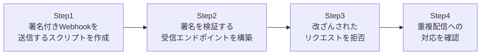

## はじめに

- **この記事で得られること**: [決済APIの裏側の仕組み](/articles/payment-api-guide)で扱ったWebhookという概念を、**実際に自分でWebhookの受信エンドポイントを構築し、HMAC署名の検証と、イベントの重複配信への対応**を実装することで検証します。
- **対象読者**: Webhookが「サーバーからサーバーへ、イベントの通知が送られてくる仕組み」であることは理解しているものの、その通知が本当に正規の送信元から来たものかをどう確認するのか、そして同じ通知が2回届いたらどうなるのかを、具体的に実装した経験がない方を想定しています。
- **読むのにかかる想定時間**: 約25分(ハンズオン実施込み)

この記事は[『上位1%』シリーズ 全記事ガイド](/sitemap)の一部、[Web/APIシリーズ](/sitemap#シリーズ一覧)の6本目です。[ハンズオン準備マニュアル](/articles/handson-prep-guide)で作成したUbuntu Server環境が1台あれば実施できます。

## 前提知識

- **Webhookの基本的な役割**: [決済APIの裏側の仕組み](/articles/payment-api-guide)で扱った、サーバー側のイベント(決済の完了など)を、別のサーバーへ能動的に通知する仕組みです。
- **冪等性の基礎**: [RESTful APIとは何か](/articles/restful-api-guide)で扱った冪等性の考え方です。本記事では、Webhookの再送という文脈で、この考え方を応用します。

## 全体像をつかむ

このハンズオンで行うことは、次の4ステップです。



## ハンズオン手順

### Step 1: 署名付きWebhookを送信するスクリプトを作成する

送信側と受信側が、事前に共有している秘密の文字列(**共有シークレット**)を使い、ペイロードのHMAC-SHA256署名を計算して送信するスクリプトを作成します。`sender.py`として保存します。

```python
import hmac
import hashlib
import json
import urllib.request

SHARED_SECRET = b"my-shared-secret"

def send_webhook(event_id, payload_dict):
    payload = json.dumps(payload_dict).encode()
    signature = hmac.new(SHARED_SECRET, payload, hashlib.sha256).hexdigest()
    req = urllib.request.Request(
        "http://localhost:8000/webhook",
        data=payload,
        headers={
            "Content-Type": "application/json",
            "X-Event-Id": event_id,
            "X-Signature": signature,
        },
    )
    with urllib.request.urlopen(req) as resp:
        print(resp.status, resp.read())

send_webhook("evt_001", {"type": "payment.succeeded", "amount": 1000})
```

### Step 2: 署名を検証する受信エンドポイントを構築する

受信側は、**受け取ったペイロードから、自分でも同じ共有シークレットを使って署名を計算し、送られてきた署名と一致するかを確認します。** `receiver.py`として保存します。

```python
import hmac
import hashlib
from http.server import BaseHTTPRequestHandler, HTTPServer

SHARED_SECRET = b"my-shared-secret"
processed_event_ids = set()

class Handler(BaseHTTPRequestHandler):
    def do_POST(self):
        length = int(self.headers.get('Content-Length', 0))
        payload = self.rfile.read(length)
        received_signature = self.headers.get('X-Signature', '')
        event_id = self.headers.get('X-Event-Id', '')

        expected_signature = hmac.new(SHARED_SECRET, payload, hashlib.sha256).hexdigest()

        if not hmac.compare_digest(expected_signature, received_signature):
            self.send_response(401)
            self.end_headers()
            self.wfile.write(b'{"error": "invalid signature"}')
            return

        if event_id in processed_event_ids:
            print(f"Event {event_id} already processed, skipping")
            self.send_response(200)
            self.end_headers()
            self.wfile.write(b'{"status": "already processed"}')
            return

        processed_event_ids.add(event_id)
        print(f"Processing event {event_id}: {payload}")
        self.send_response(200)
        self.end_headers()
        self.wfile.write(b'{"status": "processed"}')

HTTPServer(('0.0.0.0', 8000), Handler).serve_forever()
```

```bash
python3 receiver.py &
python3 sender.py
```

**実行結果:**

```
Processing event evt_001: b'{"type": "payment.succeeded", "amount": 1000}'
200 b'{"status": "processed"}'
```

正しい署名を持つWebhookが、正常に処理されたことが確認できました。

<details>
<summary>なぜ`hmac.compare_digest`という、専用の比較関数を使っているのか</summary>

署名の一致を確認する際、**単純な文字列比較(`==`)を使うことは避けるべきです。** 通常の文字列比較は、文字が一致しなくなった時点で即座に処理を終えるため、**不一致が見つかるまでにかかった時間の差(タイミング)から、どこまで署名が一致していたかを、少しずつ推測されてしまうリスク**があります。これは**タイミング攻撃**と呼ばれる攻撃手法です。`hmac.compare_digest`は、文字列の長さに関わらず、常に一定時間で比較を完了するように実装されており、このタイミング攻撃を防いでいます。見た目は`==`と同じ「比較」のように見えて、内部の実装がまったく異なる、という点が重要です。

</details>

### Step 3: 改ざんされたリクエストが拒否されることを確認する

`sender.py`を少し改造し、署名を計算した後に、ペイロードの内容だけを改ざんして送信してみます。

```python
import hmac
import hashlib
import json
import urllib.request

SHARED_SECRET = b"my-shared-secret"
payload_dict = {"type": "payment.succeeded", "amount": 1000}
payload = json.dumps(payload_dict).encode()
signature = hmac.new(SHARED_SECRET, payload, hashlib.sha256).hexdigest()

# 署名計算後に、ペイロードの金額だけを改ざん
tampered_payload = json.dumps({"type": "payment.succeeded", "amount": 999999}).encode()

req = urllib.request.Request(
    "http://localhost:8000/webhook",
    data=tampered_payload,
    headers={"X-Event-Id": "evt_002", "X-Signature": signature},
)
try:
    urllib.request.urlopen(req)
except urllib.error.HTTPError as e:
    print(e.code, e.read())
```

**実行結果:**

```
401 b'{"error": "invalid signature"}'
```

**ペイロードの内容(金額)を書き換えたことで、受信側が自分で計算した署名と、送られてきた署名が一致しなくなり、401エラーとして正しく拒否されました。** 共有シークレットを知らない第三者は、改ざんしたペイロードに対応する正しい署名を計算できないため、このチェックをすり抜けることができません。

### Step 4: 重複配信(再送)への対応を確認する

実際のWebhookの送信元(Stripeなど)は、受信側からの応答が届かなかった場合、**同じイベントを再送してくることがあります。** この挙動を、同じ`event_id`で、Step 1のリクエストを再度送信することで再現します。

```bash
python3 sender.py
python3 sender.py
```

**2回目の実行結果:**

```
200 b'{"status": "already processed"}'
```

**受信側のログを確認すると、1回目は`Processing event evt_001`と表示されますが、2回目は`Event evt_001 already processed, skipping`と表示され、実際の処理(ここでは単なる`print`ですが、実務ではデータベースへの金額加算などの重要な処理)が、2回実行されていないことが確認できます。**

## プロが見ている視点(上位1%の理解)

### Webhookの受信処理は、「信頼できない入力」として扱うのが大前提である

Webhookの受信エンドポイントは、見た目は社内のAPIのように見えても、**実際にはインターネットに公開された、誰からでもリクエストを送れるエンドポイントです。** 署名検証という手順を省略してしまうと、**共有シークレットを知らない第三者が、偽の決済完了通知を送りつけ、実際には支払いが行われていないにもかかわらず、商品が発送されてしまう**といった、具体的な実害につながります。[HTTPリクエストスマグリング](/articles/load-balancing-request-smuggling-handson-guide)の防御が「矛盾した入力を拒否する」という発想だったのと同じように、Webhookの受信処理も、「送信元を名乗っているだけの入力を、無条件には信頼しない」という前提に立つことが、実務における定石です。

## よくある誤解・つまずきポイント

- **誤解1: 「Webhookの送信元が、HTTPS経由であれば、署名検証は不要である」**
  HTTPSは通信経路の暗号化であり、「本当にその送信元から送られてきたか」を証明するものではありません。署名検証は、暗号化とは別の目的を持つ、独立した対策です。
- **誤解2: 「署名が一致すれば、重複配信の心配はない」**
  署名検証は「改ざんされていないこと」を確認するものであり、「同じイベントが複数回送られてくること」への対策にはなりません。これは別々の問題であり、別々の対策(イベントIDによる重複排除)が必要です。
- **誤解3: 「署名の比較には、通常の文字列比較(==)を使えば十分である」**
  通常の文字列比較は、タイミング攻撃のリスクがあります。`hmac.compare_digest`のような、専用の比較関数を使う必要があります。

## 障害・トラブルシューティングの視点

1. **正しいはずのWebhookが、401エラーで拒否されてしまう**: 送信側と受信側で、共有シークレットの値が完全に一致しているかを確認します。また、署名計算の対象となるペイロードの文字列表現(改行やスペースの有無など)が、送信側と受信側で一致しているかも確認します。
2. **同じイベントが、複数回処理されてしまう**: イベントIDによる重複排除の仕組みが、正しく実装されているかを確認します。実務では、このイベントIDの記録を、インメモリの集合ではなく、永続化されたデータベースで管理する必要があります。
3. **再送されたはずのイベントが、まったく届かない**: 送信元側の再送ポリシー(何回まで、どういう間隔で再送するか)を確認します。

## まとめ

- Webhookの受信エンドポイントは、HMAC署名を使って、本当に正規の送信元から送られてきたリクエストであることを検証する必要があります。
- 署名の比較には、タイミング攻撃を防ぐため、`hmac.compare_digest`のような専用の比較関数を使う必要があります。
- 署名検証(改ざんされていないことの確認)と、重複排除(同じイベントが2回処理されないことの保証)は、別々の目的を持つ、別々の対策です。
- Webhookの受信エンドポイントは、インターネットに公開された、信頼できない入力を受け取る窓口として扱う必要があります。

**今日から意識すべきこと**
1. Webhookを受信する機能を実装する際は、署名検証と重複排除を、それぞれ別の対策として、両方とも実装する習慣をつけましょう。
2. 「HTTPSを使っているから安全」という思い込みに注意し、暗号化と、送信元の正当性の検証は、別の問題であることを意識しましょう。

## 参考文献

- [RFC 2104 - HMAC: Keyed-Hashing for Message Authentication](https://datatracker.ietf.org/doc/html/rfc2104)
- [Stripe Webhooks: Verify the Signature](https://stripe.com/docs/webhooks/signatures)
