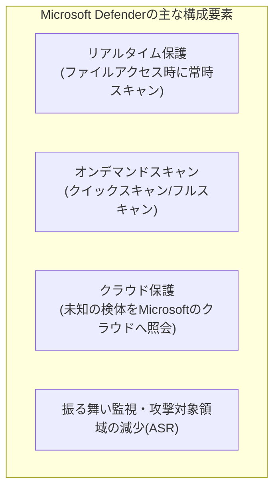
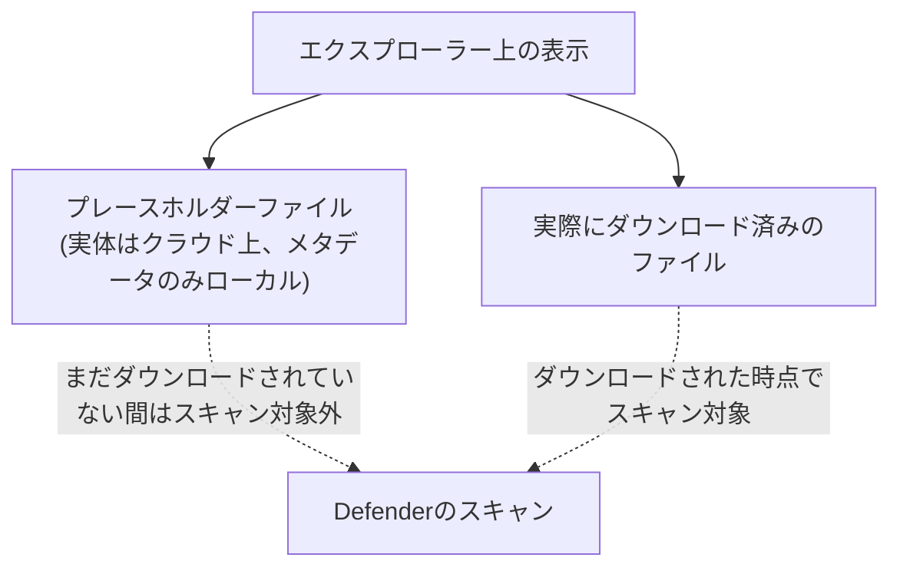

## はじめに

- **この記事で得られること**: Windowsに標準搭載されている**Microsoft Defender**が、どのような仕組みでマルウェアを検知しているのかを理解した上で、「標準搭載されているのに、なぜApexOneなど別のセキュリティソフトを併用する組織があるのか」「クイックスキャンとフルスキャンは何が違うのか」「本番環境接続前に求められるフルスキャン合格は、具体的に何を保証しているのか」「BoxDriveやGoogleDriveがエクスプローラーに統合されている場合、クラウド上のファイルもスキャン対象になるのか」という、実務でよく出会う疑問に答えます。
- **対象読者**: PCのセキュリティ運用に携わっているものの、Defenderの内部動作やスキャン方式の違いを具体的に説明できない方を想定しています。
- **読むのにかかる想定時間**: 約17分

この記事は[『上位1%』シリーズ 全記事ガイド](/sitemap)の一部、Windowsクライアント運用をテーマにした新シリーズの1本目です。

## 前提知識

- **シグネチャベース検知**: 既知のマルウェアの特徴的なパターン(シグネチャ)をデータベースとして持ち、ファイルと照合して検知する、最も基本的なマルウェア検知方式です。
- **ヒューリスティック検知・振る舞い検知**: 既知のシグネチャに一致しなくても、「不審な挙動をするプログラムかどうか」をルールやパターンから推測して検知する方式です。未知の(既存のシグネチャデータベースにまだ登録されていない)脅威にもある程度対応できます。

## 全体像をつかむ

### Microsoft Defenderの全体構成

Microsoft Defenderは、単一の仕組みではなく、**複数の防御層が組み合わさった仕組み**です。

**この記事のテーマであるクイックスキャン・フルスキャンは、あくまで「オンデマンドスキャン」という1つの構成要素に過ぎず、日常的な保護の主力はリアルタイム保護である**、という位置づけを理解しておくと、以降の説明が整理しやすくなります。

## 基礎から徹底解説

### リアルタイム保護とオンデマンドスキャンの違い

**リアルタイム保護**は、ファイルが作成・変更・実行されるたびに、そのファイルへのアクセスをフックして即座にスキャンする仕組みです。常時稼働しており、Defenderの防御の中核を担っています。

**オンデマンドスキャン**(クイックスキャン・フルスキャン)は、これとは別に、<strong>「今まさにディスク上に存在しているファイルすべて、あるいは一部を、まとめて検査する」</strong>という、任意のタイミングで実行する検査です。日常的な脅威の大半はリアルタイム保護によって既に防がれているという前提の上で、<strong>オンデマンドスキャンは「見落としがないかを確認する、補完的な検査」</strong>という位置づけになります。

### クイックスキャンとフルスキャンの違い

| | クイックスキャン | フルスキャン |
|---|---|---|
| スキャン対象 | マルウェアが潜みやすい既知の場所(レジストリの自動実行キー、実行中プロセスのメモリ、主要なシステムフォルダなど)に絞った限定的な範囲 | 接続されているすべてのドライブ上の、ほぼすべてのファイル(圧縮ファイルの内部を含む場合もある) |
| 所要時間 | 数分程度 | ディスク容量やファイル数に応じて、数十分〜数時間 |
| 主な用途 | 日常的な簡易確認、リアルタイム保護が有効な状態での定期チェック | 新規導入時・本番環境接続前・インシデント対応時など、徹底的な確認が必要な場面 |

**クイックスキャンが「既知の場所」に絞られている理由は、マルウェアの大半が、OS起動時に自動実行される設定(スタートアップ項目、レジストリの自動実行キーなど)や、現在動作中のプロセスのメモリ上に、何らかの形で痕跡を残すため**です。逆に言えば、**まだ一度も実行されておらず、自動実行の設定もされていない、単にディスク上に置かれているだけの休眠状態のファイル**は、クイックスキャンの対象範囲に含まれない可能性があります。フルスキャンは、こうした休眠状態のファイルまで含めて、接続されているストレージ全体を対象にすることで、この見落としを防ぎます。

### 本番環境接続前のフルスキャン合格は、何を保証しているのか

実務でよく指示される「本番環境へ接続する前に、フルスキャンを実施してクリアしていること」という要件について、**フルスキャン合格が実際に保証しているのは何か**を正確に理解しておくことが重要です。

**フルスキャン合格が保証しているのは、「そのスキャンを実施した時点で、Defenderが持つ検知能力(シグネチャデータベース、ヒューリスティック、クラウド照会)に基づいて判定した結果、既知の脅威パターンに一致するファイルが、スキャン対象範囲の中には見つからなかった」という事実だけ**です。これは重要な意味を持つ一方で、次のようなものを保証しているわけではありません。

- **ゼロデイ脅威(まだ世の中に知られておらず、シグネチャが存在しない未知の脅威)**: シグネチャベースの検知はもちろん、ヒューリスティック検知でも見逃される可能性があります。
- **検知回避技術を用いた高度なマルウェア**: スキャン自体を検知して活動を隠す、あるいは暗号化・難読化によって既知のパターンとの一致を回避する技術を持つものは、原理的に見逃されえます。
- **スキャン対象外の領域にあるファイル**: 後述するクラウドドライブのプレースホルダーファイルのように、そもそもスキャンの対象範囲に含まれていないデータについては、当然ながら検査自体が行われません。

**つまり、フルスキャン合格は「絶対に安全であることの証明」ではなく、「既知の脅威という、最も基本的でボリュームの大きいリスクを排除した、最低限のクリーンな状態を確認した」という、ベースラインの確保**と理解するのが正確です。本番環境接続前にこれを求める運用は、この最低限のベースラインすら満たしていない状態(たとえば、社外のネットワークで感染した既知のマルウェアを持ち込んでしまう)を防ぐための、コストの低い一次的なフィルターとして機能しています。

### なぜ標準搭載のDefenderがあるのに、別のセキュリティソフトを併用するのか

Defenderは、独立系のマルウェア対策評価機関のテストでも高い検知率を記録することが多く、**「無料だから性能が低い」という単純な図式は成り立ちません。** それでも組織がApexOneなど別の製品を併用・選定する理由には、主に次のようなものがあります。

- **EDR(Endpoint Detection and Response)・集中管理機能**: 単なるマルウェア検知にとどまらず、複数端末にまたがる脅威の可視化・調査・自動対応(隔離、ロールバックなど)を1つの管理コンソールで統合的に行いたい場合、専用製品の方が機能が充実していることがあります(Defenderにも同様の上位機能=Microsoft Defender for Endpointが存在しますが、別ライセンス・別製品という扱いです)。
- **組織のセキュリティポリシー・コンプライアンス要件**: 業界や取引先の要件で、特定のセキュリティ製品の導入や認証実績が明示的に求められる場合があります。
- **異なるOSを含む混在環境の統一管理**: Windows・Linux・macOSが混在する環境で、単一のベンダー・単一のコンソールで一元管理したいという運用上の要件です。

Defenderと他社製品を併用する際の実務上の注意点

複数のリアルタイム保護型セキュリティソフトを同時に「アクティブ」な状態で稼働させると、**同じファイルアクセスに対して複数のソフトが同時にスキャンを試みることによる競合やパフォーマンス低下**が起こりえます。このため、サードパーティ製品を導入する場合、Windows自体が自動的にDefenderを**パッシブモード**(リアルタイムスキャンは行わず、バックグラウンドでの補助的な検知や、他のAVが無効化された場合のフォールバックとしてのみ機能する状態)へ切り替える設計になっています。この挙動を理解せずに「Defenderも念のため有効化しておく」という運用をしてしまうと、意図せずリアルタイム保護が二重に稼働し、パフォーマンス問題の原因になることがあります。

### クラウドドライブ(BoxDrive/GoogleDrive)はスキャン対象になるのか

BoxDrive・Googleドライブ(デスクトップ版)といったクラウドストレージクライアントの多くは、**エクスプローラー上には表示されているものの、ファイルの実体はクラウド上にのみ存在し、ローカルディスクには「このファイルはクラウド上にある」ということを示す小さなメタデータ(プレースホルダー、スタブファイル)だけが置かれている**、という状態を実現しています(オンデマンドファイル、あるいはFiles On-Demandと呼ばれる仕組みです)。この仕組みにより、クラウド上に大量のファイルがあっても、ローカルディスクの容量を圧迫せずに済みます。

**Defenderのリアルタイム保護は、ローカルのファイルシステム上で実際に発生する読み書き(I/O)をフックして動作するため、まだダウンロードされていないプレースホルダー状態のファイルの中身までは、実際にそのファイルが開かれる(=ダウンロードされる)まで検査対象になりません。** これはフルスキャンについても同様で、**フルスキャンを実行しても、クラウド上にのみ存在しローカルへダウンロードされていないファイルの中身までは、通常スキャンされません。** 実際にダウンロード・展開されたファイルだけが、その時点でスキャン対象になります。

**この挙動は、クラウドオンデマンドファイルという仕組みの設計思想(ローカルストレージの節約)そのものとのトレードオフです。** クラウド上のファイルすべての中身をローカルで検査しようとすれば、結局すべてダウンロードする必要が生じ、オンデマンド方式の利点が失われてしまいます。企業でクラウドストレージを利用する場合、**エンドポイント側のDefenderだけに頼るのではなく、クラウドストレージサービス自体が提供するマルウェアスキャン機能(アップロード時のスキャンなど)もあわせて確認しておく**ことが、実務上重要な視点です。

## プロが見ている視点(上位1%の理解)

### クラウド保護(MAPS)とAttack Surface Reduction(ASR)

Defenderのクラウド保護は、**未知のファイルの特徴(ハッシュ値や一部の挙動情報)を、Microsoftのクラウドへリアルタイムに照会し、世界中の端末から集まる脅威インテリジェンスと突き合わせて判定する**仕組みです。ローカルのシグネチャデータベースの更新を待たずに、新しい脅威の情報が世界のどこかで確認された直後から、その情報をほぼリアルタイムに活用できるのが強みです。

また、**Attack Surface Reduction(ASR)ルール**は、マルウェアがよく悪用する特定の挙動パターン(たとえば、Office文書からの子プロセス起動や、スクリプトによる実行可能ファイルのダウンロードなど)自体を、企業のポリシーとしてあらかじめ禁止しておく機能です。<strong>検知ではなく「そもそも悪用されうる経路を塞ぐ」</strong>という、より予防的なアプローチであり、企業向けの管理機能(Microsoft Defender for Endpointなど)の中で設定されることが一般的です。

## よくある誤解・つまずきポイント

- **誤解1: 「Defenderは無料で標準搭載されているだけなので、検知性能は低い」**
  独立系の評価機関のテストでは、Defenderが高い検知率を記録することも多く、無料であることと検知性能の高低は直接結びつきません。
- **誤解2: 「フルスキャンに合格すれば、そのPCは100%安全であることが証明される」**
  フルスキャン合格は、既知の脅威パターンに一致するファイルが見つからなかったことのみを保証するものであり、ゼロデイ脅威や検知回避技術、スキャン対象外の領域までは保証していません。
- **誤解3: 「クラウドドライブと連携したフォルダーは、常にローカルにあるのと同じようにスキャンされる」**
  実体がクラウド上にのみ存在するプレースホルダー状態のファイルは、実際にダウンロードされるまでスキャンの対象になりません。

## 障害・トラブルシューティングの視点

Defenderに関連する実務上の疑問は、**「リアルタイム保護の話か、オンデマンドスキャンの話か、対象がローカルファイルかクラウド上のファイルか」を切り分ける**のが基本です。

1. **フルスキャンが異常に長時間かかる**: クラウドドライブのファイルを実際にすべてダウンロードしながらスキャンするような設定・状況になっていないか、あるいはスキャン除外設定(バックアップソフトのデータ領域など)が適切に行われているかを確認します。
2. **サードパーティ製セキュリティソフト導入後にPCの動作が重くなった**: Defenderが正しくパッシブモードへ切り替わっているかを確認します。両方がリアルタイム保護として同時に稼働してしまっている可能性があります。
3. **クラウドドライブ経由でマルウェアが侵入したのではないかという懸念がある**: エンドポイント側のスキャン結果だけでなく、クラウドストレージサービス自体のアップロード時スキャンログや、共有先での検知履歴もあわせて確認します。

### 予防策・恒久対策

- 本番環境接続前のフルスキャンは、あくまで既知の脅威に対する最低限のベースライン確認であることを踏まえ、他の予防策(パッチ適用、アクセス制御など)と組み合わせて運用する。
- サードパーティ製セキュリティソフトを導入する際は、Defenderのモード(アクティブ/パッシブ)が意図通りに切り替わっているかを確認する。
- クラウドストレージを業務で利用する場合、エンドポイント側の対策とクラウドサービス自体のセキュリティ機能の両方を、それぞれの守備範囲を理解した上で組み合わせる。

## まとめ

- Microsoft Defenderは、リアルタイム保護・オンデマンドスキャン・クラウド保護・振る舞い監視という複数の防御層の組み合わせであり、クイックスキャン/フルスキャンはそのうちの一部分(オンデマンドスキャン)です。
- クイックスキャンはマルウェアが潜みやすい既知の場所に絞った高速な検査、フルスキャンは接続されている全ストレージを対象にした徹底的な検査です。
- フルスキャン合格は「既知の脅威パターンに一致するファイルが見つからなかった」ことだけを保証するベースライン確認であり、絶対的な安全性の証明ではありません。
- クラウドドライブと連携したエクスプローラー上のファイルのうち、実体がまだダウンロードされていないプレースホルダー状態のものは、実際にダウンロードされるまでDefenderのスキャン対象になりません。

**今日から意識すべきこと**
1. 「フルスキャンに合格した」という結果を見たら、それが保証する範囲(既知の脅威の排除)と保証しない範囲(ゼロデイ、未ダウンロードのクラウドファイルなど)を意識しましょう。
2. クラウドストレージを利用する環境では、エンドポイント側のスキャンだけに頼らず、クラウドサービス自体のセキュリティ機能もあわせて確認しましょう。

## 参考文献

- [Next-generation protection overview | Microsoft Learn](https://learn.microsoft.com/en-us/defender-endpoint/next-generation-protection-overview)
- [Cloud protection and Microsoft Defender Antivirus | Microsoft Learn](https://learn.microsoft.com/en-us/defender-endpoint/cloud-protection-microsoft-defender-antivirus)
- [Attack surface reduction rules overview | Microsoft Learn](https://learn.microsoft.com/en-us/defender-endpoint/attack-surface-reduction)
- [OneDrive Files On-Demand | Microsoft Learn](https://learn.microsoft.com/en-us/onedrive/files-on-demand)
