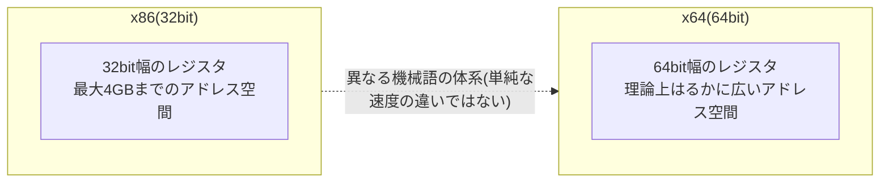

## はじめに

- **この記事で得られること**: ソフトウェアのダウンロードページでよく見かける**x64版・x86版という選択肢**が、そもそも何を表しているのか、**なぜ間違ったものをインストールすると問題が起きるのか、そしてなぜ今も統一されずに別々に配布され続けているのか**を体系的に理解します。あわせて、DELL Server Update Utilityのようなツールでダウンロードされる**ISOファイルを右クリックして「マウント」する**という操作が、具体的に何を行っているのかまでを解説します。
- **対象読者**: ソフトウェアやドライバをインストールする際にx64/x86の選択肢を目にしたことはあるものの、その違いや、間違えた場合に何が起きるのかを具体的に説明できない方を想定しています。
- **読むのにかかる想定時間**: 約16分

この記事は[『上位1%』シリーズ 全記事ガイド](/sitemap)の一部、[Windowsクライアント運用シリーズ](/sitemap#シリーズ一覧)の4本目です。

## 前提知識

- **CPUの命令セット(Instruction Set Architecture、ISA)**: CPUが直接理解・実行できる、機械語命令の体系です。ソフトウェアは最終的に、この命令セットに従った機械語へコンパイルされます。
- **レジスタ**: CPU内部にある、演算やデータの一時的な保持に使う超高速な記憶領域です。レジスタの幅(1つのレジスタが保持できるビット数)が、そのCPUが一度に扱えるデータ量やアドレス空間の広さに直結します。

## 全体像をつかむ

### x64とx86は「同じ命令セットの速度違い」ではない

**x86**は、もともとIntelの8086・386系CPUに由来する、**32bit幅のレジスタを前提とした命令セット**を指します。**x64(AMD64、x86-64とも呼ばれます)**は、この命令セットを拡張し、**64bit幅のレジスタとアドレス空間を扱えるようにした、別の命令セット(動作モード)**です。

**重要なのは、x64はx86の単なる「高速版」ではなく、レジスタ幅・アドレス空間・命令のエンコード方式が異なる、別の動作モードである**という点です。32bitのプログラムと64bitのプログラムは、最終的にCPUが読み取る機械語のバイト列そのものが異なるため、**1つのバイナリファイルが、そのままどちらのモードでも動作するわけではありません。**

## 基礎から徹底解説

### 間違ったアーキテクチャをインストールすると何が起きるのか

ここで重要なのは、**「ユーザーが直接操作する通常のアプリケーション」と「OSのカーネルの一部として動作するドライバ」で、挙動が根本的に異なる**という点です。

| 対象 | x86版を64bit OSにインストールした場合 |
|---|---|
| **通常のアプリケーション(ユーザーモード)** | **WoW64(Windows on Windows 64)**という互換レイヤーにより、多くの場合そのまま動作します。ただし、1プロセスが使えるメモリ量が32bitのアドレス空間(実質最大4GB弱)に制限されるなど、パフォーマンス・機能上の制約が生じます。 |
| **デバイスドライバ(カーネルモード)** | **原則として動作しません。** カーネルモードで動くドライバには、WoW64のような互換レイヤーが存在せず、OSのビット幅とドライバのビット幅が完全に一致していない場合、インストール自体が拒否されるか、読み込みに失敗します。 |

**つまり、「間違えたら即クラッシュする」という単純な話ではなく、対象がアプリケーションかドライバかによって結果が大きく異なります。** 通常のアプリケーションであれば、多くの場合互換レイヤーが吸収してくれますが、**ドライバのアーキテクチャだけは、OSのビット幅と厳密に一致させる必要がある**、という点が実務上の重要なポイントです。

WoW64が32bitアプリを動かす仕組み

64bit版Windowsは、内部的に32bit用の実行環境をエミュレートする**WoW64というサブシステム**を持っています。64bit版Windowsのシステムフォルダーには、64bit用のDLLを格納する`System32`フォルダーと、**32bit用のDLLを格納する`SysWOW64`という別フォルダー**が存在し、32bitアプリケーションが呼び出すシステムDLLは、WoW64によって自動的にこの`SysWOW64`側へ振り分けられます。この仕組みにより、64bit OSの上で32bitアプリケーションが、まるでネイティブな32bit環境で動いているかのように振る舞えるようになっています。

### なぜx64とx86が今も統一されないのか

「64bit CPUがほぼ普及している現在、なぜ今もx86版が配布され続けるのか」という疑問には、いくつかの理由があります。

- **古い環境との互換性維持**: ごく一部にまだ残る32bit版OSや、32bit専用の古い周辺機器・ドライバ環境との互換性を保つ必要がある場合。
- **配布側の運用コスト**: 1つのインストーラファイルに両方のアーキテクチャ用のプログラムをまとめて格納する(いわゆるユニバーサルインストーラ)ことも技術的には可能ですが、**ファイルサイズが単純に増える**ため、配布側がその手間とコストをかけていないケースがあります。
- **配布方式の世代差**: 近年の多くの一般消費者向けアプリケーションでは、**利用者が意識せずに済むよう、起動時に実行環境を自動判定し、適切な本体を裏側で取得・展開する「ブートストラッパー」形式のインストーラ**が主流になっています。一方、DELLのようなハードウェアベンダーのアップデートユーティリティや、企業向けのドライバ配布ツールなど、**歴史的に古い配布慣習を引き継いでいるツールでは、依然としてユーザー自身にx64/x86を明示的に選ばせる形式が残っています。**

**つまり「統一されていないように見える」現象の多くは、実際には「統一する技術自体は存在するが、配布側がその手間をかけているかどうかの違い」**である、という理解が実務上正確です。

### DELL SUUのISOファイルを「マウント」するとは何をしているのか

DELL Server Update Utilityのようなツールをダウンロードすると、実行可能ファイルではなく**ISOファイル**が提供されることがあります。**ISOファイルは、CD/DVDなどの光学メディアの内容を、そっくりそのまま1つのファイルとして保存した「ディスクイメージ」**です。

これを右クリックして**「マウント」**すると、Windowsは**そのISOファイルの内容を、実際に物理的な光学ドライブへディスクを挿入したのと同じ状態として認識します。** 具体的には、新しい仮想的な光学ドライブ(ドライブ文字が割り当てられる)がエクスプローラー上に出現し、その中にISOファイルの中身がそのまま展開されたかのように表示されます。

**重要なのは、マウントはあくまで「仮想的な読み取り専用のドライブとして認識させる」操作であり、ISOファイルの内容をディスク上の別の場所へ実際に展開・コピーする操作ではない**という点です。マウントを解除すれば、その仮想ドライブは消え、元のISOファイル自体はそのまま残ります。Windows 8以降、この機能はOS標準の機能として搭載されており、追加のソフトウェアなしで右クリックからそのまま実行できます。

なぜアップデートユーティリティがISO形式で配布されるのか

サーバーのファームウェア・ドライバのアップデートユーティリティが、実行可能ファイル単体ではなくISO形式で配布されることが多い背景には、**元々は物理的なCD/DVDメディアで配布・起動することを前提に作られていた慣習が、そのまま引き継がれている**という事情があります。ISO形式であれば、**そのまま物理メディアへ書き込んで、対象サーバーを起動用のメディアとしてブートさせる**ことも可能であり、OSが起動できない状態のサーバーに対しても、単体で起動してアップデート作業を行える、という運用上の利点があります。

## プロが見ている視点(上位1%の理解)

### ドライバのアーキテクチャ不一致は、実務でどう表面化するか

実務では、サーバー・PCのスペック(CPU・OSのビット幅)を事前に確認せず、誤ったアーキテクチャのドライバパッケージを取得してしまうと、**インストーラ自体が起動を拒否する、あるいはデバイスマネージャー上でそのデバイスが正しく認識されないまま残る**、という形でこの不一致が表面化します。通常のアプリケーションの動作不良より、**原因の切り分けに手間がかかりやすい**のは、こうしたドライバレベルの不一致が、エラーメッセージとして明確に「アーキテクチャが違います」と表示されるとは限らないためです。

## よくある誤解・つまずきポイント

- **誤解1: 「x64はx86の単なる高速版であり、命令セット自体は同じ」**
  x64はレジスタ幅・アドレス空間・命令のエンコード方式が異なる、別の動作モードです。単純な速度差ではありません。
- **誤解2: 「アーキテクチャを間違えると、必ずシステムがクラッシュする」**
  通常のユーザーモードアプリケーションであれば、WoW64という互換レイヤーによって多くの場合そのまま動作します。ドライバのように、互換レイヤーが存在しないカーネルモードのソフトウェアだけが、アーキテクチャの不一致でインストール自体に失敗します。
- **誤解3: 「ISOファイルをマウントすると、その内容がディスク上に実際に展開・コピーされる」**
  マウントは、ISOファイルの内容を仮想的な読み取り専用ドライブとして認識させる操作であり、内容を別の場所へ実際にコピー・展開する操作ではありません。

## 障害・トラブルシューティングの視点

インストール関連の問題は、**「対象がユーザーモードのアプリケーションか、カーネルモードのドライバか」を最初に切り分ける**のが基本です。

1. **アプリケーションのインストール後、動作が不安定・一部機能が使えない**: WoW64経由での実行に起因するメモリ・アドレス空間の制約が影響していないかを確認します。
2. **ドライバのインストーラが起動を拒否する、あるいはデバイスマネージャーで正しく認識されない**: そのドライバパッケージのアーキテクチャ(x64/x86)と、対象OSのビット幅が一致しているかを確認します。
3. **ISOファイルを右クリックしても「マウント」の選択肢が出ない**: 古いWindowsのバージョンでは標準機能として搭載されていない場合があり、サードパーティ製のマウントツールが必要になることがあります。

### 予防策・恒久対策

- ドライバ・ファームウェアの更新パッケージを取得する前に、対象サーバー・PCのCPU・OSのビット幅を必ず確認する。
- 大量の機器に対して同じアップデート作業を行う場合、アーキテクチャの取得ミスを防ぐため、事前にチェックリストや自動化スクリプトで確認手順を組み込む。

## まとめ

- x64とx86は、レジスタ幅・アドレス空間・命令のエンコード方式が異なる、別の動作モードであり、単純な速度差ではありません。
- 通常のユーザーモードアプリケーションはWoW64という互換レイヤーにより多くの場合そのまま動作しますが、カーネルモードのドライバは、OSのビット幅と厳密に一致していなければ動作しません。
- x64/x86が今も統一されずに配布され続けているのは、技術的な制約というより、配布側がユニバーサルインストーラ形式への対応コストをかけているかどうかの違いです。
- ISOファイルの「マウント」は、その内容を仮想的な読み取り専用の光学ドライブとして認識させる操作であり、内容を実際にディスク上へ展開・コピーする操作ではありません。

**今日から意識すべきこと**
1. インストール対象がドライバかアプリケーションかを意識し、ドライバの場合はアーキテクチャの一致を特に厳密に確認しましょう。
2. ISOファイルの「マウント」に出会ったら、それが仮想的な読み取り専用ドライブとしての認識に過ぎないことを思い出しましょう。

## 参考文献

- [WOW64 Implementation Details | Microsoft Learn](https://learn.microsoft.com/en-us/windows/win32/winprog64/wow64-implementation-details)
- [x64 Architecture | Microsoft Learn](https://learn.microsoft.com/en-us/windows-hardware/drivers/kernel/x64-architecture)
- [Mount and unmount an ISO image | Microsoft Support](https://support.microsoft.com/en-us/windows/mount-and-unmount-a-disc-image-iso-or-vhd-in-windows-63d84dfc-a75f-4c3e-b298-84a3fbec7784)
