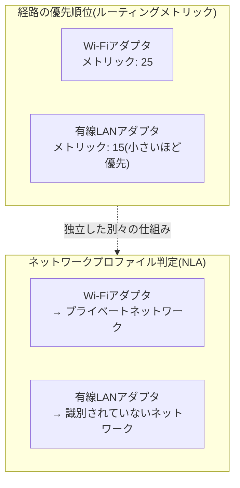

## はじめに

- **この記事で得られること**: 「Wi-Fiを有効にしたまま有線LANケーブルを接続すると、有線LAN側の機器の管理画面へ到達できなくなることがある」という実務でよくある症状を出発点に、Windowsが複数のネットワークアダプタが同時に有効な状況で、**どの経路を優先するのか(ルーティングメトリック)**、そして**そのネットワークが「ドメイン」「プライベート」「パブリック」のどれに分類され、ファイアウォールのどのプロファイルが適用されるのか(NLA、Network Location Awareness)**という2つの仕組みを体系的に理解します。あわせて、NICチーミング+複数の論理NIC(VLAN)という構成で、「識別されていないネットワーク」がまとめて扱われてしまう実際のトラブル事例も扱います。
- **対象読者**: 複数のネットワークアダプタを持つPC・サーバーの運用に携わっているものの、どちらの経路が優先されるのか、ネットワークプロファイルがどう決まるのかを具体的に説明できない方を想定しています。
- **読むのにかかる想定時間**: 約19分

この記事は[『上位1%』シリーズ 全記事ガイド](/sitemap)の一部、[ネットワーク基礎シリーズ](/sitemap#シリーズ一覧)の一部です。ルーターやスイッチの基本的な転送の仕組みは[HUB・スイッチ(L2SW)・L3SW・ルーターの違いを『上位1%』の視点で理解する](/articles/network-devices-guide)を前提にしています。

## 前提知識

- **デフォルトゲートウェイ**: 端末が、自分と異なるネットワーク宛のパケットを送る際に、最初の転送先として指定するIPアドレスです。
- **ルーティングテーブル**: どの宛先のパケットを、どのインターフェース(NIC)経由で、どこへ転送するかを定義した表です。1台のPCが複数のネットワークアダプタを持つ場合、ルーティングテーブルにも複数のエントリが存在しえます。

## 全体像をつかむ

### 一言で言うと

**Windowsは、複数のネットワークアダプタが同時に有効な場合、それぞれのアダプタに自動的または手動で割り当てられた「インターフェースメトリック」という優先順位の数値をもとに、どの経路を優先するかを決定します。** さらに、それとは独立して、各アダプタが接続しているネットワークが「ドメイン」「プライベート」「パブリック」のどれに該当するかを**NLA(Network Location Awareness)**というサービスが判定し、この分類に応じてWindowsファイアウォールの適用ルール(プロファイル)が切り替わります。**この2つの仕組みは目的も判定基準もまったく異なりますが、どちらも「複数のネットワークアダプタが同時に有効な状況」で問題を引き起こしやすい**という共通点があります。

## 基礎から徹底解説

### 複数のアクティブなアダプタと、デフォルトゲートウェイの優先順位(インターフェースメトリック)

Windowsの各ネットワークアダプタには、**インターフェースメトリック**という数値が(既定では自動計算で、あるいは手動で)割り当てられています。この値は、**そのアダプタ経由の経路がどれだけ優先されるかを示す指標で、値が小さいほど優先度が高くなります。** 複数のアダプタが同時に有効で、それぞれが独自のデフォルトゲートウェイを持っている場合、Windowsは実質的に**インターフェースメトリックが最も小さいアダプタのデフォルトゲートウェイを、実際に使われる経路として優先**します。

**「Wi-Fiを有効にしたまま有線LANケーブルを接続すると、有線LAN側の機器へ到達できなくなることがある」という症状は、まさにこのメトリックの優劣によって説明できます。** Wi-Fiアダプタのメトリックが有線LANアダプタより小さい(=優先度が高い)状態になっていると、有線LANと同じセグメント内の機器へ向けた通信であっても、宛先が自分のセグメント外だとPCが判断した場合、まずWi-Fi側のデフォルトゲートウェイへ向けて送信しようとしてしまい、意図した有線LAN側の経路が使われません。

自動メトリックの計算基準

Windowsの既定設定(自動メトリック)では、インターフェースメトリックはそのアダプタの**リンク速度**をもとに自動計算されます(高速なアダプタほど小さい=優先度の高いメトリックが割り当てられる傾向があります)。ただし、これはあくまでリンク速度に基づく機械的な計算であり、**そのアダプタが実際に到達したいネットワークへの経路として適切かどうかとは無関係**です。前述の症状のように、意図と異なる優先順位になってしまう場合は、`ncpa.cpl`から該当アダプタのプロパティ→「インターネットプロトコル バージョン4」のプロパティ→「詳細設定」で、自動計算に頼らず**手動でメトリック値を指定**することで、優先順位を明示的に制御できます。

### なぜ同じセグメント宛の通信でも、ゲートウェイの優劣が影響するのか

「有線LAN側の機器と同じセグメントにいるなら、ゲートウェイの優劣なんて関係ないのでは」と思うかもしれません。しかし、これは**そのPC自身が、有線LANアダプタに設定されたIPアドレス・サブネットマスクをもとに、宛先が本当に同一セグメント内かどうかを正しく判断できている場合に限られます。** もし何らかの理由でルーティングの解決に迷いが生じる状況(たとえば、Wi-Fi側にも偶然近いアドレス体系が設定されている、あるいはVPN接続などでルーティングテーブルが複雑化している)では、想定と異なるアダプタ経由の経路が選択されてしまうことがあります。実務でのトラブルシューティングでは、`route print`コマンドで実際のルーティングテーブルを確認し、意図した経路が意図した優先順位になっているかを直接確認するのが確実です。

### ネットワークプロファイルの判定:NLA(Network Location Awareness)

インターフェースメトリックとはまったく別の仕組みとして、Windowsには**NLA(Network Location Awareness)**というサービスがあります。NLAは、**各ネットワークアダプタが接続しているネットワークが、「ドメイン」「プライベート」「パブリック」のどのカテゴリに該当するかを自動的に判定する**役割を持ちます。

| カテゴリ | 判定基準の概要 | 既定のファイアウォールの傾向 |
|---|---|---|
| ドメイン | そのネットワーク経由で、参加しているADドメインのDCへ到達・認証できる | 業務上必要な通信を許可する、緩やかな既定ルール |
| プライベート | ユーザーが「信頼するネットワーク」として手動で分類した(自宅・社内LANなど) | ある程度の通信を許可する、中間的な既定ルール |
| パブリック | 上記のいずれにも該当しない(カフェのWi-Fiなど、信頼できないネットワーク) | 着信を厳しく制限する、最も厳格な既定ルール |

**このネットワークカテゴリは、アダプタごとに個別に判定されます。** つまり、Wi-Fiアダプタは「プライベート」、有線LANアダプタは「ドメイン」というように、同じPC上で異なるカテゴリが同時に割り当てられることが普通にあります。そして、**Windowsファイアウォールは、このカテゴリごとに異なるプロファイル(受信規則の既定ルールのセット)を、アダプタ単位で適用します。**

「識別されていないネットワーク」とは何か

NLAが「ドメイン」「プライベート」のいずれの条件も満たさないと判定した(かつユーザーがまだ手動で分類していない)ネットワークは、**「識別されていないネットワーク」**として扱われ、既定ではパブリックネットワークと同様の厳格なファイアウォールルールが適用されます。ADドメインのDCへ到達できるはずの有線LANであっても、DNS解決やドメインへの到達性確認が何らかの理由で一時的に遅延・失敗すると、NLAが判定を確定できず、一時的に「識別されていないネットワーク」として扱われることがあります。

## プロが見ている視点(上位1%の理解)

### NICチーミング+複数の論理NIC(VLAN)環境で発生した実際のトラブル

実務で発生した、次のようなトラブルを診断してみます。

> サーバーには2つの物理NICがあり、チーミングを構成していた。そのチーミングの上に、それぞれ異なるVLANを割り当てた4つの論理NICを作成しており、そのうち1つにはゲートウェイを設定していた。ゲートウェイを設定したその論理NICだけは「識別されていないネットワーク」ではなく「イーサネット4」として認識され、個別にWindowsファイアウォールのプロファイルを設定できていた。他の3つの論理NICは、まとめて「識別されていないネットワーク」として扱われ、個別設定ができなかった。サーバーの再起動後、すべての論理NICが「識別されていないネットワーク」になってしまった。NLAサービスの再起動を試みたがエラーで実行できず、該当の論理NICを個別に再起動(無効化→有効化)したところ、再びイーサネット4として認識されるようになった。

この事例は、NLAの判定ロジックの中でも特に**「デフォルトゲートウェイの有無」が、ネットワークの識別・命名において重要な手がかりになっている**ことを示しています。

- **ゲートウェイを持つ論理NICが個別に認識されやすい理由**: NLAは、そのアダプタから実際に外部(あるいは特定の到達確認先)への到達性を検証することで、ネットワークの同一性を識別しています。ゲートウェイが設定されているアダプタは、この到達性確認が明確に成立しやすく、**NLAが「これは他とは区別できる、固有のネットワークだ」と判定しやすくなります。** 一方、ゲートウェイを持たない(その論理NIC単体では外部への経路を持たない)論理NICは、NLAから見ると「どこにも到達を確認できない、素性のはっきりしないネットワーク」に見えやすく、複数の論理NICが同じ「識別されていないネットワーク」という1つの区分にまとめられてしまいます。
- **再起動後にすべてが「識別されていないネットワーク」に戻った理由**: サーバー起動時、複数の論理NICやチーミング自体の初期化が完了し、実際に到達性確認が行えるようになるまでには、ある程度の時間差が生じえます。この初期化・到達性確認のタイミングの微妙なズレにより、NLAが本来の判定を確定できないまま「識別されていないネットワーク」という暫定的な状態で確定してしまうことがあります。
- **NLAサービスの再起動ではなく、論理NIC自体の再起動(無効化→有効化)で解決した理由**: NLAサービス自体を(Windowsの中核的なネットワークサービスであるため依存関係の制約から)単純に再起動することはできない場合が多く、これがエラーになった理由です。一方、論理NICを無効化→有効化すると、そのアダプタに対する接続イベントが新たに発生し、**NLAはこの新規の接続イベントをきっかけに、そのアダプタについて改めてネットワークの識別処理を再実行します。** これにより、起動時にはうまく確定できなかった判定が、あらためて正しく行われた、と説明できます。

### なぜ「識別されていないネットワーク」は論理NICごとに個別設定できないのか

Windowsファイアウォールのプロファイルは、**NLAが識別した"ネットワーク"という単位に対して適用されます。** ゲートウェイを持つ論理NICは、NLAにとって「他と区別できる固有のネットワーク」として認識されたため、個別のプロファイルを割り当てられました。一方、ゲートウェイを持たない複数の論理NICは、いずれもNLAから見て「区別できる決め手がない、素性の不明なネットワーク」という**同じ1つの分類(識別されていないネットワーク)**にまとめられてしまったため、Windowsファイアウォールから見てもこれらは論理NICごとの別々の存在ではなく、**"識別されていないネットワーク"という1つの共通のグループとして扱われ、設定も一括で反映される**ことになります。個々の論理NICを区別してファイアウォールを設定したい場合は、各論理NICがNLAから見て確実に区別可能な状態(たとえば、それぞれに疎通確認可能な経路を用意する、あるいはグループポリシーで明示的にネットワークの分類をハードコードする)にする必要があります。

## よくある誤解・つまずきポイント

- **誤解1: 「同じセグメントの機器なら、ゲートウェイの設定に関わらず必ず到達できる」**
  ゲートウェイの優劣(インターフェースメトリック)は、PCが宛先への経路をどう解決するかに影響します。想定と異なるアダプタが優先されている場合、意図した経路が使われないことがあります。
- **誤解2: 「ネットワークプロファイル(ドメイン/プライベート/パブリック)は、PC全体で1つに決まる」**
  ネットワークプロファイルはアダプタごとに個別に判定・適用されます。同じPC上の複数のアダプタが、それぞれ異なるプロファイルを持つことは普通にあります。
- **誤解3: 「識別されていないネットワークは、NLAサービスを再起動すればすぐに直る」**
  NLAサービス自体の単純な再起動は依存関係の制約でできない場合が多く、実際には該当のネットワークアダプタ自体を無効化→有効化して新規の接続イベントを発生させることで、NLAの再判定を促す方が確実です。

## 障害・トラブルシューティングの視点

複数アダプタ環境のネットワークトラブルは、**「経路の優先順位(メトリック)の問題か、ネットワークプロファイル(NLA/ファイアウォール)の問題か」を切り分ける**のが基本です。

1. **特定のセグメントへ到達できない**: `route print`でルーティングテーブルを確認し、意図したアダプタのデフォルトゲートウェイが実際に優先されているか(インターフェースメトリックの値)を確認します。
2. **有線LAN(社内ドメイン)であるはずのアダプタがパブリック/識別されていないネットワークとして扱われ、ファイアウォールで通信が遮断される**: そのアダプタからドメインコントローラーへの到達性確認が正常に行えているか、DNS解決に問題がないかを確認します。
3. **チーミング+複数の論理NIC環境で、ネットワークプロファイルが意図通りに個別化されない**: 各論理NICにゲートウェイ(または明確な到達性確認手段)が設定されているかを確認します。
4. **サーバー再起動のたびにネットワークプロファイルの判定がリセットされる**: NLAサービスや依存するネットワークコンポーネントの起動順序・タイミングを疑い、必要であれば起動時のスクリプトなどで該当アダプタの再有効化を組み込むことを検討します。

### 予防策・恒久対策

- 複数のアクティブなネットワークアダプタを持つ構成では、自動メトリックに頼らず、意図した優先順位を手動で明示的に設定する。
- ドメイン内でのファイアウォール制御を確実にしたいアダプタには、必ず疎通確認可能なゲートウェイ(または相当する到達性確認手段)を用意する。
- チーミング+複数論理NIC環境でのネットワークプロファイルの挙動は、実際に再起動を伴うテストで事前に確認しておく。

## まとめ

- 複数のネットワークアダプタが同時に有効な場合、Windowsはインターフェースメトリックの値をもとにどの経路(デフォルトゲートウェイ)を優先するかを決定します。値が小さいほど優先度が高くなります。
- ネットワークプロファイル(ドメイン/プライベート/パブリック)は、NLAというサービスがアダプタごとに個別に判定しており、ファイアウォールのプロファイルもアダプタ単位で適用されます。
- NLAはゲートウェイの有無などの到達性確認の結果をもとにネットワークを識別しており、ゲートウェイを持たない複数の論理NICは「識別されていないネットワーク」という1つの区分にまとめられ、個別設定ができません。
- NLAサービス自体の再起動が難しい場合、該当ネットワークアダプタの無効化→有効化によって新規の接続イベントを発生させ、NLAの再判定を促すことができます。

**今日から意識すべきこと**
1. 複数のアクティブなアダプタを持つ環境でルーティングの疑問に遭遇したら、`route print`でインターフェースメトリックと実際の優先順位を確認しましょう。
2. ネットワークプロファイルが意図通りに個別化されない場合は、そのアダプタにゲートウェイ(または疎通確認手段)が設定されているかをまず確認しましょう。

## 参考文献

- [Route command | Microsoft Learn](https://learn.microsoft.com/en-us/windows-server/administration/windows-commands/route)
- [Network Location Awareness (NLA) | Microsoft Learn](https://learn.microsoft.com/en-us/windows/win32/winsock/network-location-awareness-nla-and-how-it-relates-to-windows-firewall)
- [Windows Firewall Profiles Overview | Microsoft Learn](https://learn.microsoft.com/en-us/windows/security/operating-system-security/network-security/windows-firewall/best-practices-configuring)
