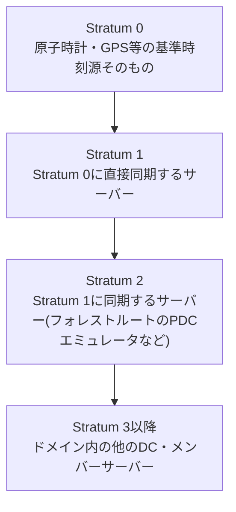
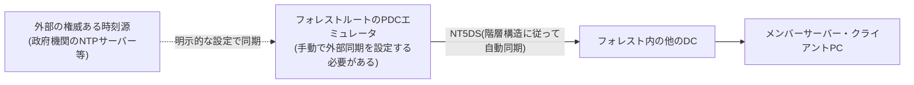

## はじめに

- **この記事で得られること**: Windows ServerでNTP(Network Time Protocol)サーバー機能を構成する際に必ず登場する**Stratum(階層)**という考え方、**AnnounceFlags**というレジストリ値が何を制御しているのか、そして**なぜフォレストルートのPDCエミュレータだけが、外部の時刻源への明示的な同期設定を必要とするのか**を体系的に理解します。
- **対象読者**: Windows Serverの時刻同期設定に携わったことはあるものの、AnnounceFlagsという設定値の意味や、なぜこの設定が必要になるのかを具体的に説明できない方を想定しています。
- **読むのにかかる想定時間**: 約17分

この記事は[『上位1%』シリーズ 全記事ガイド](/sitemap)の一部、[Windows Server運用シリーズ](/sitemap#シリーズ一覧)の2本目です。PDCエミュレータが担う時刻同期の階層構造については[FSMO(操作マスター)とは何かを『上位1%』の視点で理解する](/articles/fsmo-guide)で触れているため、本記事ではその実際の設定項目にフォーカスします。

## 前提知識

- **PDCエミュレータ**: ドメイン内の時刻同期の基準となるFSMO役割です。詳しくは[FSMO(操作マスター)とは何かを『上位1%』の視点で理解する](/articles/fsmo-guide)を参照してください。
- **W32Time(Windows Timeサービス)**: Windowsに標準搭載されている、NTPによる時刻同期を実行するサービスです。

## 全体像をつかむ

### Stratum(階層)という考え方

NTPは、**Stratum(階層)**という番号によって、時刻源としての信頼度・階層構造を表現します。



**ADドメイン内では、このStratum階層が、[FSMO(操作マスター)とは何かを『上位1%』の視点で理解する](/articles/fsmo-guide)で説明したPDCエミュレータを頂点とする時刻同期の階層構造と対応しています。** ドメイン参加済みのWindowsマシンは、既定で自分のドメインの階層構造(DCの階層)に従って自動的に上位の時刻源を頼りますが、**フォレストルートのPDCエミュレータは、ドメイン内には頼れる上位が存在しない立場**にあります。

## 基礎から徹底解説

### フォレストルートのPDCエミュレータだけが特別な設定を必要とする理由

これが、Windows ServerのNTP設定において最も重要な理解ポイントです。**フォレストルートドメインのPDCエミュレータ以外のすべてのマシンは、既定の設定(`NT5DS`と呼ばれる、AD DSの階層構造に従って自動的に上位のDCを頼る方式)のままで問題なく機能します。** しかし、**フォレストルートのPDCエミュレータ自身は、ドメインの階層をどこまで遡っても、これ以上頼れる上位のDCが存在しません。**

このため、フォレストルートのPDCエミュレータだけは、**外部の権威ある時刻源(政府機関が公開しているNTPサーバーや、GPS受信機能を持つ専用のタイムサーバーアプライアンスなど)へ、明示的に同期するよう手動で設定する必要があります。** この設定を行わない場合、フォレストルートのPDCエミュレータは自分自身のハードウェアクロック(マザーボード上のCMOS時計)にのみ依存することになり、**時間の経過とともに時刻のずれ(ドリフト)が蓄積していくリスク**があります。



### AnnounceFlagsとは何か

**AnnounceFlags**は、`HKEY_LOCAL_MACHINE\SYSTEM\CurrentControlSet\Services\W32Time\Config`にあるレジストリ値で、**そのマシンが、時刻同期を求めるクライアントに対して「自分は信頼できる時刻源である」と広告(アナウンス)するかどうか**を制御する、ビットフラグの組み合わせです。

| ビット値 | 意味 |
|---|---|
| `0x01` | 常に時刻サーバーとして動作する(Always time server) |
| `0x02` | フォレストルートのPDCエミュレータである場合に、自動的に時刻サーバーとして振る舞う(Automatic time server) |
| `0x04` | 常に信頼できる時刻源として広告する(Always reliable time source) |
| `0x08` | フォレストルートのPDCエミュレータである場合に、自動的に信頼できる時刻源として広告する(Automatic reliable time source) |

**既定値は`10`(16進数で`0x0A`、つまり`0x02`+`0x08`の組み合わせ)**です。この既定値の意味は、**「自分がフォレストルートのPDCエミュレータであれば自動的に時刻サーバー・信頼できる時刻源として振る舞い、そうでなければ振る舞わない」**という、条件付きの動作です。この既定値のおかげで、管理者が個々のDCに対して手動で設定を切り替える必要はなく、**FSMO転送によってPDCエミュレータの役割が別のDCへ移った場合でも、AnnounceFlagsの設定自体はそのままで、新しいPDCエミュレータが自動的にこの役割を引き継ぎます。**

<details>
<summary>AnnounceFlagsを0に設定すると何が起きるか</summary>

`AnnounceFlags`を`0`に設定すると、そのマシンはクライアントに対して「自分は時刻源として利用可能である」という広告を一切行わなくなります。これは**時刻同期の階層構造そのものを機能不全にする**設定変更であり、通常は行うべきではありません。特殊な検証環境や、意図的にそのマシンを時刻同期の階層から除外したい場合を除き、既定値のまま維持することが推奨されます。

</details>

### その他の主要な設定項目

AnnounceFlags以外にも、Windows ServerのNTP設定では次のような項目が登場します。

| 設定項目 | 内容 |
|---|---|
| `Type` | 同期方式を指定します。`NTP`(明示的に指定したサーバーへ同期)、`NT5DS`(AD DSの階層構造に従って自動的に上位DCへ同期)、`AllSync`(利用可能なすべての時刻源を試す)、`NoSync`(同期を行わない)から選択します。 |
| `NtpServer` | `Type`が`NTP`の場合に、同期先として明示的に指定する外部NTPサーバーのアドレスです。冗長化のため複数指定できます。 |
| `MaxPosPhaseCorrection`/`MaxNegPhaseCorrection` | 1回の同期で許容する時刻補正の最大量(秒数)です。この範囲を超える大きなずれを検知した場合、自動修正を行わずエラーとして扱う、といった安全策に使われます。 |

`w32tm`コマンドを使うと、これらの設定値の確認・変更を行えます。

```powershell
# フォレストルートのPDCエミュレータを、外部NTPサーバーへ同期するよう設定する例
w32tm /config /manualpeerlist:"time.example.com,0x8 time2.example.com,0x8" /syncfromflags:manual /reliable:yes /update
```

## プロが見ている視点(上位1%の理解)

### 時刻同期の精度が、なぜKerberos認証の安定性に直結するのか

[AD環境のDNSはなぜこう設計されているのか](/articles/ad-dns-guide)などでも触れてきた通り、AD環境の多くの機能はDNSと同様にKerberos認証と密接に関わっています。**Kerberos認証は、クライアントとDCの時刻のずれが既定の許容範囲(既定5分)を超えると、認証自体が失敗する**という、時刻精度に極めて厳しい性質を持っています。時刻同期の階層構造の頂点にあるフォレストルートのPDCエミュレータの時刻精度が損なわれると、その影響はドメイン全体に波及し、**説明のつかない認証エラーが多発する**という形で表面化します。時刻同期の設定を「単なる時計合わせ」と軽視せず、認証基盤の一部として扱う視点が重要です。

### 外部時刻源の冗長化

`NtpServer`の設定では、複数の外部時刻源をカンマ区切りで指定できます。**単一の外部時刻源に依存する構成は、その時刻源自体に障害が発生した際に、フォレスト全体の時刻同期が機能しなくなるリスク**を抱えます。大規模・高可用性が求められる環境では、複数の独立した外部時刻源(可能であれば異なる提供元)を指定しておくことが推奨されます。

## よくある誤解・つまずきポイント

- **誤解1: 「W32Timeサービスは、単なる時計の見た目を合わせるための補助機能であり、重要度は低い」**
  時刻同期はKerberos認証の前提条件であり、そのずれはドメイン全体の認証の安定性に直結します。
- **誤解2: 「フォレスト内のすべてのDCで、外部の時刻源への同期設定が必要である」**
  外部時刻源への明示的な同期設定が必要なのは、フォレストルートのPDCエミュレータだけです。他のDCは既定のNT5DS方式で階層構造に従い自動的に機能します。
- **誤解3: 「AnnounceFlagsを常に手動で明示的な値に設定しておくべきだ」**
  既定値(`0x0A`)は、FSMO転送によってPDCエミュレータの役割が移動した場合にも自動的に追従する、合理的な設計になっています。特別な理由がない限り、既定値を変更する必要はありません。

## 障害・トラブルシューティングの視点

時刻同期関連の障害は、**「どの階層のマシンで、どの設定に起因する問題か」を切り分ける**のが基本です。

1. **特定のマシンで時刻がずれている**: `w32tm /query /status`を実行し、そのマシンが参照しているStratum値と同期元(Source)を確認します。
2. **Kerberos認証が原因不明で失敗する**: クライアントとDCの時刻差を確認し、5分の許容範囲を超えていないかを確認します。フォレストルートのPDCエミュレータの時刻精度自体に問題がないかも確認します。
3. **フォレストルートのPDCエミュレータの時刻が、外部の基準と大きくずれている**: `NtpServer`に指定した外部時刻源への到達性(ファイアウォールでUDP 123番ポートが許可されているか)を確認します。

### 予防策・恒久対策

- フォレストルートのPDCエミュレータには、複数の独立した外部時刻源を明示的に設定し、単一障害点を避ける。
- ファイアウォールで、外部時刻源への同期に必要なUDP 123番ポートの通信が許可されていることを確認する。
- FSMO転送を行った際は、新しいPDCエミュレータで時刻同期の設定(外部時刻源への同期)が正しく引き継がれているかを確認する。

## まとめ

- NTPのStratum(階層)は、AD DSにおけるPDCエミュレータを頂点とする時刻同期の階層構造と対応しています。
- フォレストルートのPDCエミュレータだけが、ドメイン内に頼れる上位が存在しないため、外部の権威ある時刻源への明示的な同期設定を必要とします。
- AnnounceFlagsは、そのマシンが信頼できる時刻源として広告されるかどうかを制御するビットフラグで、既定値(`0x0A`)はFSMO転送に自動的に追従する合理的な設計になっています。
- 時刻同期の精度はKerberos認証の前提条件であり、単なる時計合わせとして軽視すべきではありません。

**今日から意識すべきこと**
1. NTPの設定を見直す際は、まずそのマシンがフォレストルートのPDCエミュレータかどうかを確認し、外部時刻源への明示的な同期設定が必要かを判断しましょう。
2. 原因不明のKerberos認証エラーに遭遇したら、まずクライアントとDCの時刻差を確認する習慣をつけましょう。

## 参考文献

- [Windows Time Service Technical Reference | Microsoft Learn](https://learn.microsoft.com/en-us/windows-server/networking/windows-time-service/windows-time-service-tech-ref)
- [How the Windows Time Service Works | Microsoft Learn](https://learn.microsoft.com/en-us/windows-server/networking/windows-time-service/how-the-windows-time-service-works)
- [Network Time Protocol Version 4: Protocol and Algorithms Specification | RFC 5905](https://datatracker.ietf.org/doc/html/rfc5905)
