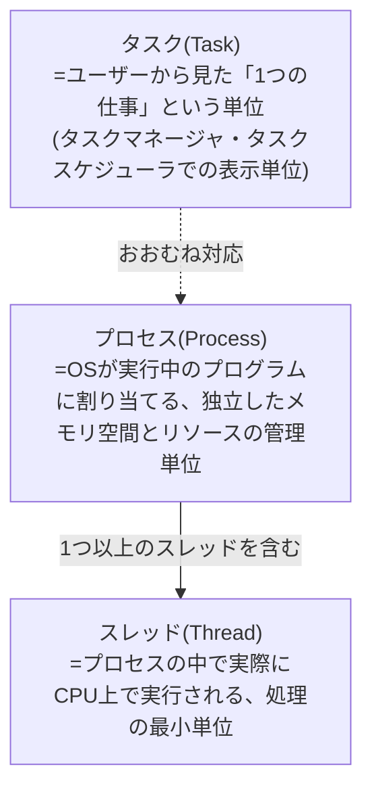
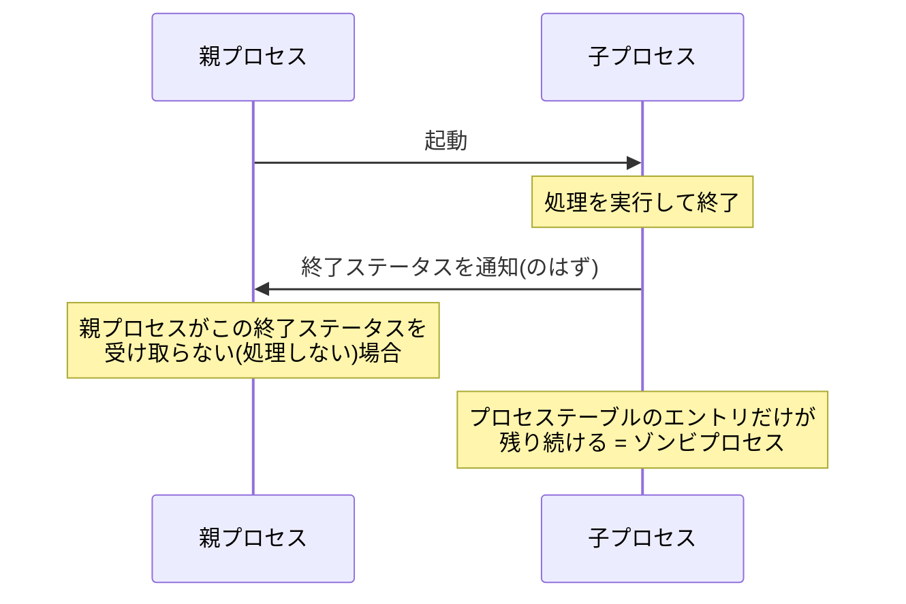

## はじめに

- **この記事で得られること**: 「GoogleDriveがエクスプローラー上に表示されなくなり、タスクマネージャでプロセスを終了させたら直った」という実務でよくある対処法を出発点に、**プロセス・スレッド・タスクという似て非なる用語の違い**、**ゾンビプロセスとは何で、なぜ発生するのか**を体系的に理解します。あわせて、モニターをHDMIケーブルで接続すると、以前の画面配置が自動的に復元される仕組みなど、実務でよく登場するその他のPC用語も整理します。
- **対象読者**: タスクマネージャでプロセスを終了させる操作を日常的に行っているものの、プロセス・タスク・スレッドの違いや、ゾンビプロセスという言葉の正確な意味を説明できない方を想定しています。
- **読むのにかかる想定時間**: 約16分

この記事は[『上位1%』シリーズ 全記事ガイド](/sitemap)の一部、[Windowsクライアント運用シリーズ](/sitemap#シリーズ一覧)の2本目です。

## 前提知識

- **OS(オペレーティングシステム)のプロセス管理**: OSは、実行中のプログラムそれぞれに専用のメモリ空間・リソースを割り当てて管理しています。この管理単位が「プロセス」です。

## 全体像をつかむ

### プロセス・スレッド・タスクの関係

3つの用語は、しばしば同じような意味で使われますが、厳密には**階層関係にある異なる概念**です。

## 基礎から徹底解説

### プロセスとスレッド:リソースの管理単位と、実行の最小単位

**プロセス**は、OSが実行中の1つのプログラムに対して割り当てる、独立したメモリ空間・ファイルハンドル・その他のリソースの集合です。あるプロセスが異常終了しても、原則として他のプロセスのメモリ領域には影響しません(プロセス間でメモリ空間が分離されているため)。

**スレッド**は、そのプロセスの中で実際にCPU上で実行される処理の最小単位です。1つのプロセスは、複数のスレッドを持つことができ(マルチスレッド)、これにより1つのプログラムの中で複数の処理を並行して進めることができます。スレッド同士は同じプロセスのメモリ空間を共有するため、プロセス間の分離ほど厳密には独立していません。

### タスクとは何か:ユーザー視点の「1つの仕事」という単位

**タスク**という言葉は、Windowsの文脈では厳密な技術用語というより、<strong>ユーザーから見た「1つの仕事・作業」</strong>を指す、やや広い意味で使われます。タスクマネージャに表示される「タスク」は、多くの場合、実行中のプロセス(や、複数プロセスにまたがるアプリケーション全体)とおおむね対応しますが、**タスクスケジューラの「タスク」は、指定した時刻・条件で自動実行される処理の定義**を指すなど、文脈によって指す対象がやや異なります。実務では「タスク=ユーザーが認識する仕事の単位、プロセス=OSが管理する実行単位」という区別を意識しておくと、混同が減ります。

### ゾンビプロセスとは何か

**ゾンビプロセス**は、**実際の処理は既に終了しているにもかかわらず、OS上の管理情報(プロセステーブルのエントリ)だけが残り続けている状態のプロセス**を指す用語です。

この用語は、本来はLinux/Unix系OSのプロセスモデル(親プロセスが子プロセスの終了ステータスを明示的に受け取る`wait()`という操作を行うまで、子プロセスの終了情報がプロセステーブルに残り続ける仕組み)に由来する概念です。**子プロセスの実際の処理(実行コード・メモリの大部分)は既に解放されているものの、「このプロセスがどう終了したか」という最後の情報だけがまだ回収されていない**、いわば後始末待ちの状態が「ゾンビ」と呼ばれる理由です。

Windows環境で口語的に「ゾンビプロセス」と呼ばれる状態は、厳密なUnix用語の定義とは少し異なり、多くの場合、**アプリケーション自体は既に応答不能になっている(あるいはウィンドウが閉じられている)のに、そのプロセスのエントリがタスクマネージャ上には依然として残り続けている状態**を指す、より広い意味で使われます。GoogleDriveのようなクラウドストレージクライアントは、システムトレイに常駐し、バックグラウンドで同期処理を行うプログラムであるため、**何らかの理由でメインの表示・応答処理が異常終了・ハングしても、プロセス自体(あるいはその一部の関連プロセス)がすぐには完全に終了せず、中途半端な状態のまま居座ってしまう**ことがあります。この状態になると、エクスプローラー上のアイコン表示や同期機能が正しく機能しなくなり、タスクマネージャからそのプロセスを手動で終了させることで、OSがリソースを正しく解放し、再起動後に正常な状態で立ち上がり直せるようになります。

なぜこのような中途半端な終了状態が発生するのか

主な原因としては、**プログラム自体のバグ(リソースの解放処理に不具合がある)**、**外部リソース(ネットワーク接続やファイルロック)への待ちがデッドロック状態になっている**、**OS側の異常(グラフィックドライバのクラッシュなど)にプログラムが巻き込まれた**、といったものが挙げられます。いずれの場合も、プログラム自身が正常な終了シーケンスを完了できていないため、OSから見て「終了したのか、まだ動いているのか」が曖昧な状態になり、これがタスクマネージャ上での不整合な表示として現れます。

## プロが見ている視点(上位1%の理解)

### モニターの配置設定が復元される仕組み

もう1つ、実務で遭遇する「なぜこうなっているのか」の疑問として、**HDMIケーブルでモニターに接続すると、以前の画面分割・配置の設定が自動的に記憶されている**という挙動があります。

これは、**モニターがEDID(Extended Display Identification Data)という、そのモニター固有の識別情報(製造元、型番、シリアル番号、対応解像度など)を、接続時にPC側へ伝える仕組み**があるためです。Windowsはこの**EDIDの内容(特にシリアル番号や型番の組み合わせ)をもとに「これは以前接続したことのある、あのモニターだ」と識別**し、そのモニターに対して過去に設定した配置・解像度・向きなどの設定を、レジストリに保存された情報から復元します。同じ型番の別のモニターであっても、シリアル番号が異なれば別のモニターとして認識され、新規の設定が必要になります。

## よくある誤解・つまずきポイント

- **誤解1: 「プロセス・タスク・スレッドは、すべて同じものを指す別名である」**
  タスクはユーザー視点での仕事の単位、プロセスはOSが管理するリソースの単位、スレッドはプロセス内で実行される処理の最小単位であり、階層関係にある異なる概念です。
- **誤解2: 「ゾンビプロセスは、Windowsに存在する概念ではない」**
  厳密な技術用語としてのゾンビプロセスはUnix系OSのプロセスモデルに由来しますが、Windows環境でも「応答不能になったまま居座り続けるプロセス」という近い意味で口語的に使われます。
- **誤解3: 「タスクマネージャでプロセスを終了させれば、その原因も解決する」**
  タスクマネージャでの終了は、あくまで居座り続けているプロセスのリソースをOSに強制的に回収させる対処であり、その状態を引き起こした根本原因(バグやデッドロックなど)自体は解決していません。頻発する場合は、アプリケーションの更新やログの確認など、根本原因の調査が必要です。

## 障害・トラブルシューティングの視点

プロセス関連の不具合は、**「そのプロセスが本当に何も処理していないのか、それとも単に応答が遅いだけなのか」を切り分ける**のが基本です。

1. **アプリケーションがエクスプローラー上に表示されない、システムトレイのアイコンが消えている**: タスクマネージャの「詳細」タブで、該当プロセスが依然として存在するか、CPU・メモリ使用率がどう推移しているかを確認します。
2. **タスクマネージャでプロセスを終了させても、同じ問題が頻発する**: アプリケーション自体のバージョンやログを確認し、単発の問題か、既知の不具合(バグ)なのかを調べます。
3. **PC全体の応答が重い状態が続く**: 特定のプロセスが異常に高いCPU・メモリ使用率を占有していないかを確認し、それが正常な処理なのか、意図しないループ(バグ)なのかを切り分けます。

### 予防策・恒久対策

- 常駐型のクラウドストレージクライアントなど、バックグラウンドで動作するアプリケーションは、定期的に最新版へ更新し、既知の不具合修正を取り込む。
- 特定のアプリケーションで居座り状態が頻発する場合は、ログを確認し、根本原因(ネットワーク不安定、ファイルロックの競合など)を特定する。

## まとめ

- タスクはユーザー視点での仕事の単位、プロセスはOSが管理するリソースの単位、スレッドはプロセス内で実行される処理の最小単位という、階層関係にある異なる概念です。
- ゾンビプロセスとは、実際の処理は終了しているにもかかわらず管理情報だけが残り続けている状態を指す用語で、Windows環境では応答不能なまま居座り続けるプロセスという近い意味で使われます。
- タスクマネージャでのプロセス終了は、居座り続けるプロセスのリソースを強制的に回収させる対処であり、根本原因の解決とは別物です。
- モニターの配置設定が復元される仕組みは、モニターが持つEDIDという固有の識別情報をもとに、Windowsが以前接続したモニターを識別していることによるものです。

**今日から意識すべきこと**
1. タスクマネージャでプロセスを終了させる対処を行った際は、それが対症療法であることを意識し、頻発する場合は根本原因を調査しましょう。
2. 「プロセス」「タスク」「スレッド」という用語に出会ったら、それぞれがどの階層を指しているのかを意識的に区別しましょう。

## 参考文献

- [Task Manager overview | Microsoft Learn](https://learn.microsoft.com/en-us/windows/win32/taskschd/task-manager)
- [About Processes and Threads | Microsoft Learn](https://learn.microsoft.com/en-us/windows/win32/procthread/about-processes-and-threads)
- [VESA Enhanced Extended Display Identification Data Standard (E-EDID) | VESA](https://vesa.org/vesa-standards/)
