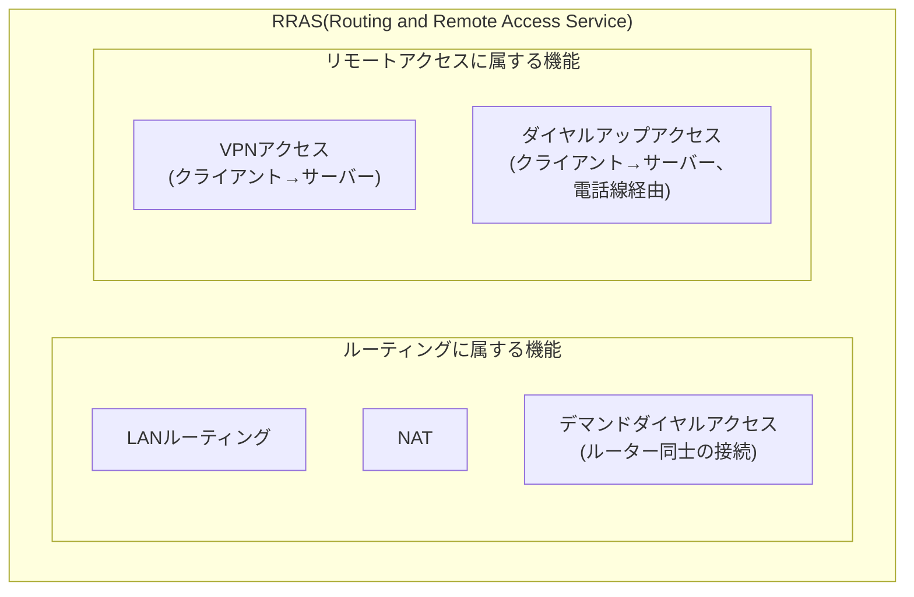
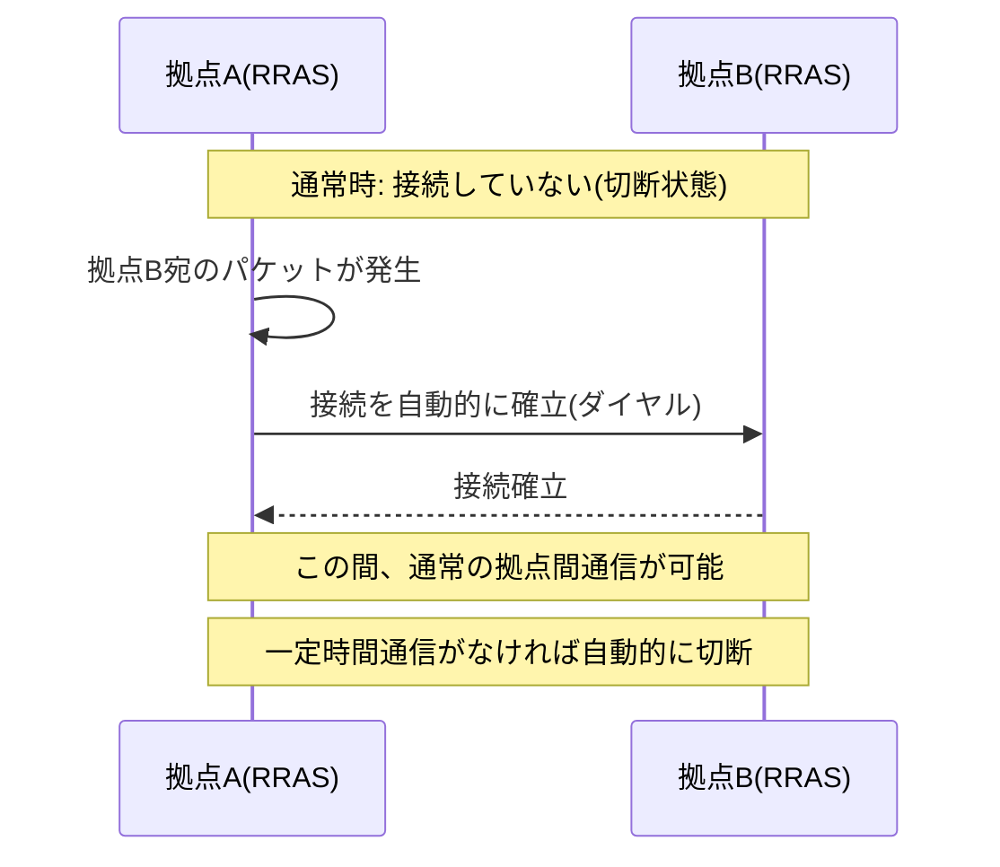

## はじめに

- **この記事で得られること**: Windows ServerのRRAS(Routing and Remote Access Service)を有効化する際に選択肢として表示される、**VPNアクセス・ダイヤルアップアクセス・デマンドダイヤルアクセス・NAT・LANルーティング**という5つの役割が、それぞれ何を実現する機能なのか、どう使い分けるのかを体系的に理解します。あわせて、なぜこれらがまったく別の機能でありながら「ルーティングとリモートアクセス」という1つのサービス名の下にまとめられているのか、その歴史的背景も整理します。
- **対象読者**: RRASの構成ウィザードでVPN以外の選択肢が並んでいるのを見たことはあるものの、それぞれが具体的に何を実現する機能なのかを説明できない方を想定しています。
- **読むのにかかる想定時間**: 約17分

この記事は[『上位1%』シリーズ 全記事ガイド](/sitemap)の一部、[リモートアクセスVPN/L2TP・IPsecシリーズ](/sitemap#シリーズ一覧)の発展編です。RRASのVPNアクセス機能そのものについては[Windows Server(RRAS)でのL2TP/IPsec VPN構築とIPアドレス管理を『上位1%』の視点で理解する](/articles/windows-server-l2tp-vpn-guide)で詳しく扱っているため、本記事ではそれ以外の4つの役割にフォーカスします。

## 前提知識

- **RRAS(Routing and Remote Access Service)**: Windows Serverに標準で搭載されている、複数のネットワーク関連機能をまとめて提供するサービスです。詳しくは[Windows Server(RRAS)でのL2TP/IPsec VPN構築とIPアドレス管理を『上位1%』の視点で理解する](/articles/windows-server-l2tp-vpn-guide)を参照してください。
- **PPP(Point-to-Point Protocol)**: 2点間を直接つなぐリンクの上で認証とIPアドレスの払い出しを行うプロトコルです。詳しくは[電話回線とIPネットワークの違いを『上位1%』の視点で理解する](/articles/circuit-switching-ppp-guide)を参照してください。

## 全体像をつかむ

### なぜ5つもの機能が1つのサービスにまとめられているのか

RRASという名前(Routing and Remote Access Service)は、実はその構成そのものを正確に表しています。**「ルーティング」に属する機能群と、「リモートアクセス」に属する機能群という、2つの異なる目的の機能セットが、歴史的に1つのサービスへ統合されている**、というのがRRASの正体です。

Windows NT4/2000の時代、Windows Serverを「社内ネットワークの中継役(ルーター)」として使いたいという需要と、「外部から社内へアクセスする窓口(リモートアクセスサーバー)」として使いたいという需要の両方に、1つのサービスでまとめて応える設計として登場したのがRRASです。**現在では専用のルーター・VPN機器を使うのが一般的ですが、Windows Server単体でもこれらの役割を担えるように、歴史的に統合された機能群が今も残っている**、という理解が実務上役に立ちます。

## 基礎から徹底解説

### 5つの役割の全体比較

| 役割 | 接続の相手 | 実現すること |
|---|---|---|
| **VPNアクセス** | リモートのクライアント端末 | インターネット経由で、暗号化されたトンネル(L2TP/IPsec、SSTPなど)を使って社内ネットワークへアクセスさせる |
| **ダイヤルアップアクセス** | リモートのクライアント端末 | 電話線(モデム・ISDNアダプター経由)を使い、インターネットを経由せず直接PPP接続で社内ネットワークへアクセスさせる |
| **デマンドダイヤルアクセス** | 別の拠点のルーター(RRASサーバー) | 拠点間の通信が発生したときだけ自動的に接続を確立し、通信がなければ切断する、拠点間の接続 |
| **NAT** | インターネット | プライベートIPアドレスの内部ネットワークを、1つ(または少数)のパブリックIPアドレスに変換してインターネットへ中継する |
| **LANルーティング** | 同一サーバーに接続された複数のLANセグメント | VPN・ダイヤルアップ・NATのいずれも行わず、複数のネットワークインターフェース間で単純にIPパケットを中継するだけの、純粋なルーター機能 |

**VPNアクセスとダイヤルアップアクセスは、いずれも「リモートのクライアント端末を社内ネットワークへ参加させる」という同じ目的を持ちますが、接続に使う経路がまったく異なります。** VPNアクセスはインターネットを経由した暗号化トンネルを使うのに対し、ダイヤルアップアクセスは電話線を使った直接のPPP接続であり、インターネットという概念自体が介在しません。

### ダイヤルアップアクセス:電話線を使った直接接続

**ダイヤルアップアクセス**は、サーバーに接続されたモデムやISDNアダプターへ、リモートのクライアントが電話線を通じて直接電話をかけ(ダイヤルし)、PPP接続を確立する機能です。これは、[電話回線とIPネットワークの違いを『上位1%』の視点で理解する](/articles/circuit-switching-ppp-guide)で扱った、PPPというプロトコルが本来想定していた最も原初的な使い方そのものです。VPNアクセスがPPPを**インターネット上のトンネルの中に**カプセル化して使うのに対し、ダイヤルアップアクセスはPPPを**そのまま電話線の上で**使います。現在ではブロードバンド回線とVPNの普及により実務で使われる機会はほとんどありませんが、RRASの選択肢としては今も残っています。

### デマンドダイヤルアクセス:必要なときだけ接続する拠点間接続

**デマンドダイヤルアクセス**は、クライアント端末とサーバーの関係ではなく、**2つの拠点にあるRRASサーバー同士(ルーター同士)を接続する**機能です。名前の通り、<strong>「需要(demand)が発生したとき、つまり相手拠点宛の通信が実際に発生したときだけ、オンデマンドで接続を確立する」</strong>という動作が最大の特徴です。通信が一定時間発生しないと、接続は自動的に切断されます。

デマンドダイヤルという発想が生まれた背景には、**接続時間や通信量に応じて課金される、従量制の回線(ISDN回線や、初期のダイヤルアップ回線)を拠点間接続に使っていた時代の事情**があります。拠点間で常時接続を維持すると回線コストが跳ね上がってしまうため、「本当に必要なときだけ繋ぐ」ことでコストを抑える、という設計思想です。現在では、[拠点間VPN(Site-to-Site VPN)を『上位1%』の視点で理解する](/articles/site-to-site-vpn-guide)で扱ったような、**常時接続(Always-On)のブロードバンド回線を前提とした拠点間VPN**が主流であり、デマンドダイヤル自体が新規に選定される機会はまれです。

デマンドダイヤルアクセスは、VPN限定の機能ではない

デマンドダイヤルアクセスという機能自体は、**接続の中身がVPN(トンネリング)である必要はありません**。歴史的には、実際のアナログ電話線やISDN回線を使った直接のダイヤルアップ接続でも、デマンドダイヤルの仕組みは使われていました。現在では、インターネット経由のVPN接続(PPTP、L2TPなど)をデマンドダイヤルの接続方式として使う構成が主です。**「オンデマンドで接続を確立・切断する」という制御ロジックと、「実際に何のプロトコルで接続するか」は、独立した別の設計要素**だという理解が重要です。

### NAT:RRASをNATルーターとして使う

RRASの**NAT**機能は、Windows Serverをそのまま**NATルーター**として動作させる機能です。プライベートIPアドレスを持つ内部ネットワークの端末が、インターネット上のリソースへ通信する際、RRASサーバーが持つパブリックIPアドレス(または少数のパブリックIPアドレス)へ変換して中継します。NAT自体の内部動作(変換テーブル、ポート番号の扱いなど)については、[NAT/NAPTの仕組みを『上位1%』の視点で理解する](/articles/nat-guide)で詳しく扱っています。

実務では、専用のルーター・ファイアウォール機器がNAT機能を持つのが一般的なため、RRASのNAT機能が本番環境の主要な構成要素として選ばれることは、現在では少なくなっています。ただし、検証環境や小規模な構成で、追加の機器を用意せずWindows Server単体でインターネット接続を中継したい場合には、依然として有効な選択肢です。

### LANルーティング:最も単純な、純粋なルーター機能

**LANルーティング**は、5つの役割の中で最も単純です。VPN・ダイヤルアップ・NAT・デマンドダイヤルのいずれも行わず、**サーバーに接続された複数のネットワークインターフェース(複数のLANセグメント)の間で、IPパケットを単純に中継するだけ**の機能です。[Windows Server(RRAS)でのL2TP/IPsec VPN構築とIPアドレス管理を『上位1%』の視点で理解する](/articles/windows-server-l2tp-vpn-guide)でも触れた通り、RRASの構成ウィザードには<strong>「ローカルエリアネットワーク(LAN)のルーティングのみ」</strong>という選択肢があり、これを選ぶとVPN接続の受け付けは一切行わず、この純粋なルーター機能だけが有効化されます。

## プロが見ている視点(上位1%の理解)

### 5つの役割は排他的ではなく、組み合わせられる

これらの5つの役割は、**すべて同時に有効化することも可能**です。たとえば、VPNアクセスとNATを同時に有効化し、VPNクライアントからの通信も、社内LANの端末からのインターネット向け通信も、同じRRASサーバーが処理する、という構成も技術的には成立します。実務では、役割ごとに構成が複雑になるため、目的に応じて必要な役割だけを有効化し、不要な役割(特にNATやデマンドダイヤル)を意図せず有効化したままにしないことが重要です。

### 現在、LANルーティングだけを選ぶ意味があるのはどんな場合か

専用のL3スイッチ・ルーターが存在しない、非常に小規模な環境で、複数のVLANやセグメントに分かれたネットワーク間の中継だけをWindows Server単体で済ませたい、という限定的なケースでは、LANルーティングの選択が今でも実務上の意味を持ちます。ただし、可用性・スループット・管理性の観点では、専用のネットワーク機器に任せる方が一般的に望ましい、という点は変わりません。

## よくある誤解・つまずきポイント

- **誤解1: 「RRASはVPNサーバー機能のためだけに存在する」**
  RRASという名前自体が示す通り、VPNアクセスは「リモートアクセス」に属する機能の1つに過ぎず、「ルーティング」に属するNAT・LANルーティング・デマンドダイヤルアクセスという、まったく別の目的の機能も同じサービスに統合されています。
- **誤解2: 「デマンドダイヤルアクセスは、VPN接続のためだけの新しい機能である」**
  デマンドダイヤルという「オンデマンドで接続する」制御ロジック自体は、実際のダイヤルアップ回線の時代から存在する、接続方式に依存しない仕組みです。
- **誤解3: 「ダイヤルアップアクセスと現代のVPNアクセスは、本質的に同じものである」**
  両者とも「リモートのクライアント端末を社内ネットワークへ参加させる」という目的は共通していますが、ダイヤルアップアクセスは電話線を使った直接のPPP接続であり、インターネットを経由する暗号化トンネルというVPNアクセスの本質的な特徴を持ちません。

## 障害・トラブルシューティングの視点

RRASのトラブルは、**「有効化されているつもりのない役割が、実は有効化されていないか」を確認する**のが基本です。

1. **社内LANの端末から、意図しない形でインターネットへ通信できてしまう**: NAT機能が意図せず有効化されていないかを確認します。専用のファイアウォール機器で本来制御すべき通信が、RRASのNAT経由で素通りしてしまっている可能性があります。
2. **ISDN回線などの従量課金回線で、想定外の通信料金が発生している**: デマンドダイヤルアクセスの接続先設定や、切断までのアイドルタイムアウトの設定を確認します。想定より頻繁に、あるいは長時間接続が維持されていないかを確認します。
3. **RRASサーバー経由の通信が、想定と異なるルールで中継されている**: 有効化されている役割(VPNアクセス・NAT・LANルーティングなど)の組み合わせを`ルーティングとリモートアクセス`の管理コンソールで確認し、意図しない役割が有効化されていないかを洗い出します。

### 予防策・恒久対策

- RRASを構成する際は、目的に必要な役割だけを明示的に有効化し、構成ウィザードで選択した内容を記録しておく。
- 従量課金回線を使うデマンドダイヤルアクセスが残っている環境では、定期的に接続ログを確認し、想定外の頻度で接続が発生していないかを監視する。
- NAT機能は、専用のファイアウォール機器がある環境では基本的に無効化し、意図しない経路での中継を防ぐ。

## まとめ

- RRASという名前は「ルーティング」と「リモートアクセス」という2つの異なる目的の機能セットが1つのサービスに統合されていることを示しており、VPNアクセス・ダイヤルアップアクセス・デマンドダイヤルアクセス・NAT・LANルーティングという5つの役割が選択できます。
- VPNアクセスとダイヤルアップアクセスはどちらもリモートクライアントの接続を実現しますが、前者はインターネット経由の暗号化トンネル、後者は電話線経由の直接PPP接続という点で本質的に異なります。
- デマンドダイヤルアクセスは、通信が発生したときだけオンデマンドで接続を確立する拠点間接続であり、従量課金回線の時代の設計思想を反映していますが、現在では常時接続の拠点間VPNが主流です。
- NATとLANルーティングはそれぞれ、専用のルーター・ファイアウォール機器が担うことが多くなった機能ですが、Windows Server単体でも同等の機能を提供できます。

**今日から意識すべきこと**
1. RRASの構成を見直す際は、5つの役割のうちどれが実際に有効化されているかを、目的と照らし合わせて確認しましょう。
2. 「VPNアクセス」以外の役割(特にNAT・デマンドダイヤル)が意図せず有効化されていないか、定期的に確認しましょう。

## 参考文献

- [Routing and Remote Access overview | Microsoft Learn](https://learn.microsoft.com/en-us/windows-server/remote/remote-access/routing-and-remote-access-service)
- [Demand-Dial Routing | Microsoft Learn](https://learn.microsoft.com/en-us/previous-versions/windows/it-pro/windows-server-2003/cc757511(v=ws.10))
- [The PPP Internet Protocol Control Protocol (IPCP) | RFC 1332](https://datatracker.ietf.org/doc/html/rfc1332)
