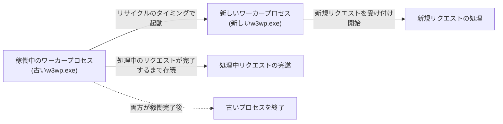

## はじめに

- **この記事で得られること**: [IISとASP.NETの仕組み](/articles/iis-fundamentals-guide)で扱った、アプリケーションプールとワーカープロセス(`w3wp.exe`)という基礎知識を前提に、アプリケーションプールが定期的にワーカープロセスを再起動する**リサイクル**という仕組みと、その裏側にある設計思想を体系的に理解します。
- **対象読者**: IISマネージャーで「定期的な間隔でのリサイクル」という設定を見たことはあるが、なぜこの機能が存在するのか、そして再起動中に届いたリクエストがどうなるのかを説明できない方を想定しています。
- **読むのにかかる想定時間**: 約15分

この記事は[『上位1%』シリーズ 全記事ガイド](/sitemap)の一部、[Windows Server運用シリーズ](/sitemap#シリーズ一覧)の11本目です。

## 前提知識

- **アプリケーションプールとワーカープロセス**: [IISとASP.NETの仕組み](/articles/iis-fundamentals-guide)で扱った、アプリケーションプールがプロセスレベルの分離単位であり、ワーカープロセス(`w3wp.exe`)が実際にコードを実行するという役割分担を前提とします。

## 全体像をつかむ

## 基礎から徹底解説

### リサイクルとは何か:ワーカープロセスの計画的な再起動

**リサイクル**は、IISのアプリケーションプールに設定できる、**ワーカープロセスを計画的に再起動する**機能です。IISマネージャーの「リサイクル条件」では、次のような条件を設定できます。

| 条件 | 内容 |
|---|---|
| **定期的な間隔** | 既定では1740分(29時間)ごとに再起動します。 |
| **特定の時刻** | 深夜など、利用者が少ない時間帯を指定して再起動します。 |
| **メモリ使用量の上限** | ワーカープロセスの仮想メモリまたは専用メモリが、指定した値を超えたら再起動します。 |
| **リクエスト数の上限** | 処理したリクエストの累計が、指定した数を超えたら再起動します。 |

### なぜ「動いているものを、あえて定期的に止める」のか

一見すると、正常に動作しているプロセスを、あえて定期的に再起動するというのは奇妙に思えます。**この設計の背景にあるのは、「長時間稼働し続けるプロセスには、メモリリークやリソースの断片化が、時間とともに蓄積していく」という、経験則に基づいた防御的な発想**です。アプリケーションのコード自体にメモリリークのバグが存在していても、リサイクルによって定期的にプロセスがまっさらな状態に戻ることで、**そのバグが実際にサーバーダウンを引き起こすまでに蓄積する時間を、根本原因を修正しないまま、先延ばしにする**ことができます。

## プロが見ている視点(上位1%の理解)

### オーバーラップ・リサイクル:リクエストを1つも取りこぼさない切り替え

リサイクルにおける最大の懸念は、「プロセスを再起動している瞬間に届いたリクエストは、どうなってしまうのか」という点です。IISは、この懸念に対して**オーバーラップ・リサイクル**(既定で有効)という仕組みで応えています。**リサイクルのタイミングが来ると、IISは古いワーカープロセスをすぐには終了させません。まず新しいワーカープロセスを起動し、これ以降の新規リクエストは、すべて新しいプロセスへ振り分けます。古いプロセスは、その時点で処理中だったリクエストをすべて完遂させてから、初めて終了します。** この設計により、リサイクルのタイミングで届いたリクエストが、瞬断によって失敗するという事態を回避しています。

### メモリ使用量によるリサイクルは、根本原因の解決ではなく「延命措置」

メモリ使用量を基準にしたリサイクル設定は、実務で頻繁に使われますが、**これはメモリリークというバグそのものを修正しているわけではなく、症状を一時的に抑え込む延命措置にすぎない**、という理解が重要です。メモリ使用量の上限に頻繁に到達し、リサイクルが異常な頻度で発生している場合、それは「リサイクル設定が正しく機能している証拠」ではなく、**「アプリケーションコード側に、対処すべきメモリリークが存在することを示す、重要な兆候」として扱うべきです。** 実務でのトラブルシューティングでは、リサイクルの頻度が急に上昇していないかを、監視すべき指標の1つとして押さえておく必要があります。

## よくある誤解・つまずきポイント

- **誤解1: 「リサイクルが発生すると、その瞬間に処理中のリクエストがすべて失敗する」**
  既定で有効なオーバーラップ・リサイクルにより、処理中のリクエストは、古いプロセスが完遂させてから終了するため、失敗しません。
- **誤解2: 「メモリ使用量によるリサイクル設定を強化すれば、メモリリークの問題は解決する」**
  リサイクルは症状を一時的に抑える延命措置であり、根本原因であるメモリリーク自体は修正されていません。
- **誤解3: 「リサイクルは、アプリケーションに問題がある場合にのみ発生する、異常な現象である」**
  定期的な間隔でのリサイクルは、既定で有効になっている、計画的で正常な動作です。

## 障害・トラブルシューティングの視点

1. **リサイクルの頻度が異常に高い**: メモリ使用量を基準にしたリサイクル設定が、頻繁に上限へ到達していないかを確認し、アプリケーションコード側のメモリリークを疑います。
2. **リサイクルのタイミングで、一部のリクエストが失敗する**: オーバーラップ・リサイクルが無効化されていないか、IISマネージャーの設定を確認します。
3. **特定の時刻にサイトへのアクセスが一時的に遅くなる**: その時刻に、定期的なリサイクルが設定されていないかを確認します。新旧2つのワーカープロセスが一時的に同時稼働するため、メモリ使用量が一時的に増加します。

## まとめ

- リサイクルは、IISのアプリケーションプールが、ワーカープロセスを計画的に再起動する機能です。
- 長時間稼働によるメモリリークやリソースの蓄積への防御として、定期的な再起動が既定で組み込まれています。
- オーバーラップ・リサイクルにより、リサイクルのタイミングで届いたリクエストも、取りこぼされることなく処理されます。
- メモリ使用量によるリサイクルは、根本原因の解決ではなく、症状を一時的に抑える延命措置です。

**今日から意識すべきこと**
1. リサイクルの頻度を監視項目に加え、急な上昇をメモリリークの兆候として捉えましょう。
2. リサイクルを「異常」ではなく「計画的な防御機構」として理解し、必要以上に無効化しないようにしましょう。

## 参考文献

- [Application Pools <applicationPools> | Microsoft Learn](https://learn.microsoft.com/en-us/iis/configuration/system.applicationhost/applicationpools/)
