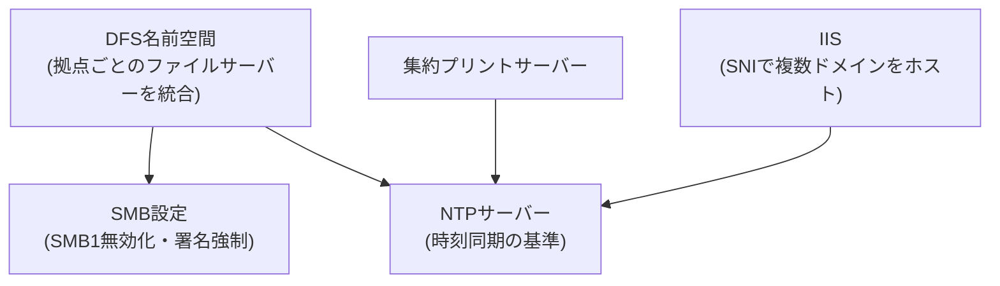

## はじめに

- **この記事で得られること**: ここまでのハンズオンで、1つずつ個別に習得してきた技術(DFS名前空間とレプリケーションによる複数拠点のファイルサーバー統合、IISのSNIによる複数ドメインのホスティング、SMB1無効化によるセキュリティ強化、アプリケーションプールのリサイクル、プリントスプーラーの運用、NTPによる時刻同期)を、**1つの架空企業のWindows Server基盤へ、自分の力で統合する**、Windows Server学科の卒業制作です。これまでの記事が「手順をなぞって、1つの技術を確実に身につける」ことを目的としていたのに対し、この記事は**要件だけを提示し、どの技術を、どう組み合わせるかを、自分で設計する**という、実務そのものに近い形式を取ります。
- **対象読者**: Windows Server学科の3年生・4年生・大学院の内容を一通り終え、個々のハンズオンは実施できるが、それらを組み合わせて1つのWindows Server基盤を設計した経験がない方を想定しています。
- **読むのにかかる想定時間**: 設計・構築・文書化を含めて、数日〜1週間程度を想定しています(1回のハンズオンとしては最も重量級です)。

この記事は[『上位1%』シリーズ 全記事ガイド](/sitemap)の一部です。[Windows Server学科の全カリキュラム](/university#windows-server学科)の、卒業制作にあたる位置づけです。

## 前提知識

このハンズオンは、新しい技術を教えるものではありません。**以下の、すでに実施済みのハンズオンで習得した技術を、組み合わせて使います。**

- [DFS名前空間とDFSレプリケーションで複数ファイルサーバーを統合し、自動フェイルオーバーを体験するハンズオン](/articles/windows-server-dfs-handson-guide)
- [IISでSNIを使い、1つのIPアドレスで複数ドメインのTLS証明書を運用するハンズオン](/articles/windows-server-iis-sni-handson-guide)
- [IISのアプリケーションプールのリサイクルを『上位1%』の視点で理解する](/articles/windows-server-app-pool-recycling-guide)
- [プリントサーバーとスプーラーの仕組みを『上位1%』の視点で理解する](/articles/windows-server-print-spooler-guide)
- [SMB1の危険性を自分の目で確認し、プロトコルの無効化と署名の強制で防御するハンズオン](/articles/windows-server-smb1-hardening-handson-guide)
- [Windows ServerでNTPサーバーを構築する際の設定値を『上位1%』の視点で理解する](/articles/windows-ntp-server-guide)

## 課題設定:架空企業のWindows Server基盤

**あなたは、架空の製造業企業「KoiKoi Manufacturing」のインフラエンジニアです。この会社は、複数の拠点にそれぞれ独立したファイルサーバー・プリントサーバーを持ち、社内向けのWebアプリケーションも複数のドメイン名で運用しています。老朽化した基盤を一新するにあたり、あなたに与えられた課題は、次の要件をすべて満たす、Windows Server基盤を、自分の手で構築することです。**

### 要件1: 拠点ごとに分散したファイルサーバーを、1つの名前空間に統合する

**複数拠点にそれぞれ独立して存在するファイルサーバーを、ユーザーから見て1つの経路でアクセスできるように統合してください。** 1拠点のサーバーに障害が発生しても、自動的に別の拠点のサーバーへ切り替わる仕組みも組み込んでください。

### 要件2: 複数のドメイン名を持つWebアプリケーションを、1つのIISサーバーに集約する

**これまで個別のサーバーで運用していた複数の社内向けWebアプリケーションを、それぞれ独自のドメイン名とTLS証明書を維持したまま、1台のIISサーバーに集約してください。**

### 要件3: 旧式のSMBプロトコルによるリスクを排除する

**ファイルサーバー群が、旧式で危険性の高いSMBプロトコルのバージョンを受け付けてしまわないよう、設定を見直してください。** 署名の強制など、追加のセキュリティ強化もあわせて検討してください。

### 要件4: Webアプリケーションの安定稼働のための運用設計を行う

**長時間稼働によるメモリリークや、ハングしたプロセスが、Webアプリケーション全体の障害につながらないよう、予防的な運用の仕組みを組み込んでください。**

### 要件5: 複数拠点のプリントサービスを集約する

**各拠点に個別に存在していたプリントサーバーを集約し、障害発生時にスプーラーのどの部分が原因かを迅速に切り分けられる体制を整えてください。**

### 要件6: すべてのサーバー間の時刻のずれを防ぐ

**ファイルサーバーの認証や、証明書の有効期限の検証など、時刻のずれが思わぬ障害を引き起こすリスクに備え、すべてのサーバーで正確な時刻同期が行われる仕組みを構築してください。**

## 成果物の要件:ポートフォリオとしてまとめる

**このハンズオンの最終的な成果物は、実際に動いた画面のスクリーンショットだけではありません。** GitHubなどのリポジトリに、次の内容を含む形でまとめてください。

- **README.md**: このシナリオの概要、あなたが採用したWindows Server基盤の全体像(mermaidなどの図を含む)
- **設計判断の記録**: 「なぜその構成・設定値を選んだのか」という、判断の理由。特に、可用性とセキュリティのトレードオフが発生した箇所について
- **実施手順**: 実際に実行したPowerShellコマンドや、設定変更の記録
- **振り返り**: 実施してみて分かった課題、実際の実務であれば追加で検討すべき点(クラウドへの段階的移行、監視体制の構築など)

**この成果物こそが、転職活動やポートフォリオとして提示できる、具体的な実績になります。** 単に「DFSのハンズオンをやりました」と説明するよりも、「複数拠点が混在する現実的な制約の中で、複数の技術を組み合わせて設計し、可用性とセキュリティのトレードオフを言語化できる」ことを示せる方が、はるかに説得力があります。

## プロが見ている視点(上位1%の理解)

### 「手順をなぞる力」と「要件から設計する力」は、まったく別のスキルである

これまでのハンズオンは、いずれも「Step 1、Step 2……」という、決められた手順をなぞる形式でした。**しかし、実際の実務で評価されるのは、手順書通りに作業を実行する力ではなく、与えられた要件(この記事でいう「要件1〜6」)から、どの技術を、どう組み合わせるべきかを、自分で設計する力です。** この2つは、似ているようでまったく別のスキルです。個々のハンズオンをすべて完了していても、それらを組み合わせて1つの一貫したWindows Server基盤を設計した経験がなければ、実務での即戦力にはなりません。この卒業制作は、その橋渡しを行うための、意図的な設計になっています。

### なぜ「複数拠点の統合」という設定なのか

このハンズオンが、単発の技術デモではなく、あえて「複数拠点にバラバラに存在するサーバー群を、1つの基盤へ統合する」という、現実的なプロジェクトを模した設定にしているのには理由があります。**実務のWindows Server基盤刷新の多くは、単一サーバーの構築だけでは完結せず、可用性・セキュリティ・運用性という、複数の軸を同時に満たしながら、既存の分散した環境を整理する必要があります。** DFSの構築方法だけを知っていても、その先にあるセキュリティ強化・運用設計・時刻同期までを見通せなければ、実際のプロジェクトでは通用しません。この卒業制作を通じて、個々の技術の知識を、**分散した環境全体を見通す設計力**へと昇華させることが、最終的な狙いです。

## よくある誤解・つまずきポイント

- **誤解1: 「このハンズオンは、決められた1つの正解の構成が存在する」**
  このハンズオンには、唯一の正解はありません。要件を満たす設計であれば、複数の妥当なアプローチが存在します。README.mdに、あなたが選んだ設計とその理由を記録することが重要です。
- **誤解2: 「成果物は、動作した証拠のスクリーンショットだけで十分である」**
  スクリーンショットは重要ですが、それだけでは不十分です。設計判断の理由を言語化できることが、このハンズオンの本当の価値です。
- **誤解3: 「個々のハンズオンをすべて完了していれば、このハンズオンも簡単に終わる」**
  個々の技術を知っていることと、それらを1つの一貫した設計へ統合することの間には、大きな距離があります。多くの時間を要することを想定しておいてください。

## 障害・トラブルシューティングの視点

このハンズオンは、個々の技術的なトラブルシューティングよりも、**設計上の手戻り**が主な課題になります。

1. **要件を満たしているつもりが、後から矛盾に気づく**: 実装を始める前に、README.mdの設計部分だけを先に書き上げ、要件1〜6のすべてを満たせているかを、文章の段階で確認してください。
2. **個々のハンズオンの手順を忘れてしまっている**: 各要件に対応する前提記事のリンクを、遠慮なく読み返してください。この卒業制作は、暗記力ではなく設計力を試すものです。
3. **どこまで作り込めばよいか分からない**: 「転職活動で、初対面の面接官にこのREADME.mdを見せて、設計判断を説明できるか」を、完成度の目安にしてください。

## まとめ

- この卒業制作は、Windows Server学科でこれまで個別に習得した技術を、1つの架空企業のWindows Server基盤へ統合する、総合演習です。
- 求められているのは、手順をなぞる力ではなく、要件から自分で設計する力です。
- 成果物は、動作した証拠だけでなく、設計判断の理由を言語化した文書として、ポートフォリオにまとめてください。

**今日から意識すべきこと**
1. 個々のハンズオンを学ぶときも、「これは、将来どんな要件の中で使うことになるか」を意識する習慣をつけましょう。
2. 技術的な成果物だけでなく、可用性とセキュリティのトレードオフを言語化する習慣を、日々の業務でも意識しましょう。

## 参考文献

- [Windows Server学科の全カリキュラム](/university#windows-server学科)
