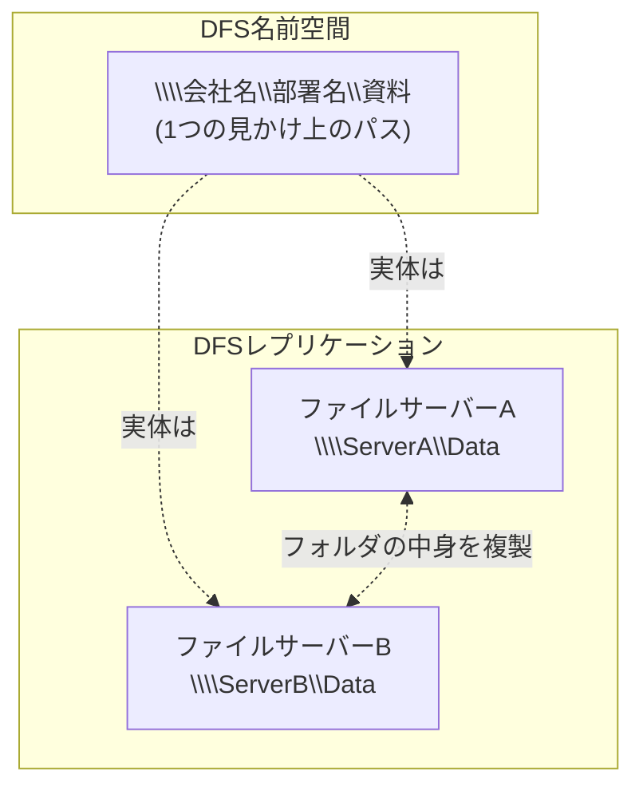

## はじめに

- **この記事で得られること**: [Windows ServerのSMB共有を『上位1%』の視点で理解する](/articles/smb-file-sharing-guide)で扱った、通常の共有フォルダの延長線上にある**DFS**(Distributed File System)について、「複数サーバーの共有フォルダを1つのパスにまとめる**名前空間(Namespace)**」と、「フォルダの中身をサーバー間で複製する**レプリケーション(Replication)**」という、独立した2つの機能の組み合わせであることを体系的に理解します。
- **対象読者**: `\\会社名\部署名\資料`のような、実サーバー名を含まないパスでファイルサーバーへアクセスした経験はあるが、その裏側の仕組みを説明できない方を想定しています。
- **読むのにかかる想定時間**: 約16分

この記事は[『上位1%』シリーズ 全記事ガイド](/sitemap)の一部、[Windows Server運用シリーズ](/sitemap#シリーズ一覧)の10本目です。

## 前提知識

- **SMB共有とUNCパス**: [Windows ServerのSMB共有](/articles/smb-file-sharing-guide)で扱った、`\\サーバー名\共有名`という形式のパスを前提とします。

## 全体像をつかむ

## 基礎から徹底解説

### DFS名前空間:複数の共有フォルダを、1つのパスの下にまとめる

**DFS名前空間**は、実際には複数の異なるサーバー・異なる共有フォルダに分散しているデータを、利用者から見て**1つの、統一されたパス**として見せる機能です。`\\会社名\部署名\資料`のようなパスへアクセスすると、DFS名前空間サーバーが、その裏側で実際にデータを持っているサーバー(`\\ServerA\Data`など)へ、利用者の代わりに接続先を解決します。**利用者は、実際にどのサーバーがデータを持っているかを、意識する必要がなくなります。** サーバーの統廃合でデータの実体が別のサーバーへ移動しても、DFS名前空間側の設定を変更するだけで、利用者が使い慣れたパス自体は変更せずに済みます。

### DFSレプリケーション:フォルダの中身を、サーバー間で複製する

**DFSレプリケーション**(DFS-R)は、DFS名前空間とは独立した、**別の機能**です。複数のサーバー間で、指定したフォルダの中身を、双方向に同期・複製し続けます。**DFS名前空間が「見せ方」を統一する機能であるのに対し、DFSレプリケーションは「実体のデータそのもの」を複数拠点に複製する機能**です。拠点間の回線が細い環境で、各拠点のファイルサーバーに同じデータのコピーを持たせ、拠点内のアクセスは拠点内のサーバーで完結させる、という構成でよく使われます。

## プロが見ている視点(上位1%の理解)

### 「DFS」という1つの名前が、2つの独立した機能を指しているという罠

**DFS名前空間とDFSレプリケーションは、それぞれ単独でも使えます。** 名前空間だけを使い、実体のデータは1台のサーバーにしか置かないという構成も、レプリケーションだけを使い、利用者は個々のサーバー名を直接指定してアクセスするという構成も、どちらも成立します。**「DFSを導入した」という会話をするとき、名前空間の話をしているのか、レプリケーションの話をしているのか、あるいは両方を組み合わせた構成の話をしているのかを、常に明確に区別する必要があります。** この区別を怠ると、「DFSを構築したのに、データが複製されていない」(実際には名前空間だけを構築していた)、あるいは「DFSでデータは複製されているのに、パスが統一されていない」(実際にはレプリケーションだけを構築していた)、という、実務でありがちな認識のズレが生まれます。

### レプリケーションを組み合わせる際の、更新の衝突という注意点

名前空間とレプリケーションを組み合わせ、複数拠点の同じ共有フォルダへ、同時に別々の利用者が書き込む構成を取ると、**同じファイルが、ほぼ同時に異なる拠点で更新される「更新の衝突」が発生する可能性があります。** DFSレプリケーションは、こうした衝突が起きた場合、**最後に更新されたバージョンを正として残し、競合した側のファイルを、`DfsrPrivate\ConflictAndDeleted`という隠しフォルダへ自動的に退避させる**、という仕組みで対応します。この挙動を知らないと、「保存したはずのファイルの変更が、いつの間にか消えている」という、原因の分かりにくいトラブルに遭遇することになります。

## よくある誤解・つまずきポイント

- **誤解1: 「DFSを導入すれば、自動的にファイルがサーバー間で複製される」**
  DFS名前空間はパスを統一する機能であり、複製自体はDFSレプリケーションという、別の独立した機能が担います。
- **誤解2: 「DFS名前空間とDFSレプリケーションは、必ずセットで使わなければならない」**
  どちらか一方だけを単独で使う構成も、実務では一般的です。
- **誤解3: 「複数拠点で同じファイルを同時に編集しても、DFSレプリケーションが自動的に内容をマージしてくれる」**
  DFSレプリケーションは内容のマージは行わず、競合時は最後の更新を正とし、競合した側を隔離フォルダへ退避させます。

## 障害・トラブルシューティングの視点

1. **DFS名前空間経由でアクセスできない**: DFS名前空間サーバー自体が稼働しているか、名前空間の設定でターゲットサーバーが正しく登録されているかを確認します。
2. **データが複製されていない**: DFS名前空間だけが構築されており、DFSレプリケーションが別途構成されていない可能性を確認します。
3. **保存したファイルの変更が消えている**: `DfsrPrivate\ConflictAndDeleted`フォルダに、競合により退避されたファイルが存在しないかを確認します。

## まとめ

- DFS名前空間は、複数サーバーの共有フォルダを1つの統一されたパスに見せる機能です。
- DFSレプリケーションは、フォルダの中身をサーバー間で複製する、名前空間とは独立した別の機能です。
- 複数拠点での同時編集は、更新の衝突を引き起こす可能性があり、DFSレプリケーションは競合したファイルを隠しフォルダへ自動的に退避させます。

**今日から意識すべきこと**
1. 「DFS」という言葉が出てきたら、名前空間の話か、レプリケーションの話かを、常に明確に区別しましょう。
2. 複数拠点での同時編集が想定される場合は、更新の衝突と自動退避の挙動を、事前に関係者へ共有しておきましょう。

## 参考文献

- [DFS Namespaces and DFS Replication Overview | Microsoft Learn](https://learn.microsoft.com/en-us/windows-server/storage/dfs-namespaces/dfs-overview)
