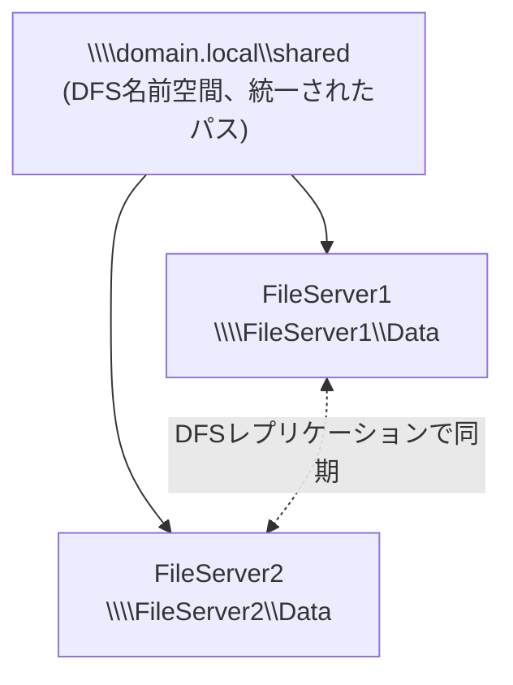

## はじめに

- **この記事で得られること**: [DFS名前空間とDFSレプリケーションの仕組み](/articles/windows-server-dfs-guide)で学んだ内容を、実際に2台のファイルサーバーを使って構築し、片方のサーバーを停止させても、利用者がまったく同じパスへアクセスし続けられる**自動フェイルオーバー**を、自分の目で確認します。
- **対象読者**: [DFS名前空間とDFSレプリケーションの仕組み](/articles/windows-server-dfs-guide)をすでに読み、ADドメインに参加済みの複数のWindows Serverを操作できる環境を持つ方を想定しています。
- **読むのにかかる想定時間**: 約40分

この記事は[『上位1%』シリーズ 全記事ガイド](/sitemap)の一部です。

## 前提知識

- **DFS名前空間とDFSレプリケーションの役割分担**: [DFS名前空間とDFSレプリケーションの仕組み](/articles/windows-server-dfs-guide)を前提とします。
- **ADドメインへの参加**: このハンズオンでは、ドメインベースの名前空間を構築するため、両方のファイルサーバーが同じADドメインに参加済みであることを前提とします。

## 全体像をつかむ



## ハンズオン手順

### Step 1: 2台のファイルサーバーに共有フォルダを用意する

`FileServer1`と`FileServer2`の両方に、同じ名前の共有フォルダを作成します。

```powershell
New-Item -Path "C:\Data" -ItemType Directory
New-SmbShare -Name "Data" -Path "C:\Data" -FullAccess "Everyone"
```

動作確認用に、`FileServer1`側にだけ、テスト用のファイルを1つ作成しておきます。

```powershell
"Hello from FileServer1" | Out-File C:\Data\test.txt
```

### Step 2: DFS名前空間をインストールし、名前空間を作成する

いずれかのサーバー(またはドメインコントローラー)で、DFS名前空間の機能をインストールします。

```powershell
Install-WindowsFeature FS-DFS-Namespace -IncludeManagementTools
```

ドメインベースの名前空間を新規作成します。

```powershell
New-DfsnRoot -TargetPath "\\domain.local\shared" -Type DomainV2 -Path "\\domain.local\shared"
```

作成した名前空間に、2台のファイルサーバーの共有フォルダを、それぞれフォルダターゲットとして追加します。

```powershell
New-DfsnFolder -Path "\\domain.local\shared\docs" -TargetPath "\\FileServer1\Data"
New-DfsnFolderTarget -Path "\\domain.local\shared\docs" -TargetPath "\\FileServer2\Data"
```

`\\domain.local\shared\docs`へアクセスし、`test.txt`が見えることを確認します。**この時点では、実際にアクセスしているのは`FileServer1`側のデータですが、利用者はそれを意識しません。**

### Step 3: DFSレプリケーションで、2つのフォルダの中身を同期する

DFSレプリケーションの機能をインストールし、レプリケーショングループを作成します。

```powershell
Install-WindowsFeature FS-DFS-Replication -IncludeManagementTools
New-DfsReplicationGroup -GroupName "DocsReplication"
New-DfsReplicatedFolder -GroupName "DocsReplication" -FolderName "Data"
Add-DfsrMember -GroupName "DocsReplication" -ComputerName "FileServer1","FileServer2"
Set-DfsrMembership -GroupName "DocsReplication" -FolderName "Data" -ContentPath "C:\Data" -ComputerName "FileServer1" -PrimaryMember $true
Set-DfsrMembership -GroupName "DocsReplication" -FolderName "Data" -ContentPath "C:\Data" -ComputerName "FileServer2" -PrimaryMember $false
Add-DfsrConnection -GroupName "DocsReplication" -SourceComputerName "FileServer1" -DestinationComputerName "FileServer2"
```

数分待ってから、`FileServer2`側の`C:\Data`を確認します。

```powershell
Get-ChildItem C:\Data
```

**`test.txt`が、`FileServer2`側にも複製されているはずです。** これで、名前空間経由でどちらのサーバーへ振り分けられても、同じデータが見える状態が整いました。

### Step 4: FileServer1を意図的に停止させ、自動フェイルオーバーを確認する

まず、名前空間経由で`test.txt`にアクセスできることを再確認します。

```powershell
Get-Content \\domain.local\shared\docs\test.txt
```

続いて、`FileServer1`のサーバーサービス(またはネットワークインターフェイス)を停止し、到達不能な状態を作ります。

```powershell
# FileServer1上で実行
Stop-Service LanmanServer -Force
```

`FileServer1`が到達不能になった状態で、再度、**まったく同じパス**へアクセスします。

```powershell
Get-Content \\domain.local\shared\docs\test.txt
```

**多少の遅延はあるものの、エラーにならず、`FileServer2`側から同じ内容のファイルが返ってくるはずです。** クライアント側は、パスを変更することも、どちらのサーバーが生きているかを意識することも一切なく、DFS名前空間が裏側で自動的に、生きている方のターゲットへ接続先を切り替えています。

## プロが見ている視点(上位1%の理解)

### フェイルオーバーを支えているのは「名前空間」であり、「レプリケーション」ではない

Step 4で体験した自動フェイルオーバーは、**DFS名前空間が、複数のフォルダターゲットの中から、到達可能なものを選んで接続先を切り替えている**という機能によるものです。**DFSレプリケーションは、あくまで両方のターゲットの中身を同じ状態に保ち続けているだけであり、フェイルオーバーそのものを実現しているわけではありません。** [DFS名前空間とDFSレプリケーションの仕組み](/articles/windows-server-dfs-guide)で扱った「2つの独立した機能」という理解が、ここで実際の挙動として区別できます。名前空間だけを構築し、レプリケーションを構築し忘れていた場合、フェイルオーバー自体は発生しますが、**切り替わった先のサーバーには、最新のデータが存在しない**という、深刻な事故につながります。

### レプリケーションの遅延は、フェイルオーバー時の一貫性に直結する

DFSレプリケーションは、リアルタイムの同期ではなく、変更を検知してから複製が完了するまでに、**一定の遅延**が存在します。フェイルオーバーが発生するタイミングによっては、**直前に片方のサーバーへ書き込まれたばかりの変更が、まだもう一方へ複製されておらず、フェイルオーバー後に古いデータしか見えない**という状況が起こり得ます。実務では、この遅延を許容できる用途(ドキュメント共有など)と、許容できない用途(リアルタイム性が求められるデータ)を区別し、後者にはDFSレプリケーションではなく、別の高可用性の仕組みを検討する必要があります。

## よくある誤解・つまずきポイント

- **誤解1: 「DFSレプリケーションを構築すれば、それだけで自動フェイルオーバーが実現する」**
  自動フェイルオーバーはDFS名前空間の機能であり、レプリケーションは中身を同期させているだけです。
- **誤解2: 「DFS名前空間だけを構築すれば、高可用性の構成として十分である」**
  名前空間だけでは、フェイルオーバー先に最新のデータが存在する保証がなく、レプリケーションと組み合わせて初めて実用的になります。
- **誤解3: 「DFSレプリケーションはリアルタイムに同期するため、フェイルオーバー時にデータが古くなることはない」**
  レプリケーションには一定の遅延があり、タイミングによってはフェイルオーバー後に古いデータしか見えないことがあります。

## 障害・トラブルシューティングの視点

1. **フェイルオーバーが発生せず、サーバー停止中はアクセスできない**: 両方のフォルダターゲットが、名前空間に正しく登録されているかを`Get-DfsnFolderTarget`で確認します。
2. **フェイルオーバー後、データが古い**: DFSレプリケーションの複製が完了する前に、フェイルオーバーが発生した可能性があります。レプリケーションのバックログを`Get-DfsrBacklog`で確認します。
3. **名前空間にアクセスできない**: ドメインコントローラーとの通信が正常か、`New-DfsnRoot`で指定したパスが正しいかを確認します。

## まとめ

- DFS名前空間は、複数のフォルダターゲットの中から到達可能なものへ、自動的に接続先を切り替えるフェイルオーバー機能を持っています。
- DFSレプリケーションは、フェイルオーバー先に正しいデータがあることを保証するための、独立した同期の仕組みです。
- 自動フェイルオーバーを実用的にするには、名前空間とレプリケーションの両方を組み合わせる必要があります。
- レプリケーションには一定の遅延があり、タイミング次第ではフェイルオーバー直後に古いデータが見える可能性があります。

**今日から意識すべきこと**
1. DFS名前空間を構築する際は、必ずDFSレプリケーションと組み合わせ、フェイルオーバー先のデータを最新に保ちましょう。
2. リアルタイム性が求められるデータには、DFSレプリケーションの遅延が許容できるかを、事前に検討しましょう。

## 参考文献

- [DFS Namespaces and DFS Replication Overview | Microsoft Learn](https://learn.microsoft.com/en-us/windows-server/storage/dfs-namespaces/dfs-overview)
- [New-DfsnRoot (DFSN) | Microsoft Learn](https://learn.microsoft.com/en-us/powershell/module/dfsn/new-dfsnroot)
