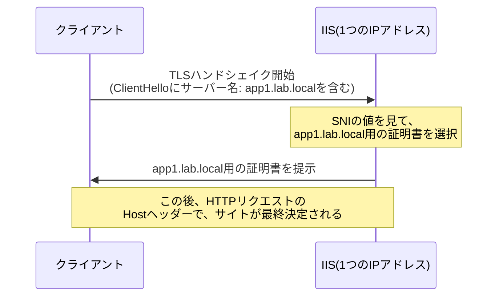

## はじめに

- **この記事で得られること**: [IISとASP.NETの仕組み](/articles/iis-fundamentals-guide)で扱ったバインド設定を発展させ、**1つのIPアドレスだけで、複数の異なるドメインに、それぞれ専用のTLS証明書でHTTPSを提供する**、SNI(Server Name Indication)という仕組みを、実際に2つのサイトを構築して体験します。
- **対象読者**: 1つのサーバーで、複数の顧客・複数のブランドサイトをHTTPSで運用する必要があるが、IPアドレスをドメインの数だけ用意するのは非現実的だと感じている方を想定しています。
- **読むのにかかる想定時間**: 約35分

この記事は[『上位1%』シリーズ 全記事ガイド](/sitemap)の一部です。

## 前提知識

- **IISのバインド設定**: [IISとASP.NETの仕組み](/articles/iis-fundamentals-guide)で扱った、IPアドレス・ポート・ホスト名の組み合わせで、Webサイトへの振り分けが決まる仕組みを前提とします。

## 全体像をつかむ



## ハンズオン手順

### Step 1: 2つの自己署名証明書を作成する

PowerShellで、2つの異なるホスト名向けに、自己署名証明書を作成します。

```powershell
New-SelfSignedCertificate -DnsName "app1.lab.local" -CertStoreLocation "cert:\LocalMachine\My"
New-SelfSignedCertificate -DnsName "app2.lab.local" -CertStoreLocation "cert:\LocalMachine\My"
```

`certlm.msc`(ローカルコンピューター証明書ストア)で、それぞれの証明書の拇印(Thumbprint)を確認しておきます。

### Step 2: 2つのIISサイトを作成する

`app1.lab.local`用と`app2.lab.local`用の、2つの独立したWebサイトを作成します。

```powershell
New-Item "C:\inetpub\app1" -ItemType Directory
New-Item "C:\inetpub\app2" -ItemType Directory
"app1" | Out-File "C:\inetpub\app1\index.html"
"app2" | Out-File "C:\inetpub\app2\index.html"

Import-Module WebAdministration
New-Website -Name "App1Site" -PhysicalPath "C:\inetpub\app1" -Port 443 -HostHeader "app1.lab.local" -Ssl
New-Website -Name "App2Site" -PhysicalPath "C:\inetpub\app2" -Port 443 -HostHeader "app2.lab.local" -Ssl
```

### Step 3: SNIを有効にしたバインドを、それぞれの証明書に紐づける

**ここが、このハンズオンの核心です。** IISマネージャー(または`netsh`)で、それぞれのサイトのHTTPSバインドに、対応する証明書を割り当て、**「SNIを要求する」チェックボックスを有効に**します。

```powershell
$cert1 = Get-ChildItem Cert:\LocalMachine\My | Where-Object { $_.Subject -match "app1.lab.local" }
$cert2 = Get-ChildItem Cert:\LocalMachine\My | Where-Object { $_.Subject -match "app2.lab.local" }

netsh http add sslcert hostnameport=app1.lab.local:443 certhash=$($cert1.Thumbprint) certstorename=MY appid="{00000000-0000-0000-0000-000000000000}"
netsh http add sslcert hostnameport=app2.lab.local:443 certhash=$($cert2.Thumbprint) certstorename=MY appid="{00000000-0000-0000-0000-000000000000}"
```

**この`hostnameport`という指定こそが、SNI対応バインドの正体です。** 従来の(SNI非対応の)バインドが「IPアドレス:ポート」の組み合わせに対して1枚の証明書しか紐づけられなかったのに対し、`hostnameport`形式のバインドは、**同じ「IPアドレス:ポート」に対して、ホスト名ごとに異なる証明書を紐づける**ことができます。

### Step 4: 実際に異なる証明書が返ってくることを確認する

クライアント側から、`openssl s_client`の`-servername`オプションを使い、SNIで異なるホスト名を指定して接続します。

```bash
openssl s_client -connect <サーバーのIP>:443 -servername app1.lab.local
```

出力の`subject=`の行を確認し、`app1.lab.local`向けの証明書が返ってきていることを確認します。続けて、同じIPアドレス・同じポートへ、異なる`-servername`で接続します。

```bash
openssl s_client -connect <サーバーのIP>:443 -servername app2.lab.local
```

**まったく同じIPアドレス・ポートへの接続にもかかわらず、今度は`app2.lab.local`向けの、別の証明書が返ってくるはずです。** TLSハンドシェイクの、暗号化が始まる前の`ClientHello`メッセージに含まれるSNIフィールドだけを頼りに、サーバー側が返す証明書を動的に切り替えていることが、自分の目で確認できました。

## プロが見ている視点(上位1%の理解)

### SNIが解決した、TLSとHTTPの「順序」の矛盾

SNIが登場する以前、TLSには構造的な矛盾がありました。**HTTPのHostヘッダーによる、1つのIPアドレスでの複数サイトの振り分けという仕組みは、TLSによる暗号化が完了した後で初めて読み取れる情報です。しかし、サーバーがどの証明書を提示すべきかは、その暗号化(TLSハンドシェイク)を始める、まさにその瞬間に決める必要があります。** つまり、「どのサイト宛かを知るにはHTTPの中身を見る必要があるが、その中身を見るためのTLSを開始する時点では、まだどのサイト宛かが分からない」という、循環した問題がありました。SNIは、**TLSハンドシェイクの最初のメッセージであるClientHelloの中に、平文のまま(暗号化される前に)ホスト名を含める**ことで、この循環を断ち切っています。

### SNIには「非対応の古いクライアント」が存在するという現実

SNIは広く普及していますが、**極めて古いOS・古いブラウザ(Windows XP上のInternet Explorerなど)の中には、SNI自体に対応していないクライアントが存在します。** こうしたクライアントが接続してきた場合、サーバーはSNIの情報を受け取れないため、**そのIPアドレス・ポートに設定された「既定の証明書」(通常、最初に登録したバインドの証明書)を返すしかありません。** 結果として、意図しないドメインの証明書が提示され、クライアント側で証明書名の不一致という警告が表示されます。現代の実務でこの制約が問題になることはほとんどありませんが、**古いクライアントのサポートが必須の環境では、SNI依存の構成だけに頼れない**、という制約を理解しておく必要があります。

## よくある誤解・つまずきポイント

- **誤解1: 「1つのIPアドレスでは、1つのドメインにしかHTTPSを提供できない」**
  SNIを使えば、1つのIPアドレス・ポートの組み合わせに対して、ホスト名ごとに異なる証明書を紐づけられます。
- **誤解2: 「SNIは、HTTPのHostヘッダーと同じ情報を、別の場所で重複して送っているだけである」**
  SNIはTLSハンドシェイクの、暗号化開始前の段階で必要な情報であり、HTTPのHostヘッダーとは、必要とされるタイミングそのものが異なります。
- **誤解3: 「SNIに対応していないクライアントは、現代では実質的に存在しない」**
  極めて古いOS・ブラウザの組み合わせでは、依然としてSNI非対応のクライアントが存在し、既定の証明書が返される可能性があります。

## 障害・トラブルシューティングの視点

1. **意図しないドメインの証明書が返ってくる**: そのバインドが`hostnameport`形式(SNI対応)で正しく登録されているか、`netsh http show sslcert`で確認します。
2. **特定のクライアントだけ証明書エラーが出る**: そのクライアントがSNIに対応しているか(特に古いOS・ブラウザの場合)を確認します。
3. **証明書を更新したのに反映されない**: `netsh http delete sslcert`で古いバインドを削除してから、新しい証明書のThumbprintで再登録する必要があります。

## まとめ

- SNIは、TLSハンドシェイクの最初のメッセージに、暗号化前のホスト名を含めることで、1つのIPアドレスで複数ドメインの証明書を運用できるようにする仕組みです。
- `netsh http add sslcert`の`hostnameport`形式が、SNI対応バインドの実体です。
- SNIに対応していない極めて古いクライアントには、既定の証明書が返され、証明書名の不一致という警告が表示される可能性があります。

**今日から意識すべきこと**
1. 複数ドメインをHTTPSで運用する際は、IPアドレスを増やす前に、SNIでの証明書の使い分けを検討しましょう。
2. 古いクライアントのサポートが必要な環境では、SNI依存の構成の制約を事前に確認しましょう。

## 参考文献

- [Server Name Indication | RFC 6066](https://datatracker.ietf.org/doc/html/rfc6066)
- [netsh http Commands | Microsoft Learn](https://learn.microsoft.com/en-us/windows-server/networking/technologies/netsh/netsh-http)
