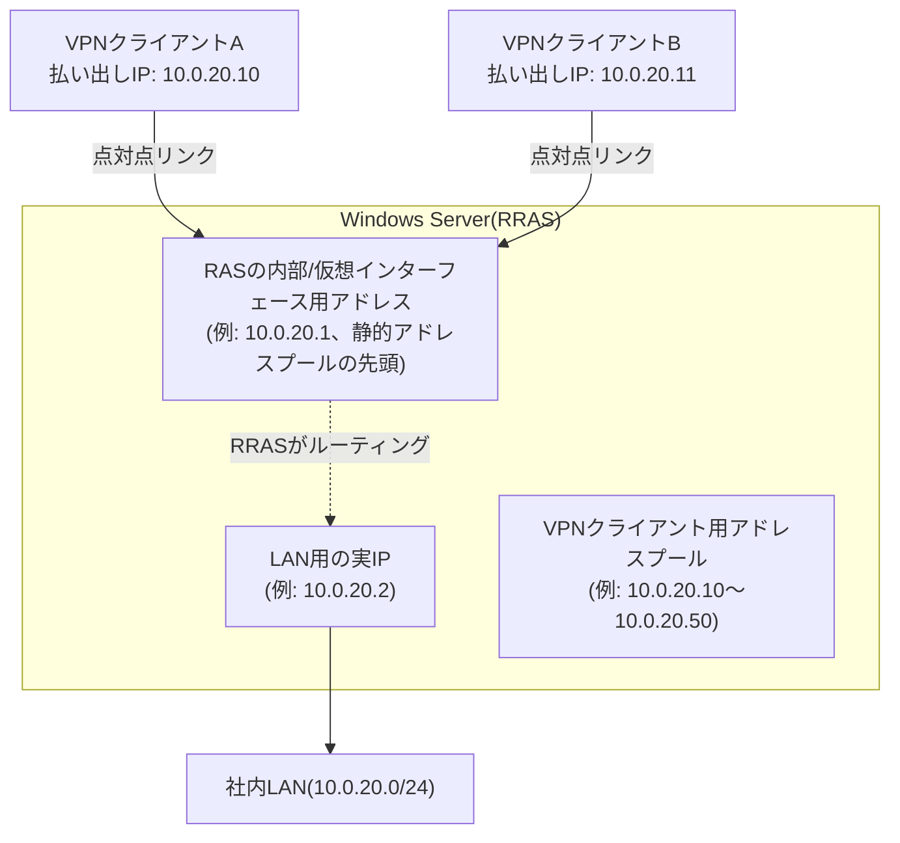
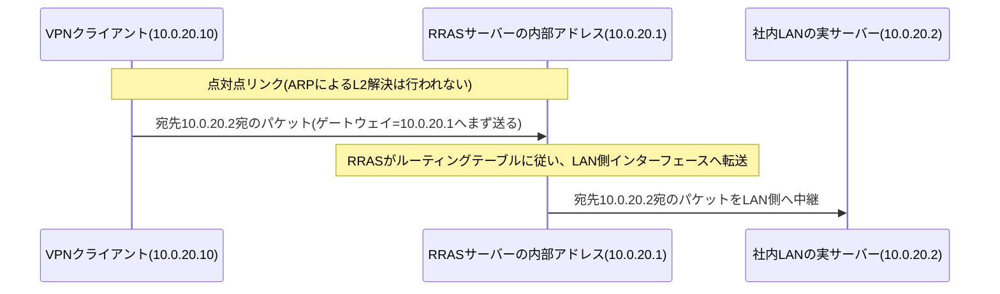
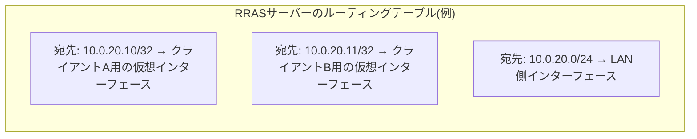

## はじめに

- **この記事で得られること**: Windows ServerのRRAS(ルーティングとリモートアクセス、Routing and Remote Access Service)でL2TP/IPsec VPNを構築した際に実際に起きているIPアドレス管理の中身——VPNクライアントにはどこからどうやってIPアドレスが払い出されるのか、サーバー自身は内部的にいくつのIPアドレスをどう使い分けているのか、そして「クライアントに払い出されたIPアドレスが社内LANと同じセグメントに見えるのに、なぜわざわざゲートウェイの指定が必要なのか」という、実際に構築するとほぼ必ずぶつかる疑問に、PPPというプロトコルの性質から答えます。
- **対象読者**: インフラエンジニアとして、Windows ServerでL2TP/IPsec VPNを構築・運用した経験があるか、これから構築しようとしているものの、クライアントに払い出されるIPアドレスの仕様やサーバー内部でのIPアドレスの扱いを体系的には説明できない方を想定しています。
- **読むのにかかる想定時間**: 約20分

この記事は[『上位1%』シリーズ 全記事ガイド](/sitemap)の一部です。

## 前提知識

- **RRAS(Routing and Remote Access Service)**: Windows Serverに標準で搭載されている、VPNサーバー機能とルーティング機能を提供する役割(ロール)です。L2TP/IPsecを含む複数のVPNプロトコルをサポートし、有効化するとサーバー自身がルーターとしても振る舞うようになります。
- **PPP(Point-to-Point Protocol)**: 2点間を直接つなぐリンクの上で、認証とIPアドレスの払い出しを行うプロトコルです。詳しい成り立ちは[電話回線とIPネットワークの違いを『上位1%』の視点で理解する](/articles/circuit-switching-ppp-guide)で扱っています。
- **デフォルトゲートウェイ**: 端末が、自分と異なるネットワーク宛のパケットを送る際に、最初の転送先として指定するIPアドレスです。

## 全体像をつかむ

### 一言で言うと

**RRASでL2TP/IPsec VPNを構築すると、サーバーは「LANに接続するための通常のIPアドレス」とは別に、「VPNクライアントとの点対点リンクの相手役を務める内部アドレス」をもう1つ持つことになり、この内部アドレスが、クライアント側の設定で言うところの「ゲートウェイ」の正体**です。

**クライアントの`ipconfig`に表示される「デフォルトゲートウェイ」は、実は社内LAN上の何か特定のルーター機器を指しているわけではなく、RRASサーバー自身が持つ、この内部アドレス(上図の10.0.20.1)を指しています。** なぜこのような構成になるのか、PPPというプロトコルの性質にまで立ち返って見ていきます。

## 基礎から徹底解説

### クライアントへのIPアドレス払い出し：静的アドレスプールとDHCPリレー

RRASがVPNクライアントにIPアドレスを払い出す方法には、大きく2種類あります。

| 方式 | 動作 | 特徴 |
|---|---|---|
| 静的アドレスプール | RRASの設定画面であらかじめ指定したIPアドレスの範囲(例: 10.0.20.10〜10.0.20.50)から、接続順に払い出す | 追加のDHCPサーバーへの依存がなく単純。範囲の管理・払い出し状況はRRAS自身が把握する |
| DHCPリレーエージェント | RRASが、社内LANに実在するDHCPサーバーへ、あたかも自分が仲介者であるかのようにDHCP要求を中継し、そこから払い出されたアドレスをクライアントに渡す | 社内LANの他の端末と同じDHCPサーバー・同じスコープ(アドレス範囲)を使えるため、アドレス管理の一元化がしやすい |

どちらの方式でも、最終的にクライアントのPPP仮想アダプタに設定されるのは、IPCP(IP Control Protocol)による払い出し結果です。前提知識で触れたPPPの性質上、**この時点でクライアントが得るIPアドレスは、あくまでその1本の点対点リンクの「片側」の住所**であり、社内LANの物理的なイーサネットセグメントに直接参加しているわけではありません。

### なぜ静的アドレスプールの先頭アドレスがサーバー側の住所になるのか

静的アドレスプールを使う構成では、多くの実装・バージョンにおいて、**指定した範囲の先頭のIPアドレスがRRASサーバー自身の内部インターフェース用に予約され、残りのアドレスが実際にクライアントへ払い出される**、という挙動になります(例えば10.0.20.1〜10.0.20.50を範囲に指定すると、10.0.20.1はサーバー自身が使い、10.0.20.2以降がクライアントに払い出されます)。

ここで重要なのは、**このサーバー側アドレス(10.0.20.1)は、接続してくるすべてのVPNクライアントに対して共通して使われる**という点です。RRASは、クライアントごとに個別の仮想PPPアダプタ(インターフェース)をその都度生成しますが、その「サーバー側の相手」としてIPCPネゴシエーションの中でクライアントに伝えるアドレスは、常にこの1つの内部アドレスです。クライアントAにもクライアントBにも、IPCPが伝える「相手(ピア)のアドレス」は同じ10.0.20.1になります。

複数のクライアントが同じ「相手のアドレス」を持っても矛盾しないのか

一見、複数のクライアントが同じ点対点リンクの「相手」を共有していると矛盾するように思えますが、これはPPPが**回線交換的な1対1のリンクをIPネットワーク上で個別に再現している**ことを踏まえると矛盾しません。L2TPのTunnel ID/Session IDによって、クライアントAとのリンク、クライアントBとのリンクは、それぞれ完全に独立した別個の仮想リンクとして扱われています。RRASサーバーから見れば、「10.0.20.1という自分のアドレスを使って、クライアントAとは専用リンクA、クライアントBとは専用リンクBをそれぞれ別々に維持している」状態であり、電話交換機が同じ代表番号で複数の通話を同時に捌いているのと同じ発想です。この歴史的背景は[電話回線とIPネットワークの違いを『上位1%』の視点で理解する](/articles/circuit-switching-ppp-guide)で扱っています。

### なぜ同一セグメントに見えるのにゲートウェイが必要なのか

ここが最大の疑問点です。クライアントに払い出されたIPアドレス(例: 10.0.20.10)と、サーバー側の内部アドレス(10.0.20.1)、さらには社内LANの実サーバーのIPアドレス(10.0.20.2)は、いずれも同じ`10.0.20.0/24`という1つのサブネットに属しているように見えます。**「同じセグメントなら、ゲートウェイなど指定せずに直接通信できるはずでは」という疑問は、通常のイーサネットLANの感覚では正しい疑問です。**

しかし、この前提が成り立つのは、**同一セグメント内の端末同士がARP(Address Resolution Protocol)でお互いのMACアドレスを解決し、L2的に直接フレームをやり取りできる場合に限られます。** VPNクライアントの仮想PPPアダプタは、**物理的にも論理的にも、社内LANのイーサネットセグメントには一切参加していません。** クライアントが持っているのは、あくまでVPNサーバーとの間の、たった1本の点対点リンクだけです。この点対点リンクの上では、そもそも「同じセグメントの中の別の端末」という概念自体が存在しません——リンクの向こう側にいる相手は、常にただ1つ(RRASサーバーの内部アドレス)だけだからです。

したがって、VPNクライアントが**IPアドレス上は同じサブネットに見える社内LANの他の端末(実サーバーの10.0.20.2など)と通信したい場合であっても、その通信は必ず一度、点対点リンクの向こう側にいる唯一の相手であるRRASサーバー(10.0.20.1)に送られ、そこからサーバーが改めて社内LAN側へルーティング(中継)する**、という経路をたどるほかありません。クライアントのOSに設定される「デフォルトゲートウェイ=10.0.20.1」は、まさにこの「点対点リンクの向こう側の、唯一の相手に、まず全部投げる」という動作を、通常のIPネットワークの用語である「ゲートウェイ」という形で表現したものです。

つまり、**IPアドレスの数字の並びだけを見れば同一サブネットに見えても、実際の通信の成立の仕方はルーティング(L3の中継)であり、イーサネットセグメント上の直接到達(L2)ではない**、というのが正確な理解です。L2TP/IPsecに限らず、リモートアクセスVPN全般で「クライアントが得るのは社内のアドレス体系に属するL3的なIPアドレスであり、L2隣接ではない」という一般論が成り立ちますが、この記事で見てきた通り、Windows Server RRASではそれが「アドレスプールの先頭アドレスを共有ゲートウェイとして使う」という具体的な実装の形で現れています。

### サーバー側の複数の仮想インターフェースとルーティングテーブル

RRASサーバーは、クライアントが接続してくるたびに、そのセッション専用の仮想PPPインターフェース(Windowsの実装では「WAN Miniport」を基にしたインターフェースインスタンス)を動的に生成します。サーバー内部のルーティングテーブルには、**接続中の各クライアントの払い出しIPアドレスごとに、対応する仮想インターフェースへのホストルート(そのIPアドレス1つだけに対する経路情報)が自動的に追加**されます。

このため、社内LAN側の端末からVPNクライアント宛に通信を返す際も、RRASサーバーが「宛先IPアドレスがどのクライアントの仮想インターフェースに対応するか」をこのホストルートで判断し、正しいセッションへ転送しています。**RRASを有効化する際に「IPv4ルーティングを有効にする」というチェックボックス(あるいは相当する設定)を入れ忘れると、VPN自体は接続できるのに社内LANの他の端末とは一切通信できない**、という状態に陥ります。これは前述のルーティングテーブルによる中継そのものが機能していないためで、実務でも頻出するつまずきポイントです。

## プロが見ている視点（上位1%の理解）

### 冗長化された構成での代表IPとの関係

今回のようにRRASを稼働させるサーバー自体が、可用性のために運用系・待機系の2台構成(あるいはそれ以上)で冗長化されている場合、クライアントからVPN接続する宛先(あるいはVPNの先にある社内アプリケーションの宛先)としては、個々の実サーバーのIPアドレスではなく、**代表IP(VIP)**が使われるのが一般的です。この代表IPが「実際にはどう実現されているのか(NAT変換なのか、IPアドレスをそのまま稼働系サーバーが持つ方式なのか)」という点は、RRAS固有の話ではなく、冗長化構成一般に共通する仕組みです。詳しくは[代表IP(VIP)とNICチーミングの仮想IPの仕組みを『上位1%』の視点で理解する](/articles/virtual-ip-guide)で扱っています。ここで重要なのは、**この記事で扱ったVPNクライアント用の内部アドレス(前述の10.0.20.1)と、冗長化構成における代表IPは、まったく別の目的を持つ、別々のIPアドレスである**という点です。前者は「VPNの点対点リンクの相手」、後者は「どちらの実サーバーが稼働中かをクライアントから意識させないための抽象化」であり、両方が同時に1台のサーバー(のNIC)に共存していても、それぞれ独立した役割を果たしています。

### DHCPリレーを使う場合の「ゲートウェイ」の扱い

静的アドレスプールではなくDHCPリレーエージェントを使う構成でも、ゲートウェイに関する結論は変わりません。DHCPリレーの場合、クライアントに払い出されるIPアドレス自体は社内の実DHCPサーバーが管理するスコープから払い出されますが、**そのスコープ設定でどのようなゲートウェイ(オプション3、Router)を配布する設定になっていても、RRAS経由のPPPリンクである以上、実際に機能するのはRRASサーバーの内部アドレスだけ**です。これは、DHCPスコープの設定がそのまま素直に使われる通常の有線LAN配下の端末とは異なる、VPN接続特有の注意点です。実務では、DHCPスコープ側のゲートウェイ設定と、実際にPPPが機能させる経路が食い違っていないかを意識する必要があります。

## よくある誤解・つまずきポイント

- **誤解1: 「VPNクライアントのIPアドレスが社内LANと同じサブネットなら、直接P2P的に通信できる」**
  VPNクライアントの仮想アダプタは社内LANのイーサネットセグメントに物理的にも論理的にも参加しておらず、通信は必ずRRASサーバーを経由したL3ルーティングによって成立します。サブネットの数字が同じに見えることと、実際にL2で直接到達できることは別の話です。
- **誤解2: 「複数のVPNクライアントが同じゲートウェイアドレスを持つのはおかしい」**
  静的アドレスプールを使う一般的な構成では、すべてのVPNクライアントが同じRRASサーバー内部アドレスをゲートウェイとして持ちます。これはPPPの点対点リンクがクライアントごとに独立して確立されているために矛盾なく成立しており、電話交換機が1つの代表番号で複数の通話を同時に処理するのと同じ発想です。
- **誤解3: 「VPN接続時に自動的に社内LANの他の端末とも通信できるようになる」**
  RRASでIPv4ルーティングが有効化されていなければ、VPN接続自体は成立してもLAN側への中継は行われません。VPNの接続確立とルーティングの有効化は別の設定項目です。

## 障害・トラブルシューティングの視点

RRAS特有のトラブルは、**「クライアントへのIPアドレス払い出しの問題か、サーバー側のルーティングの問題か」**を切り分けるのが基本です。

1. **VPN接続自体は成立するが、社内LANの端末と一切通信できない**: RRASのIPv4ルーティングが有効化されているか、ルーティングテーブルに社内LANへのルート(前述の`10.0.20.0/24 → LAN側インターフェース`に相当するもの)が存在するかを確認します。
2. **一部のクライアントだけIPアドレスが払い出されない**: 静的アドレスプールが枯渇していないか(同時接続数が想定を超えていないか)、DHCPリレー構成であれば中継先のDHCPサーバーのスコープが枯渇していないかを確認します。
3. **特定のクライアントからだけ、社内LANの特定の端末に届かない**: RRASサーバーのルーティングテーブルに、該当クライアントのホストルートが正しく登録されているか、社内LAN側のファイアウォール・ACLがVPNクライアント用のアドレス範囲(例: 10.0.20.10〜10.0.20.50)を許可しているかを確認します。
4. **DHCPリレー構成でIPアドレスが払い出されない**: RRASサーバーからリレー先のDHCPサーバーへの経路が生きているか、DHCPサーバー側でRRASサーバーからのリレー(DHCPリレーエージェント情報オプションを含む要求)を受け付ける設定になっているかを確認します。

### 予防策・恒久対策

- 静的アドレスプールの範囲は、想定される同時接続数に対して十分な余裕を持たせて設計する。
- ルーティングの有効化やホストルートの自動登録に依存する構成であることを踏まえ、VPN構築後は必ず「クライアント接続→社内LANの端末への到達」までを一連の手順として検証する。
- DHCPリレーを使う場合は、リレー先のDHCPサーバー側のスコープとゲートウェイ(オプション3)設定が、VPN経由の接続を前提に矛盾していないかを事前に確認する。

## まとめ

- RRASでL2TP/IPsec VPNを構築すると、サーバーはLAN用の実IPとは別に、VPNクライアントとの点対点リンクの相手役を務める内部アドレスを持ちます。
- 静的アドレスプールを使う構成では、多くの実装でプールの先頭アドレスがこの内部アドレスとして予約され、すべてのVPNクライアントに共通の「ゲートウェイ」として使われます。
- VPNクライアントのIPアドレスが社内LANと数字上は同じサブネットに見えても、実際の通信はL2の直接到達ではなくL3ルーティングによって成立しており、これが「同一セグメントなのになぜゲートウェイが必要か」という疑問への答えです。
- サーバー側は接続中のクライアントごとに専用の仮想インターフェースとホストルートを動的に管理しており、IPv4ルーティングの有効化を忘れると社内LANへの中継自体が機能しません。

**今日から意識すべきこと**
1. RRASのVPN構築で「なぜゲートウェイが要るのか」という疑問に出会ったら、PPPが点対点リンクでありARPによるL2到達が成立しないことを思い出しましょう。
2. VPN構築後は、接続確立の確認だけでなく、社内LANへの実際の到達性(ルーティングが機能しているか)まで含めて検証しましょう。

## 参考文献

- [The PPP Internet Protocol Control Protocol (IPCP) | RFC 1332](https://datatracker.ietf.org/doc/html/rfc1332)
- [Routing and Remote Access overview | Microsoft Learn](https://learn.microsoft.com/en-us/windows-server/remote/remote-access/routing-and-remote-access-service)
- [Configure VPN device tunnels and address assignment | Microsoft Learn](https://learn.microsoft.com/en-us/windows-server/remote/remote-access/vpn/always-on-vpn/deploy/vpn-device-tunnel-configure)
