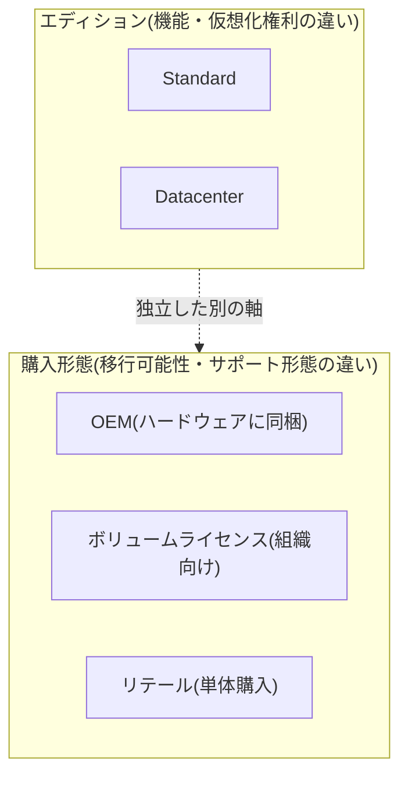
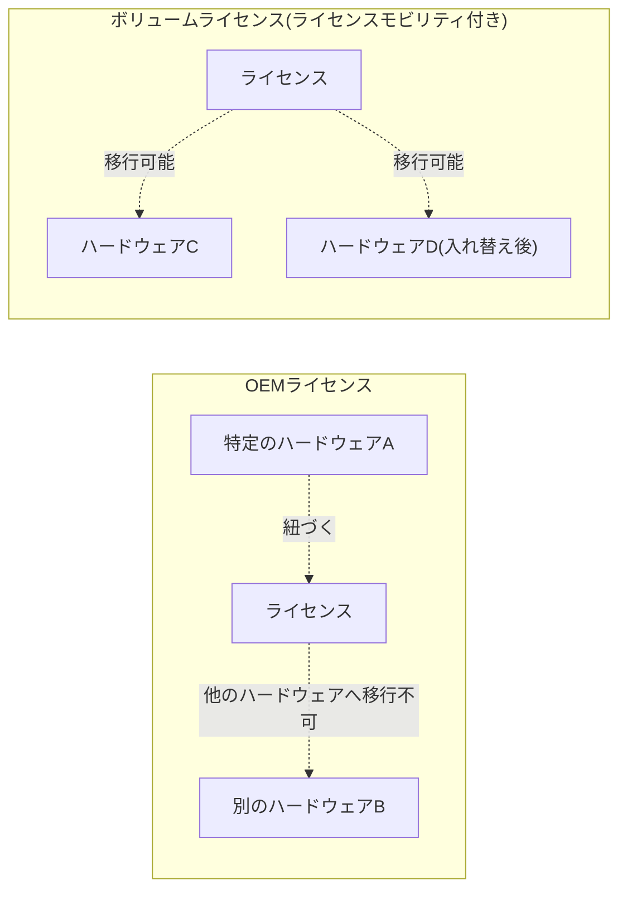

## はじめに

- **この記事で得られること**: Windows Serverの調達時に必ず登場する**StandardエディションとDatacenterエディションの違い**、そして**OEM・ボリュームライセンス・リテールという購入形態の違い**を体系的に理解します。「OEMライセンスとは何か」という基本的な疑問から、コアベースライセンシングという課金モデルの仕組み、そして仮想化が進む現代においてどちらのエディションを選ぶべきかの判断基準までを扱います。
- **対象読者**: Windows Serverの構築・調達に携わっているものの、エディションやライセンス形態の違いを具体的に説明できない方を想定しています。
- **読むのにかかる想定時間**: 約17分

この記事は[『上位1%』シリーズ 全記事ガイド](/sitemap)の一部、Windows Server運用をテーマにした新シリーズの1本目です。

## 前提知識

- **ライセンス**: ソフトウェアを使用する権利そのものです。ソフトウェアの機能自体とは別に、「どのハードウェア上で」「何台まで」使用してよいか、という利用条件を定めるものです。

## 全体像をつかむ

### Windows Serverのライセンスを決める2つの軸

Windows Serverのライセンスは、**「どのエディションを選ぶか」と「どの購入形態で入手するか」という、独立した2つの軸**で決まります。

## 基礎から徹底解説

### StandardとDatacenterの違い:主な差は仮想化権利

多くの人が誤解しがちな点ですが、<strong>StandardとDatacenterの最大の違いは、単純な機能の多寡ではなく、1つのライセンスで実行できる仮想マシンの台数(仮想化権利)</strong>です。

| | Standard | Datacenter |
|---|---|---|
| 仮想化権利 | 1つのライセンス(コアライセンスのセット)につき、物理ホスト上で最大2つまでの仮想マシン(または1つの物理インスタンス+1つの仮想マシン)を実行できる | 1つのライセンスで、その物理ホスト上に**無制限**の仮想マシンを実行できる |
| Datacenter限定機能 | 利用不可 | Storage Spaces Direct(サーバーのローカルディスクを束ねた分散ストレージ)、Shielded VM(仮想マシンの内容を仮想化基盤の管理者からも保護する機能)、Storage Replicaなど、大規模・高可用性向けの機能が利用可能 |
| 価格 | 相対的に低価格 | 相対的に高価格 |

**同じ物理ホスト上でより多くの仮想マシンを稼働させたい場合、Standardのライセンスを仮想マシンの台数分だけ追加購入するより、ある台数を超えた時点でDatacenterへ切り替える方がコスト効率が良くなる、という損益分岐点が存在します。** 仮想化基盤の統合が進み、1台の物理ホストに多数の仮想マシンを稼働させる構成が主流になっている現代では、Datacenterエディションが選ばれる機会が増えている傾向にあります。

### コアベースライセンシング:台数ではなくコア数で数える

Windows Server 2016以降、ライセンスは**サーバーの台数ではなく、物理コア(または仮想マシンに割り当てられた仮想コア)の数**に基づいて課金されます。**1台の物理サーバーにつき最低16コア分のライセンス**が必要というルールがあり、通常は2コア単位・8コア単位のパックを組み合わせて購入します。物理コア数の多い高性能なサーバーを導入するほど、必要なライセンス数も増える、という設計です。

コアベースライセンシングが導入された理由

Windows Server 2012 R2以前は、CPUソケット数を基準にライセンスを数える方式が主流でした。しかし、1つのCPUソケットに搭載されるコア数が年々増加していく中で、「ソケット数」という基準では、同じライセンス費用でも実際に使えるCPU性能(コア数)が導入するハードウェアによって大きく変わってしまう、という不均衡が生じていました。コア数を基準にすることで、実際に利用するCPU性能とライセンス費用の対応関係をより正確に反映できるようになった、という背景があります。

### OEMライセンスとは何か

**OEM(Original Equipment Manufacturer)ライセンス**は、サーバーを購入する際に、そのハードウェアと一体で提供されるライセンス形態です。相対的に低価格である一方、次のような明確な制約があります。

- **そのハードウェアに紐づく**: OEMライセンスは、購入したその特定のハードウェア上でのみ有効です。同じ組織内であっても、別の新しいハードウェアへライセンスをそのまま移行することはできません。
- **ハードウェアの提供元がサポートの窓口になる**: OS自体の技術サポートも、多くの場合、そのハードウェアを販売したメーカー(OEMベンダー)経由で提供される形になります。

これに対し、**ボリュームライセンス**(組織が複数のライセンスをまとめて契約する形態)は、多くの場合<strong>ライセンスモビリティ(ライセンスを異なるハードウェアへ移行できる権利)</strong>を含む契約が可能であり、サーバーのハードウェアを入れ替えたり、オンプレミスからクラウド(あるいはクラウド間)へ移行したりする際の柔軟性が高くなります。**組織で大量のサーバーを計画的に調達・運用する場合、OEMライセンスよりボリュームライセンスが選ばれることが一般的**なのは、この移行の柔軟性が理由です。

## プロが見ている視点(上位1%の理解)

### OEMライセンスが実務上の足かせになる場面

OEMライセンスは初期導入コストの観点では有利ですが、**サーバーのハードウェアを数年後に入れ替える、あるいは仮想化基盤・クラウドへ移行するタイミングで、そのライセンス自体を再購入する必要が生じる**という制約が、実務上のコストとして表面化することがあります。特に、複数の物理サーバーを1つの仮想化基盤へ統合する(P2V、Physical-to-Virtual移行)ような計画がある場合、**個々のOEMライセンスをそのまま持ち込めるとは限らない**という点を、調達段階から見据えておく必要があります。

### StandardからDatacenterへの切り替えの考え方

仮想マシンの台数が当初の想定を超えて増えていく場合、**Standardライセンスを仮想マシンの台数分だけ買い増していくコストと、Datacenterへアップグレードするコストを、その時点での仮想マシン台数を基準に比較検討する**ことが実務上の判断ポイントです。将来的に仮想マシンの台数が大きく増える見込みがある環境では、初期段階からDatacenterを選択しておく方が、長期的なコスト・運用の柔軟性の両面で有利になることが多くあります。

## よくある誤解・つまずきポイント

- **誤解1: 「Datacenterエディションは、単に上位モデルで機能が多いだけの製品である」**
  StandardとDatacenterの主要な違いは仮想化権利(実行できる仮想マシンの台数)であり、単純な機能の多寡という理解では実際の使い分けの判断を誤りやすくなります。
- **誤解2: 「OEMライセンスは、通常のライセンスより機能が制限されている」**
  OEMライセンスとボリュームライセンスで、OS自体の機能に違いはありません。違いは移行可能性(ライセンスモビリティの有無)とサポート形態です。
- **誤解3: 「必要なライセンス数は、サーバーの台数だけで決まる」**
  Windows Server 2016以降は、サーバーの台数ではなく物理コア(または仮想コア)の数を基準にライセンスが課金されます。

## 障害・トラブルシューティングの視点

ライセンス関連の実務上の問題は、**「エディションの制約に起因する問題か、購入形態(移行可能性)に起因する問題か」を切り分ける**のが基本です。

1. **仮想マシンを追加しようとしたら、ライセンス上の制約に引っかかった**: Standardエディションの仮想化権利(1ライセンスあたり実行可能な仮想マシン数)を超えていないかを確認します。追加のライセンス購入か、Datacenterへのアップグレードを検討します。
2. **サーバーのハードウェアを入れ替えたところ、ライセンス認証エラーが発生した**: そのライセンスがOEM形態で購入されたものであり、旧ハードウェアに紐づいていた可能性を確認します。
3. **仮想化基盤への統合を計画している**: 統合対象の各物理サーバーのライセンスが、OEMかボリュームライセンスかを事前に棚卸しし、移行可能なライセンスがどれだけあるかを把握します。

### 予防策・恒久対策

- サーバーを新規調達する際は、将来のハードウェア入れ替えや仮想化基盤への統合計画を踏まえ、OEMとボリュームライセンスのどちらが適切かを事前に検討する。
- 仮想マシンの台数が増加傾向にある環境では、定期的にStandard/Datacenterの損益分岐点を再評価する。
- 大規模な仮想化基盤・クラウド移行を計画する際は、既存ライセンスの移行可能性を早い段階で棚卸しする。

## まとめ

- StandardとDatacenterの主な違いは、単純な機能の多寡ではなく、1つのライセンスで実行できる仮想マシンの台数(仮想化権利)とDatacenter限定機能です。
- Windows Server 2016以降のライセンスは、サーバーの台数ではなく物理コア(または仮想コア)の数を基準に課金されます。
- OEMライセンスは特定のハードウェアに紐づき他のハードウェアへ移行できない一方、ボリュームライセンスはライセンスモビリティにより移行の柔軟性が高くなります。
- 仮想マシンの台数が増加する見込みがある環境では、Standardの買い増しとDatacenterへのアップグレードのコストを比較検討することが実務上重要です。

**今日から意識すべきこと**
1. Windows Serverのエディションを検討する際は、機能の多寡ではなく仮想化権利(実行できる仮想マシン数)を基準に判断しましょう。
2. サーバーを新規調達する際は、将来のハードウェア入れ替えや仮想化基盤への統合を見据え、OEMとボリュームライセンスの移行可能性の違いを踏まえて選びましょう。

## 参考文献

- [Windows Server pricing and licensing | Microsoft](https://www.microsoft.com/en-us/windows-server/pricing)
- [Licensing Windows Server 2022 | Microsoft](https://www.microsoft.com/licensing/docs/view/Windows-Server-2022)
- [How to license Windows Server 2016 or later | Microsoft Learn](https://learn.microsoft.com/en-us/windows-server/get-started/how-to-buy)
