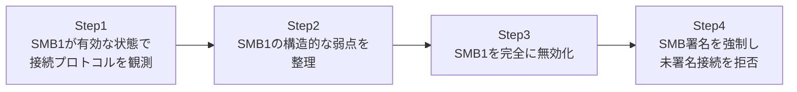

## はじめに

- **この記事で得られること**: [Windows ServerのSMB共有](/articles/smb-file-sharing-guide)で扱ったSMBプロトコルについて、今なお一部の環境に残り続けている**SMB1**という古いバージョンが、なぜ危険とされているのかを、実際に接続を観測しながら確認します。そのうえで、SMB1の完全な無効化と、**SMB署名**(SMB Signing)の強制によって、この危険な状態を防ぐ方法を扱います。
- **対象読者**: 「SMB1は危険だから無効化すべき」という知識はあるが、具体的にどう危険で、どう無効化を確認すればよいのかを、自分の手で確かめたことがない方を想定しています。**このハンズオンは、自分が管理する検証環境の防御力を高めるための、教育・防御目的のものです。実運用中の他者の環境に対して、許可なくこの手順を実行しないでください。**
- **読むのにかかる想定時間**: 約30分

この記事は[『上位1%』シリーズ 全記事ガイド](/sitemap)の一部です。

## 前提知識

- **SMB共有の基礎**: [Windows ServerのSMB共有](/articles/smb-file-sharing-guide)を前提とします。

## 全体像をつかむ



## ハンズオン手順

### Step 1: SMB1が有効な状態で、実際に使われているプロトコルを観測する

サーバー側で、SMB1機能がインストールされているかを確認します。

```powershell
Get-WindowsFeature FS-SMB1
```

有効になっている場合、クライアント側から接続し、実際にネゴシエートされたSMBのバージョン(ダイアレクト)を確認します。

```powershell
Get-SmbConnection
```

`Dialect`の列を確認してください。**環境によっては、クライアント・サーバーの双方が新しいバージョンに対応しているにもかかわらず、何らかの理由で`SMB 1.0`のような古いダイアレクトがネゴシエートされていることがあります。** これは、クライアント側の設定や、途中の古いデバイスの影響で、意図せず古いプロトコルへ降格(ダウングレード)してしまっているケースです。

### Step 2: SMB1が抱える構造的な弱点を整理する

SMB1には、現行のSMB2/SMB3と比較して、次のような構造的な弱点があります。

- **暗号化のオプションが存在しない**: SMB3で追加された、通信内容そのものを暗号化する機能が、SMB1には一切存在しません。
- **署名機能が弱く、既定でも無効なことが多い**: 改ざん検知のための署名機能はあるものの、既定で有効になっていない環境が多く残っています。
- **過去に重大な脆弱性の温床になった**: WannaCry・NotPetyaといった大規模なランサムウェアの拡散に悪用された、EternalBlueという脆弱性は、このSMB1の実装に存在していました。

**このハンズオンでは、実際の脆弱性を悪用する攻撃(エクスプロイト)は一切行いません。** SMB1が抱える設計上の弱点を理解し、無効化するという防御側の対応だけを扱います。

### Step 3: SMB1を完全に無効化する

サーバー側で、SMB1機能を完全にアンインストールします。

```powershell
Remove-WindowsFeature FS-SMB1
Set-SmbServerConfiguration -EnableSMB1Protocol $false -Force
```

再起動後、クライアント側から再度接続を試みます。

```powershell
Get-SmbConnection
```

**`Dialect`が、`SMB 3.1.1`のような、現行のバージョンにのみなっているはずです。** さらに、SMB1しか話せない、古い設定のクライアントから接続を試みると、接続自体が失敗することも確認してください。**接続が失敗するということ自体が、SMB1という危険な経路が、実際に閉じられたことの証明です。**

### Step 4: SMB署名を強制し、未署名の接続を拒否する

SMB1の無効化とあわせて、SMB署名を必須にする設定も行います。

```powershell
Set-SmbServerConfiguration -RequireSecuritySignature $true -Force
```

署名を無効にしたクライアント側の設定で、あえて接続を試みます。

```powershell
Set-SmbClientConfiguration -RequireSecuritySignature $false -Force
```

```powershell
Get-SmbConnection
```

**署名の要求と、クライアント側の署名なしという設定が食い違うため、接続そのものが拒否されるはずです。** クライアント側の設定を`$true`に戻すと、再び正常に接続できることを確認してください。

## プロが見ている視点(上位1%の理解)

### なぜSMB1は、危険だと知られていながら、今も残り続けるのか

SMB1の危険性は、セキュリティ業界では長年広く知られています。**それでもなお一部の環境に残り続けている最大の理由は、SMB1にしか対応していない、極めて古い専用機器(古いNAS、古い複合機、古い業務システムの連携機能など)が、いまだに現役で稼働しているケース**があるためです。こうした機器との互換性を理由に、SMB1を無効化できずにいる組織は少なくありません。**実務でSMB1の無効化を進める際は、まずネットワーク内でSMB1しか話せない機器がないかを事前に洗い出す**という、資産の棚卸しが最初のステップになります。

### SMB署名が、SMB1の無効化と「セットで」意味を持つ理由

SMB1を無効化しても、**SMB2/SMB3自体が、署名なしで運用されていれば、通信の改ざんや、中間者による割り込みのリスクは、完全にはなくなりません。** SMB署名は、送受信されるSMBパケットに、改ざん検知用の署名を付与する機能であり、**プロトコルのバージョンを新しくすることと、そのプロトコルを安全な設定で運用することは、独立した、別々の対策**です。SMB1の無効化が「古い、弱い経路そのものを塞ぐ」対策であるのに対し、SMB署名の強制は「残った経路(SMB2/SMB3)自体を、改ざんから守る」対策であり、**両方を組み合わせて初めて、実務上十分な防御になる**と理解しておく必要があります。

## よくある誤解・つまずきポイント

- **誤解1: 「SMB1を無効化しさえすれば、SMB関連のセキュリティ対策は完了する」**
  SMB1の無効化は、古い危険なプロトコル自体を塞ぐ対策であり、残ったSMB2/SMB3を安全に運用するには、SMB署名の強制などが別途必要です。
- **誤解2: 「SMB1が無効化できないのは、単なる設定ミスである」**
  実務では、SMB1にしか対応していない古い専用機器との互換性維持という、正当な理由でSMB1が残されているケースが少なくありません。
- **誤解3: 「クライアントとサーバーが両方SMB3に対応していれば、常にSMB3でネゴシエートされる」**
  クライアント側の設定や、途中の古いデバイスの影響で、意図せず古いダイアレクトへ降格してしまうケースがあります。

## 障害・トラブルシューティングの視点

1. **SMB1を無効化したら、特定の古い機器と通信できなくなった**: その機器がSMB1にしか対応していない可能性が高く、機器自体の更新、または例外的な移行計画の検討が必要です。
2. **SMB署名を強制したら、一部のクライアントで接続エラーが発生する**: そのクライアント側の`RequireSecuritySignature`設定を確認し、署名を有効にする必要があります。
3. **意図せず古いダイアレクトでネゴシエートされている**: `Get-SmbConnection`で実際のDialectを確認し、クライアント側の設定や、経路上の古い機器の有無を調査します。

## まとめ

- SMB1には、暗号化オプションの欠如や、過去の重大な脆弱性(EternalBlueなど)といった、構造的な弱点があります。
- `Remove-WindowsFeature FS-SMB1`と`Set-SmbServerConfiguration -EnableSMB1Protocol $false`で、SMB1を完全に無効化できます。
- SMB1の無効化とSMB署名の強制は、それぞれ「古い経路を塞ぐ」「残った経路を守る」という、独立した別の対策であり、両方の組み合わせが実務上の防御になります。
- SMB1が現役で残っている場合、SMB1にしか対応していない古い専用機器が原因であることが多く、無効化の前に資産の棚卸しが必要です。

**今日から意識すべきこと**
1. SMB1が有効になっていないか、`Get-WindowsFeature FS-SMB1`で定期的に点検しましょう。
2. SMB1を無効化する前に、ネットワーク内にSMB1にしか対応していない機器がないかを、必ず洗い出しましょう。

## 参考文献

- [SMB security hardening in Windows Server | Microsoft Learn](https://learn.microsoft.com/en-us/windows-server/storage/file-server/smb-security)
- [Stop using SMB1 | Microsoft Learn](https://learn.microsoft.com/en-us/windows-server/storage/file-server/troubleshoot/smbv1-not-installed-by-default-in-windows)
