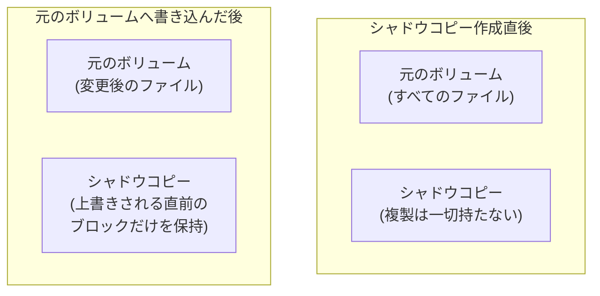

## はじめに

- **この記事で得られること**: [Windows ServerのSMB共有](/articles/smb-file-sharing-guide)で構築したファイルサーバー上で、ユーザーが自分自身で、ファイルの「以前のバージョン」を復元できる、**シャドウコピー**(VSS、Volume Shadow Copy Service)という機能の、実際の挙動を体系的に理解します。この機能が、ボリューム全体を定期的に丸ごと複製しているのではなく、**コピーオンライト**という、より効率的な仕組みで実現されていること、そして「バックアップの代わりにはならない」という決定的な限界までを扱います。
- **対象読者**: ファイルサーバーの「プロパティ」の「以前のバージョン」タブを使ったことはあるものの、この機能が裏側でどう動いているのかを説明できない方を想定しています。
- **読むのにかかる想定時間**: 約16分

この記事は[『上位1%』シリーズ 全記事ガイド](/sitemap)の一部、[Windows Server運用シリーズ](/sitemap#シリーズ一覧)の5.1本目です。

## 前提知識

- [Windows ServerのSMB共有](/articles/smb-file-sharing-guide): ファイル共有の基本的な仕組みが前提になっています。

## 全体像をつかむ

シャドウコピーが有効なボリューム上のファイルを誤って編集・削除してしまっても、ユーザーは、そのファイルの「プロパティ」から「以前のバージョン」タブを開くだけで、**IT部門への依頼なしに、過去のある時点の状態を自分で復元できます。** 「ボリューム全体を、スケジュールのたびに丸ごと複製しているのだろう」というイメージを持ってしまうと、この機能の実際の効率性が説明できなくなります。



## 基礎から徹底解説

### シャドウコピーは、コピーオンライトという、見かけの容量と実際の消費を分離する仕組みで動いている

**シャドウコピーが作成された瞬間には、元のボリュームの複製は、一切作られません。** そこから、元のボリューム上のファイルへ実際に書き込みが発生するたびに、**上書きされる直前のブロックだけが、コピーオンライトという仕組みによって、シャドウコピー専用の記憶領域へ退避されます。** これは、[LVMスナップショットを自分の手で作成し、コピーオンライトの正体を確認するハンズオン](/articles/lvm-snapshot-handson-guide)で扱った、**まったく同じ発想**です。OSやファイルサーバーの実装は異なりますが、「変更前のブロックだけを、必要になった時点で退避する」という設計の根本は、共通しています。

<details>
<summary>ユーザーが見ている「以前のバージョン」は、具体的に何を参照しているのか</summary>

**ユーザーが「以前のバージョン」タブで過去の状態を選んだとき、Windowsは、現在のファイルの内容と、シャドウコピー専用領域に退避されている「変更前のブロック」を組み合わせて、その時点でのファイルの完全な内容を、その場で再構成しています。** シャドウコピー専用領域には、ファイルそのものの完全な複製が、個別に保存されているわけではありません。

</details>

### シャドウコピーは、常時ではなく、スケジュールされたタイミングでの「スナップショット」である

**シャドウコピーは、ファイルへの変更を常時記録しているわけではありません。** 既定では、**1日2回**(平日の朝7時と正午)のような、決まったスケジュールで、その時点の状態を記録する「スナップショット」が作成されます。

```powershell
# 既存のシャドウコピーのスケジュールを確認する
vssadmin list shadowstorage
```

**「ファイルを編集した、その直後の状態」までは復元できず、あくまで、直前のスケジュールされたスナップショット作成時点の状態までしか戻せない**、という制約を理解しておく必要があります。

## プロが見ている視点(上位1%の理解)

### シャドウコピーは、バックアップの代わりにはならない

ここが、最も重要な注意点です。**シャドウコピーは、元のボリュームと同じ物理ディスク上に保存されています。** そのディスクそのものが故障すれば、元のファイルだけでなく、シャドウコピーも、まったく同時に失われます。これは、[LVMスナップショットが、元のボリュームとの依存関係により、物理障害に対する保護にはならない](/articles/lvm-snapshot-handson-guide)のと、**まったく同じ構造の限界**です。**シャドウコピーは、「数時間前・前日の状態へ、ユーザー自身が素早く戻すための機能」であり、物理的に独立した場所へデータを保存する、本来のバックアップとは、まったく別の目的を持つ機能として理解する必要があります。** [AD ごみ箱による誤削除からの復旧](/articles/ad-recycle-bin-handson-guide)が、ディレクトリサービス側で持つ「元に戻す」仕組みだったのに対し、シャドウコピーは、ファイルサーバー側で持つ、発想としては同じ系譜の仕組みです。

## よくある誤解・つまずきポイント

- **誤解1: 「シャドウコピーは、ボリューム全体を、スケジュールのたびに丸ごと複製している」**
  シャドウコピー作成直後は、ほぼ何もデータを保持しておらず、元のボリュームへの書き込みが発生するたびに、変更される直前のブロックだけが、コピーオンライトによって退避されていきます。
- **誤解2: 「シャドウコピーがあれば、バックアップは不要である」**
  シャドウコピーは、元のボリュームと同じ物理ディスク上に保存されているため、ディスクそのものの故障には対応できません。物理的に独立した場所への保存が、本来のバックアップです。
- **誤解3: 「シャドウコピーは、ファイルへの変更を常時記録している」**
  シャドウコピーは、既定では1日2回のような、決まったスケジュールでスナップショットを作成する仕組みであり、編集した直後の状態までは復元できません。

## 障害・トラブルシューティングの視点

1. **「以前のバージョン」タブに、過去のバージョンが一切表示されない**: そのボリュームで、シャドウコピーが有効になっているかを確認します。
2. **シャドウコピー専用の記憶領域が、想定より早く満杯になる**: ファイルへの変更量が多い場合、コピーオンライトによる退避データの量も増えます。記憶領域の割り当てサイズの見直しを検討します。
3. **期待したタイミングの状態が、復元候補に出てこない**: シャドウコピーは常時ではなく、スケジュールされたタイミングでのみ作成されるため、そのタイミングの前後関係を確認します。

## まとめ

- シャドウコピー(VSS)は、ユーザー自身が、IT部門への依頼なしに、ファイルの以前のバージョンを復元できる機能です。
- この機能は、ボリューム全体を複製するのではなく、コピーオンライトという仕組みで、変更される直前のブロックだけを退避することで実現されています。
- シャドウコピーは、既定では1日2回のような、決まったスケジュールでスナップショットを作成する仕組みであり、常時の変更記録ではありません。
- シャドウコピーは、元のボリュームと同じ物理ディスク上に保存されているため、物理障害に対する保護にはならず、本来のバックアップの代わりにはなりません。

**今日から意識すべきこと**
1. ファイルサーバーを構築する際は、シャドウコピーの有効化と、物理的に独立した場所へのバックアップを、常に別の目的の機能として区別しましょう。
2. シャドウコピーのスケジュールを確認し、ユーザーが期待する復元タイミングと食い違いがないかを、定期的に確認しましょう。

## 参考文献

- [Volume Shadow Copy Service | Microsoft Learn](https://learn.microsoft.com/en-us/windows-server/storage/file-server/volume-shadow-copy-service)
- [LVMスナップショットを自分の手で作成し、コピーオンライトの正体を確認するハンズオン](/articles/lvm-snapshot-handson-guide)
