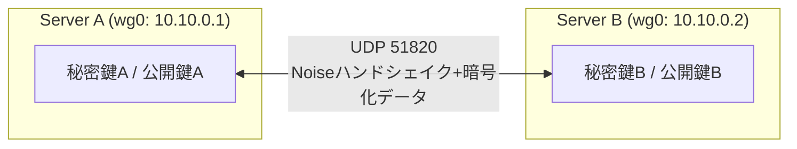

## はじめに

- **この記事で得られること**: [WireGuardの仕組みを『上位1%』の視点で理解する](/articles/wireguard-internals-guide)で扱った**Cryptokey Routing**という設計を、実際に2台のLinuxサーバー間でWireGuardトンネルを構築しながら体感します。「公開鍵とAllowedIPsの対応表1枚だけで、誰と通信でき、どの経路が使われるかが決まる」という説明を、実際に設定ファイルを書き換えて`wg show`の出力が変化する様子として確認します。
- **対象読者**: [WireGuardの仕組み](/articles/wireguard-internals-guide)をすでに読み、実際に自分の手でWireGuardを構築したことがない方を想定しています。
- **読むのにかかる想定時間**: 環境構築を含めて約60分

この記事は[『上位1%』シリーズ 全記事ガイド](/sitemap)の一部です。

## 前提知識

- **Linuxの基本操作**: `apt`によるパッケージ管理、`systemctl`によるサービス管理、テキストエディタでの設定ファイル編集ができることを前提とします。不慣れな場合は[ハンズオン準備マニュアル:Ubuntuサーバーの初期セットアップ](/articles/ubuntu-server-setup-guide)を先に読んでおくとスムーズです。
- **Cryptokey Routingの概念**: [WireGuardの仕組み](/articles/wireguard-internals-guide)で扱った、公開鍵とAllowedIPsが1対1で対応するという設計を前提とします。

## 全体像をつかむ

2台のUbuntuサーバー(またはVM)を用意し、それぞれにWireGuardをインストールして、両者の間にトンネルを構築します。



## ハンズオン手順

### Step 1: 双方にWireGuardをインストールし、鍵ペアを生成する

両方のサーバーで、WireGuardをインストールし、公開鍵暗号の鍵ペアを生成します。

```bash
sudo apt update && sudo apt install -y wireguard
wg genkey | sudo tee /etc/wireguard/privatekey | wg pubkey | sudo tee /etc/wireguard/publickey
```

`privatekey`と`publickey`という2つのファイルが生成されます。**この時点で、まだ相手のことは何も知りません。** 鍵ペアは、あくまで自分自身のアイデンティティです。

### Step 2: 設定ファイルを作成し、トンネルを立ち上げる

Server Aの`/etc/wireguard/wg0.conf`を作成します。

```ini
[Interface]
PrivateKey = <Server Aの秘密鍵>
Address = 10.10.0.1/24
ListenPort = 51820

[Peer]
PublicKey = <Server Bの公開鍵>
AllowedIPs = 10.10.0.2/32
Endpoint = <Server BのグローバルIP>:51820
PersistentKeepalive = 25
```

Server Bには、鍵とIPアドレスを入れ替えた、対になる設定を作成します。

```ini
[Interface]
PrivateKey = <Server Bの秘密鍵>
Address = 10.10.0.2/24
ListenPort = 51820

[Peer]
PublicKey = <Server Aの公開鍵>
AllowedIPs = 10.10.0.1/32
Endpoint = <Server AのグローバルIP>:51820
PersistentKeepalive = 25
```

両方で起動します。

```bash
sudo wg-quick up wg0
```

Server Aから、`10.10.0.2`へpingを送ってみてください。

```bash
ping -c 3 10.10.0.2
```

**IKEのようなネゴシエーションを一切していないにもかかわらず、この時点でもう疎通します。** `wg show`を実行すると、ハンドシェイクが完了し、直近の送受信量が記録されていることが確認できます。

### Step 3: AllowedIPsを書き換え、Cryptokey Routingを体感する

ここからが、このハンズオンの核心です。Server Aの`AllowedIPs`を、Server Bのアドレス1つだけから、より広い範囲に書き換えてみます。

```ini
AllowedIPs = 10.10.0.0/24
```

設定を反映させます。

```bash
sudo wg syncconf wg0 <(wg-quick strip wg0)
```

**この1行を書き換えただけで、Server Aは「`10.10.0.0/24`宛のパケットは、この公開鍵の相手に暗号化して送る」というルーティングの判断基準を、丸ごと変更したことになります。** ルーティングテーブル(`ip route`)を一切操作していないのに、**転送の可否を決める実体は、常にこの`AllowedIPs`だった**ことを、自分の目で確認してください。

### Step 4: tcpdumpで、ハンドシェイクの再確立を観測する

Server A側で、意図的にインターフェースを一度落とし、`tcpdump`を仕込んでから再度立ち上げます。

```bash
sudo tcpdump -i any udp port 51820 -n &
sudo wg-quick down wg0 && sudo wg-quick up wg0
```

pingを送ると、`tcpdump`の出力に、最初の数パケットだけサイズが異なる(ハンドシェイクメッセージ)ことが確認できます。**WireGuardは、約2分ごとに、通信を継続しながらバックグラウンドでセッション鍵を再確立し続けています。** `wg show`の`latest handshake`の値が、時間経過とともに更新され続けていることでも確認できます。

## プロが見ている視点(上位1%の理解)

### PersistentKeepaliveは「接続維持」ではなく「NAT越えの維持」

`PersistentKeepalive = 25`は、25秒ごとに空のパケットを送り続ける設定です。**これは、WireGuard自体の接続を維持するためではなく、NATルーターやファイアウォールが保持している「このUDPポートは通信中である」という状態(NATバインディング)を維持するためのものです。** 両者がグローバルIPを持つ環境では基本的に不要ですが、どちらか一方がNAT配下にある一般的な環境では、これを設定しない側からの再接続要求が、NATに遮断されて届かなくなります。実務では「サーバー側は不要、クライアント側にだけ設定する」という非対称な構成がよく取られます。

### AllowedIPsが狭すぎる設定ミスは、「一部だけ繋がらない」という厄介な障害になる

Step 3で確認した通り、`AllowedIPs`は転送を許可する範囲そのものです。**複数の内部ネットワークを中継するようなハブ構成で、AllowedIPsの範囲設定を誤ると、「特定のホストにだけ繋がらない」という、原因が分かりにくい障害になります。** IPsecのSA(セキュリティアソシエーション)がトンネル単位で確立されるのと異なり、WireGuardではこの対応表の1行1行が、実質的なルーティングポリシーそのものであることを意識する必要があります。

## よくある誤解・つまずきポイント

- **誤解1: 「AllowedIPsは、単なるファイアウォールのようなフィルタ設定である」**
  AllowedIPsは、フィルタであると同時に、そのIP範囲宛のパケットをどの公開鍵の相手へ暗号化して送るかを決める、ルーティングの実体そのものです。
- **誤解2: 「PersistentKeepaliveを設定しないと、WireGuardの接続自体がすぐに切れる」**
  WireGuard自体はステートレスに近い設計であり、接続そのものが切れるわけではありません。NAT越え環境での再到達性を維持するための設定です。
- **誤解3: 「ハンドシェイクは、最初の接続時に1回だけ行われる」**
  WireGuardは約2分ごとに、通信を継続させながらバックグラウンドでセッション鍵を自動的に再確立し続けます。

## 障害・トラブルシューティングの視点

1. **pingは通るが、特定のサブネットだけ届かない**: 相手側の`AllowedIPs`が、その宛先を含む範囲になっているかを確認します。
2. **NAT配下のクライアントからの再接続が、一定時間後に失敗する**: `PersistentKeepalive`が設定されているかを確認します。
3. **`wg show`のlatest handshakeが更新されない**: `Endpoint`のIPアドレスやポートが変わっていないか、`UDP 51820`がファイアウォールで許可されているかを確認します。

## まとめ

- WireGuardは、公開鍵とAllowedIPsの対応表(Cryptokey Routing)によって、通信できる相手と経路を決定します。
- `AllowedIPs`を書き換えるだけで、ルーティングテーブルを操作せずに転送範囲を変更できます。
- WireGuardは約2分ごとにセッション鍵を自動的に再確立し続け、`PersistentKeepalive`はNATバインディングを維持するための設定です。

**今日から意識すべきこと**
1. WireGuardの設定を読むときは、`AllowedIPs`をルーティングテーブルそのものとして読み解きましょう。
2. NAT配下のクライアントには、`PersistentKeepalive`を忘れずに設定しましょう。

## 参考文献

- [WireGuard: Conceptual Overview](https://www.wireguard.com/#conceptual-overview)
- [wg-quick(8) — Linux man page](https://man7.org/linux/man-pages/man8/wg-quick.8.html)
