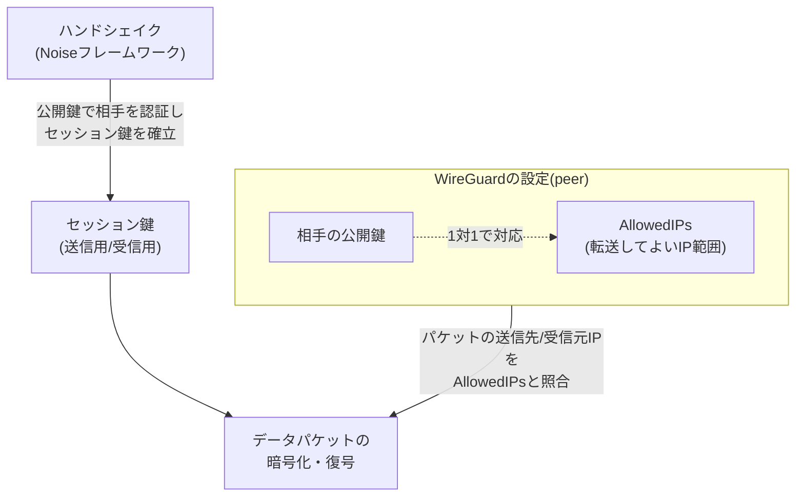
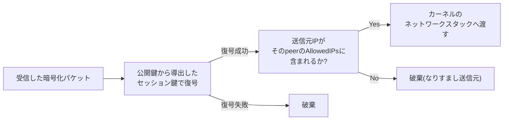
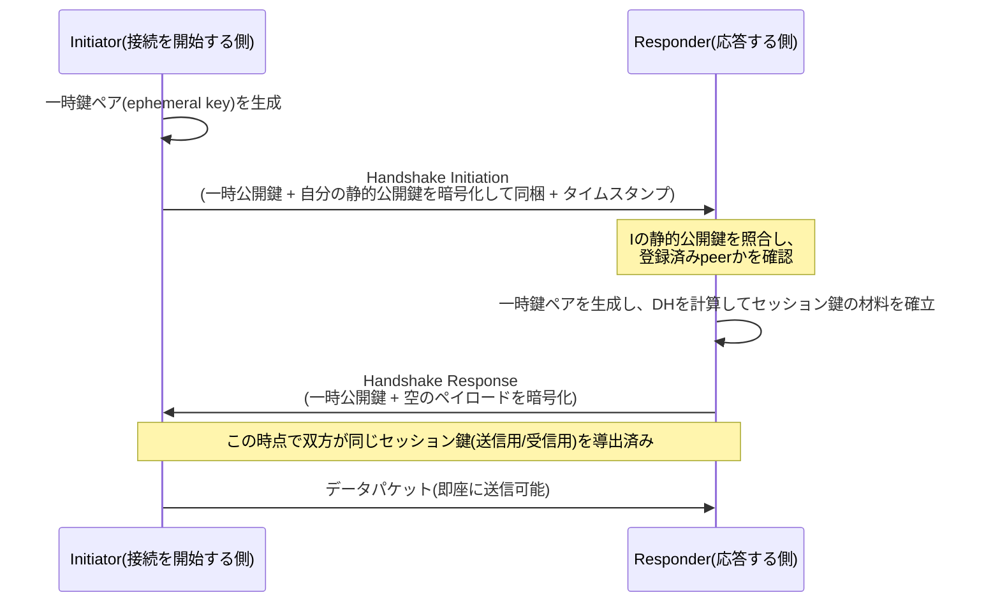

## はじめに

- **この記事で得られること**: WireGuardが「暗号アルゴリズムを固定した最小構成」というだけでなく、Noiseフレームワークに基づくハンドシェイクが具体的にどういう手順で鍵を確立するのか、公開鍵と許可するIPアドレス範囲を結びつける**Cryptokey Routing**という設計がなぜルーティングテーブルの代わりになるのか、そしてセッション鍵がどうやって自動的に更新され続けるのかを、体系的に理解できます。
- **対象読者**: [L2TP/IPsecと現代的なVPNプロトコルを『上位1%』の視点で比較する](/articles/vpn-protocols-comparison-guide)でWireGuardの概要(暗号スイートの固定、実装の小ささ、公開鍵による接続識別)を理解した上で、「実際に接続が確立するときに何が起きているのか」まで掘り下げたい方を想定しています。
- **読むのにかかる想定時間**: 約18分

この記事は[『上位1%』シリーズ 全記事ガイド](/sitemap)の一部です。

## 前提知識

- **公開鍵暗号/共通鍵暗号**: 公開鍵暗号は暗号化・復号(または鍵交換)に異なる鍵ペアを使う方式、共通鍵暗号は同じ鍵を使う方式です。詳しくは[PKIとデジタル証明書の仕組み](/articles/pki-guide)で扱っています。
- **Diffie-Hellman鍵交換(DH)** : 通信の両者が公開鍵と自分の秘密鍵を使い、盗聴されている経路上でも第三者にはわからない共通の秘密値を作り出す手順です。
- **UDP**: コネクションレスで、送受信のたびに接続確立の手順を必要としない軽量なプロトコルです。

## 全体像をつかむ

### 一言で言うと

**WireGuardの本質は、「あらかじめ交換しておいた公開鍵」と「その相手に転送してよいIPアドレス範囲」を1対1で結びつけた小さな対応表(Cryptokey Routing Table)を軸に、Noiseフレームワークという確立された設計に基づく1往復半のハンドシェイクで鍵を確立し、以降のすべてのパケットをこの対応表に沿って暗号化・転送する**、という設計です。IKEのような「ネゴシエーション」の概念自体を持たず、誰と話すか・何を許可するかを、鍵ペアと対応表という単純なデータ構造だけで表現しています。

## 基礎から徹底解説

### Cryptokey Routing:ルーティングテーブルではなく「鍵の対応表」で経路を決める

WireGuardには、IPsecのSPD(Security Policy Database)のような専用の照合ルールの仕組みが別途存在しません。代わりに、各インターフェースが持つ**peer設定そのもの**が、暗号化と経路制御を同時に担います。1つのpeer設定は、次の2つの情報がセットになっているだけの単純な構造です。

- **相手の公開鍵**: この鍵を持つ相手だけが、対応するデータを復号できます。
- **AllowedIPs**: このpeerとの間で「送信してよい・受信を許可する」IPアドレス範囲(CIDR)です。

送信時は、送りたいパケットの宛先IPアドレスがどのpeerのAllowedIPsに含まれるかを調べ、該当するpeerの公開鍵から導出したセッション鍵で暗号化して送信します。受信時は、復号に成功した(=正しい鍵を持つpeerからの通信だと確認できた)パケットの**送信元IPアドレス**が、そのpeerのAllowedIPsに含まれているかを再度チェックします。含まれていなければ、たとえ暗号としては正しく復号できてもパケットは破棄されます。

**この設計の本質は、「認証(誰からのパケットか)」と「認可(その相手が名乗って良いIPアドレス範囲はどこか)」を、公開鍵という1つの識別子で同時に扱っていること**です。IPsecがIKEでSAを確立したあとSPDというルールセットで別途照合するのに対し、WireGuardは「この公開鍵を持つ相手=このAllowedIPsの範囲」という1つの対応関係で完結させています。ゲートウェイとして複数の拠点を中継する構成(サイト間接続)を組むときも、あるpeerのAllowedIPsに複数のCIDR(相手拠点の内部ネットワーク全体など)を指定するだけで、追加のルーティングプロトコルを組まずに経路制御ができます。

### ハンドシェイク:Noiseフレームワークに基づく1往復半の鍵確立

WireGuardのハンドシェイクは、独自に設計された暗号プロトコルではなく、**Noise Protocol Framework**という、鍵交換パターンを体系的に定義した既存の設計図の中の`Noise_IK`というパターンをそのまま採用しています。「暗号プロトコルを毎回一から設計するのではなく、実績のある枠組みから該当パターンを選ぶ」というアプローチ自体が、IKEのように独自プロトコルを1から仕様化した結果として複雑さや脆弱性を生んできた歴史への反省を反映しています。

`Noise_IK`の「IK」は、**Iが「Initiator(開始側)の静的鍵は事前に知られていない」、Kが「Responder(応答側)の静的鍵はすでに知っている(Known)」** ことを表すNoiseフレームワークの命名規則です。WireGuardでは通信を始める前にpeerの公開鍵を設定ファイルに記述しておく必要があるため、双方とも相手の静的公開鍵をあらかじめ知っている状態からハンドシェイクが始まります。

このハンドシェイクの重要な特徴は、**IKEのフェーズ1(Main Modeで6往復)のような多段階の交渉が一切なく、1往復(Initiation→Response)でセッション鍵が確立し、Responderからの応答を受け取った時点でInitiatorは即座にデータを送信できる**ことです。往復回数が少ないほど、接続確立にかかる時間・パケット数が減り、モバイル回線のような高レイテンシ環境でも体感の遅延が小さくなります。

補足: なぜ静的公開鍵を暗号化して送るのか

Handshake Initiationメッセージの中でInitiatorの静的公開鍵は平文ではなく暗号化されて送信されます。これは、通信経路を観測している第三者に対して「誰と誰が通信しようとしているか」という関係性そのものを隠すためです(この性質は暗号学で**IDの秘匿性(identity hiding)** と呼ばれます)。IKEv1/IKEv2の一部モードでは身元情報が平文または不十分な保護で流れることがあり、これもWireGuardが設計上の反省点として踏まえている点の1つです。

### DoS耐性:Cookieによる負荷の押し付け

Handshake Initiationメッセージの処理には計算コストの高いDH演算が必要です。もし誰でも自由にInitiationメッセージを送りつけられるなら、送信元IPアドレスを詐称した大量の偽Initiationを送るだけで、Responder側に高負荷なDH演算を大量に強制させるDoS攻撃が成立してしまいます。

WireGuardはこれに対し、**短時間に大量のハンドシェイク要求を受け取ったResponderが、本格的なDH演算を始める前に軽量な「Cookie」を要求し、正しいCookieを含めて再送してきた相手にだけ本処理を行う**という仕組みを備えています。Cookie自体の生成・検証はDHのような重い公開鍵演算を必要としない軽量な計算(MAC)で済むため、なりすまし送信元からの負荷攻撃に対して、Responder側が先に軽いコストで足切りできます。IKEv2がCookie方式でDoS耐性を持つのと同じ考え方を、WireGuardも踏襲しています。

### セッション鍵の自動更新(Rekey)

WireGuardのセッション鍵は無期限に使い続けられるわけではありません。**送信したデータ量が一定量(2^60パケット)に達するか、最後にハンドシェイクしてから一定時間(120秒)が経過すると、バックグラウンドで自動的に新しいハンドシェイクが行われ、新しいセッション鍵に切り替わります。** この自動更新はユーザーの操作や通信の中断を伴わず、既存の通信を継続したまま裏側で完了します。

鍵を定期的に更新する理由は、**同じ鍵を使い続ける期間が長くなるほど、その鍵が万一漏洩した際の被害範囲(どこまで遡って復号されてしまうか)が広がる**ためです。一定間隔で鍵を使い捨てにしていく設計は、暗号学で**Forward Secrecy(前方秘匿性)** と呼ばれる性質を実現するための標準的な手法で、TLS 1.3や多くの現代的な鍵交換プロトコルにも共通する考え方です。

### データパケットの構造とリプレイ攻撃対策

ハンドシェイクが完了したあとのデータパケットは、次のような単純な構造をしています。

| フィールド | 役割 |
|---|---|
| タイプ | ハンドシェイク関連メッセージか、データパケットかを識別 |
| Receiver Index | 相手が「どのセッションの鍵で復号すべきか」を即座に特定できるようにする識別子 |
| Counter(連番) | このセッションで何番目に送信したパケットかを示す64bitの連番 |
| 暗号化ペイロード | ChaCha20-Poly1305で暗号化されたIPパケット本体+認証タグ |

このCounterフィールドが、**リプレイ攻撃(過去に送信された正規の暗号化パケットを盗聴者がそのまま再送し、あたかも正規の通信であるかのように誤認させる攻撃)への対策**として機能します。受信側は、そのセッションで過去に受け取ったCounter値をスライディングウィンドウで記録しており、すでに処理済みのCounter値を持つパケットや、極端に古い(ウィンドウの範囲外の)Counter値を持つパケットは、暗号としては正しく復号できたとしても無条件に破棄します。

### モバイル環境での接続維持:エンドポイントの動的更新

WireGuardのpeer設定には、相手の現在のIPアドレス・ポート番号(**エンドポイント**)を指定できますが、これは固定される必要がありません。**Responder側は、正しいセッション鍵で復号できた最新のパケットの送信元IPアドレス・ポート番号を、そのpeerの「現在のエンドポイント」として自動的に更新し続けます。** クライアントのIPアドレスがWi-Fiからモバイル回線への切り替えなどで変化しても、新しいIPアドレスから送られてきたパケットが正しい鍵で復号できさえすれば、サーバー側は「このpeerの新しいエンドポイントはここだ」と即座に認識し、通信を継続できます。IKEv2のMOBIKEのような専用の拡張プロトコル・追加のメッセージ交換を必要とせず、**「正しい鍵で復号できた=このpeer本人からの通信」という認証の仕組み自体が、副産物としてローミング機能を提供している**、という理解が正確です。

## プロが見ている視点(上位1%の理解)

### 「ネゴシエーションがない」ことの安全上の意味

IKEのようなネゴシエーション型のプロトコルでは、「使用する暗号アルゴリズムの組み合わせをその都度交渉する」という仕組み自体が、攻撃者に**ダウングレード攻撃**(より弱いアルゴリズムを使わせるよう誘導する攻撃)の糸口を与えます。WireGuardが暗号スイートを完全に固定していることの意味は、単に「選択肢が少なくて設定が楽」という運用上の利点にとどまりません。**ネゴシエーションという処理そのものが存在しないため、ダウングレード攻撃という攻撃クラス自体が構造的に成立しない**ということです。IKEv1のAggressive Modeのように「互換性のために弱い設定を許容してしまう」余地が、設計レベルで排除されています。

### 公開鍵の事前配布という運用上のトレードオフ

Cryptokey Routingは強力な設計ですが、**通信を始める前に相手の公開鍵を(何らかの方法で)入手し、設定に書き込んでおく必要がある**という前提の上に成り立っています。これは、CA(認証局)が証明書を発行・失効管理する[PKI](/articles/pki-guide)のような仕組みとは対照的です。PKIでは新しいメンバーの参加や鍵の失効をCA側で一元管理できますが、素のWireGuardには鍵の配布・失効を自動化する仕組みが標準では存在しません。数台〜数十台規模なら手動configでも運用できますが、数百台規模の組織になると、この「鍵配布問題」をどう解決するかが実務上の大きな課題になります。この課題を解決するために生まれたのが、[Tailscaleの仕組み](/articles/tailscale-internals-guide)で扱う、IdP連携による鍵の自動配布というレイヤーです。

## よくある誤解・つまずきポイント

- **誤解1: 「WireGuardにはハンドシェイクという概念がなく、いきなり暗号化通信が始まる」**
  ハンドシェイク自体はNoiseフレームワークに基づいて必ず行われます。IKEのような多段階の交渉が「ない」だけで、鍵を確立する手順そのものは存在します。
- **誤解2: 「エンドポイントを設定しなければ、WireGuardは相手を見つけられない」**
  Responder(多くの場合サーバー側)は、正しい鍵で復号できた最新の送信元をエンドポイントとして動的に学習するため、クライアント側のエンドポイントが変化しても通信を継続できます。ただしInitiator側(最初に接続を開始する側)は、少なくとも最初の1回は相手のエンドポイントを知っている必要があります。
- **誤解3: 「暗号アルゴリズムが固定だから、将来その暗号が破られたら終わりだ」**
  固定された暗号スイート自体が古くなるリスクはゼロではありませんが、WireGuardの開発チームは新しい暗号スイートへの移行を、既存の`Noise_IK`パターンとは別バージョンとして追加する方針を取っており、「アルゴリズムが1つしかない」ことと「アルゴリズムの更新ができない」こととは別問題です。

## 障害・トラブルシューティングの視点

WireGuardの接続トラブルは、**「ハンドシェイクが成立しているか」「AllowedIPsの設定が正しいか」を切り分ける**ことが出発点になります。

1. **ハンドシェイクが成立しない(`wg show`でlatest handshakeが更新されない)**: 相手の公開鍵の設定ミス、UDPポートがファイアウォールで塞がれている、あるいはNAT配下でエンドポイントの情報が古いままになっている、といった原因が典型的です。まずは経路上でそのUDPポート宛の通信が到達しているかを確認します。
2. **ハンドシェイクは成立するが、特定の宛先にだけ通信できない**: AllowedIPsの範囲設定漏れが最も多い原因です。Cryptokey Routingの性質上、AllowedIPsに含まれていない宛先への通信は、暗号的には正しくても経路として存在しないのと同じ扱いになります。
3. **一定時間ごとに一瞬だけ通信が途切れる**: Rekeyのタイミングで発生している可能性があります。通常はバックグラウンドで完了し体感できないはずですが、CPU負荷が極端に高い環境などでは遅延として現れることがあります。

### 予防策・恒久対策

- 複数拠点・複数peerを扱う構成では、AllowedIPsの設計(どの範囲をどのpeerに割り当てるか)を事前に一覧化し、重複や漏れがないかをレビューしてから投入する。
- 数十台を超える規模でWireGuardを使う場合は、素のconfig管理ではなく、鍵配布・失効を自動化する仕組み(Tailscaleなどのラッパー製品や、自前の鍵配布基盤)の導入を早めに検討する。
- `wg show`の`latest handshake`を監視項目に加え、想定した間隔(デフォルトでは最長でも数分おき)でハンドシェイクが更新され続けているかを定常的に確認する。

## まとめ

- WireGuardは、公開鍵とAllowedIPs(許可するIP範囲)を1対1で結びつけたCryptokey Routingという設計により、専用のルーティングプロトコルなしに経路制御と暗号化を同時に実現しています。
- ハンドシェイクはNoiseフレームワークの`Noise_IK`パターンに基づき、1往復で双方のセッション鍵を確立します。IKEのような多段階の交渉は存在しません。
- Cookieによる負荷の押し付け、Counterによるリプレイ攻撃対策、一定間隔でのセッション鍵の自動更新(Forward Secrecy)など、シンプルな見た目の裏でDoS耐性・改ざん耐性・鍵漏洩時の被害限定という複数のセキュリティ特性が組み込まれています。
- IPアドレス変化への耐性は、専用の拡張機能ではなく「正しい鍵で復号できた送信元を動的にエンドポイントとして学習する」という認証の仕組み自体の副産物です。
- 公開鍵の事前配布・失効管理を自動化する仕組みが標準では存在しないことが、素のWireGuardを大規模組織にそのまま導入しにくい実務上の弱点であり、Tailscaleのようなラッパー製品が生まれた背景になっています。

**今日から意識すべきこと**
1. WireGuardの接続トラブルに遭遇したら、まず`wg show`でハンドシェイクが成立しているかを確認し、成立していればAllowedIPsの設定漏れを疑いましょう。
2. 数十台を超える規模での導入を検討する際は、鍵配布・失効の運用設計を、プロトコル選定と同じくらい早い段階で検討しましょう。

## 参考文献

- [WireGuard: Next Generation Kernel Network Tunnel | WireGuard 公式論文](https://www.wireguard.com/papers/wireguard.pdf)
- [WireGuard Protocol & Cryptography | WireGuard公式サイト](https://www.wireguard.com/protocol/)
- [The Noise Protocol Framework](https://noiseprotocol.org/noise.html)

