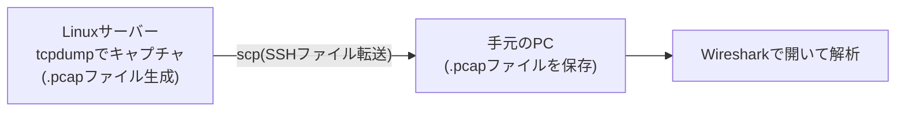

## はじめに

- **この記事で得られること**: リモートのLinuxサーバー(Proxmox VE上のVMなど)で`tcpdump`を使って取得したパケットキャプチャファイル(`.pcap`)を、`scp`コマンドで手元のPCへ転送し、Wiresharkで開いて解析するまでの一連の流れを身につけられます。
- **対象読者**: Wiresharkとパケットキャプチャの扱いがこれから初めてで、[L2TP/IPsecサーバー自作ハンズオン](/articles/l2tp-ipsec-lab-guide)のようにキャプチャファイルの解析を伴うハンズオン記事に取り組みたい方を想定しています。
- **読むのにかかる想定時間**: 約10分

この記事は[『上位1%』シリーズ 全記事ガイド](/sitemap)の一部で、[ハンズオン準備マニュアル](/articles/handson-prep-guide)からテーマ別に分割された記事の1つです。SSHクライアントの使い方は[Teraterm(ターミナルソフト)の使い方](/articles/teraterm-guide)で扱っています。

## この記事で扱う構成

本ブログのハンズオン記事では、Wireshark自体をリモートのLinuxサーバー上で動かすのではなく、**サーバー側では`tcpdump`でキャプチャファイルを取得し、それを手元のPCへ転送してからWiresharkで開く**という構成を採っています。サーバー側にGUI環境を用意する必要がなく、ファイル自体を保存しておけば後からいつでも見返せるという利点があります。



## Step 1: Wiresharkをインストールする

[Wireshark公式サイト](https://www.wireshark.org/download.html)から、お使いのOS(Windows/macOS)向けのインストーラーをダウンロードし、インストールします。インストール中に「Npcap」(パケットキャプチャ用のドライバ)のインストールを求められた場合は、あわせてインストールしておいてください(今回のようにファイルを開くだけの用途でも、将来的に自分のPC自体でライブキャプチャをしたくなった場合に必要になります)。

## Step 2: `scp`でキャプチャファイルを手元のPCへ転送する

`scp`(Secure Copy)は、SSHの暗号化された経路を使ってファイルを転送するコマンドです。Windows 10/11には標準でOpenSSHクライアントが同梱されており、コマンドプロンプトやPowerShellからそのまま使えます(macOS/Linuxのターミナルでも同様に使えます)。

サーバー側で`tcpdump`を使ってキャプチャを取得したら(例: `/tmp/l2tp-capture.pcap`)、手元のPCのコマンドプロンプト/PowerShell/ターミナルで次のように実行します。

```bash
scp <ユーザー名>@<サーバーのIPアドレス>:/tmp/l2tp-capture.pcap ./
```

コマンドの構造は`scp <転送元> <転送先>`です。`ユーザー名@サーバーのIPアドレス:パス`という書式でリモート側のファイルを指定し、末尾の`./`は「カレントディレクトリに保存する」という意味です。実行するとSSHと同様にパスワード(または鍵認証)を求められ、成功するとファイルがコピーされます。

<details>
<summary>Permission denied(権限エラー)が出る場合</summary>

`sudo tcpdump`のようにroot権限でキャプチャを取得した場合、生成された`.pcap`ファイルの所有者はrootになります。SSH接続に使っている一般ユーザーにそのファイルの読み取り権限がないと、`scp`は`Permission denied`で失敗します。サーバー側で次のいずれかの対処が必要です。

- キャプチャ後に`sudo chmod 644 /tmp/l2tp-capture.pcap`のように読み取り権限を緩める(検証用の一時ファイルなので、転送が終わったら削除して問題ありません)。
- `tcpdump`の`-Z`オプションで、キャプチャ実行時のファイル所有者を指定する(例: `sudo tcpdump ... -Z <ユーザー名> -w /tmp/l2tp-capture.pcap`)。

</details>

<details>
<summary>Teratermのファイル転送機能を使う方法もある</summary>

コマンドラインの`scp`の代わりに、[Teraterm](/articles/teraterm-guide)のメニュー「File」→「Transfer」→「SCP」→「Receive file」からも、GUI操作でファイルを取得できます。コマンドを覚えるのが面倒な場合はこちらでも構いません。

</details>

## Step 3: Wiresharkでファイルを開く

Wiresharkを起動し、「File」→「Open...」から、Step 2で転送した`.pcap`ファイルを選択します。あるいは、エクスプローラー上で`.pcap`ファイルをWiresharkのアイコンにドラッグ&ドロップしても開けます。

開くと、パケットが上から時系列順に一覧表示されます。画面上部の「Filter」欄に条件を入力すると、該当するパケットだけに絞り込めます(これを**表示フィルタ**と呼びます)。

| 入力例 | 絞り込まれる内容 |
|---|---|
| `isakmp` | IKE(鍵交換)のやり取りだけを表示 |
| `l2tp` | L2TP制御メッセージだけを表示 |
| `tcp.port == 443` | TCPポート443番(HTTPS)のパケットだけを表示 |
| `ip.addr == 10.10.10.1` | 送信元または宛先が指定したIPアドレスのパケットだけを表示 |

<details>
<summary>表示フィルタとキャプチャフィルタの違い</summary>

Wiresharkには、開いた(または録っている)全パケットの中から表示するものだけを絞り込む**表示フィルタ**(画面上部のFilter欄、`isakmp`のような書式)と、キャプチャを開始する時点でそもそも記録するパケット自体を絞り込む**キャプチャフィルタ**(`tcpdump`のBPF構文、`udp port 500`のような書式)の2種類があります。この記事のようにすでに取得済みのファイルを開いて解析する場合は表示フィルタだけを使いますが、`tcpdump`でキャプチャを取得するコマンド自体([L2TP/IPsecサーバー自作ハンズオン](/articles/l2tp-ipsec-lab-guide)の`udp port 500 or udp port 4500`のような指定)はキャプチャフィルタにあたります。書式が異なる点に注意してください。

</details>

パケットを1つクリックすると、画面中段にプロトコルごとの階層構造(Ethernet→IP→UDP→ISAKMPのように、下位層から上位層へ積み重なった構造)が表示され、それぞれを展開すると個々のフィールドの値まで確認できます。

## まとめ

- 本ブログのハンズオン記事では、サーバー側で`tcpdump`によりキャプチャを取得し、`scp`で手元のPCへ転送してからWiresharkで開く構成を採っています。
- `scp <ユーザー名>@<サーバーのIPアドレス>:<転送元のパス> ./`で、リモートのファイルをカレントディレクトリに転送できます。`sudo`で取得したキャプチャファイルは、権限エラーに注意してください。
- 画面上部のFilter欄に`isakmp`や`ip.addr == ...`のような条件を入力する表示フィルタで、大量のパケットから見たいものだけに絞り込めます。

## 参考文献

- [Wireshark公式サイト](https://www.wireshark.org/)
- [Wireshark User's Guide](https://www.wireshark.org/docs/wsug_html_chunked/)
- [scp(1) — Linux manual page](https://man7.org/linux/man-pages/man1/scp.1.html)
