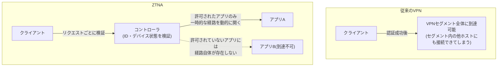
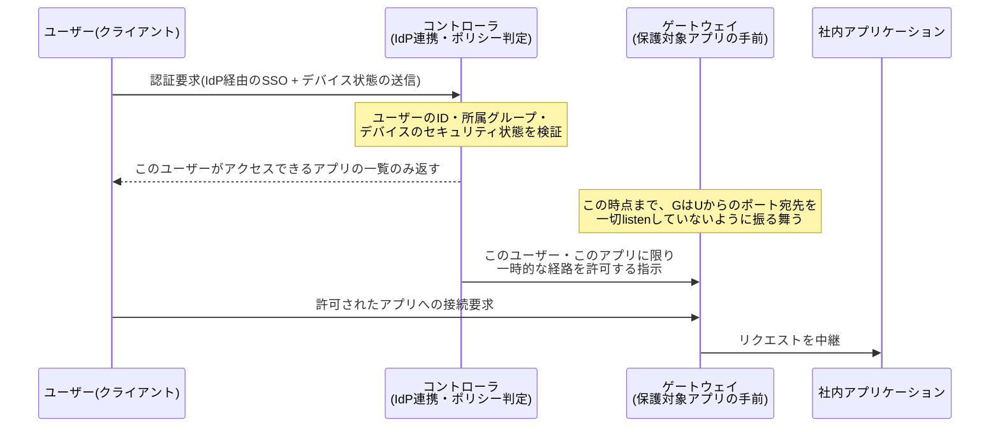

## はじめに

- **この記事で得られること**: ZTNA(Zero Trust Network Access)が、単なる「新しいVPN」ではなく、**VPNが前提とする「一度認証すればネットワークレベルで信頼する」というモデルそのものを捨て、「リクエストのたびに検証する」という別の信頼モデルに立脚している**ことを、SDP(Software-Defined Perimeter)というアーキテクチャの具体的な仕組みから体系的に理解できます。
- **対象読者**: [L2TP/IPsecと現代的なVPNプロトコルを『上位1%』の視点で比較する](/articles/vpn-protocols-comparison-guide)でZTNAという言葉に触れたものの、VPNと何が違うのか、内部でどういう仕組みが動いているのかを説明できない方を想定しています。
- **読むのにかかる想定時間**: 約17分

この記事は[『上位1%』シリーズ 全記事ガイド](/sitemap)の一部です。

## 前提知識

- **VPN(Virtual Private Network)** : 公衆網の上に論理的な専用線を作る技術の総称です。詳しくは[L2TP/IPsecと現代的なVPNプロトコルの比較](/articles/vpn-protocols-comparison-guide)で扱っています。
- **IdP(Identity Provider)** : ユーザーの認証を一元的に担う外部サービスです(Google Workspace、Okta、Microsoft Entra IDなど)。
- **最小権限の原則(Principle of Least Privilege)** : ユーザーやプロセスに対し、業務上必要な範囲を超えた権限を与えないという設計原則です。

## 全体像をつかむ

### 一言で言うと

**VPNが「認証に成功した端末を、ネットワークセグメントの一員として信頼する」モデルであるのに対し、ZTNAは「ネットワークへの参加という概念自体を持たず、個々のアプリケーションへのリクエストのたびに、ユーザー・デバイスの状態を検証してから、必要最小限の経路だけを一時的に開く」モデルです。** 「VPNの次のバージョン」ではなく、**そもそも何を信頼の単位とするかという前提そのものが異なる**、という理解が正確です。

## 基礎から徹底解説

### なぜVPNは「ネットワークレベルの信頼」を前提にしてしまうのか

VPNは、IPアドレスというネットワーク層(レイヤー3)の概念を単位に接続を確立します。クライアントがVPN接続に成功すると、多くの場合VPNセグメント内のIPアドレス帯に対して**ルーティングレベルで到達可能**になります。これは、VPN接続時に払い出される仮想IPアドレスと、社内ネットワークのルーティングテーブルの組み合わせによって実現される、VPNというレイヤー3技術そのものの性質です。

この構造には、次のようなリスクが伴います。**一度認証を突破されてしまう(盗まれた認証情報でログインされる、マルウェアに感染した端末が正規にVPN接続する、など)と、攻撃者はそのVPNセグメント内の他のホストに対しても、ネットワーク層で到達できてしまいます。** 本来アクセスすべきでない社内システムへの侵入経路を、ネットワークそのものが提供してしまうこの現象を**ラテラルムーブメント(横方向移動)** と呼びます。VPN自体の暗号化・認証がどれだけ強固でも、「一度繋がったら、そのネットワークの一員として振る舞える」という設計上の前提そのものが、ラテラルムーブメントの土台になってしまいます。

### SDP(Software-Defined Perimeter)モデル:ネットワークを「見えなく」する

ZTNAの多くは、**SDP(Software-Defined Perimeter)** と呼ばれるアーキテクチャモデルに基づいて実装されています。SDPの中核にあるのは、コントロールプレーンとデータプレーンを分離し、**「認証されるまで、保護対象のリソースはネットワーク上に一切存在しないかのように振る舞う」** という考え方です。

この図の **「認証されるまでゲートウェイは何も応答しないように振る舞う」** という性質は、**SPA(Single Packet Authorization)** と呼ばれる技術で実現されることが多く、認証されていないクライアントがゲートウェイの該当ポートへポートスキャンを行っても、ポートが開いているかどうかすら判別できません(通常のファイアウォールが「閉じているポート」として応答するのに対し、SPAでは「そもそも応答しない」ため、外部からはネットワークの存在自体が見えなくなります)。この、外部から見て保護対象のインフラがまるで存在しないかのように振る舞う性質を指して、**「ダーククラウド」** と表現されることもあります。VPNのIKEやOpenVPNのポートが(認証前であっても)応答を返すのとは対照的な設計です。

### 2つの実装方式:エージェント型とクライアントレス型

ZTNA製品は、大きく2つの実装方式に分かれます。

- **エージェント型(サービスイニシエーテッド/エンドポイントイニシエーテッド)** : 各端末に専用のクライアントソフトウェアをインストールし、社内に設置された**コネクタ**(社内ネットワークからクラウド上のコントローラへ、常時アウトバウンド接続を確立しておくソフトウェア)経由でトンネルを確立します。Webアプリだけでなく、SSHやRDPのような任意のTCP/UDPアプリケーションにも対応できるのが利点です。
- **クライアントレス型(ブラウザベース)** : 専用クライアントをインストールせず、ユーザーのWebブラウザから、IdP連携したリバースプロキシ経由でWebアプリケーションにアクセスします。導入が容易な一方、対象はHTTP(S)ベースのWebアプリケーションに限られます。

いずれの方式でも、**コネクタが社内ネットワークからクラウド側へ「アウトバウンド」で接続を開始する**という点が共通しています。これにより、社内ファイアウォールで「インバウンド接続を一切許可しない」という、より安全なデフォルト構成を維持したまま、外部からのアクセスを実現できます(VPNサーバーが特定のインバウンドポートを開けて待ち受ける必要があるのとは対照的です)。

補足: ZTNA製品の内部通信路にもVPNプロトコルの技術が使われている

「ZTNAはVPNとは別物」と説明してきましたが、コネクタとコントローラ・クライアントとゲートウェイの間の実際の通信路そのものは、TLSや、あるいは[WireGuard](/articles/wireguard-internals-guide)ベースの暗号化トンネル(Cloudflare AccessやTwingateなど)で実装されていることが一般的です。ZTNAが変えているのは「暗号化された通信路を使うかどうか」ではなく、**「その通信路を誰に・いつ・どこまで開くかを決める制御ロジック」** だという点を押さえておくと、VPNプロトコルの知識とZTNAの理解がつながります。

### 継続的な検証:認証は「一度きりのイベント」ではない

ZTNAのもう1つの重要な特徴は、**アクセスを許可した後も、セッションを通じて継続的に検証を行う**ことです。従来のVPNでは、一度認証に成功すれば、切断されるまでそのセッションは信頼され続けるのが一般的でした。ZTNAでは、次のような要素を継続的・断続的にチェックし、条件を満たさなくなった時点でアクセスを取り消します。

- **デバイスポスチャ(端末のセキュリティ状態)** : OSのパッチ適用状況、ディスク暗号化の有無、EDR(Endpoint Detection and Response)が正常に稼働しているかなど。
- **行動パターンの異常**: 通常と異なる地理的位置からのアクセス、短時間での大量データダウンロードなど。
- **ユーザー・グループの所属変更**: IdP側でユーザーが部署異動・退職として処理された場合、ポリシー評価にほぼリアルタイムで反映されます。

「認証(この人は誰か)」と「認可(この人は何をしてよいか)」を接続確立時の1回だけで完結させず、**セッションが続く限り繰り返し評価し続ける**という発想が、「Never trust, always verify(決して信頼せず、常に検証する)」というゼロトラストの標語の実装上の意味です。

## プロが見ている視点(上位1%の理解)

### 「ネットワークを見せない」ことがラテラルムーブメント対策として機能する理由

侵入者(または侵害された端末)の視点に立つと、攻撃の第一段階は多くの場合**偵察(reconnaissance)** ——到達可能なホスト・開いているポートを調べる行為——です。VPNのようにネットワークセグメント全体への到達性を得てしまう構成では、この偵察行為自体を止める手立てがネットワークの構造上ありません。ZTNAが「認証されるまでゲートウェイが応答しない」という設計(SPAによるステルス化)を徹底しているのは、**そもそも攻撃者に偵察の材料そのものを与えない**という、ラテラルムーブメント対策の中でも最も上流に位置する防御だからです。マイクロセグメンテーション(アプリケーション単位でしか到達できない)は、万一1つのアプリケーションへのアクセス権が侵害されても、被害範囲をそのアプリケーション単体に閉じ込める、という多層防御の最後の砦としても機能します。

### ZTNAは「ゼロトラストの実装の1つ」であって、ゼロトラストそのものではない

**ゼロトラスト(Zero Trust)** は、NIST SP 800-207などで定義される、より広いセキュリティの設計思想・アーキテクチャ原則の名称です。ZTNAは、その原則をリモートアクセス(社外から社内リソースへのアクセス)という具体的な場面に適用した実装形態の1つに過ぎません。ゼロトラストの原則は、リモートアクセスだけでなく、社内ネットワーク内部の通信(マイクロサービス間の通信など)にも同様に適用されるべきものであり、「ZTNAを導入した=ゼロトラストを実現した」と等号で結ぶのは正確ではありません。

## よくある誤解・つまずきポイント

- **誤解1: 「ZTNAを導入すれば、VPNは完全に不要になる」**
  拠点間のサイト間接続や、ユーザー単位のIdP連携が難しいレガシーなOT(制御技術)機器など、ZTNAの前提(ユーザー単位の認証、Webまたは特定TCP/UDPアプリケーション単位でのアクセス)がそもそも当てはまらない場面も存在します。多くの組織では、リモートアクセスVPNをZTNAに置き換えつつ、サイト間VPNは併存させるという構成が現実的です。
- **誤解2: 「ゼロトラストとは、VPNのようなネットワーク境界防御を一切使わないという意味だ」**
  ゼロトラストが否定しているのは「ネットワークの内側にいることそのものを信頼の根拠にする」という前提であり、暗号化されたトンネルや境界防御の技術自体を使わないという意味ではありません。ZTNA自体、内部の通信路にTLSやWireGuardベースの暗号化トンネルを使っています。
- **誤解3: 「ZTNAは特定の1つの製品・規格を指す固有名詞だ」**
  ZTNAは、Zscaler Private Access、Cloudflare Access、Twingateなど複数のベンダーが提供する、共通のアーキテクチャモデル(SDP)に基づく製品カテゴリの総称です。ベンダーによって実装方式(エージェント型かクライアントレス型か)や内部の通信路の技術は異なります。

## 障害・トラブルシューティングの視点

ZTNAでアクセスできない場合のトラブルシューティングは、**「認証(Authentication)」「デバイスポスチャ」「認可(Authorization/ポリシー)」のどの段階で拒否されているかを切り分ける**ことが出発点になります。

1. **IdPでのログイン自体が失敗する**: IdP側の認証エラー(パスワード誤り、MFA未設定など)が原因で、ZTNAコントローラ以前の問題です。IdP側のログを確認します。
2. **ログインは成功するが、特定のアプリだけアクセスできない**: ポリシー(誰が・どのアプリにアクセスしてよいか)の設定漏れ、あるいはユーザーが想定しているグループに所属していない、といった認可段階の問題が典型的です。
3. **普段はアクセスできるのに、特定の端末からだけ拒否される**: デバイスポスチャチェック(OSパッチ未適用、EDR停止中など)に引っかかっている可能性があります。ZTNA管理コンソールのアクセスログで、拒否理由が認証エラーなのかポスチャチェックの失敗なのかを確認します。

### 予防策・恒久対策

- ポリシー変更時は、影響を受けるユーザー・アプリの組み合わせを事前にシミュレーションできる管理コンソールの機能を使い、意図しないアクセス遮断を防ぐ。
- デバイスポスチャの要件(パッチ適用期限、EDR必須など)は、現場の運用実態と乖離しすぎないよう、セキュリティ部門と利用部門で事前にすり合わせておく。
- サイト間接続やIdP連携が困難なレガシー機器については、ZTNAで無理に統一しようとせず、既存のVPN(またはネットワークセグメンテーション)を計画的に併存させる。

## まとめ

- ZTNAは「新しいVPN」ではなく、VPNが前提とする「一度認証すればネットワークレベルで信頼する」モデルを捨て、リクエストのたびにユーザー・デバイスの状態を検証する、信頼モデルそのものが異なるアーキテクチャです。
- SDP(Software-Defined Perimeter)モデルでは、認証されるまでゲートウェイが一切応答しない(SPAによるステルス化)ことで、攻撃者に偵察の材料そのものを与えず、ラテラルムーブメントを構造的に抑制します。
- エージェント型・クライアントレス型のいずれの実装でも、コネクタが社内から社外へアウトバウンド接続を開始するため、社内ファイアウォールにインバウンドポートを開ける必要がありません。
- 内部の通信路自体はTLSやWireGuardベースの暗号化トンネルであることが多く、ZTNAが変えているのは暗号化技術そのものではなく「誰に・いつ・どこまで通信路を開くかを決める制御ロジック」です。
- ZTNAはゼロトラストという広い原則の一実装であり、サイト間接続やレガシー機器との併存を含め、既存のVPNを完全に置き換えるとは限りません。

**今日から意識すべきこと**
1. ZTNAへのアクセス障害に遭遇したら、認証・デバイスポスチャ・認可のどの段階で拒否されているかを、管理コンソールのログでまず切り分けましょう。
2. 新規のリモートアクセス要件を検討する際は、「VPNかZTNAか」の二択ではなく、ユーザー単位の認証が可能か・対象がWeb/特定アプリに限定できるかを軸に適用範囲を判断しましょう。

## 参考文献

- [NIST SP 800-207: Zero Trust Architecture](https://nvlpubs.nist.gov/nistpubs/specialpublications/nist.sp.800-207.pdf)
- [Cloud Security Alliance: Software-Defined Perimeter (SDP) and Zero Trust](https://cloudsecurityalliance.org/artifacts/software-defined-perimeter-zero-trust)

