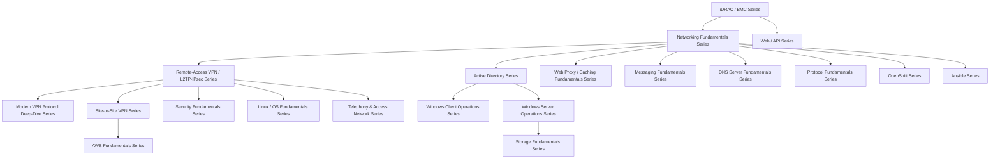

## About this series

This series aims for the level of understanding held by "the top 1% of infrastructure engineers, even among those working at the leading infrastructure companies like AWS and Google." Rather than just memorizing operational steps, the goal is to thoroughly explain:

- The internal mechanics and design rationale behind why something is built the way it is
- How to actually diagnose and troubleshoot the problems that come up in production

...in a way that lets even a beginner climb the ladder one step at a time. When a topic gets too large, we don't force it into a single article — we split it by theme and link the articles together. This page is the table of contents, recommended reading order, and sitemap across all of them. It gets updated every time a new topic is added.

## Recommended reading order

This page used to cram every article into a single giant diagram, but chaining everything back through the iDRAC article as the root made things — especially everything under the VPN/L2TP-IPsec series — too dense to read. So article-level derivation is now shown within each series' own section (in "Series list" below), and this diagram is scaled back to a simple map of **how the series relate to each other.**

**The basic path**: Start with the iDRAC article, branch into the Networking Fundamentals and Web/API series, follow the L2TP/IPsec article's thread from Networking Fundamentals into the Remote-Access VPN/L2TP-IPsec series, and dig deeper from there into the Site-to-Site VPN series, Security Fundamentals, Linux/OS Fundamentals, and Telephony. That's the main line of derivation between articles. That said, every article is written to be **fully readable on its own**, so feel free to start with whichever series or article interests you. Note also that some articles in the Networking Fundamentals series (NAT/NAPT, virtual IPs, TCP/UDP sessions, DNS) actually branch off from the L2TP/IPsec article in the Remote-Access VPN series — the series don't form a strict one-way tree; some cross-reference each other. The remote-access and site-to-site VPN articles used to be bundled into a single "VPN/L2TP-IPsec Series," but since they serve different audiences and use cases, they've since been split into two separate series. The Active Directory series is a new series digging into questions that come up constantly in real AD migration and DC operation work, and assumes you've read the Networking Fundamentals series (especially DNS).

The recommended reading order within each series is noted in that series' description under "Series list" below (the ①②③... numbers before each article title are the recommended order within that series). Goal-based recommended routes are collected in "Recommended routes by reader type," next.

## Recommended Routes by Reader Type

This blog is written for a wide range of readers — from people with no experience aiming to become infrastructure engineers, to engineers on the front line at top-tier companies like AWS and Google. You don't have to read every article in order, so here are eight routes matched to career stage. **Pick the tab closest to you below and only that route will show** (route ② and beyond each assume every STEP before it). Once you've picked a STEP, you can also use the filter below it to narrow the list down to just "Articles," "Hands-On," "Audio Review," or "Audio Lecture." Niche articles that only matter in a very specific real-world situation aren't force-fit into every route — each one is introduced for the first time in the route where it actually becomes relevant (earlier routes just mention it briefly as optional). These routes are split purely by **reader level and proficiency** — if you want to read everything in one specific field (Active Directory, container platforms, and so on) in one go, use "Series list" below or the filter feature on the top page instead. This used to be five STEPs, but as the article count grew, the load per STEP became uneven, so the "on the job, building confidence" stage is now split into four depths — foundations, expanding scope, running it solo, and adjacent infrastructure — to make the load per STEP more even.

<input type="radio" name="persona-route" id="persona-tab-1" class="persona-input" checked>
<input type="radio" name="persona-route" id="persona-tab-2" class="persona-input">
<input type="radio" name="persona-route" id="persona-tab-3" class="persona-input">
<input type="radio" name="persona-route" id="persona-tab-4" class="persona-input">
<input type="radio" name="persona-route" id="persona-tab-5" class="persona-input">
<input type="radio" name="persona-route" id="persona-tab-6" class="persona-input">
<input type="radio" name="persona-route" id="persona-tab-7" class="persona-input">
<input type="radio" name="persona-route" id="persona-tab-8" class="persona-input">
<input type="radio" name="content-filter" id="content-filter-all" class="persona-input" checked>
<input type="radio" name="content-filter" id="content-filter-main" class="persona-input">
<input type="radio" name="content-filter" id="content-filter-handson" class="persona-input">
<input type="radio" name="content-filter" id="content-filter-audio" class="persona-input">
<input type="radio" name="content-filter" id="content-filter-lecture" class="persona-input">

<label for="persona-tab-1" class="persona-tab">STEP1 🌱 Self-taught, no experience yet</label>
<label for="persona-tab-2" class="persona-tab">STEP2 🔧 Year 1, entering design/build work</label>
<label for="persona-tab-3" class="persona-tab">STEP3 💪 On the job, building confidence (foundations)</label>
<label for="persona-tab-4" class="persona-tab">STEP4 💪 On the job, building confidence (expanding scope)</label>
<label for="persona-tab-5" class="persona-tab">STEP5 💪 On the job, building confidence (running it solo)</label>
<label for="persona-tab-6" class="persona-tab">STEP6 💪 On the job, building confidence (adjacent infrastructure)</label>
<label for="persona-tab-7" class="persona-tab">STEP7 📈 Aiming for a higher-paying job</label>
<label for="persona-tab-8" class="persona-tab">STEP8 🏆 Aiming for the top 1%</label>

↳ Filter by type:
<label for="content-filter-all" class="filter-chip">All</label>
<label for="content-filter-main" class="filter-chip">Articles</label>
<label for="content-filter-handson" class="filter-chip">Hands-On</label>
<label for="content-filter-audio" class="filter-chip">Audio Review</label>
<label for="content-filter-lecture" class="filter-chip">Audio Lecture</label>

<h3>🌱 For those aiming to become an infrastructure engineer with no prior experience</h3>

A route that builds the foundational way of thinking in each area, without going too deep. These 8 articles are the shared starting point for every other route below.

<ol class="persona-route-list">
<li><a href="/en/articles/idrac-guide">What Is iDRAC? Understanding How It Works from a "Top 1%" Perspective</a></li>
<li><a href="/en/articles/network-stack-guide">Understanding the Network Stack from a "Top 1%" Perspective</a></li>
<li><a href="/en/articles/network-devices-guide">Understanding the Differences Between Hubs, Switches (L2SW), L3 Switches, and Routers from a "Top 1%" Perspective</a></li>
<li><a href="/en/articles/nat-guide">Understanding How NAT/NAPT Works from a "Top 1%" Perspective</a></li>
<li><a href="/en/articles/dns-guide">Understanding How DNS Works from a "Top 1%" Perspective</a></li>
<li><a href="/en/articles/circuit-switching-ppp-guide">Understanding the Difference Between Telephone Lines and IP Networks from a "Top 1%" Perspective</a></li>
<li><a href="/en/articles/access-network-guide">Understanding the Evolution of Access-Line Technology — ADSL, Fiber, and More — from a "Top 1%" Perspective</a></li>
<li><a href="/en/articles/restful-api-guide">What Is a RESTful API? Understanding from HTTP/JSON Basics to Practical Design from a "Top 1%" Perspective</a></li>
<li><a href="/en/articles/payment-api-guide">Understanding Payment APIs from a "Top 1%" Perspective</a></li>
</ol>

<h3>🔧 For infrastructure engineers in year 1, ready to take on design/build work</h3>

Builds on STEP1 with the VPN, cryptography, and certificate topics that design/build work always ends up touching.

<ol class="persona-route-list">
<li>STEP1's 9 articles (iDRAC through the payment API guide — see that tab above)</li>
<li><a href="/en/articles/l2tp-ipsec-guide">Understanding How L2TP/IPsec Works from a "Top 1%" Perspective</a></li>
<li><a href="/en/articles/pki-guide">Understanding PKI and Digital Certificates from a "Top 1%" Perspective</a></li>
<li><a href="/en/articles/symmetric-encryption-guide">Understanding Symmetric Encryption (AES) and HMAC/AEAD from a "Top 1%" Perspective</a></li>
<li><a href="/en/articles/tcp-udp-session-port-guide">Understanding the Relationship Between TCP/UDP "Sessions" and Port Numbers from a "Top 1%" Perspective</a></li>
<li><a href="/en/articles/vpn-protocols-comparison-guide">Comparing L2TP/IPsec to Modern VPN Protocols from a "Top 1%" Perspective</a></li>
<li><a href="/en/articles/ipsec-ah-guide">Understanding IPsec's AH (Authentication Header) from a "Top 1%" Perspective</a></li>
<li><a href="/en/articles/windows-defender-guide">Understanding How Microsoft Defender Works from a "Top 1%" Perspective</a></li>
<li><a href="/en/articles/windows-process-task-guide">Understanding the Difference Between Processes, Tasks, and Threads in Windows from a "Top 1%" Perspective</a></li>
<li><a href="/en/articles/unicode-filename-normalization-guide">Why Do Files With Identical-Looking Names Have Different Character Counts in Windows?</a></li>
<li><a href="/en/articles/windows-install-media-guide">Understanding the Difference Between x64 and x86 Installers from a "Top 1%" Perspective</a></li>
<li data-subseries="handson"><a href="/en/articles/windows-defender-eicar-handson-guide">A Top-1% Hands-On Lab: Confirming Windows Defender's Detection with the EICAR Test File</a></li>
<li><a href="/en/articles/malware-infection-mechanics-guide">Understanding How Malware Infection Actually Happens from a Top-1% Perspective</a></li>
<li><a href="/en/articles/practical-server-security-measures-guide">Understanding Practical Security Measures for Building and Operating Servers from a Top-1% Perspective</a></li>
<li><a href="/en/articles/monitor-edid-guide">Understanding How a Monitor's Layout Settings Get Restored from a Top-1% Perspective</a></li>
<li><a href="/en/articles/iso-mount-guide">Understanding What "Mounting" an ISO File Actually Does from a Top-1% Perspective</a></li>
<li><a href="/en/articles/office-click-to-run-conflict-guide">Understanding Why Conflicting Office Editions Become Impossible to Uninstall from a Top-1% Perspective</a></li>
<li data-subseries="audio"><a href="/en/articles/windows-client-audio-review-guide">[Listen] The Windows Client Operations Series, Fully Recapped</a></li>
<li><a href="/en/articles/proxy-firewall-guide">Understanding When to Use a Proxy vs. a Firewall from a "Top 1%" Perspective</a></li>
<li><a href="/en/articles/http-caching-cdn-guide">Understanding the Rise of HTTPS and the End of Proxy Caching from a "Top 1%" Perspective</a></li>
<li><a href="/en/articles/protocol-design-guide">Understanding What a Protocol Actually Is From a "Top 1%" Perspective</a></li>
<li><a href="/en/articles/icmp-guide">Understanding How ICMP Works From a "Top 1%" Perspective</a></li>
</ol>

🔍 <strong>If you run into it on the job (optional)</strong>: <a href="/en/articles/windows-server-l2tp-vpn-guide">Windows Server (RRAS) L2TP/IPsec VPN setup</a>, <a href="/en/articles/site-to-site-vpn-guide">site-to-site VPN</a>, and <a href="/en/articles/local-gov-network-guide">Japanese local government network segregation</a> are niche articles for people who actually hit that specific situation. No need to read them now — save them for when a search lands you there, or when curiosity strikes (STEP3 covers them properly).

<h3>💪 For those on the job in design/build work who still don't feel confident (foundations)</h3>

This is where "I sort of know this" starts turning into working knowledge. It covers hands-on VPN construction, site-to-site VPN, and the hands-on basics of doing things with your own hands — setting up a virtualization environment, first-time OS setup, terminal/packet-capture tools, and troubleshooting drills.

<ol class="persona-route-list">
<li>STEP1 and STEP2's 30 articles (see those tabs above)</li>
<li><a href="/en/articles/windows-server-l2tp-vpn-guide">Why Does a VPN Client Need a Gateway on the Same Subnet? — Understanding IP Address Management in Windows Server (RRAS) L2TP/IPsec VPN from a "Top 1%" Perspective</a></li>
<li><a href="/en/articles/site-to-site-vpn-guide">Understanding Site-to-Site VPN from a "Top 1%" Perspective</a></li>
<li><a href="/en/articles/local-gov-network-guide">Understanding Japanese Local Government Network Segregation and Security Clouds from a "Top 1%" Perspective</a></li>
<li><a href="/en/articles/virtual-ip-guide">Understanding Virtual IPs (VIPs) and NIC Teaming's Virtual IP from a "Top 1%" Perspective</a></li>
<li><a href="/en/articles/windows-network-adapter-guide">Understanding Windows Multi-Adapter Networking and Network Location Awareness from a "Top 1%" Perspective</a></li>
<li data-subseries="handson"><a href="/en/articles/handson-prep-guide">Hands-On Prep Manual: From Creating a VM in Proxmox VE to Installing an OS</a></li>
<li data-subseries="handson"><a href="/en/articles/ubuntu-server-setup-guide">Hands-On Prep Manual: Setting Up an Ubuntu Server for the First Time</a></li>
<li data-subseries="handson"><a href="/en/articles/windows-server-setup-guide">Hands-On Prep Manual: Setting Up Windows Server 2025 for the First Time and Enabling SSH (GUI Only)</a></li>
<li data-subseries="handson"><a href="/en/articles/teraterm-guide">Hands-On Prep Manual: How to Use Teraterm (a Terminal Client)</a></li>
<li data-subseries="handson"><a href="/en/articles/wireshark-guide">Hands-On Prep Manual: How to Use Wireshark</a></li>
<li data-subseries="audio"><a href="/en/articles/handson-prep-audio-review-guide">[Listen] The Hands-On Prep Series, Fully Recapped</a></li>
<li data-subseries="handson"><a href="/en/articles/l2tp-ipsec-lab-guide">A "Top 1%" Hands-On Lab: Building Your Own L2TP/IPsec Server and Verifying the Theory Yourself</a></li>
<li data-subseries="handson"><a href="/en/articles/l2tp-ipsec-troubleshooting-lab">L2TP/IPsec Troubleshooting Lab: Diagnosing Real Failures from Error Logs, a "Top 1%" Hands-On Exercise</a></li>
<li><a href="/en/articles/windows-rras-roles-guide">Understanding the Differences Between VPN Access, Dial-Up Access, Demand-Dial Access, NAT, and LAN Routing in Windows Server RRAS from a "Top 1%" Perspective</a></li>
</ol>

<h3>💪 For those on the job in design/build work who still don't feel confident (expanding scope)</h3>

On top of STEP3, this route adds larger-scale design work — site-to-site VPN with AWS, SD-WAN — plus the design philosophy of directory services (the core of internal infrastructure), practical DNS work, and the basics of health checks, expanding the range of work you're trusted with.

<ol class="persona-route-list">
<li>STEP1 through STEP3's 44 articles (see those tabs above)</li>
<li data-subseries="audio"><a href="/en/articles/vpn-audio-review-guide">[Listen] The Remote-Access VPN / L2TP-IPsec Series, Fully Recapped</a></li>
<li><a href="/en/articles/site-to-site-vpn-aws-guide">Understanding Site-to-Site VPN with AWS from a "Top 1%" Perspective</a></li>
<li><a href="/en/articles/sdwan-edge-router-guide">Understanding SD-WAN and Edge Router Selection from a "Top 1%" Perspective</a></li>
<li data-subseries="lecture"><a href="/en/articles/ad-audio-lecture-1-guide">[Audio Lecture] Active Directory, Part 1</a></li>
<li data-subseries="lecture"><a href="/en/articles/ad-audio-lecture-2-guide">[Audio Lecture] Active Directory, Part 2</a></li>
<li data-subseries="lecture"><a href="/en/articles/ad-audio-lecture-3-guide">[Audio Lecture] Active Directory, Part 3</a></li>
<li><a href="/en/articles/ad-dc-fundamentals-guide">Understanding the Difference Between AD and DC, and Domains vs. Forests, from a "Top 1%" Perspective</a></li>
<li><a href="/en/articles/ad-computername-netdom-guide">What's the Difference Between sysdm.cpl and netdom computername?</a></li>
<li><a href="/en/articles/ad-windows-login-guide">Understanding Windows Logon and User Profiles from a "Top 1%" Perspective</a></li>
<li><a href="/en/articles/ad-dns-guide">Why Is DNS in an AD Environment Designed This Way?</a></li>
<li><a href="/en/articles/dns-zones-records-guide">Reading DNS Zones and Records from a "Top 1%" Perspective</a></li>
<li><a href="/en/articles/fsmo-guide">Understanding FSMO (Operations Master) Roles from a "Top 1%" Perspective</a></li>
<li><a href="/en/articles/dc-health-check-guide">Understanding DC Health Checks from a "Top 1%" Perspective</a></li>
<li><a href="/en/articles/ad-sites-guide">Understanding AD "Sites" and Replication Topology from a "Top 1%" Perspective</a></li>
<li><a href="/en/articles/dcdiag-guide">Reading dcdiag /v from a "Top 1%" Perspective</a></li>
<li><a href="/en/articles/ad-migration-cleanup-guide">Understanding Post-Migration AD Cleanup from a "Top 1%" Perspective</a></li>
<li><a href="/en/articles/ad-spn-guide">Understanding SPNs (Service Principal Names) from a "Top 1%" Perspective</a></li>
</ol>

🔍 <strong>If you run into it on the job (optional)</strong>: <a href="/en/articles/windows-server-l2tp-vpn-guide">Windows Server (RRAS) L2TP/IPsec VPN setup</a>, <a href="/en/articles/site-to-site-vpn-guide">site-to-site VPN</a>, and <a href="/en/articles/local-gov-network-guide">Japanese local government network segregation</a> are niche articles for people who actually hit that specific situation (STEP3 covers them properly).

<h3>💪 For those on the job in design/build work who still don't feel confident (running it solo)</h3>

On top of STEP4's directory-services basics, this route adds the deep, "breaking this has a big blast radius" areas — authentication, replication, migration — plus hands-on labs building a multi-domain forest and migrating a DC, so you can run infrastructure you've been handed on your own with confidence. It also covers Windows Server procurement and time-sync basics.

<ol class="persona-route-list">
<li>STEP1 through STEP4's 61 articles (see those tabs above)</li>
<li><a href="/en/articles/ad-netlogon-guide">Understanding the Netlogon Service and the Secure Channel from a "Top 1%" Perspective</a></li>
<li><a href="/en/articles/ad-kerberos-guide">Understanding Kerberos Authentication from a "Top 1%" Perspective</a></li>
<li><a href="/en/articles/ad-sysvol-dfsr-gpo-guide">Understanding SYSVOL, DFSR, and Group Policy from a "Top 1%" Perspective</a></li>
<li data-subseries="lecture"><a href="/en/articles/ad-audio-lecture-4-guide">[Audio Lecture] Active Directory, Part 4 (Final)</a></li>
<li><a href="/en/articles/ad-family-overview-guide">Understanding AD DS, AD CS, AD FS, AD LDS, and AD RMS from a Top-1% Perspective</a></li>
<li><a href="/en/articles/ad-ldap-protocol-guide">Understanding the LDAP Protocol from a Top-1% Perspective</a></li>
<li><a href="/en/articles/ad-netbios-dns-history-guide">Understanding Why NetBIOS Names and DNS Hostnames Coexist from a Top-1% Perspective</a></li>
<li><a href="/en/articles/ad-schema-extension-guide">Understanding AD Schema Extension from a Top-1% Perspective</a></li>
<li><a href="/en/articles/ad-dotnet-powershell-guide">Understanding the Relationship Between .NET Framework and PowerShell from a Top-1% Perspective</a></li>
<li><a href="/en/articles/ad-isp-guide">Understanding What an ISP Is from a Top-1% Perspective</a></li>
</ol>

▶ AD Hands-On: Foundational Tier (build along with as a beginner)

<ol class="persona-route-list">
<li data-subseries="handson"><a href="/en/articles/ad-multidomain-handson-guide">Hands-On: Building a Multi-Domain, Multi-Tree AD Forest</a></li>
<li data-subseries="handson"><a href="/en/articles/ad-migration-handson-guide">Hands-On: Migrating From an Old DC to a New One</a></li>
</ol>

▶ AD Hands-On: Real-World Scenario Tier

<ol class="persona-route-list">
<li data-subseries="handson"><a href="/en/articles/ad-forest-trust-handson-guide">A Hands-On Lab: Building Trust Between Two Independent Forests in an Acquisition Scenario</a></li>
<li data-subseries="handson"><a href="/en/articles/ad-recycle-bin-handson-guide">A Hands-On Lab: Restoring an Accidentally Deleted User or OU With the AD Recycle Bin</a></li>
<li data-subseries="handson"><a href="/en/articles/ad-gpo-handson-guide">A Hands-On Lab: GPO Precedence and Troubleshooting</a></li>
<li data-subseries="handson"><a href="/en/articles/ad-fgpp-handson-guide">A Hands-On Lab: Applying Different Password Requirements Per Department With a Fine-Grained Password Policy (PSO)</a></li>
<li data-subseries="handson"><a href="/en/articles/ad-delegation-handson-guide">The Top 1% Hands-On for Delegating OU Control to the Help Desk</a></li>
<li data-subseries="handson"><a href="/en/articles/ad-constrained-delegation-handson-guide">The Top 1% Hands-On for Solving the "Double Hop Problem" With Kerberos Constrained Delegation</a></li>
<li data-subseries="handson"><a href="/en/articles/ad-backup-restore-handson-guide">The Top 1% Hands-On for System State Backup and Authoritative Restore</a></li>
<li data-subseries="handson"><a href="/en/articles/ad-fsmo-seize-handson-guide">The Top 1% Hands-On for Seizing FSMO Roles When an Old DC Is Permanently Gone</a></li>
</ol>

▶ AD Hands-On: Niche-Spec Tier

<ol class="persona-route-list">
<li data-subseries="handson"><a href="/en/articles/ad-gmsa-handson-guide">The Top 1% Hands-On for Escaping Service Account Password Management With a gMSA</a></li>
<li data-subseries="handson"><a href="/en/articles/ad-cs-handson-guide">The Top 1% Hands-On for Building an Enterprise CA With AD CS and Automatic Certificate Enrollment</a></li>
<li data-subseries="handson"><a href="/en/articles/ad-rodc-handson-guide">The Top 1% Hands-On for Deploying a Branch-Office RODC (Read-Only Domain Controller)</a></li>
<li data-subseries="handson"><a href="/en/articles/ad-functional-level-handson-guide">The Top 1% Hands-On for Raising Domain and Forest Functional Levels</a></li>
<li data-subseries="handson"><a href="/en/articles/ad-dns-scavenging-handson-guide">The Top 1% Hands-On for Configuring AD-Integrated DNS Scavenging</a></li>
<li data-subseries="handson"><a href="/en/articles/ad-sitelink-topology-handson-guide">The Top 1% Hands-On for Controlling Replication Paths With Site Link Cost</a></li>
</ol>

▶ AD Hands-On: Security-Hardening Tier (experience an attacker's perspective)

<ol class="persona-route-list">
<li data-subseries="handson"><a href="/en/articles/ad-kerberoasting-handson-guide">The Top 1% Hands-On for Reproducing Kerberoasting Yourself and Defending Service Accounts</a></li>
<li data-subseries="handson"><a href="/en/articles/ad-dcsync-audit-handson-guide">The Top 1% Hands-On for Auditing the Replication Rights DCSync Abuses</a></li>
</ol>
<ol class="persona-route-list">
<li data-subseries="audio"><a href="/en/articles/ad-audio-review-guide">[Listen] The Active Directory Series, Fully Recapped</a></li>
<li><a href="/en/articles/windows-server-licensing-guide">Understanding Windows Server Licensing (OEM, Datacenter, Standard) from a "Top 1%" Perspective</a></li>
<li><a href="/en/articles/windows-ntp-server-guide">Understanding the Configuration Values for Building an NTP Server on Windows Server from a "Top 1%" Perspective</a></li>
</ol>

<h3>💪 For those on the job in design/build work who still don't feel confident (adjacent infrastructure)</h3>

On top of STEP5, this route adds the infrastructure adjacent to your core stack — web servers (IIS), file sharing (SMB), storage, cloud, email infrastructure, and container platforms/config-management automation. This completes the "building confidence" route. If you want to read one specific field in one go, use the filter feature on the top page instead.

<ol class="persona-route-list">
<li>STEP1 through STEP5's 92 articles (see those tabs above)</li>
<li><a href="/en/articles/iis-fundamentals-guide">Understanding How IIS and ASP.NET Work from a "Top 1%" Perspective</a></li>
<li><a href="/en/articles/iis-ftp-guide">Understanding the Relationship Between IIS and FTP from a "Top 1%" Perspective</a></li>
<li><a href="/en/articles/smb-file-sharing-guide">Understanding Windows Server SMB File Sharing from a "Top 1%" Perspective</a></li>
<li data-subseries="handson"><a href="/en/articles/minimal-http-server-handson-guide">A "Top 1%" Hands-On Lab: Writing Your Own HTTP Server From Scratch</a></li>
<li><a href="/en/articles/smb-cifs-linux-interop-guide">What's the Difference Between SMB and CIFS? Understanding Windows-Linux File Sharing from a "Top 1%" Perspective</a></li>
<li data-subseries="audio"><a href="/en/articles/windows-server-audio-review-guide">[Listen] The Windows Server Operations Series, Fully Recapped</a></li>
<li><a href="/en/articles/disk-raid-fundamentals-guide">Understanding the Relationship Between RAID and Windows Disk Management from a "Top 1%" Perspective</a></li>
<li><a href="/en/articles/fc-san-fundamentals-guide">Understanding the Difference Between Fibre Channel and LAN Connections from a "Top 1%" Perspective</a></li>
<li><a href="/en/articles/ntfs-mft-internals-guide">Understanding How the NTFS File System Works from a Top-1% Perspective</a></li>
<li><a href="/en/articles/aws-ec2-networking-basics-guide">Understanding EC2 Key Pairs (.pem/.ppk) and Reserved Subnet IPs from a "Top 1%" Perspective</a></li>
<li data-subseries="handson"><a href="/en/articles/aws-ec2-webserver-handson-guide">The Top 1% Hands-On for Launching an EC2 Instance and Publishing a Web Server</a></li>
<li data-subseries="handson"><a href="/en/articles/aws-iam-role-handson-guide">The Top 1% Hands-On for Never Giving EC2 an Access Key With an IAM Role</a></li>
<li data-subseries="handson"><a href="/en/articles/aws-s3-static-website-handson-guide">The Top 1% Hands-On for Publishing a Static Website From an S3 Bucket</a></li>
<li data-subseries="handson"><a href="/en/articles/aws-vpc-handson-guide">The Top 1% Hands-On for Building a VPC With Public/Private Subnets Yourself</a></li>
<li data-subseries="handson"><a href="/en/articles/aws-rds-secrets-handson-guide">The Top 1% Hands-On for Never Letting an App Write a Password With RDS and Secrets Manager</a></li>
<li data-subseries="handson"><a href="/en/articles/aws-vpc-endpoint-handson-guide">The Top 1% Hands-On for Reaching S3 Without a NAT Gateway Using a VPC Endpoint</a></li>
<li data-subseries="handson"><a href="/en/articles/aws-ebs-snapshot-handson-guide">The Top 1% Hands-On for Building a Backup/Restore Strategy With EBS Snapshots and AMIs</a></li>
<li data-subseries="handson"><a href="/en/articles/aws-least-privilege-policy-handson-guide">The Top 1% Hands-On for Reproducing the Danger of an Overly Broad IAM Policy and Scoping It to Least Privilege</a></li>
<li data-subseries="handson"><a href="/en/articles/aws-cloudtrail-guardduty-handson-guide">The Top 1% Hands-On for Detecting a Leaked Access Key's Misuse With CloudTrail and GuardDuty</a></li>
<li data-subseries="audio"><a href="/en/articles/aws-basics-audio-review-guide">[Listen] The AWS Fundamentals Series, Fully Recapped</a></li>
<li><a href="/en/articles/m365-email-fundamentals-guide">Understanding Email Migration to M365 from a "Top 1%" Perspective</a></li>
<li><a href="/en/articles/mail-server-fundamentals-guide">Understanding Mail Server Fundamentals from a "Top 1%" Perspective — MTA, MDA, MUA, and the Roles of Postfix and Dovecot</a></li>
<li data-subseries="handson"><a href="/en/articles/mail-server-handson-guide">A "Top 1%" Hands-On Lab: Building a Mail Server with Postfix and Dovecot</a></li>
<li><a href="/en/articles/dns-server-fundamentals-guide">Understanding DNS Server Fundamentals from a "Top 1%" Perspective — BIND's Zone Files and Master/Slave Configuration</a></li>
<li data-subseries="handson"><a href="/en/articles/dns-server-handson-guide">A "Top 1%" Hands-On Lab: Building a DNS Server With BIND and Experiencing a Zone Transfer</a></li>
<li><a href="/en/articles/openshift-guide">Understanding What OpenShift Actually Is From a "Top 1%" Perspective — Its Relationship to Kubernetes</a></li>
<li data-subseries="handson"><a href="/en/articles/openshift-handson-guide">A "Top 1%" Hands-On Lab: Running a Container Application on OpenShift Local</a></li>
<li><a href="/en/articles/ansible-guide">Understanding What Ansible Actually Is From a "Top 1%" Perspective — Configuration Management and the Agentless Model</a></li>
<li data-subseries="handson"><a href="/en/articles/ansible-handson-guide">A "Top 1%" Hands-On Lab: Automating Configuration Across Multiple Servers with Ansible</a></li>
<li data-subseries="handson"><a href="/en/articles/ansible-roles-handson-guide">The Top 1% Hands-On for Real-World Config Management With Ansible Roles, Handlers, and Templates</a></li>
<li data-subseries="handson"><a href="/en/articles/ansible-vault-handson-guide">The Top 1% Hands-On for Never Leaving a Password in Plaintext in Git With Ansible Vault</a></li>
<li data-subseries="handson"><a href="/en/articles/ansible-aws-dynamic-inventory-handson-guide">The Top 1% Hands-On for Escaping the Static IP List With Ansible's AWS Dynamic Inventory</a></li>
<li data-subseries="handson"><a href="/en/articles/ansible-environments-handson-guide">The Top 1% Hands-On for Safely Running dev/staging/prod From One Ansible Playbook</a></li>
<li data-subseries="handson"><a href="/en/articles/ansible-galaxy-collections-handson-guide">The Top 1% Hands-On for Using Community Roles and Collections With Ansible Galaxy</a></li>
<li data-subseries="handson"><a href="/en/articles/ansible-jinja2-loops-handson-guide">The Top 1% Hands-On for Experiencing Ansible's Jinja2 Filters and the loop/when Gotchas</a></li>
<li data-subseries="handson"><a href="/en/articles/ansible-facts-caching-handson-guide">The Top 1% Hands-On for Speeding Up a Large Inventory by Caching Ansible Facts</a></li>
<li data-subseries="handson"><a href="/en/articles/ansible-error-handling-handson-guide">The Top 1% Hands-On for Designing a Rollback on Failed Configuration Changes With Ansible's block/rescue/always</a></li>
<li data-subseries="handson"><a href="/en/articles/ansible-secrets-exposure-handson-guide">The Top 1% Hands-On for Closing Off the Paths Where Secrets Leak Into Logs and Process Lists During an Ansible Run</a></li>
<li data-subseries="audio"><a href="/en/articles/ansible-audio-review-guide">[Listen] The Ansible Series, Fully Recapped</a></li>
</ol>

🔍 <strong>If it interests you (optional)</strong>: <a href="/en/articles/voip-ss7-guide">Understanding VoIP and SS7</a> is worth a read once the history behind the telephone network starts to interest you, and <a href="/en/articles/proxmox-internals-guide">What Is Proxmox VE?</a> is worth a read once KVM/QEMU's internals start to interest you (the Proxmox deep-dive is properly covered in STEP7, VoIP/SS7 in STEP8).

<h3>📈 For those studying to move to a higher-paying company</h3>

Adds the low-level implementation knowledge that sets you apart in interviews and design reviews, on top of everything through STEP6.

<ol class="persona-route-list">
<li>STEP1 through STEP6's 131 articles (see those tabs above)</li>
<li><a href="/en/articles/proxmox-internals-guide">What Is Proxmox VE? Understanding KVM/QEMU Virtualization from the "Top 1%" Perspective</a></li>
<li><a href="/en/articles/linux-daemon-guide">What Is a Daemon? Understanding Linux Background Processes from a "Top 1%" Perspective</a></li>
<li><a href="/en/articles/software-library-guide">What Is a Library? Understanding Static and Dynamic Linking from a "Top 1%" Perspective</a></li>
<li><a href="/en/articles/linux-user-kernel-space-guide">User Space, Kernel Space, and TUN/TAP Devices, Understood from a "Top 1%" Perspective</a></li>
<li><a href="/en/articles/linux-file-permissions-guide">What Are Permissions (chmod)? Understanding Linux File Access Control from the "Top 1%" Perspective</a></li>
<li><a href="/en/articles/linux-sysctl-guide">sysctl and /etc/sysctl.conf from the "Top 1%" Perspective</a></li>
<li><a href="/en/articles/linux-iptables-guide">iptables (netfilter) from the "Top 1%" Perspective</a></li>
<li><a href="/en/articles/linux-filesystem-hierarchy-guide">/etc and the Linux Directory Layout (FHS) from the "Top 1%" Perspective</a></li>
<li><a href="/en/articles/linux-config-activation-guide">How a Config File Actually "Takes Effect," from the "Top 1%" Perspective</a></li>
<li><a href="/en/articles/linux-journalctl-guide">Investigating Error Logs with journalctl from a "Top 1%" Perspective</a></li>
<li><a href="/en/articles/curl-guide">Understanding curl's Inner Workings from a "Top 1%" Perspective</a></li>
<li><a href="/en/articles/software-framework-guide">What Is a Framework? Understanding the Difference From a Library, Runtime, and SDK from a "Top 1%" Perspective</a></li>
<li data-subseries="audio"><a href="/en/articles/linux-audio-review-guide">[Listen] The Linux/OS Fundamentals Series, Fully Recapped</a></li>
<li><a href="/en/articles/nic-driver-internals-guide">Understanding NIC Drivers and Linux Kernel Networking from a "Top 1%" Perspective</a></li>
<li data-subseries="audio"><a href="/en/articles/network-audio-review-guide">[Listen] The Networking Fundamentals Series, Fully Recapped</a></li>
<li><a href="/en/articles/openvpn-internals-guide">How OpenVPN Works from a "Top 1%" Perspective</a></li>
<li><a href="/en/articles/wireguard-internals-guide">How WireGuard Works from a "Top 1%" Perspective</a></li>
<li><a href="/en/articles/tailscale-internals-guide">How Tailscale Works from a "Top 1%" Perspective</a></li>
<li><a href="/en/articles/ztna-guide">What Is ZTNA (Zero Trust Network Access) from a "Top 1%" Perspective</a></li>
<li data-subseries="audio"><a href="/en/articles/modern-vpn-audio-review-guide">[Listen] The Modern VPN Protocol Deep-Dive Series, Fully Recapped</a></li>
<li><a href="/en/articles/idrac-power-guide">Understanding Server Power Design from a "Top 1%" Perspective</a></li>
<li><a href="/en/articles/os-boot-process-guide">Understanding the OS Boot Process After POST from a "Top 1%" Perspective</a></li>
<li><a href="/en/articles/hyperv-capacity-guide">Understanding Hyper-V Virtual Machine Resource Design from a "Top 1%" Perspective</a></li>
</ol>

<h3>🏆 For those gathering information toward the industry's highest skill tier</h3>

The complete-conquest route: read all 155 articles and be able to speak to the design philosophy of the whole series, end to end.

<ol class="persona-route-list">
<li>STEP1 through STEP7's 154 articles (see those tabs above)</li>
<li><a href="/en/articles/voip-ss7-guide">Understanding VoIP and SS7 — and the Real Path Your Traffic Takes — from a "Top 1%" Perspective</a></li>
</ol>

🎉 <strong>That's all 155 articles.</strong> You can also revisit the whole shape of the series in "Series list," next.

## Series list

### iDRAC / BMC Series

A series covering out-of-band server management. **Recommended order**: ① idrac-guide → ② idrac-power-guide → ③ os-boot-process-guide.

- [What Is iDRAC? Understanding How It Works from a "Top 1%" Perspective](/en/articles/idrac-guide) — The main article: iDRAC (BMC) overview, power design, licensing, security, and troubleshooting.
- [Understanding Server Power Design from a "Top 1%" Perspective](/en/articles/idrac-power-guide) — A deep dive into the power design touched on in the iDRAC article: AC/DC conversion and PSU redundancy (A/B grid, hot spares). Also readable standalone.
- [Understanding the OS Boot Process After POST from a "Top 1%" Perspective](/en/articles/os-boot-process-guide) — A deep dive into the bootloader, initramfs, and systemd (PID 1) stages after POST completes, plus the difference between Secure Boot and measured boot (spun off from the power article's POST/OS-boot section; also readable standalone).

### Networking Fundamentals Series

**Recommended order**: ① network-stack-guide → ② nic-driver-internals-guide → ③ network-devices-guide → ④ local-gov-network-guide → ⑤ virtual-ip-guide → ⑥ nat-guide → ⑦ tcp-udp-session-port-guide → ⑧ dns-guide → ⑨ windows-network-adapter-guide → ⑩ network-audio-review-guide (for reviewing by ear after finishing all 9).

- [Understanding the Network Stack from a "Top 1%" Perspective](/en/articles/network-stack-guide) — A deep dive into the layered structure of the NIC driver, IP, TCP/UDP, and the application layer.
- [Understanding NIC Drivers and Linux Kernel Networking from a "Top 1%" Perspective](/en/articles/nic-driver-internals-guide) — A further deep dive into interrupt handling, DMA, offloading, and kernel bypass.
- [Understanding the Differences Between Hubs, Switches (L2SW), L3 Switches, and Routers from a "Top 1%" Perspective](/en/articles/network-devices-guide) — How to tell these devices apart by OSI layer and forwarding method (MAC address tables, VLANs, spanning tree, ASIC/TCAM).
- [Understanding Japanese Local Government Network Segregation and Security Clouds from a "Top 1%" Perspective](/en/articles/local-gov-network-guide) — How the LGWAN-connected, My Number business, and internet-connected segments are actually implemented with VLANs/firewalls, plus a deep dive into the shared prefectural security cloud (spun off from the VLAN section of the network-devices-guide article; also readable standalone).
- [Understanding Virtual IPs (VIPs) and NIC Teaming's Virtual IP from a "Top 1%" Perspective](/en/articles/virtual-ip-guide) — The difference between the two ways a virtual IP is realized (IP takeover vs. a load balancer's NAT translation), plus NIC teaming's virtual IP (spun off from IP address management in redundant setups; also readable standalone).
- [Understanding How NAT/NAPT Works from a "Top 1%" Perspective](/en/articles/nat-guide) — The internals of the translation table, NAT behavior types, and how NAT-T works (spun off from the L2TP/IPsec article's NAT traversal section; also readable standalone).
- [Understanding the Relationship Between TCP/UDP "Sessions" and Port Numbers from a "Top 1%" Perspective](/en/articles/tcp-udp-session-port-guide) — What a TCP connection's state machine really is, how it differs from a NAT/firewall's pseudo-session, and why protocol numbers and port numbers aren't a 1:1 mapping (spun off from the L2TP/IPsec article's discussion of ESP and port numbers; also readable standalone).
- [Understanding How DNS Works from a "Top 1%" Perspective](/en/articles/dns-guide) — The hierarchy of name resolution, the division of labor between recursive resolvers and authoritative servers, how Windows and Linux prioritize among multiple DNS servers, and DNS resolution over a VPN connection (spun off from the L2TP/IPsec article's DNS server assignment via IPCP; also readable standalone).
- [Understanding Windows Multi-Adapter Networking and Network Location Awareness from a "Top 1%" Perspective](/en/articles/windows-network-adapter-guide) — A deep dive into gateway priority (interface metrics) when using Wi-Fi and wired LAN together, network profile detection via NLA, and why an "unidentified network" gets lumped together in a NIC teaming + VLAN environment (also readable standalone).
- [[Listen] The Networking Fundamentals Series, Fully Recapped](/en/articles/network-audio-review-guide) — An audio-learning article for anyone who's finished all 9 articles, reviewable by ear alone. No tables, diagrams, or bullet points — just spoken-style prose meant to be read aloud by a browser's text-to-speech feature (assumes you've finished the series).

### Remote-Access VPN / L2TP-IPsec Series

**Recommended order**: ① l2tp-ipsec-guide → ② windows-server-l2tp-vpn-guide → ③ vpn-protocols-comparison-guide → ④ l2tp-ipsec-lab-guide → ⑤ l2tp-ipsec-troubleshooting-lab → ⑥ ipsec-ah-guide → ⑦ windows-rras-roles-guide → ⑧ vpn-audio-review-guide (for reviewing by ear after finishing all 7).

- [Understanding How L2TP/IPsec Works from a "Top 1%" Perspective](/en/articles/l2tp-ipsec-guide) — Why L2TP and IPsec are combined, the connection-establishment sequence, and a deep dive into NAT traversal.
- [Why Does a VPN Client Need a Gateway on the Same Subnet? — Understanding IP Address Management in Windows Server (RRAS) L2TP/IPsec VPN from a "Top 1%" Perspective](/en/articles/windows-server-l2tp-vpn-guide) — RRAS's address pool, and why a gateway is needed even though clients look like they're on the same subnet (a Windows Server implementation companion to the L2TP/IPsec article; also readable standalone).
- [Comparing L2TP/IPsec to Modern VPN Protocols from a "Top 1%" Perspective](/en/articles/vpn-protocols-comparison-guide) — A deep dive into the differences in design philosophy, implementation size, and mobile resilience against IKEv2/IPsec, OpenVPN, and WireGuard (spun off to dig into why L2TP/IPsec is called legacy; also readable standalone).
- [A "Top 1%" Hands-On Lab: Building Your Own L2TP/IPsec Server and Verifying the Theory Yourself](/en/articles/l2tp-ipsec-lab-guide) — Build an L2TP/IPsec server on Proxmox VE with strongSwan and xl2tpd, then verify the connection sequence with tcpdump, a Windows client's routing table, a deliberately triggered NAT-T, and a recorded performance baseline. Assumes you've already read the three prerequisite articles (①②③) (a deliberate exception in this series: a hands-on build guide).
- [L2TP/IPsec Troubleshooting Lab: Diagnosing Real Failures from Error Logs, a "Top 1%" Hands-On Exercise](/en/articles/l2tp-ipsec-troubleshooting-lab) — A self-diagnosis exercise built around five failures that actually happened during the hands-on lab (a forgotten uncomment, the lock option, a wrong pppoptfile path, a stray space in ike=, a hard-coded chap-secrets server name). Builds the practical skill of tracking down a cause using nothing but journalctl output (assumes the environment from ④; also readable standalone).
- [Understanding IPsec's AH (Authentication Header) from a "Top 1%" Perspective](/en/articles/ipsec-ah-guide) — A deep dive into why AH provides only integrity and no confidentiality, its structural difference from ESP, the historical background of cryptographic export controls, and why it's structurally incompatible with NAT (also readable standalone).
- [Understanding the Differences Between VPN Access, Dial-Up Access, Demand-Dial Access, NAT, and LAN Routing in Windows Server RRAS from a "Top 1%" Perspective](/en/articles/windows-rras-roles-guide) — A deep dive into why five capabilities are bundled into one service, the difference between each role, and why demand-dial access reflects the design philosophy of the metered-line era (also readable standalone).
- [[Listen] The Remote-Access VPN / L2TP-IPsec Series, Fully Recapped](/en/articles/vpn-audio-review-guide) — An audio-learning article for anyone who's finished all 7 articles, reviewable by ear alone. No tables, diagrams, or bullet points — just spoken-style prose meant to be read aloud by a browser's text-to-speech feature (assumes you've finished the series).

### Modern VPN Protocol Deep-Dive Series

A series that digs, one protocol at a time, into the internal mechanics of the protocols compared at a high level in ③ (vpn-protocols-comparison-guide) of the Remote-Access VPN/L2TP-IPsec series. **Recommended order**: ① openvpn-internals-guide → ② wireguard-internals-guide → ③ tailscale-internals-guide → ④ ztna-guide → ⑤ modern-vpn-audio-review-guide (for reviewing by ear after finishing all 4).

- [How OpenVPN Works from a "Top 1%" Perspective](/en/articles/openvpn-internals-guide) — A deep dive into why "encrypting with TLS" amounts to a VPN connection at all: packet capture via the TUN device, the Control/Data Channel split, and delivering routing information via the Push mechanism (spun off from the OpenVPN section of vpn-protocols-comparison-guide; also readable standalone).
- [How WireGuard Works from a "Top 1%" Perspective](/en/articles/wireguard-internals-guide) — A deep dive into the Noise-framework-based handshake, Cryptokey Routing (the mapping between public keys and AllowedIPs), and automatic session-key rotation (spun off from the WireGuard section of vpn-protocols-comparison-guide; also readable standalone).
- [How Tailscale Works from a "Top 1%" Perspective](/en/articles/tailscale-internals-guide) — A deep dive into the design that uses WireGuard as its internal protocol while separating out a control plane (key distribution, ACLs, IdP integration), NAT hole punching, and DERP relays (spun off as the solution to the key-distribution problem covered in wireguard-internals-guide; also readable standalone).
- [What Is ZTNA (Zero Trust Network Access) from a "Top 1%" Perspective](/en/articles/ztna-guide) — A deep dive into its structural difference from the "network-level trust" VPN assumes, the SDP (Software-Defined Perimeter) model, and what it means as a defense against lateral movement (spun off from the ZTNA mention in vpn-protocols-comparison-guide; also readable standalone).
- [[Listen] The Modern VPN Protocol Deep-Dive Series, Fully Recapped](/en/articles/modern-vpn-audio-review-guide) — An audio-learning article for anyone who's finished all 4 articles, reviewable by ear alone. No tables, diagrams, or bullet points — just spoken-style prose meant to be read aloud by a browser's text-to-speech feature (assumes you've finished the series).

### Site-to-Site VPN Series

A follow-on series that assumes you've read ① from the Remote-Access VPN/L2TP-IPsec series. **Recommended order**: ① site-to-site-vpn-guide → ② site-to-site-vpn-aws-guide → ③ sdwan-edge-router-guide.

- [Understanding Site-to-Site VPN from a "Top 1%" Perspective](/en/articles/site-to-site-vpn-guide) — How it differs from remote-access VPN, the mechanics of IPsec tunnel mode and traffic selectors, and the practical considerations for building an IPsec tunnel between different vendors like Cisco and WatchGuard (spun off from the contrast with L2TP/IPsec; also readable standalone).
- [Understanding Site-to-Site VPN with AWS from a "Top 1%" Perspective](/en/articles/site-to-site-vpn-aws-guide) — A deep dive into the difference in role between IGW, VGW, CGW, and TGW, whether traffic really travels over the internet and how that relates to Direct Connect, and the typical flow of the build process (a follow-on from ①, also readable standalone).
- [Understanding SD-WAN and Edge Router Selection from a "Top 1%" Perspective](/en/articles/sdwan-edge-router-guide) — A deep dive into separating two often-conflated concepts, SD-WAN (traffic control) and cloud management (centralized operations), and the differences between and how to choose among FortiGate, Yamaha, and Meraki (also readable standalone).

### Hands-On Prep Series

A group of prep manuals covering what this blog's hands-on articles (like the self-built L2TP/IPsec server lab) need in common — creating a VM in Proxmox VE, initial OS setup, and using an SSH client and a packet-capture tool — split into focused, per-theme articles. **Recommended order**: ① handson-prep-guide → ② ubuntu-server-setup-guide → ③ windows-server-setup-guide → ④ teraterm-guide → ⑤ wireshark-guide → ⑥ handson-prep-audio-review-guide (for reviewing by ear after finishing all 5).

- [Hands-On Prep Manual: From Creating a VM in Proxmox VE to Installing an OS](/en/articles/handson-prep-guide) — An operations manual covering each tab of Proxmox VE's VM creation wizard, downloading/uploading the Ubuntu Server ISO, and the OS install flow (a step-by-step guide for readers doing a hands-on lab for the first time, not an internals deep dive; also readable standalone).
- [Hands-On Prep Manual: Setting Up an Ubuntu Server for the First Time](/en/articles/ubuntu-server-setup-guide) — An operations manual covering post-first-login basics (apt update/sudo su -/nano), the US-keyboard-layout gotcha, and checking for/installing an OpenSSH server (also readable standalone).
- [Hands-On Prep Manual: Setting Up Windows Server 2025 for the First Time and Enabling SSH (GUI Only)](/en/articles/windows-server-setup-guide) — An operations manual covering computer name/IP address/time zone setup entirely through Server Manager's GUI, enabling OpenSSH Server via "Add Roles and Features," and confirming the firewall's inbound rule (no PowerShell commands; also readable standalone).
- [Hands-On Prep Manual: How to Use Teraterm (a Terminal Client)](/en/articles/teraterm-guide) — An operations manual covering creating a new SSH connection, confirming the host key on first connect, fixing garbled text via character-encoding settings, saving connection settings, and recording session logs (also readable standalone).
- [Hands-On Prep Manual: How to Use Wireshark](/en/articles/wireshark-guide) — An operations manual covering transferring a tcpdump capture file to your own PC with scp, then opening it in Wireshark and narrowing it down with display filters (also readable standalone).
- [[Listen] The Hands-On Prep Series, Fully Recapped](/en/articles/handson-prep-audio-review-guide) — An audio-learning article for anyone who's finished all 5 articles, reviewable by ear alone. No tables, diagrams, or bullet points — just spoken-style prose meant to be read aloud by a browser's text-to-speech feature (assumes you've finished the series).

### Virtualization Fundamentals Series

A series that digs into what actually implements the virtualization behind Proxmox VE, the platform used in the hands-on labs. **Recommended order**: ① proxmox-internals-guide → ② hyperv-capacity-guide.

- [What Is Proxmox VE? Understanding KVM/QEMU Virtualization from the "Top 1%" Perspective](/en/articles/proxmox-internals-guide) — The division of labor between KVM (which turns the Linux kernel itself into a hypervisor) and QEMU (which reproduces everything besides the CPU in software), how a virtual bridge (vmbr) connects a VM to the network, and how storage backends and snapshots work (spun off from the Proxmox operations covered in the hands-on prep manual; also readable standalone).
- [Understanding Hyper-V Virtual Machine Resource Design from a "Top 1%" Perspective](/en/articles/hyperv-capacity-guide) — A deep dive into why CPU and memory differ in their tolerance for overcommit, how Dynamic Memory (Startup/Minimum/Maximum RAM) works, and designing with NUMA in mind (also readable standalone).

### Linux / OS Fundamentals Series

A series that takes execution-environment-level terms that keep showing up in the VPN protocol articles and the L2TP/IPsec hands-on lab, and gives each one a standalone deep dive. **Recommended order**: ① linux-daemon-guide → ② software-library-guide → ③ linux-user-kernel-space-guide → ④ linux-file-permissions-guide → ⑤ linux-sysctl-guide → ⑥ linux-iptables-guide → ⑦ linux-filesystem-hierarchy-guide → ⑧ linux-config-activation-guide → ⑨ linux-journalctl-guide → ⑩ curl-guide → ⑪ software-framework-guide (⑩⑪ were added before the audio review) → ⑫ linux-audio-review-guide (for reviewing by ear after finishing all 11).

- [What Is a Daemon? Understanding Linux Background Processes from a "Top 1%" Perspective](/en/articles/linux-daemon-guide) — How a daemon differs from a regular process, why protocol-handling software like an IKE daemon is implemented as one, and how systemd starts, monitors, and logs it (spun off from the daemon discussion in the modern-VPN-protocols comparison article; also readable standalone).
- [What Is a Library? Understanding Static and Dynamic Linking from a "Top 1%" Perspective](/en/articles/software-library-guide) — The difference between static linking and dynamic linking (shared libraries), how symbol resolution works, and why ABI compatibility becomes a real failure mode (spun off from the OpenSSL discussion in the modern-VPN-protocols comparison article; also readable standalone).
- [User Space, Kernel Space, and TUN/TAP Devices, Understood from a "Top 1%" Perspective](/en/articles/linux-user-kernel-space-guide) — How the CPU's privilege levels separate the two spaces, how system calls and context switches work, and how OpenVPN's TUN/TAP device operates (spun off from the user-space-implementation discussion in the modern-VPN-protocols comparison article; also readable standalone).
- [What Are Permissions (chmod)? Understanding Linux File Access Control from the "Top 1%" Perspective](/en/articles/linux-file-permissions-guide) — The mapping between the rwx bits and numeric notation, special permissions like setuid and the sticky bit, and how the kernel checks this on every system call (spun off from the `chmod 600` step in the L2TP/IPsec hands-on lab; also readable standalone).
- [sysctl and /etc/sysctl.conf from the "Top 1%" Perspective](/en/articles/linux-sysctl-guide) — What procfs, a virtual filesystem, really is, how /proc/sys maps to sysctl keys, and why editing a config file alone doesn't apply it (spun off from the `net.ipv4.ip_forward` step in the L2TP/IPsec hands-on lab; also readable standalone).
- [iptables (netfilter) from the "Top 1%" Perspective](/en/articles/linux-iptables-guide) — The structure of netfilter's hook points, tables, and chains, the order rules are evaluated in, stateful decisions via connection tracking, and the difference between MASQUERADE and SNAT (spun off from the `iptables` commands in the L2TP/IPsec hands-on lab; also readable standalone).
- [/etc and the Linux Directory Layout (FHS) from the "Top 1%" Perspective](/en/articles/linux-filesystem-hierarchy-guide) — The two axes running through the FHS design philosophy ("host-specific vs. shareable," "static vs. mutable"), the convention of per-service subdirectories, and how the meaning shifts in the container era (spun off from editing `/etc/ipsec.conf` in the L2TP/IPsec hands-on lab; also readable standalone).
- [How a Config File Actually "Takes Effect," from the "Top 1%" Perspective](/en/articles/linux-config-activation-guide) — How a daemon parses a config file into an internal data structure, the difference between reload and restart, and how a userspace daemon's config differs from a kernel parameter in how it actually applies (spun off from editing `ipsec.conf`/`xl2tpd.conf` in the L2TP/IPsec hands-on lab; also readable standalone).
- [Investigating Error Logs with journalctl from a "Top 1%" Perspective](/en/articles/linux-journalctl-guide) — What the systemd journal actually is, how to use -u/-t/-f/-n/--no-pager/-xe, and how to decide which order to check logs in when several processes (like IKE → L2TP → PPP) work together (spun off from debugging errors in the L2TP/IPsec hands-on lab; also readable standalone).
- [Understanding curl's Inner Workings from a "Top 1%" Perspective](/en/articles/curl-guide) — Maps main options like -X, -H, -d, and -i onto the exact part of an HTTP request each corresponds to, and covers how curl isn't a standalone tool but a wrapper around a library called libcurl (also readable standalone).
- [What Is a Framework? Understanding the Difference From a Library, Runtime, and SDK from a "Top 1%" Perspective](/en/articles/software-framework-guide) — Sorts out five easily-confused terms — "framework," "library," "runtime," "SDK," and "API" — along a single axis: Inversion of Control (IoC) (spun off from [iis-fundamentals-guide](/en/articles/iis-fundamentals-guide)'s "ASP.NET is a framework" line; also readable standalone).
- [[Listen] The Linux/OS Fundamentals Series, Fully Recapped](/en/articles/linux-audio-review-guide) — An audio-learning article for anyone who's finished all 11 articles, reviewable by ear alone. No tables, diagrams, or bullet points — just spoken-style prose meant to be read aloud by a browser's text-to-speech feature (assumes you've finished the series).

### Telephony & Access Network Series

**Recommended order**: ① circuit-switching-ppp-guide → ② access-network-guide → ③ voip-ss7-guide.

- [Understanding the Difference Between Telephone Lines and IP Networks from a "Top 1%" Perspective](/en/articles/circuit-switching-ppp-guide) — Circuit switching vs. packet switching, the historical background behind PPP, its reuse in PPPoE/L2TP, and the internals of CHAP/MS-CHAPv2 challenge-response authentication (a deep dive spun off from the PPP portion of the L2TP/IPsec article; also readable standalone).
- [Understanding the Evolution of Access-Line Technology — ADSL, Fiber, and More — from a "Top 1%" Perspective](/en/articles/access-network-guide) — The differences between a telephone line, ADSL, and fiber (FTTH) as ways of realizing an access line, how the PON architecture works, and the relationship between Ethernet and an IP network (spun off from the telephone-lines-and-PPP article; also readable standalone).
- [Understanding VoIP and SS7 — and the Real Path Your Traffic Takes — from a "Top 1%" Perspective](/en/articles/voip-ss7-guide) — The separation of call control (SS7 signaling) from voice transport (VoIP media), how SIP/RTP work, and the real path a home PC's traffic takes to reach a service on the internet (spun off from the telephone-lines-and-PPP article; also readable standalone).

### Web / API Series

- [What Is a RESTful API? Understanding from HTTP/JSON Basics to Practical Design from a "Top 1%" Perspective](/en/articles/restful-api-guide) — A deep dive into HTTP, REST, JSON, authentication, idempotency, and pagination.
- [Understanding Payment APIs from a "Top 1%" Perspective](/en/articles/payment-api-guide) — Uses Stripe as a concrete example for a deep dive into the multi-step PaymentIntent lifecycle, 3D Secure (SCA) support, detecting payment completion with webhooks and their signature verification, and PCI DSS compliance that keeps card numbers off your own server (also readable standalone).

### Security Fundamentals Series

**Recommended order**: ① pki-guide → ② symmetric-encryption-guide.

- [Understanding PKI and Digital Certificates from a "Top 1%" Perspective](/en/articles/pki-guide) — A deep dive into public-key cryptography, Diffie-Hellman key exchange, digital signatures, CSRs, and certificate chain verification (spun off from L2TP/IPsec's certificate authentication; also readable standalone).
- [Understanding Symmetric Encryption (AES) and HMAC/AEAD from a "Top 1%" Perspective](/en/articles/symmetric-encryption-guide) — A deep dive into block cipher internals, the differences between CBC/CTR/GCM modes, and HMAC-based tamper detection (spun off from L2TP/IPsec's ESP encryption; also readable standalone).

### Active Directory Series

A series digging into the questions that come up constantly in real-world AD migration and domain controller (DC) build/operation work — the largest series on this blog (43 articles). Written assuming you've read the DNS fundamentals article ([dns-guide](/en/articles/dns-guide)). Given the article count, it's organized into **Fundamentals → Supplementary Deep-Dives → Hands-On (4 tiers) → Audio Learning.** Within each group, reading top to bottom is recommended, but every article is written to stand alone, so feel free to start wherever interests you. The hands-on labs escalate in four tiers: a foundational tier you can build along with as a beginner, a real-world-scenario tier covering situations that come up constantly on the job, a niche-spec tier for precisely understanding fine-grained features, and a security-hardening tier for experiencing an attacker's perspective to harden your defenses. If you'd rather start from zero, by ear, before reading a single article, the [audio lecture](/en/articles/ad-audio-lecture-1-guide) is also available (4 parts).

#### Fundamentals (10 articles)

1. [Understanding the Difference Between AD and DC, and Domains vs. Forests, from a "Top 1%" Perspective](/en/articles/ad-dc-fundamentals-guide) — A deep dive into the division of labor between AD DS (the mechanism) and DC (the server), the three-layer boundary of domain/tree/forest, what functional levels constrain, and what gets installed alongside the AD DS role.
2. [What's the Difference Between sysdm.cpl and netdom computername?](/en/articles/ad-computername-netdom-guide) — A deep dive into the mechanism difference between sysdm.cpl and netdom for changing a computer name, why the two-step /add → /makeprimary process is required, and a diagnosis of a real authentication outage caused by a hostname collision during an AD migration (a follow-on from article ①, also readable standalone).
3. [Understanding Windows Logon and User Profiles from a "Top 1%" Perspective](/en/articles/ad-windows-login-guide) — A deep dive into why the first logon needs corporate network connectivity, what cached credentials really are, roaming profiles, and profile management via FSLogix in persistent/non-persistent VDI (also readable standalone).
4. [Why Is DNS in an AD Environment Designed This Way?](/en/articles/ad-dns-guide) — A deep dive into the truth behind "ping 8.8.8.8 works but I can't search," DNS forwarders, why primary/secondary DNS doesn't fail over automatically, the benefits and side effects of using 127.0.0.1, and what ipconfig /registerdns does (a follow-on from [dns-guide](/en/articles/dns-guide), also readable standalone).
5. [Reading DNS Zones and Records from a "Top 1%" Perspective](/en/articles/dns-zones-records-guide) — A deep dive into the difference between forward and reverse lookup zones, why the _msdcs zone replicates across the entire forest, the role of SRV records and GUID-named CNAME records, and a practical guide to reading DNS Manager (a follow-on from [dns-guide](/en/articles/dns-guide), also readable standalone).
6. [Understanding FSMO (Operations Master) Roles from a "Top 1%" Perspective](/en/articles/fsmo-guide) — A deep dive into why this exception to multi-master replication is needed, what each of the five roles (Schema, Domain Naming, RID, PDC Emulator, Infrastructure) does, and the difference between FSMO transfer and seizure (also readable standalone).
7. [Understanding DC Health Checks from a "Top 1%" Perspective](/en/articles/dc-health-check-guide) — A deep dive into the five partitions visible in repadmin /showrepl, what a "successful" indicator really means, the difference between the C$/IPC$/ADMIN$/NETLOGON/SYSVOL shares shown by net share, and the SysvolReady registry value (also readable standalone).
8. [Understanding AD "Sites" and Replication Topology from a "Top 1%" Perspective](/en/articles/ad-sites-guide) — A deep dive into the substance of a site as a subnet-to-DC mapping, why intra-site and inter-site replication differ in speed, and the division of labor between the KCC, ISTG, bridgehead servers, and site link cost (also readable standalone).
9. [Reading dcdiag /v from a "Top 1%" Perspective](/en/articles/dcdiag-guide) — A deep dive into what dcdiag actually tests, what its major test items mean, grounds for ignoring (or not ignoring) a warning or error, and when to run it at each stage of an AD migration (also readable standalone).
10. [Understanding Post-Migration AD Cleanup from a "Top 1%" Perspective](/en/articles/ad-migration-cleanup-guide) — A deep dive into which AD DS partition each of dsa.msc/dssite.msc/adsiedit.msc/dnsmgmt.msc manages, why a computer account lingers even after leaving the domain, and when checking all four consoles truly matters (also readable standalone).

#### Supplementary Deep-Dives (10 articles)

1. [Understanding SPNs (Service Principal Names) from a "Top 1%" Perspective](/en/articles/ad-spn-guide) — A deep dive into how an SPN identifies "the account running a service" rather than the server itself, its role inside a Kerberos ticket request, how to use the setspn command, what a duplicate SPN error really means, and diagnosing a silent fallback to NTLM (also readable standalone).
2. [Understanding the Netlogon Service and the Secure Channel from a "Top 1%" Perspective](/en/articles/ad-netlogon-guide) — A deep dive into the true identity of the secure channel, the mechanism by which a machine account password rotates automatically every 30 days by default, why restoring a VM snapshot to an old state triggers a "trust relationship failure," recovery with Test-ComputerSecureChannel, and an overview of the Zerologon vulnerability (also readable standalone).
3. [Understanding Kerberos Authentication from a "Top 1%" Perspective](/en/articles/ad-kerberos-guide) — A deep dive into why identity can be verified without ever sending the password over the network, the TGT and service-ticket exchange (AS-REQ/AS-REP, TGS-REQ/TGS-REP, AP-REQ), the relationship between the PAC (Privilege Attribute Certificate) and SIDs, the difference from NTLM, and the token-bloat problem (also readable standalone).
4. [Understanding SYSVOL, DFSR, and Group Policy from a "Top 1%" Perspective](/en/articles/ad-sysvol-dfsr-gpo-guide) — A deep dive into how a GPO is actually made of two independent parts — the GPC in AD DS and the GPT in SYSVOL — the difference between DFSR and its predecessor FRS, and diagnosing the real-world GPO version-mismatch problem (also readable standalone).
5. [Understanding AD DS, AD CS, AD FS, AD LDS, and AD RMS from a Top-1% Perspective](/en/articles/ad-family-overview-guide) — A deep dive into why five roles sharing the "Active Directory" name have completely different implementations and purposes: certificate issuance (AD CS), cross-organization SSO (AD FS), a domain-independent lightweight directory (AD LDS), file-level rights management (AD RMS), and where AD FS/AD RMS currently sit in Microsoft's product strategy (also readable standalone).
6. [Understanding the LDAP Protocol from a Top-1% Perspective](/en/articles/ad-ldap-protocol-guide) — A deep dive into what LDAP itself actually does behind AD DS's queries: its data model (DN, attributes, search filters), its operations (Bind, Search, Add/Modify/Delete), how ports 389/636/3268/3269 are used differently, and the practically important security settings of LDAP signing and LDAP channel binding (also readable standalone).
7. [Understanding Why NetBIOS Names and DNS Hostnames Coexist from a Top-1% Perspective](/en/articles/ad-netbios-dns-history-guide) — A deep dive into why a computer name is capped at 15 characters, the historical origin of NetBIOS, the role WINS played, and the practically important current state: Windows Server 2025 is the last LTSC release to include WINS before it's removed entirely (also readable standalone).
8. [Understanding AD Schema Extension from a Top-1% Perspective](/en/articles/ad-schema-extension-guide) — A deep dive into what actually happens during the schema extension that inevitably occurs when deploying Exchange or Skype for Business, why it affects the entire forest, why it's essentially irreversible once done, how the Schema Admins group should be handled, and how to proceed safely in practice (also readable standalone).
9. [Understanding the Relationship Between .NET Framework and PowerShell from a Top-1% Perspective](/en/articles/ad-dotnet-powershell-guide) — A deep dive into the relationship between .NET Framework (runtime + class library) and PowerShell, PowerShell's design philosophy of passing objects rather than text through its pipeline, the difference between Windows PowerShell 5.1 and PowerShell 7, and why .NET Framework 4.8 gets enabled alongside the AD DS role (also readable standalone).
10. [Understanding What an ISP Is from a Top-1% Perspective](/en/articles/ad-isp-guide) — A deep dive into what an ISP actually provides, the industry's Tier 1/Tier 2/Tier 3 hierarchy and the difference between peering and transit, and why a local cable TV company is often also your ISP in Japan, complete with the history behind it (also readable standalone).

#### Hands-On: Foundational Tier (build along with as a beginner, 2 articles)

1. [Hands-On: Building a Multi-Domain, Multi-Tree AD Forest](/en/articles/ad-multidomain-handson-guide) — Build example.com as the forest root, child.example.com as a child domain, and example.net as a separate tree, then confirm domain partition isolation, configuration partition sharing, automatic trust relationships, GC search scope, and FSMO placement with real commands (assumes you've read the Fundamentals and Supplementary Deep-Dives).
2. [Hands-On: Migrating From an Old DC to a New One](/en/articles/ad-migration-handson-guide) — A real-world-scenario AD migration hands-on covering adding a new DC, verifying replication health with repadmin/dcdiag, the FSMO transfer, formally demoting the old DC, post-demotion cleanup verification, handing the old DC's name to the new one, and an exercise in deliberately triggering and reading a dcdiag warning (assumes you've read the Fundamentals and Supplementary Deep-Dives).

#### Hands-On: Real-World Scenario Tier (8 articles)

1. [A Hands-On Lab: Building Trust Between Two Independent Forests in an Acquisition Scenario](/en/articles/ad-forest-trust-handson-guide) — Build a forest trust between two genuinely independent forests and confirm cross-forest resource access, covering the difference from automatic trust within a single forest, what a trust alone doesn't solve, and where ADMT stands today (also readable standalone).
2. [A Hands-On Lab: Restoring an Accidentally Deleted User or OU With the AD Recycle Bin](/en/articles/ad-recycle-bin-handson-guide) — Enable the AD Recycle Bin, deliberately delete an entire OU including a user, and restore it with group membership and other attributes intact. Covers why enabling it is irreversible, and how it differs from the older tombstone-based restore method (also readable standalone).
3. [A Hands-On Lab: GPO Precedence and Troubleshooting](/en/articles/ad-gpo-handson-guide) — Create and link several GPOs, verify how link order, Enforced, Block Inheritance, and security filtering affect the applied result, then diagnose "the GPO doesn't apply" with gpresult (also readable standalone).
4. [A Hands-On Lab: Applying Different Password Requirements Per Department With a Fine-Grained Password Policy (PSO)](/en/articles/ad-fgpp-handson-guide) — Work around AD DS's one-password-policy-per-domain limitation with a PSO. Covers the trap that a PSO can't be linked directly to an OU, and how Precedence resolves conflicts between multiple PSOs (also readable standalone).
5. [The Top 1% Hands-On for Delegating OU Control to the Help Desk](/en/articles/ad-delegation-handson-guide) — Delegate password-reset rights within one specific OU, without ever handing out Domain Admins. Covers how a delegated permission is really just an ACE on an ACL, and the gotcha that the wizard has no built-in way to revoke one (also readable standalone).
6. [The Top 1% Hands-On for Solving the "Double Hop Problem" With Kerberos Constrained Delegation](/en/articles/ad-constrained-delegation-handson-guide) — Reproduces the common real-world double hop problem, where authentication from a web server to the SQL server behind it fails, then solves it with Kerberos constrained delegation. Covers why CredSSP and NTLM aren't the right fix (also readable standalone).
7. [The Top 1% Hands-On for System State Backup and Authoritative Restore](/en/articles/ad-backup-restore-handson-guide) — Prepares for failures beyond what the AD Recycle Bin can save you from, with a System State backup and an ntdsutil-driven authoritative restore. Covers the difference from a non-authoritative restore, and why rewriting the USN is the decisive factor (also readable standalone).
8. [The Top 1% Hands-On for Seizing FSMO Roles When an Old DC Is Permanently Gone](/en/articles/ad-fsmo-seize-handson-guide) — Experience a forced seize, the emergency alternative to a graceful transfer. Covers why the old DC must never be reconnected to the network after seizing, and why metadata cleanup is mandatory (also readable standalone).

#### Hands-On: Niche-Spec Tier (6 articles)

1. [The Top 1% Hands-On for Escaping Service Account Password Management With a gMSA](/en/articles/ad-gmsa-handson-guide) — Build a gMSA whose password AD DS itself automatically generates and rotates. Covers the practical gotcha of the roughly 10-hour KDS root key propagation delay, and the difference from its predecessor sMSA (also readable standalone).
2. [The Top 1% Hands-On for Building an Enterprise CA With AD CS and Automatic Certificate Enrollment](/en/articles/ad-cs-handson-guide) — Build an enterprise CA and experience autoenrollment by combining a certificate template with a GPO. Covers the difference from a standalone CA, and the separate "Enroll" and "Autoenroll" permissions (also readable standalone).
3. [The Top 1% Hands-On for Deploying a Branch-Office RODC (Read-Only Domain Controller)](/en/articles/ad-rodc-handson-guide) — Experience the Password Replication Policy, which caches no user's password by default. Covers why a stolen RODC's blast radius stays limited, and Administrator Role Separation (also readable standalone).
4. [The Top 1% Hands-On for Raising Domain and Forest Functional Levels](/en/articles/ad-functional-level-handson-guide) — Raise functional levels as the finishing step after decommissioning an old DC. Covers why this operation is irreversible, and why every domain's functional level must be aligned first (also readable standalone).
5. [The Top 1% Hands-On for Configuring AD-Integrated DNS Scavenging](/en/articles/ad-dns-scavenging-handson-guide) — Experience the two-stage grace period made of a no-refresh interval and a refresh interval. Covers why a static record is excluded from scavenging by default (also readable standalone).
6. [The Top 1% Hands-On for Controlling Replication Paths With Site Link Cost](/en/articles/ad-sitelink-topology-handson-guide) — Control the replication path the KCC automatically generates, by changing site link cost. Covers why cost isn't bandwidth, and site link transitivity (also readable standalone).

#### Hands-On: Security-Hardening Tier (experience an attacker's perspective, 2 articles)

1. [The Top 1% Hands-On for Reproducing Kerberoasting Yourself and Defending Service Accounts](/en/articles/ad-kerberoasting-handson-guide) — Reproduce Kerberoasting, carried out by any ordinary user with no special rights, in a safe test environment. Covers why it's Kerberos's designed behavior rather than a bug, and why migrating to a gMSA is the fundamental fix (also readable standalone).
2. [The Top 1% Hands-On for Auditing the Replication Rights DCSync Abuses](/en/articles/ad-dcsync-audit-handson-guide) — Audit the domain root's ACL for the two extended rights around replicating directory changes that DCSync abuses. Covers telling them apart from a legitimate service like Entra Connect, and the Tier 0 administrative model (also readable standalone).

#### Audio Learning (5 articles)

- [[Audio Lecture] Active Directory, Part 1](/en/articles/ad-audio-lecture-1-guide) — The first installment of an audio lecture that teaches the series from zero, by ear alone, even if you haven't read a single article yet. Covers AD DS/DC/domain/tree/forest fundamentals, renaming a computer, what's behind a login, and AD's DNS design (4 parts).
- [[Audio Lecture] Active Directory, Part 2](/en/articles/ad-audio-lecture-2-guide) — The second installment. Covers what an SPN actually points to, the Netlogon secure channel, why Kerberos never sends your password, FSMO as an exception, and replication between DCs.
- [[Audio Lecture] Active Directory, Part 3](/en/articles/ad-audio-lecture-3-guide) — The third installment. Covers the authentication-side role sites play, checking a DC's health with dcdiag and repadmin, and the order GPOs apply in — Local, Site, Domain, OU.
- [[Audio Lecture] Active Directory, Part 4 (Final)](/en/articles/ad-audio-lecture-4-guide) — The final installment. Covers the difference between the five roles sharing the Active Directory name, what LDAP really is, schema extension as an operation you can't undo, and a level-by-level recap of the whole hands-on series.
- [\[Listen\] The Active Directory Series, Fully Recapped](/en/articles/ad-audio-review-guide) — An audio-learning article for anyone who's finished all 38 articles (every non-audio article in the series): no tables, diagrams, or bullet points, just spoken-style narration built to be listened to via your browser's read-aloud feature (assumes you've read the whole series).

### Windows Client Operations Series

A series digging into the "why is it built this way" questions that come up in day-to-day PC operations. **Recommended order**: ① windows-defender-guide → ② windows-process-task-guide → ③ unicode-filename-normalization-guide → ④ windows-install-media-guide → ⑤ windows-defender-eicar-handson-guide → ⑥ malware-infection-mechanics-guide → ⑦ practical-server-security-measures-guide → ⑧ monitor-edid-guide → ⑨ iso-mount-guide → ⑩ office-click-to-run-conflict-guide → ⑪ windows-client-audio-review-guide (for reviewing by ear after finishing all 10).

- [Understanding How Microsoft Defender Works from a "Top 1%" Perspective](/en/articles/windows-defender-guide) — A deep dive into the difference between real-time protection and on-demand scanning, the scope of a quick scan vs. a full scan, what passing a full scan does and doesn't guarantee, and whether cloud drive (BoxDrive/Google Drive) files get scanned (also readable standalone).
- [Understanding the Difference Between Processes, Tasks, and Threads in Windows from a "Top 1%" Perspective](/en/articles/windows-process-task-guide) — A deep dive into the hierarchy between process/task/thread, and what a zombie process really is (also readable standalone).
- [Why Do Files With Identical-Looking Names Have Different Character Counts in Windows?](/en/articles/unicode-filename-normalization-guide) — A deep dive into how Unicode normalization (NFC/NFD) works, why Windows (NTFS) doesn't normalize, and why cloud storage services like BOX, which compare after normalizing, fail during migration (also readable standalone).
- [Understanding the Difference Between x64 and x86 Installers from a "Top 1%" Perspective](/en/articles/windows-install-media-guide) — A deep dive into the behavior difference between applications and drivers via WoW64, and why it still isn't unified today (also readable standalone).
- [A Top-1% Hands-On Lab: Confirming Windows Defender's Detection with the EICAR Test File](/en/articles/windows-defender-eicar-handson-guide) — Instead of building real malware, this hands-on lab uses the industry-standard safe EICAR test file to actually watch detection under real-time protection and an on-demand scan, and check the protection history (a practical companion to [windows-defender-guide](/en/articles/windows-defender-guide)).
- [Understanding How Malware Infection Actually Happens from a Top-1% Perspective](/en/articles/malware-infection-mechanics-guide) — A deep dive into the staged infection process (initial access, execution, persistence, C2 communication, achieving the objective), the technique of abusing legitimate system tools (LOLBins), and going fileless (also readable standalone).
- [Understanding Practical Security Measures for Building and Operating Servers from a Top-1% Perspective](/en/articles/practical-server-security-measures-guide) — A precise evaluation of what "unplugging the LAN cable after work" actually protects against and doesn't, and where it ranks against higher-value measures like patching, least privilege, network segmentation, and EDR (a follow-on from [malware-infection-mechanics-guide](/en/articles/malware-infection-mechanics-guide), also readable standalone).
- [Understanding How a Monitor's Layout Settings Get Restored from a Top-1% Perspective](/en/articles/monitor-edid-guide) — A deep dive into what EDID (Extended Display Identification Data) carries, how Windows uses it to recognize a previously connected monitor, and why this can stop working reliably through a KVM switch (also readable standalone).
- [Understanding What "Mounting" an ISO File Actually Does from a Top-1% Perspective](/en/articles/iso-mount-guide) — A deep dive into what mounting actually does, why update utilities are still distributed as an ISO today, and how this differs from creating a bootable USB drive (a follow-on from [windows-install-media-guide](/en/articles/windows-install-media-guide), also readable standalone).
- [Understanding Why Conflicting Office Editions Become Impossible to Uninstall from a Top-1% Perspective](/en/articles/office-click-to-run-conflict-guide) — A deep dive into how Click-to-Run distribution works, why conflicts arise between different editions/bitness, full removal via SaRAcmd.exe, and how conflicts arise in an Intune-managed environment (also readable standalone).
- [[Listen] The Windows Client Operations Series, Fully Recapped](/en/articles/windows-client-audio-review-guide) — An audio-learning article for anyone who's finished all 10 articles, reviewable by ear alone. No tables, diagrams, or bullet points — just spoken-style prose meant to be read aloud by a browser's text-to-speech feature (assumes you've finished the series).

### Windows Server Operations Series

A series digging into the questions that come up constantly in Windows Server procurement and operations. **Recommended order**: ① windows-server-licensing-guide → ② windows-ntp-server-guide → ③ iis-fundamentals-guide → ④ iis-ftp-guide → ⑤ smb-file-sharing-guide → ⑥ minimal-http-server-handson-guide → ⑦ smb-cifs-linux-interop-guide (⑥⑦ added before the audio review) → ⑧ windows-server-audio-review-guide (for reviewing by ear after finishing all 7).

- [Understanding Windows Server Licensing (OEM, Datacenter, Standard) from a "Top 1%" Perspective](/en/articles/windows-server-licensing-guide) — A deep dive into why the main Standard/Datacenter difference is virtualization rights, how core-based licensing works, and why an OEM license is tied to specific hardware (also readable standalone).
- [Understanding the Configuration Values for Building an NTP Server on Windows Server from a "Top 1%" Perspective](/en/articles/windows-ntp-server-guide) — A deep dive into the concept of Stratum, why only the forest root PDC emulator needs an explicit sync to an external time source, what each bit of AnnounceFlags controls, the difference between "time server" and "reliable time source," and why the PDC emulator's NTP function isn't separate from what activates at DC promotion (a follow-on from [fsmo-guide](/en/articles/fsmo-guide), also readable standalone).
- [Understanding How IIS and ASP.NET Work from a "Top 1%" Perspective](/en/articles/iis-fundamentals-guide) — A deep dive into the division of labor between IIS and ASP.NET, the three-layer structure of HTTP.sys/application pools/worker processes, the true identity of the Default Web Site and its relationship to application pools, binding configuration and SNI, the relationship between a website's host name and a DC's domain name, and adding HTTP response headers (also readable standalone).
- [Understanding the Relationship Between IIS and FTP from a "Top 1%" Perspective](/en/articles/iis-ftp-guide) — A deep dive into the integrated-platform philosophy behind the name IIS, FTP's control/data channels and active/passive modes, and the difference between FTPS and SFTP (a follow-on from [iis-fundamentals-guide](/en/articles/iis-fundamentals-guide), also readable standalone).
- [Understanding Windows Server SMB File Sharing from a "Top 1%" Perspective](/en/articles/smb-file-sharing-guide) — A deep dive into the role of the C$/IPC$/ADMIN$ administrative shares, why the SMB client's connection cache treats an IP address and a hostname as separate "servers," diagnosing the phenomenon where access fails via IP address but succeeds via hostname, the difference between SMB and CIFS, and how Windows-Linux file sharing actually works (also readable standalone).
- [A "Top 1%" Hands-On Lab: Writing Your Own HTTP Server From Scratch](/en/articles/minimal-http-server-handson-guide) — Build your own HTTP server from a few dozen lines of Python that talk directly to a TCP socket, and experience hands-on the idea that "a website" is simply software that can process HTTP (a practical companion to [iis-fundamentals-guide](/en/articles/iis-fundamentals-guide)).
- [What's the Difference Between SMB and CIFS? Understanding Windows-Linux File Sharing from a "Top 1%" Perspective](/en/articles/smb-cifs-linux-interop-guide) — A deep dive into the relationship between SMB and CIFS, why SMB1.0 (CIFS) is disabled by default, and how Samba makes file sharing between different operating systems work (a follow-on from [smb-file-sharing-guide](/en/articles/smb-file-sharing-guide), also readable standalone).
- [[Listen] The Windows Server Operations Series, Fully Recapped](/en/articles/windows-server-audio-review-guide) — An audio-learning article for anyone who's finished all 7 articles, reviewable by ear alone. No tables, diagrams, or bullet points — just spoken-style prose meant to be read aloud by a browser's text-to-speech feature (assumes you've finished the series).

### Storage Fundamentals Series

A series digging into storage fundamentals — RAID, disk management, storage connection methods, and more. **Recommended order**: ① disk-raid-fundamentals-guide → ② fc-san-fundamentals-guide → ③ ntfs-mft-internals-guide.

- [Understanding the Relationship Between RAID and Windows Disk Management from a "Top 1%" Perspective](/en/articles/disk-raid-fundamentals-guide) — A deep dive into the relationship between the two independent layers of RAID and OS disk management, why the C drive works right away while the D drive needs initialization, the difference between MBR/GPT, the difference between a partition and a volume, and what formatting does (also readable standalone).
- [Understanding the Difference Between Fibre Channel and LAN Connections from a "Top 1%" Perspective](/en/articles/fc-san-fundamentals-guide) — A deep dive into how FC identifies and controls the other end of a connection via WWN and zoning instead of an IP address, the difference from SAS, and the criteria for choosing between FC, SAS, and LAN (also readable standalone).
- [Understanding How the NTFS File System Works from a Top-1% Perspective](/en/articles/ntfs-mft-internals-guide) — A deep dive into how a file actually becomes "usable" after formatting, the structure of an MFT record, the "resident attribute" that lets a small file fit directly inside its own MFT record, the fact that a folder is really nothing more than a B-tree index, and what happens internally when you open a file (a follow-on from [disk-raid-fundamentals-guide](/en/articles/disk-raid-fundamentals-guide), also readable standalone).

### Web Proxy / Caching Fundamentals Series

A series digging into the fundamentals of controlling and speeding up web traffic — proxies, firewalls, caching, and CDNs. **Recommended order**: ① proxy-firewall-guide → ② http-caching-cdn-guide.

- [Understanding When to Use a Proxy vs. a Firewall from a "Top 1%" Perspective](/en/articles/proxy-firewall-guide) — A deep dive into the difference in the layer and granularity each controls, explicit vs. transparent proxies, the relationship between a cloud proxy (SWG) and ZTNA/SASE, and SSL inspection (also readable standalone).
- [Understanding the Rise of HTTPS and the End of Proxy Caching from a "Top 1%" Perspective](/en/articles/http-caching-cdn-guide) — A deep dive into the difference between the three layers of proxy caching, browser caching, and CDNs, why HTTPS adoption neutralized only proxy caching, and the historical handoff of shared caching from the consumer side to the provider side via CDNs (a follow-on from [proxy-firewall-guide](/en/articles/proxy-firewall-guide), also readable standalone).

### AWS Fundamentals Series

A series digging into the basic questions that come up constantly when using AWS — EC2, VPC, and more. **Recommended order**: ① aws-ec2-networking-basics-guide → ② aws-ec2-webserver-handson-guide → ③ aws-iam-role-handson-guide → ④ aws-s3-static-website-handson-guide → ⑤ aws-vpc-handson-guide → ⑥ aws-rds-secrets-handson-guide → ⑦ aws-vpc-endpoint-handson-guide → ⑧ aws-ebs-snapshot-handson-guide → ⑨ aws-least-privilege-policy-handson-guide → ⑩ aws-cloudtrail-guardduty-handson-guide. If you'd rather review by ear, there's also an [audio review](/en/articles/aws-basics-audio-review-guide).

- [Understanding EC2 Key Pairs (.pem/.ppk) and Reserved Subnet IPs from a "Top 1%" Perspective](/en/articles/aws-ec2-networking-basics-guide) — A deep dive into why .pem and .ppk are different file formats for the same private key, and why the first four and last one IP addresses on an AWS subnet are reserved, and what each is used for (also readable standalone).
- [The Top 1% Hands-On for Launching an EC2 Instance and Publishing a Web Server](/en/articles/aws-ec2-webserver-handson-guide) — A hands-on lab opening only the minimum necessary holes with a security group, launching an EC2 instance, and building/publishing Nginx. Covers the billing difference between Stop and Terminate, and the invisible billing trap of an Elastic IP (also readable standalone).
- [The Top 1% Hands-On for Never Giving EC2 an Access Key With an IAM Role](/en/articles/aws-iam-role-handson-guide) — Avoid hardcoding an access key by accessing an AWS service safely with an IAM role instead. Covers STS's automatic issuance of temporary credentials, and why IMDSv2 is now required (also readable standalone).
- [The Top 1% Hands-On for Publishing a Static Website From an S3 Bucket](/en/articles/aws-s3-static-website-handson-guide) — Correctly unblock public access "per bucket" and "only for what's needed." Covers the public access block as defense in depth, and versioning as protection against accidental deletion (also readable standalone).
- [The Top 1% Hands-On for Building a VPC With Public/Private Subnets Yourself](/en/articles/aws-vpc-handson-guide) — Combine an IGW, a NAT gateway, and route tables yourself instead of relying on the default VPC. Covers the fact that "public/private" isn't an AWS-side attribute at all, just a result of route table configuration (also readable standalone).
- [The Top 1% Hands-On for Never Letting an App Write a Password With RDS and Secrets Manager](/en/articles/aws-rds-secrets-handson-guide) — Build RDS in a private subnet and fetch the DB password from Secrets Manager at runtime. Covers combining it with an IAM role and automatic rotation (also readable standalone).
- [The Top 1% Hands-On for Reaching S3 Without a NAT Gateway Using a VPC Endpoint](/en/articles/aws-vpc-endpoint-handson-guide) — Avoid NAT gateway data-processing charges. Covers the difference between the gateway type (free) and the interface type (paid) (also readable standalone).
- [The Top 1% Hands-On for Building a Backup/Restore Strategy With EBS Snapshots and AMIs](/en/articles/aws-ebs-snapshot-handson-guide) — Covers the mechanism behind a snapshot actually being an incremental backup, and why deleting the first one doesn't break later ones. Also covers choosing between gp3 and io2 (also readable standalone).
- [The Top 1% Hands-On for Reproducing the Danger of an Overly Broad IAM Policy and Scoping It to Least Privilege](/en/articles/aws-least-privilege-policy-handson-guide) — An educational, defense-focused hands-on. Covers scoping down with Resource/Condition, and finding unused permissions with IAM Access Analyzer (also readable standalone).
- [The Top 1% Hands-On for Detecting a Leaked Access Key's Misuse With CloudTrail and GuardDuty](/en/articles/aws-cloudtrail-guardduty-handson-guide) — An educational, defense-focused hands-on. Covers the division of labor where CloudTrail "records" and GuardDuty "analyzes and alerts," through to log investigation after detection (also readable standalone).
- [[Listen] The AWS Fundamentals Series, Fully Recapped](/en/articles/aws-basics-audio-review-guide) — An audio-learning article for anyone who's finished all 10 articles: no tables, diagrams, or bullet points, just spoken-style narration built to be listened to via your browser's read-aloud feature (assumes you've read the whole series).

### Messaging Fundamentals Series

A series digging into the fundamentals of messaging infrastructure — what domain means for email, Exchange servers, migrating to M365, and building a mail server with Postfix and Dovecot. **Recommended order**: ① m365-email-fundamentals-guide → ② mail-server-fundamentals-guide → ③ mail-server-handson-guide.

- [Understanding Email Migration to M365 from a "Top 1%" Perspective](/en/articles/m365-email-fundamentals-guide) — A deep dive into how an email domain's delivery destination is decided separately from a website's via the MX record, the two roles an Exchange server handles, what an M365 migration concretely switches over, and hybrid configurations (a follow-on from [dns-guide](/en/articles/dns-guide), also readable standalone).
- [Understanding Mail Server Fundamentals from a "Top 1%" Perspective — MTA, MDA, MUA, and the Roles of Postfix and Dovecot](/en/articles/mail-server-fundamentals-guide) — A deep dive into the MTA/MDA/MUA division of roles in a mail system, the difference between SMTP and IMAP/POP3, how Postfix (the MTA) and Dovecot (mailbox management/retrieval) cooperate, and how SASL authentication works (also readable standalone).
- [A "Top 1%" Hands-On Lab: Building a Mail Server with Postfix and Dovecot](/en/articles/mail-server-handson-guide) — A practical companion that types raw SMTP/IMAP commands by hand over telnet, letting you confirm sending/receiving mail and Maildir storage with your own eyes (a practical companion to [mail-server-fundamentals-guide](/en/articles/mail-server-fundamentals-guide)).

### DNS Server Fundamentals Series

After understanding DNS name resolution from the "using it" side ([dns-guide](/en/articles/dns-guide)), this series digs into the perspective of actually building and operating a DNS server. **Recommended order**: ① dns-server-fundamentals-guide → ② dns-server-handson-guide.

- [Understanding DNS Server Fundamentals from a "Top 1%" Perspective — BIND's Zone Files and Master/Slave Configuration](/en/articles/dns-server-fundamentals-guide) — A deep dive into BIND's two-layer structure of `named.conf` and zone files, what each SOA record field controls, how zone transfers (AXFR/IXFR) work in a master/slave configuration, and why authoritative and caching servers should be kept separate (a follow-on from [dns-guide](/en/articles/dns-guide), also readable standalone).
- [A "Top 1%" Hands-On Lab: Building a DNS Server With BIND and Experiencing a Zone Transfer](/en/articles/dns-server-handson-guide) — A practical companion where you actually build a master/slave configuration, confirm with your own eyes that forgetting to bump the serial number stops a zone transfer, and then experience fixing it the right way (a practical companion to [dns-server-fundamentals-guide](/en/articles/dns-server-fundamentals-guide)).

### Protocol Fundamentals Series

A series digging into the concept of a protocol itself. **Recommended order**: ① protocol-design-guide → ② icmp-guide.

- [Understanding What a Protocol Actually Is From a "Top 1%" Perspective](/en/articles/protocol-design-guide) — A deep dive into the three elements a protocol is made of (syntax, semantics, timing), the difference between text-based and binary protocols, why you can design your own custom protocol, and the analysis risk an unencrypted custom protocol carries (also readable standalone).
- [Understanding How ICMP Works From a "Top 1%" Perspective](/en/articles/icmp-guide) — A deep dive into why ICMP, unlike TCP/UDP, has no port number, major message types like Destination Unreachable/Time Exceeded, how traceroute works, and the pitfall where blocking ICMP on a firewall breaks PMTUD (a follow-on from [protocol-design-guide](/en/articles/protocol-design-guide), also readable standalone).

### OpenShift Series

A series digging into container/Kubernetes fundamentals and what OpenShift adds by default, split into an overview article and a hands-on lab. **Recommended order**: ① openshift-guide → ② openshift-handson-guide.

- [Understanding What OpenShift Actually Is From a "Top 1%" Perspective — Its Relationship to Kubernetes](/en/articles/openshift-guide) — A deep dive into the difference between a virtual machine and a container, why OpenShift is a derivative of Kubernetes rather than a competitor, and the functionality OpenShift bundles in by default — Route, Build/S2I, Operator, SCC, and more (also readable standalone).
- [A "Top 1%" Hands-On Lab: Running a Container Application on OpenShift Local](/en/articles/openshift-handson-guide) — Hands-on experience setting up OpenShift Local, deploying a sample application via S2I, exposing it externally with a Route, and scaling it with `oc scale` (a practical follow-on to [openshift-guide](/en/articles/openshift-guide)).

### Ansible Series

A series digging into configuration management fundamentals through to actually automating configuration across multiple servers, split into an overview article and a hands-on lab. **Recommended order**: ① ansible-guide → ② ansible-handson-guide → ③ ansible-roles-handson-guide → ④ ansible-vault-handson-guide → ⑤ ansible-aws-dynamic-inventory-handson-guide → ⑥ ansible-environments-handson-guide → ⑦ ansible-galaxy-collections-handson-guide → ⑧ ansible-jinja2-loops-handson-guide → ⑨ ansible-facts-caching-handson-guide → ⑩ ansible-error-handling-handson-guide → ⑪ ansible-secrets-exposure-handson-guide. If you'd rather review by ear, there's also an [audio review](/en/articles/ansible-audio-review-guide).

- [Understanding What Ansible Actually Is From a "Top 1%" Perspective — Configuration Management and the Agentless Model](/en/articles/ansible-guide) — A deep dive into the difference between agent-based tools (Puppet, Chef, and so on) and the agentless model, the core concepts of Inventory, Playbook, Task, Module, and Role, and the core design principle of idempotency (also readable standalone).
- [A "Top 1%" Hands-On Lab: Automating Configuration Across Multiple Servers with Ansible](/en/articles/ansible-handson-guide) — Hands-on experience installing Ansible on a control node, setting up SSH key authentication, writing an Inventory and a Playbook, automating installing/starting/configuring Nginx, and running the same Playbook twice to confirm idempotency (`changed=0`) (a practical follow-on to [ansible-guide](/en/articles/ansible-guide)).
- [The Top 1% Hands-On for Real-World Config Management With Ansible Roles, Handlers, and Templates](/en/articles/ansible-roles-handson-guide) — Splits a single Playbook into a role, distributes a config file with a Jinja2 template, and restarts a service only when something changed via notify/handlers — three mechanisms that show up in almost every piece of real-world Ansible code (a follow-on to [ansible-handson-guide](/en/articles/ansible-handson-guide)).
- [The Top 1% Hands-On for Never Leaving a Password in Plaintext in Git With Ansible Vault](/en/articles/ansible-vault-handson-guide) — Encrypt a variable file containing secrets with Ansible Vault, decrypting it only at execution time. Covers letting encrypted and unencrypted files coexist, and managing a different password per environment with vault-id (also readable standalone).
- [The Top 1% Hands-On for Escaping the Static IP List With Ansible's AWS Dynamic Inventory](/en/articles/ansible-aws-dynamic-inventory-handson-guide) — Replace a hand-maintained static inventory with a dynamic fetch straight from the AWS API. Covers automatic tag-based grouping with keyed_groups, and combining it with an IAM role so no access key needs to be configured on the control node (also readable standalone).
- [The Top 1% Hands-On for Safely Running dev/staging/prod From One Ansible Playbook](/en/articles/ansible-environments-handson-guide) — Manage per-environment variables with group_vars and narrow targets with --limit. Covers concrete protection against the accident of targeting production by mistake (also readable standalone).
- [The Top 1% Hands-On for Using Community Roles and Collections With Ansible Galaxy](/en/articles/ansible-galaxy-collections-handson-guide) — Stop reinventing the wheel and use a battle-tested role and Collection pinned via requirements.yml. Covers the difference between a Collection and a Role (also readable standalone).
- [The Top 1% Hands-On for Experiencing Ansible's Jinja2 Filters and the loop/when Gotchas](/en/articles/ansible-jinja2-loops-handson-guide) — Covers the structured data inside a registered variable, and the spec that when is evaluated per loop item. Also covers customizing change detection with changed_when (also readable standalone).
- [The Top 1% Hands-On for Speeding Up a Large Inventory by Caching Ansible Facts](/en/articles/ansible-facts-caching-handson-guide) — Covers the reality that gather_facts establishes an SSH connection and runs a Python script under the hood. Also covers cache TTL design and weighing the risk of it going stale (also readable standalone).
- [The Top 1% Hands-On for Designing a Rollback on Failed Configuration Changes With Ansible's block/rescue/always](/en/articles/ansible-error-handling-handson-guide) — Covers the decisive difference between ignore_errors and block/rescue. Also covers the design philosophy of never leaving behind a "changed but unverified" state (also readable standalone).
- [The Top 1% Hands-On for Closing Off the Paths Where Secrets Leak Into Logs and Process Lists During an Ansible Run](/en/articles/ansible-secrets-exposure-handson-guide) — An educational, defense-focused hands-on. Covers no_log's effect and its limits, through to reproducing shell injection from embedding directly into the shell module (also readable standalone).
- [[Listen] The Ansible Series, Fully Recapped](/en/articles/ansible-audio-review-guide) — An audio-learning article for anyone who's finished all 11 articles: no tables, diagrams, or bullet points, just spoken-style narration built to be listened to via your browser's read-aloud feature (assumes you've read the whole series).

## What's next

One large theme is currently under consideration: a hands-on lab for building a custom protocol and header format from scratch. It'll be added if it turns out to be needed for understanding, but if the two articles in the [Protocol Fundamentals Series](#series-list) already provide enough understanding on their own, work on it may not start at all. When a new series is added, its theme gets written into the `templates/article-prompt-template.md` template before drafting begins, and once complete, both this page and "Recommended routes by reader type" get updated.
