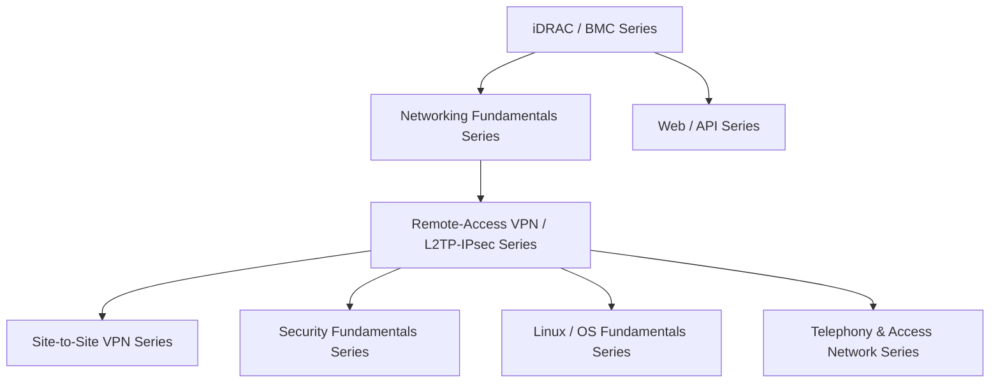

## About this series

This series aims for the level of understanding held by "the top 1% of infrastructure engineers, even among those working at the leading infrastructure companies like AWS and Google." Rather than just memorizing operational steps, the goal is to thoroughly explain:

- The internal mechanics and design rationale behind why something is built the way it is
- How to actually diagnose and troubleshoot the problems that come up in production

...in a way that lets even a beginner climb the ladder one step at a time. When a topic gets too large, we don't force it into a single article — we split it by theme and link the articles together. This page is the table of contents, recommended reading order, and sitemap across all of them. It gets updated every time a new topic is added.

## Recommended reading order

This page used to cram every article into a single giant diagram, but chaining everything back through the iDRAC article as the root made things — especially everything under the VPN/L2TP-IPsec series — too dense to read. So article-level derivation is now shown within each series' own section (in "Series list" below), and this diagram is scaled back to a simple map of **how the series relate to each other.**

**The basic path**: Start with the iDRAC article, branch into the Networking Fundamentals and Web/API series, follow the L2TP/IPsec article's thread from Networking Fundamentals into the Remote-Access VPN/L2TP-IPsec series, and dig deeper from there into the Site-to-Site VPN series, Security Fundamentals, Linux/OS Fundamentals, and Telephony. That's the main line of derivation between articles. That said, every article is written to be **fully readable on its own**, so feel free to start with whichever series or article interests you. Note also that some articles in the Networking Fundamentals series (NAT/NAPT, virtual IPs, TCP/UDP sessions, DNS) actually branch off from the L2TP/IPsec article in the Remote-Access VPN series — the series don't form a strict one-way tree; some cross-reference each other. The remote-access and site-to-site VPN articles used to be bundled into a single "VPN/L2TP-IPsec Series," but since they serve different audiences and use cases, they've since been split into two separate series.

The recommended reading order within each series is noted in that series' description under "Series list" below (the ①②③... numbers before each article title are the recommended order within that series). Goal-based recommended routes are collected in "Recommended routes by reader type," next.

## Recommended Routes by Reader Type

This blog is written for a wide range of readers — from people with no experience aiming to become infrastructure engineers, to top-tier AWS/Google engineers earning the equivalent of ¥50 million or more a year. You don't have to read every article in order, so here are five routes matched to career stage. **Pick the tab closest to you below and only that route will show** (route ② assumes ①, ③ assumes ①②, ④ assumes ①②③, ⑤ assumes ①②③④). Niche articles that only matter in a very specific real-world situation aren't force-fit into every route — each one is introduced for the first time in the route where it actually becomes relevant (earlier routes just mention it briefly as optional). This same 5-stage split is also intended to double as the difficulty tiering for hands-on material we plan to add later.

<input type="radio" name="persona-route" id="persona-tab-1" class="persona-input" checked>
<input type="radio" name="persona-route" id="persona-tab-2" class="persona-input">
<input type="radio" name="persona-route" id="persona-tab-3" class="persona-input">
<input type="radio" name="persona-route" id="persona-tab-4" class="persona-input">
<input type="radio" name="persona-route" id="persona-tab-5" class="persona-input">

<label for="persona-tab-1" class="persona-tab">STEP1 🌱 Self-taught, no experience yet</label>
<label for="persona-tab-2" class="persona-tab">STEP2 🔧 Year 1, entering design/build work</label>
<label for="persona-tab-3" class="persona-tab">STEP3 💪 On the job, building confidence</label>
<label for="persona-tab-4" class="persona-tab">STEP4 📈 Aiming for a higher-paying job</label>
<label for="persona-tab-5" class="persona-tab">STEP5 🏆 Top 1% (¥10M–¥50M+)</label>

<h3>🌱 For those aiming to become an infrastructure engineer with no prior experience</h3>

A route that builds the foundational way of thinking in each area, without going too deep. These 8 articles are the shared starting point for every other route below.

<ol class="persona-route-list">
<li><a href="/en/articles/idrac-guide">What Is iDRAC? Understanding How It Works from a "Top 1%" Perspective</a></li>
<li><a href="/en/articles/network-stack-guide">Understanding the Network Stack from a "Top 1%" Perspective</a></li>
<li><a href="/en/articles/network-devices-guide">Understanding the Differences Between Hubs, Switches (L2SW), L3 Switches, and Routers from a "Top 1%" Perspective</a></li>
<li><a href="/en/articles/nat-guide">Understanding How NAT/NAPT Works from a "Top 1%" Perspective</a></li>
<li><a href="/en/articles/dns-guide">Understanding How DNS Works from a "Top 1%" Perspective</a></li>
<li><a href="/en/articles/circuit-switching-ppp-guide">Understanding the Difference Between Telephone Lines and IP Networks from a "Top 1%" Perspective</a></li>
<li><a href="/en/articles/access-network-guide">Understanding the Evolution of Access-Line Technology — ADSL, Fiber, and More — from a "Top 1%" Perspective</a></li>
<li><a href="/en/articles/restful-api-guide">What Is a RESTful API? Understanding from HTTP/JSON Basics to Practical Design from a "Top 1%" Perspective</a></li>
</ol>

<h3>🔧 For infrastructure engineers in year 1, ready to take on design/build work</h3>

Builds on STEP1 with the VPN, cryptography, and certificate topics that design/build work always ends up touching.

<ol class="persona-route-list">
<li>STEP1's 8 articles (iDRAC through RESTful API — see that tab above)</li>
<li><a href="/en/articles/l2tp-ipsec-guide">Understanding How L2TP/IPsec Works from a "Top 1%" Perspective</a></li>
<li><a href="/en/articles/pki-guide">Understanding PKI and Digital Certificates from a "Top 1%" Perspective</a></li>
<li><a href="/en/articles/symmetric-encryption-guide">Understanding Symmetric Encryption (AES) and HMAC/AEAD from a "Top 1%" Perspective</a></li>
<li><a href="/en/articles/tcp-udp-session-port-guide">Understanding the Relationship Between TCP/UDP "Sessions" and Port Numbers from a "Top 1%" Perspective</a></li>
<li><a href="/en/articles/vpn-protocols-comparison-guide">Comparing L2TP/IPsec to Modern VPN Protocols from a "Top 1%" Perspective</a></li>
</ol>

🔍 <strong>If you run into it on the job (optional)</strong>: <a href="/en/articles/windows-server-l2tp-vpn-guide">Windows Server (RRAS) L2TP/IPsec VPN setup</a>, <a href="/en/articles/site-to-site-vpn-guide">site-to-site VPN</a>, and <a href="/en/articles/local-gov-network-guide">Japanese local government network segregation</a> are niche articles for people who actually hit that specific situation. No need to read them now — save them for when a search lands you there, or when curiosity strikes (STEP3 covers them properly).

<h3>💪 For those on the job in design/build work who still don't feel confident</h3>

This is where "I sort of know this" turns into working knowledge. On top of STEP2, this route adds the niche real-world articles and a hands-on lab to build actual confidence.

<ol class="persona-route-list">
<li>STEP1 and STEP2's 13 articles (see those tabs above)</li>
<li><a href="/en/articles/windows-server-l2tp-vpn-guide">Why Does a VPN Client Need a Gateway on the Same Subnet? — Understanding IP Address Management in Windows Server (RRAS) L2TP/IPsec VPN from a "Top 1%" Perspective</a></li>
<li><a href="/en/articles/site-to-site-vpn-guide">Understanding Site-to-Site VPN from a "Top 1%" Perspective</a></li>
<li><a href="/en/articles/local-gov-network-guide">Understanding Japanese Local Government Network Segregation and Security Clouds from a "Top 1%" Perspective</a></li>
<li><a href="/en/articles/virtual-ip-guide">Understanding Virtual IPs (VIPs) and NIC Teaming's Virtual IP from a "Top 1%" Perspective</a></li>
<li><a href="/en/articles/handson-prep-guide">Hands-On Prep Manual: From Creating a VM in Proxmox VE to Installing an OS and Initial Setup</a></li>
<li><a href="/en/articles/l2tp-ipsec-lab-guide">A "Top 1%" Hands-On Lab: Building Your Own L2TP/IPsec Server and Verifying the Theory Yourself</a></li>
</ol>

🔍 <strong>If it interests you (optional)</strong>: <a href="/en/articles/voip-ss7-guide">Understanding VoIP and SS7</a> is worth a read once the history behind the telephone network starts to interest you, and <a href="/en/articles/proxmox-internals-guide">What Is Proxmox VE?</a> is worth a read once KVM/QEMU's internals start to interest you.

<h3>📈 For those studying to move to a higher-paying company</h3>

Adds the low-level implementation knowledge that sets you apart in interviews and design reviews, on top of everything through STEP3.

<ol class="persona-route-list">
<li>STEP1 through STEP3's 19 articles (see those tabs above)</li>
<li><a href="/en/articles/proxmox-internals-guide">What Is Proxmox VE? Understanding KVM/QEMU Virtualization from the "Top 1%" Perspective</a></li>
<li><a href="/en/articles/linux-daemon-guide">What Is a Daemon? Understanding Linux Background Processes from a "Top 1%" Perspective</a></li>
<li><a href="/en/articles/software-library-guide">What Is a Library? Understanding Static and Dynamic Linking from a "Top 1%" Perspective</a></li>
<li><a href="/en/articles/linux-user-kernel-space-guide">User Space, Kernel Space, and TUN/TAP Devices, Understood from a "Top 1%" Perspective</a></li>
<li><a href="/en/articles/linux-file-permissions-guide">What Are Permissions (chmod)? Understanding Linux File Access Control from the "Top 1%" Perspective</a></li>
<li><a href="/en/articles/linux-sysctl-guide">sysctl and /etc/sysctl.conf from the "Top 1%" Perspective</a></li>
<li><a href="/en/articles/linux-iptables-guide">iptables (netfilter) from the "Top 1%" Perspective</a></li>
<li><a href="/en/articles/linux-filesystem-hierarchy-guide">/etc and the Linux Directory Layout (FHS) from the "Top 1%" Perspective</a></li>
<li><a href="/en/articles/linux-config-activation-guide">How a Config File Actually "Takes Effect," from the "Top 1%" Perspective</a></li>
<li><a href="/en/articles/linux-journalctl-guide">Investigating Error Logs with journalctl from a "Top 1%" Perspective</a></li>
<li><a href="/en/articles/nic-driver-internals-guide">Understanding NIC Drivers and Linux Kernel Networking from a "Top 1%" Perspective</a></li>
<li><a href="/en/articles/idrac-power-guide">Understanding Server Power Design from a "Top 1%" Perspective</a></li>
<li><a href="/en/articles/os-boot-process-guide">Understanding the OS Boot Process After POST from a "Top 1%" Perspective</a></li>
</ol>

<h3>🏆 For those gathering information toward ¥10M, ¥20M, or ¥50M+</h3>

The complete-conquest route: read all 32 articles and be able to speak to the design philosophy of the whole series, end to end.

<ol class="persona-route-list">
<li>STEP1 through STEP4's 31 articles (see those tabs above)</li>
<li><a href="/en/articles/voip-ss7-guide">Understanding VoIP and SS7 — and the Real Path Your Traffic Takes — from a "Top 1%" Perspective</a></li>
</ol>

🎉 <strong>That's all 32 articles.</strong> You can also revisit the whole shape of the series in "Series list," next.

## Series list

### iDRAC / BMC Series

A series covering out-of-band server management. **Recommended order**: ① idrac-guide → ② idrac-power-guide → ③ os-boot-process-guide.

- [What Is iDRAC? Understanding How It Works from a "Top 1%" Perspective](/en/articles/idrac-guide) — The main article: iDRAC (BMC) overview, power design, licensing, security, and troubleshooting.
- [Understanding Server Power Design from a "Top 1%" Perspective](/en/articles/idrac-power-guide) — A deep dive into the power design touched on in the iDRAC article: AC/DC conversion and PSU redundancy (A/B grid, hot spares). Also readable standalone.
- [Understanding the OS Boot Process After POST from a "Top 1%" Perspective](/en/articles/os-boot-process-guide) — A deep dive into the bootloader, initramfs, and systemd (PID 1) stages after POST completes, plus the difference between Secure Boot and measured boot (spun off from the power article's POST/OS-boot section; also readable standalone).

### Networking Fundamentals Series

**Recommended order**: ① network-stack-guide → ② nic-driver-internals-guide → ③ network-devices-guide → ④ local-gov-network-guide → ⑤ virtual-ip-guide → ⑥ nat-guide → ⑦ tcp-udp-session-port-guide → ⑧ dns-guide.

- [Understanding the Network Stack from a "Top 1%" Perspective](/en/articles/network-stack-guide) — A deep dive into the layered structure of the NIC driver, IP, TCP/UDP, and the application layer.
- [Understanding NIC Drivers and Linux Kernel Networking from a "Top 1%" Perspective](/en/articles/nic-driver-internals-guide) — A further deep dive into interrupt handling, DMA, offloading, and kernel bypass.
- [Understanding the Differences Between Hubs, Switches (L2SW), L3 Switches, and Routers from a "Top 1%" Perspective](/en/articles/network-devices-guide) — How to tell these devices apart by OSI layer and forwarding method (MAC address tables, VLANs, spanning tree, ASIC/TCAM).
- [Understanding Japanese Local Government Network Segregation and Security Clouds from a "Top 1%" Perspective](/en/articles/local-gov-network-guide) — How the LGWAN-connected, My Number business, and internet-connected segments are actually implemented with VLANs/firewalls, plus a deep dive into the shared prefectural security cloud (spun off from the VLAN section of the network-devices-guide article; also readable standalone).
- [Understanding Virtual IPs (VIPs) and NIC Teaming's Virtual IP from a "Top 1%" Perspective](/en/articles/virtual-ip-guide) — The difference between the two ways a virtual IP is realized (IP takeover vs. a load balancer's NAT translation), plus NIC teaming's virtual IP (spun off from IP address management in redundant setups; also readable standalone).
- [Understanding How NAT/NAPT Works from a "Top 1%" Perspective](/en/articles/nat-guide) — The internals of the translation table, NAT behavior types, and how NAT-T works (spun off from the L2TP/IPsec article's NAT traversal section; also readable standalone).
- [Understanding the Relationship Between TCP/UDP "Sessions" and Port Numbers from a "Top 1%" Perspective](/en/articles/tcp-udp-session-port-guide) — What a TCP connection's state machine really is, how it differs from a NAT/firewall's pseudo-session, and why protocol numbers and port numbers aren't a 1:1 mapping (spun off from the L2TP/IPsec article's discussion of ESP and port numbers; also readable standalone).
- [Understanding How DNS Works from a "Top 1%" Perspective](/en/articles/dns-guide) — The hierarchy of name resolution, the division of labor between recursive resolvers and authoritative servers, how Windows and Linux prioritize among multiple DNS servers, and DNS resolution over a VPN connection (spun off from the L2TP/IPsec article's DNS server assignment via IPCP; also readable standalone).

### Remote-Access VPN / L2TP-IPsec Series

**Recommended order**: ① l2tp-ipsec-guide → ② windows-server-l2tp-vpn-guide → ③ vpn-protocols-comparison-guide → ④ l2tp-ipsec-lab-guide.

- [Understanding How L2TP/IPsec Works from a "Top 1%" Perspective](/en/articles/l2tp-ipsec-guide) — Why L2TP and IPsec are combined, the connection-establishment sequence, and a deep dive into NAT traversal.
- [Why Does a VPN Client Need a Gateway on the Same Subnet? — Understanding IP Address Management in Windows Server (RRAS) L2TP/IPsec VPN from a "Top 1%" Perspective](/en/articles/windows-server-l2tp-vpn-guide) — RRAS's address pool, and why a gateway is needed even though clients look like they're on the same subnet (a Windows Server implementation companion to the L2TP/IPsec article; also readable standalone).
- [Comparing L2TP/IPsec to Modern VPN Protocols from a "Top 1%" Perspective](/en/articles/vpn-protocols-comparison-guide) — A deep dive into the differences in design philosophy, implementation size, and mobile resilience against IKEv2/IPsec, OpenVPN, and WireGuard (spun off to dig into why L2TP/IPsec is called legacy; also readable standalone).
- [A "Top 1%" Hands-On Lab: Building Your Own L2TP/IPsec Server and Verifying the Theory Yourself](/en/articles/l2tp-ipsec-lab-guide) — Build an L2TP/IPsec server on Proxmox VE with strongSwan and xl2tpd, then verify the connection sequence with tcpdump, a Windows client's routing table, a deliberately triggered NAT-T, and a recorded performance baseline. Assumes you've already read the three prerequisite articles (①②③) (a deliberate exception in this series: a hands-on build guide).

### Site-to-Site VPN Series

A follow-on series that assumes you've read ① from the Remote-Access VPN/L2TP-IPsec series. **Recommended order**: ① site-to-site-vpn-guide.

- [Understanding Site-to-Site VPN from a "Top 1%" Perspective](/en/articles/site-to-site-vpn-guide) — How it differs from remote-access VPN, the mechanics of IPsec tunnel mode and traffic selectors, and the practical considerations for building an IPsec tunnel between different vendors like Cisco and WatchGuard (spun off from the contrast with L2TP/IPsec; also readable standalone).

### Hands-On Prep Series

A prep manual covering what this blog's hands-on articles (like the self-built L2TP/IPsec server lab) need in common — creating a VM in Proxmox VE, and basic Linux operations. **Recommended order**: ① handson-prep-guide.

- [Hands-On Prep Manual: From Creating a VM in Proxmox VE to Installing an OS, Plus the Basics of nano/sudo/apt update](/en/articles/handson-prep-guide) — An operations manual covering creating a VM in Proxmox VE, downloading and installing the Ubuntu Server ISO, the basics of apt update/sudo su -/nano, and gotchas with a US keyboard layout (a step-by-step guide for readers doing a hands-on lab for the first time, not an internals deep dive; also readable standalone).

### Virtualization Fundamentals Series

A series that digs into what actually implements the virtualization behind Proxmox VE, the platform used in the hands-on labs. **Recommended order**: ① proxmox-internals-guide.

- [What Is Proxmox VE? Understanding KVM/QEMU Virtualization from the "Top 1%" Perspective](/en/articles/proxmox-internals-guide) — The division of labor between KVM (which turns the Linux kernel itself into a hypervisor) and QEMU (which reproduces everything besides the CPU in software), how a virtual bridge (vmbr) connects a VM to the network, and how storage backends and snapshots work (spun off from the Proxmox operations covered in the hands-on prep manual; also readable standalone).

### Linux / OS Fundamentals Series

A series that takes execution-environment-level terms that keep showing up in the VPN protocol articles and the L2TP/IPsec hands-on lab, and gives each one a standalone deep dive. **Recommended order**: ① linux-daemon-guide → ② software-library-guide → ③ linux-user-kernel-space-guide → ④ linux-file-permissions-guide → ⑤ linux-sysctl-guide → ⑥ linux-iptables-guide → ⑦ linux-filesystem-hierarchy-guide → ⑧ linux-config-activation-guide → ⑨ linux-journalctl-guide.

- [What Is a Daemon? Understanding Linux Background Processes from a "Top 1%" Perspective](/en/articles/linux-daemon-guide) — How a daemon differs from a regular process, why protocol-handling software like an IKE daemon is implemented as one, and how systemd starts, monitors, and logs it (spun off from the daemon discussion in the modern-VPN-protocols comparison article; also readable standalone).
- [What Is a Library? Understanding Static and Dynamic Linking from a "Top 1%" Perspective](/en/articles/software-library-guide) — The difference between static linking and dynamic linking (shared libraries), how symbol resolution works, and why ABI compatibility becomes a real failure mode (spun off from the OpenSSL discussion in the modern-VPN-protocols comparison article; also readable standalone).
- [User Space, Kernel Space, and TUN/TAP Devices, Understood from a "Top 1%" Perspective](/en/articles/linux-user-kernel-space-guide) — How the CPU's privilege levels separate the two spaces, how system calls and context switches work, and how OpenVPN's TUN/TAP device operates (spun off from the user-space-implementation discussion in the modern-VPN-protocols comparison article; also readable standalone).
- [What Are Permissions (chmod)? Understanding Linux File Access Control from the "Top 1%" Perspective](/en/articles/linux-file-permissions-guide) — The mapping between the rwx bits and numeric notation, special permissions like setuid and the sticky bit, and how the kernel checks this on every system call (spun off from the `chmod 600` step in the L2TP/IPsec hands-on lab; also readable standalone).
- [sysctl and /etc/sysctl.conf from the "Top 1%" Perspective](/en/articles/linux-sysctl-guide) — What procfs, a virtual filesystem, really is, how /proc/sys maps to sysctl keys, and why editing a config file alone doesn't apply it (spun off from the `net.ipv4.ip_forward` step in the L2TP/IPsec hands-on lab; also readable standalone).
- [iptables (netfilter) from the "Top 1%" Perspective](/en/articles/linux-iptables-guide) — The structure of netfilter's hook points, tables, and chains, the order rules are evaluated in, stateful decisions via connection tracking, and the difference between MASQUERADE and SNAT (spun off from the `iptables` commands in the L2TP/IPsec hands-on lab; also readable standalone).
- [/etc and the Linux Directory Layout (FHS) from the "Top 1%" Perspective](/en/articles/linux-filesystem-hierarchy-guide) — The two axes running through the FHS design philosophy ("host-specific vs. shareable," "static vs. mutable"), the convention of per-service subdirectories, and how the meaning shifts in the container era (spun off from editing `/etc/ipsec.conf` in the L2TP/IPsec hands-on lab; also readable standalone).
- [How a Config File Actually "Takes Effect," from the "Top 1%" Perspective](/en/articles/linux-config-activation-guide) — How a daemon parses a config file into an internal data structure, the difference between reload and restart, and how a userspace daemon's config differs from a kernel parameter in how it actually applies (spun off from editing `ipsec.conf`/`xl2tpd.conf` in the L2TP/IPsec hands-on lab; also readable standalone).
- [Investigating Error Logs with journalctl from a "Top 1%" Perspective](/en/articles/linux-journalctl-guide) — What the systemd journal actually is, how to use -u/-t/-f/-n/--no-pager/-xe, and how to decide which order to check logs in when several processes (like IKE → L2TP → PPP) work together (spun off from debugging errors in the L2TP/IPsec hands-on lab; also readable standalone).

### Telephony & Access Network Series

**Recommended order**: ① circuit-switching-ppp-guide → ② access-network-guide → ③ voip-ss7-guide.

- [Understanding the Difference Between Telephone Lines and IP Networks from a "Top 1%" Perspective](/en/articles/circuit-switching-ppp-guide) — Circuit switching vs. packet switching, the historical background behind PPP, its reuse in PPPoE/L2TP, and the internals of CHAP/MS-CHAPv2 challenge-response authentication (a deep dive spun off from the PPP portion of the L2TP/IPsec article; also readable standalone).
- [Understanding the Evolution of Access-Line Technology — ADSL, Fiber, and More — from a "Top 1%" Perspective](/en/articles/access-network-guide) — The differences between a telephone line, ADSL, and fiber (FTTH) as ways of realizing an access line, how the PON architecture works, and the relationship between Ethernet and an IP network (spun off from the telephone-lines-and-PPP article; also readable standalone).
- [Understanding VoIP and SS7 — and the Real Path Your Traffic Takes — from a "Top 1%" Perspective](/en/articles/voip-ss7-guide) — The separation of call control (SS7 signaling) from voice transport (VoIP media), how SIP/RTP work, and the real path a home PC's traffic takes to reach a service on the internet (spun off from the telephone-lines-and-PPP article; also readable standalone).

### Web / API Series

- [What Is a RESTful API? Understanding from HTTP/JSON Basics to Practical Design from a "Top 1%" Perspective](/en/articles/restful-api-guide) — A deep dive into HTTP, REST, JSON, authentication, idempotency, and pagination.

### Security Fundamentals Series

**Recommended order**: ① pki-guide → ② symmetric-encryption-guide.

- [Understanding PKI and Digital Certificates from a "Top 1%" Perspective](/en/articles/pki-guide) — A deep dive into public-key cryptography, Diffie-Hellman key exchange, digital signatures, CSRs, and certificate chain verification (spun off from L2TP/IPsec's certificate authentication; also readable standalone).
- [Understanding Symmetric Encryption (AES) and HMAC/AEAD from a "Top 1%" Perspective](/en/articles/symmetric-encryption-guide) — A deep dive into block cipher internals, the differences between CBC/CTR/GCM modes, and HMAC-based tamper detection (spun off from L2TP/IPsec's ESP encryption; also readable standalone).

## What's next

Once the iDRAC-related series reaches a good stopping point, we plan to add a new series on a different theme (TBD). When a new series is added, this page will be updated too.
