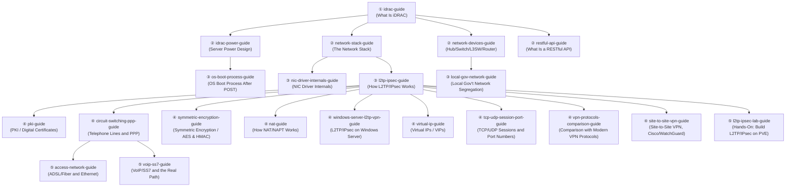

## About this series

This series aims for the level of understanding held by "the top 1% of infrastructure engineers, even among those working at the leading infrastructure companies like AWS and Google." Rather than just memorizing operational steps, the goal is to thoroughly explain:

- The internal mechanics and design rationale behind why something is built the way it is
- How to actually diagnose and troubleshoot the problems that come up in production

...in a way that lets even a beginner climb the ladder one step at a time. When a topic gets too large, we don't force it into a single article — we split it by theme and link the articles together. This page is the table of contents, recommended reading order, and sitemap across all of them. It gets updated every time a new topic is added.

## Recommended reading order

Start with article ① on iDRAC, then branch out into the ② deep-dive articles (power, networking, API) depending on your interest. The three ② articles are independent of each other, so read them in any order. The ③ articles are each a further step down from one of the ② articles (the OS boot process after POST, NIC driver internals, how L2TP/IPsec works, Japanese local government network segregation) — a good way to test your understanding after finishing the corresponding ② article. The nine ④ articles are all deep dives that branch off from the L2TP/IPsec article to cover topics that wouldn't fit in the main article, but **every one of them can be read entirely on its own**. The four on PKI/digital certificates, symmetric encryption (AES/HMAC), NAT/NAPT, and TCP/UDP sessions and port numbers are general-purpose technical topics used far beyond L2TP/IPsec, in TLS, SSH, and elsewhere. The telephone-lines-and-PPP article covers both the historical background of why L2TP/IPsec reuses dial-up-era PPP and the internals of MS-CHAPv2 authentication. The Windows Server (RRAS) L2TP/IPsec setup and virtual IP (VIP) articles cover more implementation-level topics you'll run into when actually building and operating a VPN server. The comparison article covers how L2TP/IPsec's design differs from IKEv2/IPsec, OpenVPN, and WireGuard. The site-to-site VPN article covers the gateway-to-gateway connection model that differs from remote-access VPN, and the practical considerations for building an IPsec tunnel between different vendors like Cisco and WatchGuard. The three ⑤ articles go a further step down from a ④ article. The hands-on article is a deliberate exception in this series — a practical build guide where you construct an L2TP/IPsec server on Proxmox VE and verify the theory with packet captures. The access-line article branches off from the telephone-lines-and-PPP article, covering the technical mechanics of ADSL and fiber as access-line technologies and the relationship between Ethernet and an IP network. The VoIP/SS7 article also branches off from the telephone-lines-and-PPP article, covering a telephone network's signaling (SS7) and media transport (VoIP), plus the real path your traffic takes when a home PC accesses a service on the internet.

## Series list

### iDRAC / BMC Series

A series covering out-of-band server management.

- [What Is iDRAC? Understanding How It Works from a "Top 1%" Perspective](/en/articles/idrac-guide) — The main article: iDRAC (BMC) overview, power design, licensing, security, and troubleshooting.
- [Understanding Server Power Design from a "Top 1%" Perspective](/en/articles/idrac-power-guide) — A deep dive into the power design touched on in the iDRAC article: AC/DC conversion and PSU redundancy (A/B grid, hot spares). Also readable standalone.
- [Understanding the OS Boot Process After POST from a "Top 1%" Perspective](/en/articles/os-boot-process-guide) — A deep dive into the bootloader, initramfs, and systemd (PID 1) stages after POST completes, plus the difference between Secure Boot and measured boot (spun off from the power article's POST/OS-boot section; also readable standalone).

### Networking Fundamentals Series

- [Understanding the Network Stack from a "Top 1%" Perspective](/en/articles/network-stack-guide) — A deep dive into the layered structure of the NIC driver, IP, TCP/UDP, and the application layer.
- [Understanding NIC Drivers and Linux Kernel Networking from a "Top 1%" Perspective](/en/articles/nic-driver-internals-guide) — A further deep dive into interrupt handling, DMA, offloading, and kernel bypass.
- [Understanding the Differences Between Hubs, Switches (L2SW), L3 Switches, and Routers from a "Top 1%" Perspective](/en/articles/network-devices-guide) — How to tell these devices apart by OSI layer and forwarding method (MAC address tables, VLANs, spanning tree, ASIC/TCAM).
- [Understanding Japanese Local Government Network Segregation and Security Clouds from a "Top 1%" Perspective](/en/articles/local-gov-network-guide) — How the LGWAN-connected, My Number business, and internet-connected segments are actually implemented with VLANs/firewalls, plus a deep dive into the shared prefectural security cloud (spun off from the VLAN section of the network-devices-guide article; also readable standalone).
- [Understanding Virtual IPs (VIPs) and NIC Teaming's Virtual IP from a "Top 1%" Perspective](/en/articles/virtual-ip-guide) — The difference between the two ways a virtual IP is realized (IP takeover vs. a load balancer's NAT translation), plus NIC teaming's virtual IP (spun off from IP address management in redundant setups; also readable standalone).
- [Understanding How NAT/NAPT Works from a "Top 1%" Perspective](/en/articles/nat-guide) — The internals of the translation table, NAT behavior types, and how NAT-T works (spun off from the L2TP/IPsec article's NAT traversal section; also readable standalone).
- [Understanding the Relationship Between TCP/UDP "Sessions" and Port Numbers from a "Top 1%" Perspective](/en/articles/tcp-udp-session-port-guide) — What a TCP connection's state machine really is, how it differs from a NAT/firewall's pseudo-session, and why protocol numbers and port numbers aren't a 1:1 mapping (spun off from the L2TP/IPsec article's discussion of ESP and port numbers; also readable standalone).

### VPN / L2TP-IPsec Series

- [Understanding How L2TP/IPsec Works from a "Top 1%" Perspective](/en/articles/l2tp-ipsec-guide) — Why L2TP and IPsec are combined, the connection-establishment sequence, and a deep dive into NAT traversal.
- [Understanding Windows Server (RRAS) L2TP/IPsec VPN Setup and IP Address Management from a "Top 1%" Perspective](/en/articles/windows-server-l2tp-vpn-guide) — RRAS's address pool, and why a gateway is needed even though clients look like they're on the same subnet (a Windows Server implementation companion to the L2TP/IPsec article; also readable standalone).
- [Comparing L2TP/IPsec to Modern VPN Protocols from a "Top 1%" Perspective](/en/articles/vpn-protocols-comparison-guide) — A deep dive into the differences in design philosophy, implementation size, and mobile resilience against IKEv2/IPsec, OpenVPN, and WireGuard (spun off to dig into why L2TP/IPsec is called legacy; also readable standalone).
- [A "Top 1%" Hands-On Lab: Building Your Own L2TP/IPsec Server on Proxmox VE](/en/articles/l2tp-ipsec-lab-guide) — Build an L2TP/IPsec server on Proxmox VE with strongSwan and xl2tpd, and verify the connection sequence with tcpdump (a deliberate exception in this series: a hands-on build guide).
- [Understanding Site-to-Site VPN from a "Top 1%" Perspective](/en/articles/site-to-site-vpn-guide) — How it differs from remote-access VPN, the mechanics of IPsec tunnel mode and traffic selectors, and the practical considerations for building an IPsec tunnel between different vendors like Cisco and WatchGuard (spun off from the contrast with L2TP/IPsec; also readable standalone).

### Telephony & Access Network Series

- [Understanding the Difference Between Telephone Lines and IP Networks from a "Top 1%" Perspective](/en/articles/circuit-switching-ppp-guide) — Circuit switching vs. packet switching, the historical background behind PPP, its reuse in PPPoE/L2TP, and the internals of CHAP/MS-CHAPv2 challenge-response authentication (a deep dive spun off from the PPP portion of the L2TP/IPsec article; also readable standalone).
- [Understanding the Evolution of Access-Line Technology — ADSL, Fiber, and More — from a "Top 1%" Perspective](/en/articles/access-network-guide) — The differences between a telephone line, ADSL, and fiber (FTTH) as ways of realizing an access line, how the PON architecture works, and the relationship between Ethernet and an IP network (spun off from the telephone-lines-and-PPP article; also readable standalone).
- [Understanding VoIP and SS7 — and the Real Path Your Traffic Takes — from a "Top 1%" Perspective](/en/articles/voip-ss7-guide) — The separation of call control (SS7 signaling) from voice transport (VoIP media), how SIP/RTP work, and the real path a home PC's traffic takes to reach a service on the internet (spun off from the telephone-lines-and-PPP article; also readable standalone).

### Web / API Series

- [What Is a RESTful API? Understanding from HTTP/JSON Basics to Practical Design from a "Top 1%" Perspective](/en/articles/restful-api-guide) — A deep dive into HTTP, REST, JSON, authentication, idempotency, and pagination.

### Security Fundamentals Series

- [Understanding PKI and Digital Certificates from a "Top 1%" Perspective](/en/articles/pki-guide) — A deep dive into public-key cryptography, Diffie-Hellman key exchange, digital signatures, CSRs, and certificate chain verification (spun off from L2TP/IPsec's certificate authentication; also readable standalone).
- [Understanding Symmetric Encryption (AES) and HMAC/AEAD from a "Top 1%" Perspective](/en/articles/symmetric-encryption-guide) — A deep dive into block cipher internals, the differences between CBC/CTR/GCM modes, and HMAC-based tamper detection (spun off from L2TP/IPsec's ESP encryption; also readable standalone).

## What's next

Once the iDRAC-related series reaches a good stopping point, we plan to add a new series on a different theme (TBD). When a new series is added, this page will be updated too.
