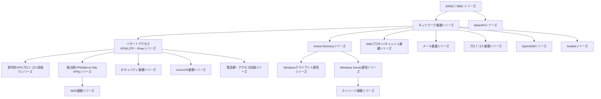

## このシリーズについて

このシリーズが目指しているのは、「AWSやGoogleのような最高峰のインフラ企業に在籍するインフラエンジニアの、さらに上位1%」の理解水準です。単なる操作手順の暗記ではなく、

- なぜそう設計されているのかという内部動作・設計思想
- 実務で起きるトラブルの切り分け方

までを、初心者からでも一歩ずつ登れるように徹底解説することを方針にしています。ボリュームが大きくなる場合は無理に1本にまとめず、テーマごとに記事を分割し、記事同士をリンクでつないでいます。このページは、その全記事の目次・読む順番のロードマップ・サイトマップです。新しいテーマの記事が増えるたびに、このページを更新していきます。

各記事はそれぞれ単体で読んでも完結するように書いています。深掘り系の記事（②③）から元になった記事（①）へ読者を差し戻すようなリンクは行わず、興味に応じて自由な順番で読めることを優先しています。逆に①側では、深掘りしたテーマがあれば②③へのリンクを埋め込んでいるので、より詳しく知りたい箇所があればそこから読み進めてください。

## 読む順番のおすすめ

以前はこのページに全記事を1つの巨大な図に詰め込んでいましたが、iDRACの記事を起点にすべての記事を連結する構成だと、特にVPN/L2TP・IPsecシリーズ以下が密集し過ぎて読みにくくなっていました。そこで、記事単位の派生関係は下記「シリーズ一覧」の各シリーズ内に閉じて示すことにし、この図は**シリーズ同士の大まかな関係**だけを示す全体マップにしています。

**基本的な読み方**: iDRACの記事を起点に、ネットワーク基礎シリーズとWeb/APIシリーズへ進み、ネットワーク基礎シリーズのL2TP/IPsecの記事からリモートアクセスVPN/L2TP・IPsecシリーズへ、そこから拠点間VPNシリーズ・セキュリティ基礎・Linux/OS基礎・電話網シリーズへと深掘りしていく、というのが記事同士の主な派生の流れです。ただし各記事は**すべて単体でも読める**ように書かれているため、興味のあるシリーズ・記事から読み始めて問題ありません。なお、ネットワーク基礎シリーズの一部記事(NAT/NAPT・代表IP・TCP/UDPセッション・DNS)はリモートアクセスVPN/L2TP・IPsecシリーズのL2TP/IPsecの記事から派生しており、シリーズ同士は一方向のツリーではなく一部相互に関係している点に注意してください。以前はリモートアクセスVPNと拠点間VPNを同じ「VPN/L2TP・IPsecシリーズ」にまとめていましたが、対象読者・用途が異なるため2つのシリーズに分割しました。Active Directoryシリーズは、AD移行・DC運用の実務で直面する疑問を深掘りする新シリーズで、ネットワーク基礎シリーズ(特にDNS)の知識を前提にしています。

各シリーズ内でどの順番に読むべきかは、下記「シリーズ一覧」の各シリーズの説明文に記載しています(記事タイトルの前にある①②③…の番号が、そのシリーズ内での推奨読了順です)。目的別のおすすめルートは、次の「読者タイプ別のおすすめルート」にまとめています。

## 読者タイプ別のおすすめルート

このブログは、未経験からインフラエンジニアを目指す方から、年収5000万円以上を稼ぐAWS/Googleのトップエンジニアまで、幅広い読者を想定しています。全記事を必ず順番通りに読む必要はないため、キャリアの段階に応じた8つのルートを用意しました。**下のタブから自分に近いものを選ぶと、そのルートだけが表示されます**(②以降は、それより前のすべてのSTEPを読了している前提の積み増しです)。実務のごく特定の場面でしか使わないニッチな記事は、無理にロードマップへ詰め込まず、それが実際に必要になる段階のルートで初めて紹介する形にしています(該当しない段階では「任意」として控えめに触れるだけです)。記事数が増えて1つのSTEPに詰め込みすぎないよう、テーマのまとまりが大きくなった段階でSTEPを分割する方針にしており、この段階の切り方は今後も記事が増えるたびに見直していきます。

<input type="radio" name="persona-route" id="persona-tab-1" class="persona-input" checked>
<input type="radio" name="persona-route" id="persona-tab-2" class="persona-input">
<input type="radio" name="persona-route" id="persona-tab-3" class="persona-input">
<input type="radio" name="persona-route" id="persona-tab-4" class="persona-input">
<input type="radio" name="persona-route" id="persona-tab-5" class="persona-input">
<input type="radio" name="persona-route" id="persona-tab-6" class="persona-input">
<input type="radio" name="persona-route" id="persona-tab-7" class="persona-input">
<input type="radio" name="persona-route" id="persona-tab-8" class="persona-input">

<label for="persona-tab-1" class="persona-tab">STEP1 🌱 未経験から独学で目指す</label>
<label for="persona-tab-2" class="persona-tab">STEP2 🔧 1年目・設計構築デビュー</label>
<label for="persona-tab-3" class="persona-tab">STEP3 💪 現場で自信をつけたい</label>
<label for="persona-tab-4" class="persona-tab">STEP4 🏢 Active Directory運用を極める</label>
<label for="persona-tab-5" class="persona-tab">STEP5 🖥️ Windows Server・ストレージ・クラウド周辺</label>
<label for="persona-tab-6" class="persona-tab">STEP6 🐳 コンテナ・構成管理の自動化</label>
<label for="persona-tab-7" class="persona-tab">STEP7 📈 高年収企業への転職</label>
<label for="persona-tab-8" class="persona-tab">STEP8 🏆 上位1%(年収1000万〜5000万)</label>

<h3>🌱 未経験からインフラエンジニアを独学で目指す方へ</h3>

資格の暗記ではなく、実際の現場で何がどう動いているかという土台を作るルートです。ここで扱う8記事が、他のすべてのルートの共通の出発点になります。

<ol class="persona-route-list">
<li><a href="/articles/idrac-guide">iDRACとは何か？その仕組みを『上位1%』の視点まで理解する</a></li>
<li><a href="/articles/network-stack-guide">ネットワークスタックの仕組みを『上位1%』の視点で理解する</a></li>
<li><a href="/articles/network-devices-guide">HUB・スイッチ(L2SW)・L3SW・ルーターの違いを『上位1%』の視点で理解する</a></li>
<li><a href="/articles/nat-guide">NAT/NAPTの仕組みを『上位1%』の視点で理解する</a></li>
<li><a href="/articles/dns-guide">DNSの仕組みを『上位1%』の視点で理解する</a></li>
<li><a href="/articles/circuit-switching-ppp-guide">電話回線とIPネットワークの違いを『上位1%』の視点で理解する</a></li>
<li><a href="/articles/access-network-guide">ADSL・光回線などアクセス回線の技術変遷を『上位1%』の視点で理解する</a></li>
<li><a href="/articles/restful-api-guide">RESTful APIとは何か？HTTP・JSONの基礎から実務設計まで『上位1%』の視点で理解する</a></li>
</ol>

<h3>🔧 インフラエンジニア1年目で設計構築の現場に挑戦したい方へ</h3>

STEP1の土台に、設計・構築の現場で必ず問われるVPN・暗号・証明書まわりを積み増すルートです。

<ol class="persona-route-list">
<li>STEP1の8記事(iDRAC〜RESTful API、上のタブから確認できます)</li>
<li><a href="/articles/l2tp-ipsec-guide">L2TP/IPsecの仕組みを『上位1%』の視点で理解する</a></li>
<li><a href="/articles/pki-guide">PKIとデジタル証明書の仕組みを『上位1%』の視点で理解する</a></li>
<li><a href="/articles/symmetric-encryption-guide">共通鍵暗号(AES)とHMAC/AEADの仕組みを『上位1%』の視点で理解する</a></li>
<li><a href="/articles/tcp-udp-session-port-guide">TCP/UDPの「セッション」とポート番号の関係を『上位1%』の視点で理解する</a></li>
<li><a href="/articles/vpn-protocols-comparison-guide">L2TP/IPsecと現代的なVPNプロトコルを『上位1%』の視点で比較する</a></li>
<li><a href="/articles/ipsec-ah-guide">IPsecのAH(Authentication Header)とは何かを『上位1%』の視点で理解する</a></li>
<li><a href="/articles/windows-defender-guide">Microsoft Defenderの仕組みを『上位1%』の視点で理解する</a></li>
<li><a href="/articles/windows-process-task-guide">Windowsのプロセス・タスク・スレッドの違いを『上位1%』の視点で理解する</a></li>
<li><a href="/articles/unicode-filename-normalization-guide">見た目が同じなのに文字数が異なるファイル名が存在する理由を『上位1%』の視点で理解する</a></li>
<li><a href="/articles/windows-install-media-guide">インストーラのx64とx86の違いを『上位1%』の視点で理解する</a></li>
<li><a href="/articles/proxy-firewall-guide">プロキシとファイアウォールの使い分けを『上位1%』の視点で理解する</a></li>
<li><a href="/articles/http-caching-cdn-guide">HTTPSの普及とプロキシキャッシュの終焉を『上位1%』の視点で理解する</a></li>
<li><a href="/articles/protocol-design-guide">プロトコルとは何かを『上位1%』の視点で理解する</a></li>
<li><a href="/articles/icmp-guide">ICMPの仕組みを『上位1%』の視点で理解する</a></li>
</ol>

🔍 <strong>現場で出会ったら(任意)</strong>: <a href="/articles/windows-server-l2tp-vpn-guide">Windows Server(RRAS)でのL2TP/IPsec VPN構築</a>や<a href="/articles/site-to-site-vpn-guide">拠点間VPN</a>、<a href="/articles/local-gov-network-guide">自治体ネットワークの三層分離</a>は、実務でその状況に当たった人向けのニッチな記事です。今すぐ読む必要はなく、検索でたどり着いたときや興味が湧いたときに読めば十分です(STEP3で本格的に扱います)。

<h3>💪 設計構築の現場で働いているが、いまいち自信が持てない方へ</h3>

「知ってるつもり」を実務で使える理解に変える段階です。STEP2までに加え、現場のニッチな疑問を解消する記事と、手を動かすハンズオンで自信をつけます。

<ol class="persona-route-list">
<li>STEP1・STEP2の22記事(上のタブから確認できます)</li>
<li><a href="/articles/windows-server-l2tp-vpn-guide">Windows Server(RRAS)でのL2TP/IPsec VPN構築とIPアドレス管理を『上位1%』の視点で理解する</a></li>
<li><a href="/articles/site-to-site-vpn-guide">拠点間VPN(Site-to-Site VPN)を『上位1%』の視点で理解する</a></li>
<li><a href="/articles/local-gov-network-guide">自治体ネットワークの三層分離とセキュリティクラウドを『上位1%』の視点で理解する</a></li>
<li><a href="/articles/virtual-ip-guide">代表IP(VIP)とNICチーミングの仮想IPの仕組みを『上位1%』の視点で理解する</a></li>
<li><a href="/articles/windows-network-adapter-guide">Windowsの複数ネットワークアダプタとネットワークプロファイルの仕組みを『上位1%』の視点で理解する</a></li>
<li><a href="/articles/handson-prep-guide">ハンズオン準備マニュアル:Proxmox VEでのVM作成からOSインストールまで</a></li>
<li><a href="/articles/ubuntu-server-setup-guide">ハンズオン準備マニュアル:Ubuntuサーバーの初期セットアップ</a></li>
<li><a href="/articles/windows-server-setup-guide">ハンズオン準備マニュアル:Windows Server 2025の初期セットアップとSSHサーバーの有効化(GUI操作)</a></li>
<li><a href="/articles/teraterm-guide">ハンズオン準備マニュアル:Teraterm(ターミナルソフト)の使い方</a></li>
<li><a href="/articles/wireshark-guide">ハンズオン準備マニュアル:Wiresharkの使い方</a></li>
<li><a href="/articles/l2tp-ipsec-lab-guide">L2TP/IPsecサーバーを自作し、理論を自分の目で検証する『上位1%』のハンズオン</a></li>
<li><a href="/articles/l2tp-ipsec-troubleshooting-lab">L2TP/IPsecトラブルシューティング演習——自分でエラーログから原因を突き止める『上位1%』のハンズオン</a></li>
<li><a href="/articles/windows-rras-roles-guide">Windows Server RRASのVPNアクセス・ダイヤルアップ・デマンドダイヤル・NAT・LANルーティングの違いを『上位1%』の視点で理解する</a></li>
<li><a href="/articles/site-to-site-vpn-aws-guide">AWSとの拠点間VPN(Site-to-Site VPN)を『上位1%』の視点で理解する</a></li>
<li><a href="/articles/sdwan-edge-router-guide">SD-WANとエッジルーター選定を『上位1%』の視点で理解する</a></li>
</ol>

<h3>🏢 AD移行・DC運用の実務を任され、体系的に理解したい方へ</h3>

Active Directoryシリーズ全15記事を、基礎理解→サイト/SPN/Netlogon/Kerberosの深掘り→実際に手を動かすハンズオンの順に、まるごと1ステップで踏破します。記事数が多いテーマなので、他のSTEPから独立させています。

<ol class="persona-route-list">
<li>STEP1〜STEP3の37記事(上のタブから確認できます)</li>
<li><a href="/articles/ad-dc-fundamentals-guide">ADとDC、ドメインとフォレストの違いを『上位1%』の視点で理解する</a></li>
<li><a href="/articles/ad-computername-netdom-guide">sysdm.cplとnetdom computernameは何が違うのか</a></li>
<li><a href="/articles/ad-windows-login-guide">Windowsのログインとユーザープロファイルの仕組みを『上位1%』の視点で理解する</a></li>
<li><a href="/articles/ad-dns-guide">AD環境のDNSはなぜこう設計されているのか</a></li>
<li><a href="/articles/dns-zones-records-guide">DNSゾーンとレコードの読み方を『上位1%』の視点で理解する</a></li>
<li><a href="/articles/fsmo-guide">FSMO(操作マスター)とは何かを『上位1%』の視点で理解する</a></li>
<li><a href="/articles/dc-health-check-guide">DCの正常性確認を『上位1%』の視点で理解する</a></li>
<li><a href="/articles/ad-sites-guide">ADの「サイト」とレプリケーショントポロジーを『上位1%』の視点で理解する</a></li>
<li><a href="/articles/dcdiag-guide">dcdiag /vの読み方を『上位1%』の視点で理解する</a></li>
<li><a href="/articles/ad-migration-cleanup-guide">AD移行後のクリーンアップを『上位1%』の視点で理解する</a></li>
<li><a href="/articles/ad-spn-guide">SPN(サービスプリンシパル名)の仕組みを『上位1%』の視点で理解する</a></li>
<li><a href="/articles/ad-netlogon-guide">Netlogonサービスとセキュアチャネルの仕組みを『上位1%』の視点で理解する</a></li>
<li><a href="/articles/ad-kerberos-guide">Kerberos認証の仕組みを『上位1%』の視点で理解する</a></li>
<li><a href="/articles/ad-multidomain-handson-guide">マルチドメイン・マルチツリーのADフォレストを構築するハンズオン</a></li>
<li><a href="/articles/ad-migration-handson-guide">旧DCから新DCへのAD移行(リプレース)ハンズオン</a></li>
<li><a href="/articles/ad-audio-review-guide">【音声で聴く】Active Directoryシリーズ総復習</a></li>
<li><a href="/articles/ad-sysvol-dfsr-gpo-guide">SYSVOL・DFSR・グループポリシーの仕組みを『上位1%』の視点で理解する</a></li>
<li><a href="/articles/ad-family-overview-guide">AD DS・AD CS・AD FS・AD LDS・AD RMSの違いを『上位1%』の視点で理解する</a></li>
<li><a href="/articles/ad-ldap-protocol-guide">LDAPプロトコルの仕組みを『上位1%』の視点で理解する</a></li>
</ol>

<h3>🖥️ Windows Serverの運用範囲をAD以外にも広げたい方へ</h3>

ライセンス・NTP・IIS・ファイル共有・ストレージ接続・クラウド周辺知識など、AD以外でWindows Server運用の現場でよく問われるテーマをまとめて積み増します。

<ol class="persona-route-list">
<li>STEP1〜STEP4の56記事(上のタブから確認できます)</li>
<li><a href="/articles/windows-server-licensing-guide">Windows Serverのライセンス(OEM・Datacenter・Standard)を『上位1%』の視点で理解する</a></li>
<li><a href="/articles/windows-ntp-server-guide">Windows ServerでNTPサーバーを構築する際の設定値を『上位1%』の視点で理解する</a></li>
<li><a href="/articles/iis-fundamentals-guide">IISとASP.NETの仕組みを『上位1%』の視点で理解する</a></li>
<li><a href="/articles/iis-ftp-guide">IISとFTPの関係を『上位1%』の視点で理解する</a></li>
<li><a href="/articles/smb-file-sharing-guide">Windows ServerのSMB共有を『上位1%』の視点で理解する</a></li>
<li><a href="/articles/disk-raid-fundamentals-guide">RAIDとWindowsのディスク管理の関係を『上位1%』の視点で理解する</a></li>
<li><a href="/articles/fc-san-fundamentals-guide">FCケーブル接続とLANケーブル接続の違いを『上位1%』の視点で理解する</a></li>
<li><a href="/articles/aws-ec2-networking-basics-guide">EC2のキーペア(.pem/.ppk)とサブネットの予約IPを『上位1%』の視点で理解する</a></li>
<li><a href="/articles/m365-email-fundamentals-guide">M365へのメール移行を『上位1%』の視点で理解する</a></li>
</ol>

<h3>🐳 コンテナ基盤や構成管理の自動化にも触れておきたい方へ</h3>

OpenShift(コンテナ基盤)とAnsible(構成管理の自動化)を、それぞれ概要記事とハンズオンのセットで押さえるステップです。

<ol class="persona-route-list">
<li>STEP1〜STEP5の65記事(上のタブから確認できます)</li>
<li><a href="/articles/openshift-guide">OpenShiftとは何かを『上位1%』の視点で理解する——Kubernetesとの関係</a></li>
<li><a href="/articles/openshift-handson-guide">OpenShift Localでコンテナアプリケーションを動かす『上位1%』のハンズオン</a></li>
<li><a href="/articles/ansible-guide">Ansibleとは何かを『上位1%』の視点で理解する——構成管理とエージェントレスの仕組み</a></li>
<li><a href="/articles/ansible-handson-guide">Ansibleで複数サーバーへの設定投入を自動化する『上位1%』のハンズオン</a></li>
</ol>

🔍 <strong>興味があれば(任意)</strong>: <a href="/articles/voip-ss7-guide">VoIPとSS7、そして実際の通信経路</a>は電話網の歴史的経緯に、<a href="/articles/proxmox-internals-guide">Proxmox VEとは何か</a>はKVM/QEMUの内部動作に興味が湧いたら読んでみてください。

<h3>📈 より年収の高い企業への転職を目指して勉強している方へ</h3>

STEP6までの実務知識に、面接や設計レビューで差がつく低レイヤーの実装知識を積み増すルートです。

<ol class="persona-route-list">
<li>STEP1〜STEP6の69記事(上のタブから確認できます)</li>
<li><a href="/articles/proxmox-internals-guide">Proxmox VEとは何か——KVM/QEMUによる仮想化の仕組みを『上位1%』の視点で理解する</a></li>
<li><a href="/articles/linux-daemon-guide">デーモン(daemon)とは何か——Linuxのバックグラウンドプロセスを『上位1%』の視点で理解する</a></li>
<li><a href="/articles/software-library-guide">ライブラリ(library)とは何か——静的リンク・動的リンクの仕組みを『上位1%』の視点で理解する</a></li>
<li><a href="/articles/linux-user-kernel-space-guide">ユーザー空間とカーネル空間、TUN/TAPデバイスの仕組みを『上位1%』の視点で理解する</a></li>
<li><a href="/articles/linux-file-permissions-guide">パーミッション(chmod)とは何か——Linuxのファイルアクセス制御を『上位1%』の視点で理解する</a></li>
<li><a href="/articles/linux-sysctl-guide">sysctlと/etc/sysctl.confの仕組みを『上位1%』の視点で理解する</a></li>
<li><a href="/articles/linux-iptables-guide">iptables(netfilter)の仕組みを『上位1%』の視点で理解する</a></li>
<li><a href="/articles/linux-filesystem-hierarchy-guide">/etcとLinuxのディレクトリ構成(FHS)を『上位1%』の視点で理解する</a></li>
<li><a href="/articles/linux-config-activation-guide">設定ファイルが「効く」までの仕組みを『上位1%』の視点で理解する</a></li>
<li><a href="/articles/linux-journalctl-guide">journalctlでエラーログを調査する方法を『上位1%』の視点で理解する</a></li>
<li><a href="/articles/nic-driver-internals-guide">NICドライバとLinuxカーネルのネットワーク処理を『上位1%』の視点で理解する</a></li>
<li><a href="/articles/openvpn-internals-guide">OpenVPNの仕組みを『上位1%』の視点で理解する</a></li>
<li><a href="/articles/wireguard-internals-guide">WireGuardの仕組みを『上位1%』の視点で理解する</a></li>
<li><a href="/articles/tailscale-internals-guide">Tailscaleの仕組みを『上位1%』の視点で理解する</a></li>
<li><a href="/articles/ztna-guide">ZTNA(ゼロトラストネットワークアクセス)とは何かを『上位1%』の視点で理解する</a></li>
<li><a href="/articles/idrac-power-guide">サーバー電源の仕組みを『上位1%』の視点で理解する</a></li>
<li><a href="/articles/os-boot-process-guide">POST後のOS起動プロセスを『上位1%』の視点で理解する</a></li>
<li><a href="/articles/hyperv-capacity-guide">Hyper-Vの仮想マシンリソース設計を『上位1%』の視点で理解する</a></li>
</ol>

<h3>🏆 年収1000万・2000万・5000万を目指して情報収集している方へ</h3>

全88記事を読み切り、シリーズ全体の設計思想を一貫して語れる状態を目指す、完全制覇ルートです。

<ol class="persona-route-list">
<li>STEP1〜STEP7の87記事(上のタブから確認できます)</li>
<li><a href="/articles/voip-ss7-guide">VoIPとSS7、そして実際の通信経路を『上位1%』の視点で理解する</a></li>
</ol>

🎉 <strong>これで全88記事読了です。</strong> シリーズ全体の構成は、次の「シリーズ一覧」でも振り返れます。

## シリーズ一覧

### iDRAC / BMC シリーズ

サーバーの帯域外管理（Out-of-Band管理）の仕組みを扱うシリーズです。**読む順番の目安**: ① idrac-guide → ② idrac-power-guide → ③ os-boot-process-guide。

- [iDRACとは何か？その仕組みを『上位1%』の視点まで理解する](/articles/idrac-guide) — iDRAC（BMC）の全体像、電源設計、ライセンス、セキュリティ、障害対応までの本編。
- [サーバー電源の仕組みを『上位1%』の視点で理解する](/articles/idrac-power-guide) — iDRACの電源設計を掘り下げた、AC/DC変換・PSU冗長化（A/Bグリッド・ホットスペア）の深掘り記事（単体でも読めます）。
- [POST後のOS起動プロセスを『上位1%』の視点で理解する](/articles/os-boot-process-guide) — POST完了後のブートローダー・initramfs・systemd(PID1)の仕組み、Secure Bootと測定起動の違いまでの深掘り（サーバー電源の記事のPOST/OS起動の話から派生した発展編、単体でも読めます）。

### ネットワーク基礎シリーズ

**読む順番の目安**: ① network-stack-guide → ② nic-driver-internals-guide → ③ network-devices-guide → ④ local-gov-network-guide → ⑤ virtual-ip-guide → ⑥ nat-guide → ⑦ tcp-udp-session-port-guide → ⑧ dns-guide → ⑨ windows-network-adapter-guide。

- [ネットワークスタックの仕組みを『上位1%』の視点で理解する](/articles/network-stack-guide) — NICドライバ・IP・TCP/UDP・アプリケーション層の階層構造の深掘り。
- [NICドライバとLinuxカーネルのネットワーク処理を『上位1%』の視点で理解する](/articles/nic-driver-internals-guide) — 割り込み処理・DMA・オフロード機能・カーネルバイパスまでの発展編。
- [HUB・スイッチ(L2SW)・L3SW・ルーターの違いを『上位1%』の視点で理解する](/articles/network-devices-guide) — OSI階層と転送方式(MACアドレス表・VLAN・STP・ASIC/TCAM)による中継装置の使い分け。
- [自治体ネットワークの三層分離とセキュリティクラウドを『上位1%』の視点で理解する](/articles/local-gov-network-guide) — LGWAN接続系・マイナンバー利用事務系・インターネット接続系というVLAN/ファイアウォールによる実際のセグメント設計、自治体情報セキュリティクラウドまでの深掘り(network-devices-guideのVLANの話から派生した発展編、単体でも読めます)。
- [代表IP(VIP)とNICチーミングの仮想IPの仕組みを『上位1%』の視点で理解する](/articles/virtual-ip-guide) — IPテイクオーバーとロードバランサーのNAT変換という2つの代表IP実現方式の違い、NICチーミングの仮想IPまでの深掘り（冗長化構成のIPアドレス管理から派生した発展編、単体でも読めます）。
- [NAT/NAPTの仕組みを『上位1%』の視点で理解する](/articles/nat-guide) — 変換テーブルの内部動作、NATの挙動によるタイプ分類、NAT-Tの仕組みまでの深掘り（L2TP/IPsecのNATトラバーサルから派生した発展編、単体でも読めます）。
- [TCP/UDPの「セッション」とポート番号の関係を『上位1%』の視点で理解する](/articles/tcp-udp-session-port-guide) — TCPコネクションの状態機械としての実体、NAT/FWの疑似セッションとの違い、プロトコル番号とポート番号がなぜ1対1でないのかまでの深掘り（L2TP/IPsecのESP/ポート番号の話から派生した発展編、単体でも読めます）。
- [DNSの仕組みを『上位1%』の視点で理解する](/articles/dns-guide) — 名前解決の階層構造、再帰リゾルバと権威サーバーの役割分担、Windows/LinuxでのDNSサーバーの使い分け、VPN接続時のDNS解決までの深掘り（L2TP/IPsecのIPCPによるDNSサーバー払い出しから派生した発展編、単体でも読めます）。
- [Windowsの複数ネットワークアダプタとネットワークプロファイルの仕組みを『上位1%』の視点で理解する](/articles/windows-network-adapter-guide) — Wi-Fi+有線LAN併用時のゲートウェイ優先順位(インターフェースメトリック)、NLAによるネットワークプロファイル判定、NICチーミング+VLAN環境で「識別されていないネットワーク」がまとめて扱われる理由までの深掘り(単体でも読めます)。

### リモートアクセスVPN/L2TP・IPsecシリーズ

**読む順番の目安**: ① l2tp-ipsec-guide → ② windows-server-l2tp-vpn-guide → ③ vpn-protocols-comparison-guide → ④ l2tp-ipsec-lab-guide → ⑤ l2tp-ipsec-troubleshooting-lab → ⑥ ipsec-ah-guide → ⑦ windows-rras-roles-guide。

- [L2TP/IPsecの仕組みを『上位1%』の視点で理解する](/articles/l2tp-ipsec-guide) — L2TPとIPsecを組み合わせる理由、接続確立のシーケンス、NATトラバーサルまでの深掘り。
- [Windows Server(RRAS)でのL2TP/IPsec VPN構築とIPアドレス管理を『上位1%』の視点で理解する](/articles/windows-server-l2tp-vpn-guide) — RRASのアドレスプール、なぜ同一セグメントなのにゲートウェイが必要なのかまでの深掘り（L2TP/IPsecのWindows Server実装編、単体でも読めます）。
- [L2TP/IPsecと現代的なVPNプロトコルを『上位1%』の視点で比較する](/articles/vpn-protocols-comparison-guide) — IKEv2/IPsec・OpenVPN・WireGuardとの設計思想・実装規模・モバイル耐性の違いまでの深掘り（L2TP/IPsecがなぜレガシーと評されるのかを掘り下げた発展編、単体でも読めます）。
- [L2TP/IPsecサーバーを自作し、理論を自分の目で検証する『上位1%』のハンズオン](/articles/l2tp-ipsec-lab-guide) — Proxmox VE上にstrongSwan+xl2tpdでL2TP/IPsecサーバーを構築し、tcpdumpでの接続シーケンス検証・Windowsクライアントのルーティング確認・NAT-T誘発・性能ベースライン計測までを行う実践編。前提3記事(①②③)を読了済みであることを前提としています(本シリーズでは例外的な実機構築のハンズオン記事です)。
- [L2TP/IPsecトラブルシューティング演習——自分でエラーログから原因を突き止める『上位1%』のハンズオン](/articles/l2tp-ipsec-troubleshooting-lab) — ハンズオンで実際に発生した5つの障害(コメントアウト解除忘れ・lockオプション・pppoptfileの指定ミス・ike=のスペース・chap-secretsのサーバー名固定)を自力で診断する演習。journalctlの出力だけを手がかりに原因を突き止める実務力を養います(④の環境が前提、単体でも読めます)。
- [IPsecのAH(Authentication Header)とは何かを『上位1%』の視点で理解する](/articles/ipsec-ah-guide) — AHが完全性のみを提供し機密性を持たない理由、ESPとの構造的な違い、暗号輸出規制という歴史的経緯、NATと構造的に相容れない理由までの深掘り(単体でも読めます)。
- [Windows Server RRASのVPNアクセス・ダイヤルアップ・デマンドダイヤル・NAT・LANルーティングの違いを『上位1%』の視点で理解する](/articles/windows-rras-roles-guide) — なぜ5つの機能が1つのサービスに統合されているのか、それぞれの役割の違い、デマンドダイヤルアクセスが従量課金回線の時代の設計思想を反映している理由までの深掘り(単体でも読めます)。

### 現代的VPNプロトコル深掘りシリーズ

リモートアクセスVPN/L2TP・IPsecシリーズの③(vpn-protocols-comparison-guide)で概要を比較した各プロトコルの内部動作を、1つずつ深掘りするシリーズです。**読む順番の目安**: ① openvpn-internals-guide → ② wireguard-internals-guide → ③ tailscale-internals-guide → ④ ztna-guide。

- [OpenVPNの仕組みを『上位1%』の視点で理解する](/articles/openvpn-internals-guide) — TUNデバイスによるパケット捕捉、制御チャネル/データチャネルの分離、Push機構によるルーティング情報の配布まで、「TLSで暗号化する」ことがなぜVPN接続になるのかの深掘り(vpn-protocols-comparison-guideのOpenVPNの節から派生した発展編、単体でも読めます)。
- [WireGuardの仕組みを『上位1%』の視点で理解する](/articles/wireguard-internals-guide) — Noiseフレームワークに基づくハンドシェイク、公開鍵とAllowedIPsを結びつけるCryptokey Routing、セッション鍵の自動更新までの深掘り(vpn-protocols-comparison-guideのWireGuardの節から派生した発展編、単体でも読めます)。
- [Tailscaleの仕組みを『上位1%』の視点で理解する](/articles/tailscale-internals-guide) — WireGuardを内部プロトコルとして使いながら、コントロールプレーン(鍵配布・ACL・IdP連携)を分離する設計、NATホールパンチング、DERPリレーまでの深掘り(wireguard-internals-guideで扱った鍵配布問題への解決策として派生した発展編、単体でも読めます)。
- [ZTNA(ゼロトラストネットワークアクセス)とは何かを『上位1%』の視点で理解する](/articles/ztna-guide) — VPNが前提とする「ネットワークレベルの信頼」との構造的な違い、SDP(Software-Defined Perimeter)モデル、ラテラルムーブメント対策としての意味までの深掘り(vpn-protocols-comparison-guideのZTNAの言及から派生した発展編、単体でも読めます)。

### 拠点間VPN(Site-to-Site VPN)シリーズ

リモートアクセスVPN/L2TP・IPsecシリーズの①を読んだ前提の発展シリーズです。**読む順番の目安**: ① site-to-site-vpn-guide → ② site-to-site-vpn-aws-guide → ③ sdwan-edge-router-guide。

- [拠点間VPN(Site-to-Site VPN)を『上位1%』の視点で理解する](/articles/site-to-site-vpn-guide) — リモートアクセスVPNとの違い、IPsecトンネルモードとトラフィックセレクタの仕組み、CiscoとWatchGuardという異なるベンダー間でIPsecトンネルを組む際の実務上の注意点までの深掘り（L2TP/IPsecとの対比から派生した発展編、単体でも読めます）。
- [AWSとの拠点間VPN(Site-to-Site VPN)を『上位1%』の視点で理解する](/articles/site-to-site-vpn-aws-guide) — IGW・VGW・CGW・TGWそれぞれの役割の違い、通信が本当にインターネットを経由するのかDirect Connectとの関係、想定される構築手順までの深掘り(①の発展編、単体でも読めます)。
- [SD-WANとエッジルーター選定を『上位1%』の視点で理解する](/articles/sdwan-edge-router-guide) — SD-WAN(トラフィック制御)とクラウド管理(運用管理の一元化)という混同されやすい2つの概念の切り分け、FortiGate・YAMAHA・Merakiの違いと選び方までの深掘り(単体でも読めます)。

### ハンズオン準備シリーズ

このブログのハンズオン記事(L2TP/IPsecサーバー自作など)に共通して必要になる、Proxmox VEでのVM作成・OS初期設定・SSHクライアント/パケットキャプチャツールの使い方をテーマ別に分けた準備マニュアル群です。**読む順番の目安**: ① handson-prep-guide → ② ubuntu-server-setup-guide → ③ windows-server-setup-guide → ④ teraterm-guide → ⑤ wireshark-guide。

- [ハンズオン準備マニュアル:Proxmox VEでのVM作成からOSインストールまで](/articles/handson-prep-guide) — Proxmox VEでのVM作成ウィザードの各タブ、Ubuntu ServerのISOダウンロード・アップロード、OSインストールの流れをまとめた操作マニュアル(内部動作の深掘りではなく、初めてハンズオンに取り組む方向けの手順書、単体でも読めます)。
- [ハンズオン準備マニュアル:Ubuntuサーバーの初期セットアップ](/articles/ubuntu-server-setup-guide) — 初回ログイン後のapt update/sudo su -/nanoの基本操作、USキーボードレイアウトの注意点、OpenSSHサーバーの確認・インストール手順までの操作マニュアル(単体でも読めます)。
- [ハンズオン準備マニュアル:Windows Server 2025の初期セットアップとSSHサーバーの有効化(GUI操作)](/articles/windows-server-setup-guide) — Server ManagerのGUI操作だけによるコンピューター名・IPアドレス・タイムゾーンの設定、「Add Roles and Features」からのOpenSSH Server有効化、ファイアウォールの受信規則確認までの操作マニュアル(PowerShellコマンドは使いません、単体でも読めます)。
- [ハンズオン準備マニュアル:Teraterm(ターミナルソフト)の使い方](/articles/teraterm-guide) — 新規SSH接続の作成、初回接続時のホスト鍵確認、文字コード設定による文字化け対策、接続設定の保存、操作ログの記録までの操作マニュアル(単体でも読めます)。
- [ハンズオン準備マニュアル:Wiresharkの使い方](/articles/wireshark-guide) — tcpdumpで取得したキャプチャファイルをscpで手元のPCへ転送し、Wiresharkで開いて表示フィルタで絞り込むまでの操作マニュアル(単体でも読めます)。

### 仮想化基盤シリーズ

ハンズオンで利用するProxmox VEが、実際には何によって仮想化を実現しているのかを深掘りするシリーズです。**読む順番の目安**: ① proxmox-internals-guide → ② hyperv-capacity-guide。

- [Proxmox VEとは何か——KVM/QEMUによる仮想化の仕組みを『上位1%』の視点で理解する](/articles/proxmox-internals-guide) — Linuxカーネル自身をハイパーバイザーに変えるKVMと、CPU以外のハードウェアをソフトウェアで再現するQEMUの役割分担、仮想ブリッジ(vmbr)によるVMのネットワーク接続、ストレージ方式とスナップショットの仕組みまでの深掘り（ハンズオン準備マニュアルのProxmox操作から派生した発展編、単体でも読めます）。
- [Hyper-Vの仮想マシンリソース設計を『上位1%』の視点で理解する](/articles/hyperv-capacity-guide) — CPUとメモリでオーバーコミットの許容度が異なる理由、動的メモリ(Startup/Minimum/Maximum RAM)の仕組み、NUMAを意識した設計までの深掘り(単体でも読めます)。

### Linux/OS基礎シリーズ

VPNプロトコルの記事やL2TP/IPsecハンズオンなどで繰り返し登場する、実行環境レベルの基礎用語を深掘りするシリーズです。**読む順番の目安**: ① linux-daemon-guide → ② software-library-guide → ③ linux-user-kernel-space-guide → ④ linux-file-permissions-guide → ⑤ linux-sysctl-guide → ⑥ linux-iptables-guide → ⑦ linux-filesystem-hierarchy-guide → ⑧ linux-config-activation-guide → ⑨ linux-journalctl-guide。

- [デーモン(daemon)とは何か——Linuxのバックグラウンドプロセスを『上位1%』の視点で理解する](/articles/linux-daemon-guide) — 通常のプロセスとの違い、IKEデーモンなどプロトコル処理がデーモンとして実装される理由、systemdによる起動・監視・ログの仕組みまでの深掘り（現代的なVPNプロトコルとの比較の記事のデーモンの話から派生した発展編、単体でも読めます）。
- [ライブラリ(library)とは何か——静的リンク・動的リンクの仕組みを『上位1%』の視点で理解する](/articles/software-library-guide) — 静的リンクと動的リンク(共有ライブラリ)の違い、シンボル解決の仕組み、ABI互換性が障害要因になる理由までの深掘り（現代的なVPNプロトコルとの比較の記事のOpenSSLの話から派生した発展編、単体でも読めます）。
- [ユーザー空間とカーネル空間、TUN/TAPデバイスの仕組みを『上位1%』の視点で理解する](/articles/linux-user-kernel-space-guide) — CPUの特権レベルによる空間分離、システムコールとコンテキストスイッチ、OpenVPNが使うTUN/TAPデバイスの仕組みまでの深掘り（現代的なVPNプロトコルとの比較の記事のユーザー空間実装の話から派生した発展編、単体でも読めます）。
- [パーミッション(chmod)とは何か——Linuxのファイルアクセス制御を『上位1%』の視点で理解する](/articles/linux-file-permissions-guide) — rwxビットと数値表記の対応、setuid/sticky bitといった特殊権限、カーネルがシステムコールのたびにこれを検査する仕組みまでの深掘り（L2TP/IPsecハンズオンのchmod 600から派生した発展編、単体でも読めます）。
- [sysctlと/etc/sysctl.confの仕組みを『上位1%』の視点で理解する](/articles/linux-sysctl-guide) — procfsという仮想ファイルシステムの正体、/proc/sysとsysctlキーの対応関係、設定ファイルを編集しただけでは反映されない理由までの深掘り（L2TP/IPsecハンズオンのnet.ipv4.ip_forwardから派生した発展編、単体でも読めます）。
- [iptables(netfilter)の仕組みを『上位1%』の視点で理解する](/articles/linux-iptables-guide) — netfilterのフック点・テーブル・チェーンの構造、ルールの評価順序、connection trackingによるステートフルな判定、MASQUERADEとSNATの違いまでの深掘り（L2TP/IPsecハンズオンのiptablesコマンド群から派生した発展編、単体でも読めます）。
- [/etcとLinuxのディレクトリ構成(FHS)を『上位1%』の視点で理解する](/articles/linux-filesystem-hierarchy-guide) — FHSという設計思想を貫く「ホスト固有か共有可能か」「静的か可変か」という2つの軸、サービスごとのサブディレクトリの慣習、コンテナ時代における意味の変化までの深掘り（L2TP/IPsecハンズオンの/etc/ipsec.conf編集から派生した発展編、単体でも読めます）。
- [設定ファイルが「効く」までの仕組みを『上位1%』の視点で理解する](/articles/linux-config-activation-guide) — デーモンが設定ファイルをパースして内部データ構造に変換する流れ、reloadと再起動の違い、ユーザー空間デーモンの設定とカーネルパラメータの反映経路の違いまでの深掘り（L2TP/IPsecハンズオンのipsec.conf/xl2tpd.conf編集から派生した発展編、単体でも読めます）。
- [journalctlでエラーログを調査する方法を『上位1%』の視点で理解する](/articles/linux-journalctl-guide) — systemdジャーナルの正体、-u/-t/-f/-n/--no-pager/-xeの使い分け、IKE→L2TP→PPPのように複数プロセスが連携する構成でどの順番でログを追うかの切り分け方までの深掘り（L2TP/IPsecハンズオンのエラー調査から派生した発展編、単体でも読めます）。

### 電話網・アクセス回線シリーズ

**読む順番の目安**: ① circuit-switching-ppp-guide → ② access-network-guide → ③ voip-ss7-guide。

- [電話回線とIPネットワークの違いを『上位1%』の視点で理解する](/articles/circuit-switching-ppp-guide) — 回線交換とパケット交換の違い、PPPが生まれた歴史的背景からPPPoE/L2TPへの流用、CHAP/MS-CHAPv2のチャレンジレスポンス認証の内部動作までの深掘り（L2TP/IPsecのPPPの話から派生した発展編、単体でも読めます）。
- [ADSL・光回線などアクセス回線の技術変遷を『上位1%』の視点で理解する](/articles/access-network-guide) — 電話回線・ADSL・光回線(FTTH)というアクセス回線の実現方式の違い、PON方式の仕組み、イーサネットとIPネットワークの関係までの深掘り（電話回線とPPPの記事から派生した発展編、単体でも読めます）。
- [VoIPとSS7、そして実際の通信経路を『上位1%』の視点で理解する](/articles/voip-ss7-guide) — SS7による呼制御(シグナリング)とVoIPによる音声伝送(メディア)の分離、SIP/RTPの仕組み、自宅PCがインターネット上のサービスにアクセスするまでの実際の経路までの深掘り（電話回線とPPPの記事から派生した発展編、単体でも読めます）。

### Web / API シリーズ

- [RESTful APIとは何か？HTTP・JSONの基礎から実務設計まで『上位1%』の視点で理解する](/articles/restful-api-guide) — HTTP・REST・JSON・認証・べき等性・ページネーションの深掘り。

### セキュリティ基礎シリーズ

**読む順番の目安**: ① pki-guide → ② symmetric-encryption-guide。

- [PKIとデジタル証明書の仕組みを『上位1%』の視点で理解する](/articles/pki-guide) — 公開鍵暗号・Diffie-Hellman鍵交換・デジタル署名・CSR・証明書チェーンの検証までの深掘り（L2TP/IPsecの証明書認証からの発展編、単体でも読めます）。
- [共通鍵暗号(AES)とHMAC/AEADの仕組みを『上位1%』の視点で理解する](/articles/symmetric-encryption-guide) — ブロック暗号の仕組み、CBC/CTR/GCMといった暗号利用モードの違い、HMACによる改ざん検知までの深掘り（L2TP/IPsecのESP暗号化からの発展編、単体でも読めます）。

### Active Directoryシリーズ

AD移行・ドメインコントローラー(DC)の構築・運用の実務で必ず直面する疑問を深掘りするシリーズです。DNSの基礎([dns-guide](/articles/dns-guide))を読了している前提で書いています。**読む順番の目安**: ① ad-dc-fundamentals-guide → ② ad-computername-netdom-guide → ③ ad-windows-login-guide → ④ ad-dns-guide → ⑤ dns-zones-records-guide → ⑥ fsmo-guide → ⑦ dc-health-check-guide → ⑧ ad-sites-guide → ⑨ dcdiag-guide → ⑩ ad-migration-cleanup-guide → ⑪ ad-spn-guide → ⑫ ad-netlogon-guide → ⑬ ad-kerberos-guide → ⑭ ad-multidomain-handson-guide → ⑮ ad-migration-handson-guide → ⑯ ad-audio-review-guide(全15記事を読み終えた後の音声復習用) → ⑰ ad-sysvol-dfsr-gpo-guide → ⑱ ad-family-overview-guide → ⑲ ad-ldap-protocol-guide(いずれも音声復習の後に追加された、さらなる深掘り記事)。

- [ADとDC、ドメインとフォレストの違いを『上位1%』の視点で理解する](/articles/ad-dc-fundamentals-guide) — AD DS(仕組み)とDC(サーバー)の役割分担、ドメイン・ツリー・フォレストという3階層の境界線、機能レベルが何を制約しているか、AD DSの役割追加時に何が一緒にインストールされるのかまでの深掘り。
- [sysdm.cplとnetdom computernameは何が違うのか——「プライマリホスト名」とAD移行のホスト名重複事故を『上位1%』の視点で理解する](/articles/ad-computername-netdom-guide) — sysdm.cplとnetdomのコンピューター名変更の仕組みの違い、なぜ/add→/makeprimaryという2段階が必要なのか、そして実際のAD移行で発生したホスト名重複による認証障害の事例診断までの深掘り(①の発展編、単体でも読めます)。
- [Windowsのログインとユーザープロファイルの仕組みを『上位1%』の視点で理解する](/articles/ad-windows-login-guide) — 初回ログインになぜ社内ネットワーク接続が必要か、キャッシュされた資格情報の正体、ローミングプロファイル、VDI(永続型/非永続型)とFSLogixによるプロファイル管理までの深掘り(単体でも読めます)。
- [AD環境のDNSはなぜこう設計されているのか——フォワーダー・プライマリ/セカンダリの挙動・127.0.0.1指定の理由を『上位1%』の視点で理解する](/articles/ad-dns-guide) — 「ping 8.8.8.8は通るのに検索できない」の正体、DNSサーバーのフォワーダー、プライマリ/セカンダリが自動フェイルオーバーしない理由、127.0.0.1指定のメリットと副作用、ipconfig /registerdnsまでの深掘り([dns-guide](/articles/dns-guide)の発展編、単体でも読めます)。
- [DNSゾーンとレコードの読み方を『上位1%』の視点で理解する](/articles/dns-zones-records-guide) — 前方参照ゾーン・後方参照ゾーンの違い、_msdcsゾーンがフォレスト全体でレプリケーションされる理由、SRVレコードとGUID名のCNAMEレコードの役割、DNSマネージャーの実務的な見方までの深掘り([dns-guide](/articles/dns-guide)の発展編、単体でも読めます)。
- [FSMO(操作マスター)とは何かを『上位1%』の視点で理解する](/articles/fsmo-guide) — マルチマスターレプリケーションの例外がなぜ必要か、スキーマ・ドメイン名前付け・RID・PDCエミュレータ・インフラストラクチャという5つの役割の意味、FSMO転送とシージの違いまでの深掘り(単体でも読めます)。
- [DCの正常性確認を『上位1%』の視点で理解する](/articles/dc-health-check-guide) — repadmin /showreplで確認できる5つのパーティション、「成功」表示の本当の意味、net shareに表示されるC$/IPC$/ADMIN$/NETLOGON/SYSVOLの違い、SysvolReadyレジストリ値までの深掘り(単体でも読めます)。
- [ADの「サイト」とレプリケーショントポロジーを『上位1%』の視点で理解する](/articles/ad-sites-guide) — サブネットとサイトの対応表という実体、サイト内/サイト間レプリケーションの速さの違い、KCC・ISTG・ブリッジヘッドサーバー・サイトリンクコストの役割分担までの深掘り(単体でも読めます)。
- [dcdiag /vの読み方を『上位1%』の視点で理解する](/articles/dcdiag-guide) — dcdiagが何をテストしているツールなのか、主要なテスト項目の意味、警告・エラーを無視してよい根拠と無視できない根拠、AD移行の各段階での実行タイミングまでの深掘り(単体でも読めます)。
- [AD移行後のクリーンアップを『上位1%』の視点で理解する](/articles/ad-migration-cleanup-guide) — dsa.msc・dssite.msc・adsiedit.msc・dnsmgmt.mscがそれぞれ管理しているAD DSのパーティション、ドメイン脱退後もコンピューターアカウントが残り続ける理由、4つのコンソールすべての確認が本当に必要になる場面までの深掘り(単体でも読めます)。
- [SPN(サービスプリンシパル名)の仕組みを『上位1%』の視点で理解する](/articles/ad-spn-guide) — SPNがサーバーではなく「サービスを実行しているアカウント」を指す識別子であること、Kerberosのチケット要求の中での役割、setspnコマンドの使い方、SPN重複エラーの正体、NTLMへの静かな降格の診断までの深掘り(単体でも読めます)。
- [Netlogonサービスとセキュアチャネルの仕組みを『上位1%』の視点で理解する](/articles/ad-netlogon-guide) — セキュアチャネルの正体、マシンアカウントパスワードが既定30日ごとに自動更新される仕組み、VMスナップショットを古い状態に戻すと「信頼関係の障害」が起きる理由、Test-ComputerSecureChannelでの復旧、Zerologon脆弱性の概要までの深掘り(単体でも読めます)。
- [Kerberos認証の仕組みを『上位1%』の視点で理解する](/articles/ad-kerberos-guide) — パスワードを一度もネットワークに送らずに本人確認できる理由、TGT・サービスチケットのやり取り(AS-REQ/AS-REP、TGS-REQ/TGS-REP、AP-REQ)、PAC(特権属性証明書)とSIDの関係、NTLMとの違い、トークン肥大化問題までの深掘り(単体でも読めます)。
- [マルチドメイン・マルチツリーのADフォレストを構築するハンズオン](/articles/ad-multidomain-handson-guide) — example.comをフォレストルート、child.example.comを子ドメイン、example.netを別ツリーとして構築し、ドメインパーティションの分離・設定パーティションの共有・自動的な信頼関係・GCの検索範囲・FSMOの配置を実際のコマンドで確認するハンズオン(シリーズの集大成、これまでの記事を読んでいる前提)。
- [旧DCから新DCへのAD移行(リプレース)ハンズオン](/articles/ad-migration-handson-guide) — 新DCの追加、repadmin/dcdiagでのレプリケーション健全性確認、FSMO転送、旧DCの正式な降格、降格後のクリーンアップ確認、新DCへの旧DC名の引き継ぎ、dcdiagであえて警告を発生させて読み解く演習までを扱う、実際の現場を想定したAD移行ハンズオン(シリーズの集大成、これまでの記事を読んでいる前提)。
- [【音声で聴く】Active Directoryシリーズ総復習](/articles/ad-audio-review-guide) — 全15記事を読み終えた人向けの、耳だけで復習できる音声学習記事。表・図・箇条書きを使わず、ブラウザの読み上げ機能で聞き流せるように語りかける文章だけで構成(シリーズを読了している前提)。
- [SYSVOL・DFSR・グループポリシーの仕組みを『上位1%』の視点で理解する](/articles/ad-sysvol-dfsr-gpo-guide) — GPOが実はAD DS上のGPCとSYSVOL上のGPTという2つの独立した部分から成ること、DFSRとその前身FRSの違い、GPOバージョン不一致という実務トラブルの診断までの深掘り(単体でも読めます)。
- [AD DS・AD CS・AD FS・AD LDS・AD RMSの違いを『上位1%』の視点で理解する](/articles/ad-family-overview-guide) — 同じ「Active Directory」を名乗る5つの役割がなぜ中身も用途もまったく異なるのか、証明書発行(AD CS)・組織を越えたSSO(AD FS)・ドメイン非依存の軽量ディレクトリ(AD LDS)・ファイル自体の権利管理(AD RMS)それぞれの役割、AD FS/AD RMSの現在の製品戦略上の位置づけまでの深掘り(単体でも読めます)。
- [LDAPプロトコルの仕組みを『上位1%』の視点で理解する](/articles/ad-ldap-protocol-guide) — AD DSが問い合わせを受け付けているLDAPそのものの中身、DN(識別名)・属性・検索フィルターというデータモデル、Bind・Search・Add/Modify/Deleteという操作の種類、ポート389/636/3268/3269の使い分け、LDAP署名・LDAPチャネルバインディングという実務上重要なセキュリティ設定までの深掘り(単体でも読めます)。

### Windowsクライアント運用シリーズ

日々のPC運用で遭遇する「なぜこうなっているのか」を深掘りするシリーズです。**読む順番の目安**: ① windows-defender-guide → ② windows-process-task-guide → ③ unicode-filename-normalization-guide → ④ windows-install-media-guide。

- [Microsoft Defenderの仕組みを『上位1%』の視点で理解する](/articles/windows-defender-guide) — リアルタイム保護とオンデマンドスキャンの違い、クイックスキャン/フルスキャンの対象範囲、フルスキャン合格が保証する範囲としない範囲、クラウドドライブ(BoxDrive/GoogleDrive)のファイルがスキャン対象になるのかまでの深掘り(単体でも読めます)。
- [Windowsのプロセス・タスク・スレッドの違いを『上位1%』の視点で理解する](/articles/windows-process-task-guide) — プロセス/タスク/スレッドの階層関係、ゾンビプロセスの正体、モニターの配置設定が復元される仕組み(EDID)までの深掘り(単体でも読めます)。
- [見た目が同じなのに文字数が異なるファイル名が存在する理由を『上位1%』の視点で理解する](/articles/unicode-filename-normalization-guide) — Unicode正規化(NFC/NFD)の仕組み、Windows(NTFS)が正規化を行わない理由、BOXなどのクラウドストレージが正規化した上で比較するために移行が失敗する理由までの深掘り(単体でも読めます)。
- [インストーラのx64とx86の違いを『上位1%』の視点で理解する](/articles/windows-install-media-guide) — WoW64によるアプリケーションとドライバの挙動の違い、なぜ今も統一されないのか、ISOファイルの「マウント」が実際に行っていることまでの深掘り(単体でも読めます)。

### Windows Server運用シリーズ

Windows Serverの調達・運用で必ず直面する疑問を深掘りするシリーズです。**読む順番の目安**: ① windows-server-licensing-guide → ② windows-ntp-server-guide → ③ iis-fundamentals-guide → ④ iis-ftp-guide → ⑤ smb-file-sharing-guide。

- [Windows Serverのライセンス(OEM・Datacenter・Standard)を『上位1%』の視点で理解する](/articles/windows-server-licensing-guide) — Standard/Datacenterの主な違いが仮想化権利である理由、コアベースライセンシングの仕組み、OEMライセンスがハードウェアに紐づく理由までの深掘り(単体でも読めます)。
- [Windows ServerでNTPサーバーを構築する際の設定値を『上位1%』の視点で理解する](/articles/windows-ntp-server-guide) — Stratum(階層)の考え方、フォレストルートのPDCエミュレータだけが外部時刻源への明示的な同期を必要とする理由、AnnounceFlagsの各ビットが制御する動作までの深掘り([fsmo-guide](/articles/fsmo-guide)の発展編、単体でも読めます)。
- [IISとASP.NETの仕組みを『上位1%』の視点で理解する](/articles/iis-fundamentals-guide) — IISとASP.NETの役割分担、HTTP.sys/アプリケーションプール/ワーカープロセスという3層構造、Default Web Siteの正体、バインド設定とSNI、HTTP応答ヘッダーの追加までの深掘り(単体でも読めます)。
- [IISとFTPの関係を『上位1%』の視点で理解する](/articles/iis-ftp-guide) — IISという名前が表す統合基盤という設計思想、FTPの制御チャネル/データチャネルとアクティブ/パッシブモード、FTPSとSFTPの違いまでの深掘り([iis-fundamentals-guide](/articles/iis-fundamentals-guide)の発展編、単体でも読めます)。
- [Windows ServerのSMB共有を『上位1%』の視点で理解する](/articles/smb-file-sharing-guide) — C$/IPC$/ADMIN$という管理共有の役割、SMBクライアントの接続キャッシュがIPアドレスとホスト名を別々の「サーバー」として扱う理由、IPアドレスでは失敗しホスト名では成功する現象の診断までの深掘り(単体でも読めます)。

### ストレージ基礎シリーズ

RAID・ディスク管理・ストレージ接続方式など、ストレージまわりの基礎を深掘りするシリーズです。**読む順番の目安**: ① disk-raid-fundamentals-guide → ② fc-san-fundamentals-guide。

- [RAIDとWindowsのディスク管理の関係を『上位1%』の視点で理解する](/articles/disk-raid-fundamentals-guide) — RAIDとOSのディスク管理という2つの独立したレイヤーの関係、Cドライブはすぐ使えるのにDドライブは初期化が必要な理由、MBR/GPTの違い、パーティションとボリュームの違い、フォーマットが行っていることまでの深掘り(単体でも読めます)。
- [FCケーブル接続とLANケーブル接続の違いを『上位1%』の視点で理解する](/articles/fc-san-fundamentals-guide) — FCがIPアドレスを使わずWWNとゾーニングで通信相手を認識・制御する仕組み、SASとの違い、FC・SAS・LANの使い分けの基準までの深掘り(単体でも読めます)。

### Webプロキシ/キャッシュ基礎シリーズ

プロキシ・ファイアウォール・キャッシュ・CDNといった、Webトラフィックの制御と高速化にまつわる基礎を深掘りするシリーズです。**読む順番の目安**: ① proxy-firewall-guide → ② http-caching-cdn-guide。

- [プロキシとファイアウォールの使い分けを『上位1%』の視点で理解する](/articles/proxy-firewall-guide) — 両者が制御する通信の階層・単位の違い、明示的プロキシと透過型プロキシ、クラウドプロキシ(SWG)とZTNA・SASEの関係、SSLインスペクションまでの深掘り(単体でも読めます)。
- [HTTPSの普及とプロキシキャッシュの終焉を『上位1%』の視点で理解する](/articles/http-caching-cdn-guide) — プロキシキャッシュ・ブラウザキャッシュ・CDNという3つのレイヤーの違い、HTTPS化がプロキシキャッシュだけを無力化した理由、CDNが利用者側から提供者側へと共有キャッシュの主体を引き継いだ歴史的経緯までの深掘り([proxy-firewall-guide](/articles/proxy-firewall-guide)の発展編、単体でも読めます)。

### AWS基礎シリーズ

EC2・VPCなど、AWSを使ううえで必ず直面する基礎的な疑問を深掘りするシリーズです。**読む順番の目安**: ① aws-ec2-networking-basics-guide。

- [EC2のキーペア(.pem/.ppk)とサブネットの予約IPを『上位1%』の視点で理解する](/articles/aws-ec2-networking-basics-guide) — .pemと.ppkが同じ秘密鍵の異なるファイル形式である理由、AWSサブネットで先頭4つ・末尾1つのIPアドレスが予約されている理由と用途までの深掘り(単体でも読めます)。

### メール基盤シリーズ

メールにおけるドメイン・Exchangeサーバー・M365への移行といった、メール基盤の基礎を深掘りするシリーズです。**読む順番の目安**: ① m365-email-fundamentals-guide。

- [M365へのメール移行を『上位1%』の視点で理解する](/articles/m365-email-fundamentals-guide) — メールのドメインがMXレコードによってWebサイトのドメインと別々に配送先を決められている仕組み、Exchangeサーバーの2つの役割、M365移行で具体的に何を切り替えるのか、ハイブリッド構成までの深掘り([dns-guide](/articles/dns-guide)の発展編、単体でも読めます)。

### プロトコル基礎シリーズ

プロトコルという概念そのものを深掘りするシリーズです。**読む順番の目安**: ① protocol-design-guide → ② icmp-guide。

- [プロトコルとは何かを『上位1%』の視点で理解する](/articles/protocol-design-guide) — プロトコルを構成する構文・意味論・タイミングの3要素、テキストベースとバイナリの違い、なぜ独自のプロトコルを自作できるのか、暗号化されていない独自プロトコルの解析リスクまでの深掘り(単体でも読めます)。
- [ICMPの仕組みを『上位1%』の視点で理解する](/articles/icmp-guide) — ICMPがTCP/UDPと異なりポート番号を持たない理由、Destination Unreachable/Time Exceededといった主要メッセージタイプ、tracerouteの原理、ファイアウォールでのICMP遮断がPMTUDを壊す落とし穴までの深掘り([protocol-design-guide](/articles/protocol-design-guide)の発展編、単体でも読めます)。

### OpenShiftシリーズ

コンテナ・Kubernetesの基礎から、OpenShiftが標準で追加している機能までを概要編とハンズオン編で深掘りするシリーズです。**読む順番の目安**: ① openshift-guide → ② openshift-handson-guide。

- [OpenShiftとは何かを『上位1%』の視点で理解する——Kubernetesとの関係](/articles/openshift-guide) — 仮想マシンとコンテナの違い、OpenShiftがKubernetesの競合ではなく派生製品である理由、Route・Build/S2I・Operator・SCCなどOpenShiftが標準搭載している機能までの深掘り(単体でも読めます)。
- [OpenShift Localでコンテナアプリケーションを動かす『上位1%』のハンズオン](/articles/openshift-handson-guide) — OpenShift Localのセットアップから、サンプルアプリケーションのS2Iデプロイ、Routeでの外部公開、`oc scale`によるスケール体験までを実際に手を動かして体験([openshift-guide](/articles/openshift-guide)の実践編)。

### Ansibleシリーズ

構成管理の基礎から、実際に複数サーバーへの設定投入を自動化するまでを概要編とハンズオン編で深掘りするシリーズです。**読む順番の目安**: ① ansible-guide → ② ansible-handson-guide。

- [Ansibleとは何かを『上位1%』の視点で理解する——構成管理とエージェントレスの仕組み](/articles/ansible-guide) — エージェント型(Puppet・Chefなど)とエージェントレスの違い、Inventory・Playbook・Task・Module・Roleという基本概念、そして冪等性(idempotency)という中核的な設計思想までの深掘り(単体でも読めます)。
- [Ansibleで複数サーバーへの設定投入を自動化する『上位1%』のハンズオン](/articles/ansible-handson-guide) — 制御ノードへのAnsibleインストールから、SSH鍵認証の設定、InventoryとPlaybookの作成、Nginxのインストール・起動・設定投入の自動化、同じPlaybookを2回実行して冪等性(`changed=0`)を確認するまでを実際に手を動かして体験([ansible-guide](/articles/ansible-guide)の実践編)。

## 今後の展開予定

現時点で構想している大型テーマは、①オリジナルのプロトコル・ヘッダーを自作するハンズオンの1つです。理解のために必要であれば追加しますが、[プロトコル基礎シリーズ](#シリーズ一覧)の2記事で十分な理解が得られた場合は、着手を見送る可能性もあります。新しいシリーズを追加したら、`templates/article-prompt-template.md`のテーマ欄を書き換えて執筆に入り、完成したらこのページと「読者タイプ別のおすすめルート」の両方に追記します。
