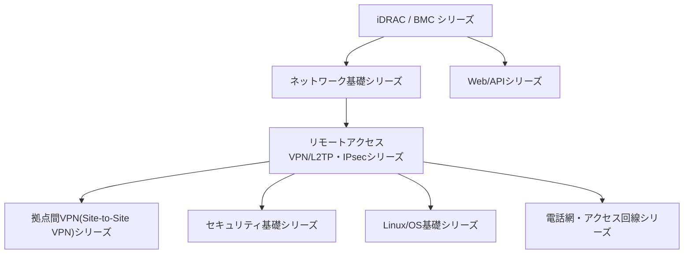

## このシリーズについて

このシリーズが目指しているのは、「AWSやGoogleのような最高峰のインフラ企業に在籍するインフラエンジニアの、さらに上位1%」の理解水準です。単なる操作手順の暗記ではなく、

- なぜそう設計されているのかという内部動作・設計思想
- 実務で起きるトラブルの切り分け方

までを、初心者からでも一歩ずつ登れるように徹底解説することを方針にしています。ボリュームが大きくなる場合は無理に1本にまとめず、テーマごとに記事を分割し、記事同士をリンクでつないでいます。このページは、その全記事の目次・読む順番のロードマップ・サイトマップです。新しいテーマの記事が増えるたびに、このページを更新していきます。

各記事はそれぞれ単体で読んでも完結するように書いています。深掘り系の記事（②③）から元になった記事（①）へ読者を差し戻すようなリンクは行わず、興味に応じて自由な順番で読めることを優先しています。逆に①側では、深掘りしたテーマがあれば②③へのリンクを埋め込んでいるので、より詳しく知りたい箇所があればそこから読み進めてください。

## 読む順番のおすすめ

以前はこのページに全記事を1つの巨大な図に詰め込んでいましたが、iDRACの記事を起点にすべての記事を連結する構成だと、特にVPN/L2TP・IPsecシリーズ以下が密集し過ぎて読みにくくなっていました。そこで、記事単位の派生関係は下記「シリーズ一覧」の各シリーズ内に閉じて示すことにし、この図は**シリーズ同士の大まかな関係**だけを示す全体マップにしています。

**基本的な読み方**: iDRACの記事を起点に、ネットワーク基礎シリーズとWeb/APIシリーズへ進み、ネットワーク基礎シリーズのL2TP/IPsecの記事からリモートアクセスVPN/L2TP・IPsecシリーズへ、そこから拠点間VPNシリーズ・セキュリティ基礎・Linux/OS基礎・電話網シリーズへと深掘りしていく、というのが記事同士の主な派生の流れです。ただし各記事は**すべて単体でも読める**ように書かれているため、興味のあるシリーズ・記事から読み始めて問題ありません。なお、ネットワーク基礎シリーズの一部記事(NAT/NAPT・代表IP・TCP/UDPセッション・DNS)はリモートアクセスVPN/L2TP・IPsecシリーズのL2TP/IPsecの記事から派生しており、シリーズ同士は一方向のツリーではなく一部相互に関係している点に注意してください。以前はリモートアクセスVPNと拠点間VPNを同じ「VPN/L2TP・IPsecシリーズ」にまとめていましたが、対象読者・用途が異なるため2つのシリーズに分割しました。

各シリーズ内でどの順番に読むべきかは、下記「シリーズ一覧」の各シリーズの説明文に記載しています(記事タイトルの前にある①②③…の番号が、そのシリーズ内での推奨読了順です)。目的別のおすすめルートは、次の「読者タイプ別のおすすめルート」にまとめています。

## 読者タイプ別のおすすめルート

このブログは、未経験からインフラエンジニアを目指す方から、年収5000万円以上を稼ぐAWS/Googleのトップエンジニアまで、幅広い読者を想定しています。全記事を必ず順番通りに読む必要はないため、キャリアの段階に応じた5つのルートを用意しました。**下のタブから自分に近いものを選ぶと、そのルートだけが表示されます**（②は①を、③は①②を、④は①②③を、⑤は①②③④を読了している前提の積み増しです)。実務のごく特定の場面でしか使わないニッチな記事は、無理にロードマップへ詰め込まず、それが実際に必要になる段階のルートで初めて紹介する形にしています(該当しない段階では「任意」として控えめに触れるだけです)。なお、この5段階の切り方は、今後追加予定のハンズオン教材の難易度分けにもそのまま対応させる予定です。

<input type="radio" name="persona-route" id="persona-tab-1" class="persona-input" checked>
<input type="radio" name="persona-route" id="persona-tab-2" class="persona-input">
<input type="radio" name="persona-route" id="persona-tab-3" class="persona-input">
<input type="radio" name="persona-route" id="persona-tab-4" class="persona-input">
<input type="radio" name="persona-route" id="persona-tab-5" class="persona-input">

<label for="persona-tab-1" class="persona-tab">STEP1 🌱 未経験から独学で目指す</label>
<label for="persona-tab-2" class="persona-tab">STEP2 🔧 1年目・設計構築デビュー</label>
<label for="persona-tab-3" class="persona-tab">STEP3 💪 現場で自信をつけたい</label>
<label for="persona-tab-4" class="persona-tab">STEP4 📈 高年収企業への転職</label>
<label for="persona-tab-5" class="persona-tab">STEP5 🏆 上位1%(年収1000万〜5000万)</label>

<h3>🌱 未経験からインフラエンジニアを独学で目指す方へ</h3>

資格の暗記ではなく、実際の現場で何がどう動いているかという土台を作るルートです。ここで扱う8記事が、他のすべてのルートの共通の出発点になります。

<ol class="persona-route-list">
<li><a href="/articles/idrac-guide">iDRACとは何か？その仕組みを『上位1%』の視点まで理解する</a></li>
<li><a href="/articles/network-stack-guide">ネットワークスタックの仕組みを『上位1%』の視点で理解する</a></li>
<li><a href="/articles/network-devices-guide">HUB・スイッチ(L2SW)・L3SW・ルーターの違いを『上位1%』の視点で理解する</a></li>
<li><a href="/articles/nat-guide">NAT/NAPTの仕組みを『上位1%』の視点で理解する</a></li>
<li><a href="/articles/dns-guide">DNSの仕組みを『上位1%』の視点で理解する</a></li>
<li><a href="/articles/circuit-switching-ppp-guide">電話回線とIPネットワークの違いを『上位1%』の視点で理解する</a></li>
<li><a href="/articles/access-network-guide">ADSL・光回線などアクセス回線の技術変遷を『上位1%』の視点で理解する</a></li>
<li><a href="/articles/restful-api-guide">RESTful APIとは何か？HTTP・JSONの基礎から実務設計まで『上位1%』の視点で理解する</a></li>
</ol>

<h3>🔧 インフラエンジニア1年目で設計構築の現場に挑戦したい方へ</h3>

STEP1の土台に、設計・構築の現場で必ず問われるVPN・暗号・証明書まわりを積み増すルートです。

<ol class="persona-route-list">
<li>STEP1の8記事(iDRAC〜RESTful API、上のタブから確認できます)</li>
<li><a href="/articles/l2tp-ipsec-guide">L2TP/IPsecの仕組みを『上位1%』の視点で理解する</a></li>
<li><a href="/articles/pki-guide">PKIとデジタル証明書の仕組みを『上位1%』の視点で理解する</a></li>
<li><a href="/articles/symmetric-encryption-guide">共通鍵暗号(AES)とHMAC/AEADの仕組みを『上位1%』の視点で理解する</a></li>
<li><a href="/articles/tcp-udp-session-port-guide">TCP/UDPの「セッション」とポート番号の関係を『上位1%』の視点で理解する</a></li>
<li><a href="/articles/vpn-protocols-comparison-guide">L2TP/IPsecと現代的なVPNプロトコルを『上位1%』の視点で比較する</a></li>
</ol>

🔍 <strong>現場で出会ったら(任意)</strong>: <a href="/articles/windows-server-l2tp-vpn-guide">Windows Server(RRAS)でのL2TP/IPsec VPN構築</a>や<a href="/articles/site-to-site-vpn-guide">拠点間VPN</a>、<a href="/articles/local-gov-network-guide">自治体ネットワークの三層分離</a>は、実務でその状況に当たった人向けのニッチな記事です。今すぐ読む必要はなく、検索でたどり着いたときや興味が湧いたときに読めば十分です(STEP3で本格的に扱います)。

<h3>💪 設計構築の現場で働いているが、いまいち自信が持てない方へ</h3>

「知ってるつもり」を実務で使える理解に変える段階です。STEP2までに加え、現場のニッチな疑問を解消する記事と、手を動かすハンズオンで自信をつけます。

<ol class="persona-route-list">
<li>STEP1・STEP2の13記事(上のタブから確認できます)</li>
<li><a href="/articles/windows-server-l2tp-vpn-guide">Windows Server(RRAS)でのL2TP/IPsec VPN構築とIPアドレス管理を『上位1%』の視点で理解する</a></li>
<li><a href="/articles/site-to-site-vpn-guide">拠点間VPN(Site-to-Site VPN)を『上位1%』の視点で理解する</a></li>
<li><a href="/articles/local-gov-network-guide">自治体ネットワークの三層分離とセキュリティクラウドを『上位1%』の視点で理解する</a></li>
<li><a href="/articles/virtual-ip-guide">代表IP(VIP)とNICチーミングの仮想IPの仕組みを『上位1%』の視点で理解する</a></li>
<li><a href="/articles/l2tp-ipsec-lab-guide">L2TP/IPsecサーバーを自作し、理論を自分の目で検証する『上位1%』のハンズオン</a></li>
</ol>

🔍 <strong>興味があれば(任意)</strong>: <a href="/articles/voip-ss7-guide">VoIPとSS7、そして実際の通信経路</a>は、電話網の歴史的経緯に興味が湧いたら読んでみてください。

<h3>📈 より年収の高い企業への転職を目指して勉強している方へ</h3>

STEP3までの実務知識に、面接や設計レビューで差がつく低レイヤーの実装知識を積み増すルートです。

<ol class="persona-route-list">
<li>STEP1〜STEP3の18記事(上のタブから確認できます)</li>
<li><a href="/articles/linux-daemon-guide">デーモン(daemon)とは何か——Linuxのバックグラウンドプロセスを『上位1%』の視点で理解する</a></li>
<li><a href="/articles/software-library-guide">ライブラリ(library)とは何か——静的リンク・動的リンクの仕組みを『上位1%』の視点で理解する</a></li>
<li><a href="/articles/linux-user-kernel-space-guide">ユーザー空間とカーネル空間、TUN/TAPデバイスの仕組みを『上位1%』の視点で理解する</a></li>
<li><a href="/articles/nic-driver-internals-guide">NICドライバとLinuxカーネルのネットワーク処理を『上位1%』の視点で理解する</a></li>
<li><a href="/articles/idrac-power-guide">サーバー電源の仕組みを『上位1%』の視点で理解する</a></li>
<li><a href="/articles/os-boot-process-guide">POST後のOS起動プロセスを『上位1%』の視点で理解する</a></li>
</ol>

<h3>🏆 年収1000万・2000万・5000万を目指して情報収集している方へ</h3>

全25記事を読み切り、シリーズ全体の設計思想を一貫して語れる状態を目指す、完全制覇ルートです。

<ol class="persona-route-list">
<li>STEP1〜STEP4の24記事(上のタブから確認できます)</li>
<li><a href="/articles/voip-ss7-guide">VoIPとSS7、そして実際の通信経路を『上位1%』の視点で理解する</a></li>
</ol>

🎉 <strong>これで全25記事読了です。</strong> シリーズ全体の構成は、次の「シリーズ一覧」でも振り返れます。

## シリーズ一覧

### iDRAC / BMC シリーズ

サーバーの帯域外管理（Out-of-Band管理）の仕組みを扱うシリーズです。**読む順番の目安**: ① idrac-guide → ② idrac-power-guide → ③ os-boot-process-guide。

- [iDRACとは何か？その仕組みを『上位1%』の視点まで理解する](/articles/idrac-guide) — iDRAC（BMC）の全体像、電源設計、ライセンス、セキュリティ、障害対応までの本編。
- [サーバー電源の仕組みを『上位1%』の視点で理解する](/articles/idrac-power-guide) — iDRACの電源設計を掘り下げた、AC/DC変換・PSU冗長化（A/Bグリッド・ホットスペア）の深掘り記事（単体でも読めます）。
- [POST後のOS起動プロセスを『上位1%』の視点で理解する](/articles/os-boot-process-guide) — POST完了後のブートローダー・initramfs・systemd(PID1)の仕組み、Secure Bootと測定起動の違いまでの深掘り（サーバー電源の記事のPOST/OS起動の話から派生した発展編、単体でも読めます）。

### ネットワーク基礎シリーズ

**読む順番の目安**: ① network-stack-guide → ② nic-driver-internals-guide → ③ network-devices-guide → ④ local-gov-network-guide → ⑤ virtual-ip-guide → ⑥ nat-guide → ⑦ tcp-udp-session-port-guide → ⑧ dns-guide。

- [ネットワークスタックの仕組みを『上位1%』の視点で理解する](/articles/network-stack-guide) — NICドライバ・IP・TCP/UDP・アプリケーション層の階層構造の深掘り。
- [NICドライバとLinuxカーネルのネットワーク処理を『上位1%』の視点で理解する](/articles/nic-driver-internals-guide) — 割り込み処理・DMA・オフロード機能・カーネルバイパスまでの発展編。
- [HUB・スイッチ(L2SW)・L3SW・ルーターの違いを『上位1%』の視点で理解する](/articles/network-devices-guide) — OSI階層と転送方式(MACアドレス表・VLAN・STP・ASIC/TCAM)による中継装置の使い分け。
- [自治体ネットワークの三層分離とセキュリティクラウドを『上位1%』の視点で理解する](/articles/local-gov-network-guide) — LGWAN接続系・マイナンバー利用事務系・インターネット接続系というVLAN/ファイアウォールによる実際のセグメント設計、自治体情報セキュリティクラウドまでの深掘り(network-devices-guideのVLANの話から派生した発展編、単体でも読めます)。
- [代表IP(VIP)とNICチーミングの仮想IPの仕組みを『上位1%』の視点で理解する](/articles/virtual-ip-guide) — IPテイクオーバーとロードバランサーのNAT変換という2つの代表IP実現方式の違い、NICチーミングの仮想IPまでの深掘り（冗長化構成のIPアドレス管理から派生した発展編、単体でも読めます）。
- [NAT/NAPTの仕組みを『上位1%』の視点で理解する](/articles/nat-guide) — 変換テーブルの内部動作、NATの挙動によるタイプ分類、NAT-Tの仕組みまでの深掘り（L2TP/IPsecのNATトラバーサルから派生した発展編、単体でも読めます）。
- [TCP/UDPの「セッション」とポート番号の関係を『上位1%』の視点で理解する](/articles/tcp-udp-session-port-guide) — TCPコネクションの状態機械としての実体、NAT/FWの疑似セッションとの違い、プロトコル番号とポート番号がなぜ1対1でないのかまでの深掘り（L2TP/IPsecのESP/ポート番号の話から派生した発展編、単体でも読めます）。
- [DNSの仕組みを『上位1%』の視点で理解する](/articles/dns-guide) — 名前解決の階層構造、再帰リゾルバと権威サーバーの役割分担、Windows/LinuxでのDNSサーバーの使い分け、VPN接続時のDNS解決までの深掘り（L2TP/IPsecのIPCPによるDNSサーバー払い出しから派生した発展編、単体でも読めます）。

### リモートアクセスVPN/L2TP・IPsecシリーズ

**読む順番の目安**: ① l2tp-ipsec-guide → ② windows-server-l2tp-vpn-guide → ③ vpn-protocols-comparison-guide → ④ l2tp-ipsec-lab-guide。

- [L2TP/IPsecの仕組みを『上位1%』の視点で理解する](/articles/l2tp-ipsec-guide) — L2TPとIPsecを組み合わせる理由、接続確立のシーケンス、NATトラバーサルまでの深掘り。
- [Windows Server(RRAS)でのL2TP/IPsec VPN構築とIPアドレス管理を『上位1%』の視点で理解する](/articles/windows-server-l2tp-vpn-guide) — RRASのアドレスプール、なぜ同一セグメントなのにゲートウェイが必要なのかまでの深掘り（L2TP/IPsecのWindows Server実装編、単体でも読めます）。
- [L2TP/IPsecと現代的なVPNプロトコルを『上位1%』の視点で比較する](/articles/vpn-protocols-comparison-guide) — IKEv2/IPsec・OpenVPN・WireGuardとの設計思想・実装規模・モバイル耐性の違いまでの深掘り（L2TP/IPsecがなぜレガシーと評されるのかを掘り下げた発展編、単体でも読めます）。
- [L2TP/IPsecサーバーを自作し、理論を自分の目で検証する『上位1%』のハンズオン](/articles/l2tp-ipsec-lab-guide) — Proxmox VE上にstrongSwan+xl2tpdでL2TP/IPsecサーバーを構築し、tcpdumpでの接続シーケンス検証・Windowsクライアントのルーティング確認・NAT-T誘発・性能ベースライン計測までを行う実践編。前提3記事(①②③)を読了済みであることを前提としています(本シリーズでは例外的な実機構築のハンズオン記事です)。

### 拠点間VPN(Site-to-Site VPN)シリーズ

リモートアクセスVPN/L2TP・IPsecシリーズの①を読んだ前提の発展シリーズです。**読む順番の目安**: ① site-to-site-vpn-guide。

- [拠点間VPN(Site-to-Site VPN)を『上位1%』の視点で理解する](/articles/site-to-site-vpn-guide) — リモートアクセスVPNとの違い、IPsecトンネルモードとトラフィックセレクタの仕組み、CiscoとWatchGuardという異なるベンダー間でIPsecトンネルを組む際の実務上の注意点までの深掘り（L2TP/IPsecとの対比から派生した発展編、単体でも読めます）。

### Linux/OS基礎シリーズ

VPNプロトコルの記事などで繰り返し登場する、実行環境レベルの基礎用語を深掘りするシリーズです。**読む順番の目安**: ① linux-daemon-guide → ② software-library-guide → ③ linux-user-kernel-space-guide。

- [デーモン(daemon)とは何か——Linuxのバックグラウンドプロセスを『上位1%』の視点で理解する](/articles/linux-daemon-guide) — 通常のプロセスとの違い、IKEデーモンなどプロトコル処理がデーモンとして実装される理由、systemdによる起動・監視・ログの仕組みまでの深掘り（現代的なVPNプロトコルとの比較の記事のデーモンの話から派生した発展編、単体でも読めます）。
- [ライブラリ(library)とは何か——静的リンク・動的リンクの仕組みを『上位1%』の視点で理解する](/articles/software-library-guide) — 静的リンクと動的リンク(共有ライブラリ)の違い、シンボル解決の仕組み、ABI互換性が障害要因になる理由までの深掘り（現代的なVPNプロトコルとの比較の記事のOpenSSLの話から派生した発展編、単体でも読めます）。
- [ユーザー空間とカーネル空間、TUN/TAPデバイスの仕組みを『上位1%』の視点で理解する](/articles/linux-user-kernel-space-guide) — CPUの特権レベルによる空間分離、システムコールとコンテキストスイッチ、OpenVPNが使うTUN/TAPデバイスの仕組みまでの深掘り（現代的なVPNプロトコルとの比較の記事のユーザー空間実装の話から派生した発展編、単体でも読めます）。

### 電話網・アクセス回線シリーズ

**読む順番の目安**: ① circuit-switching-ppp-guide → ② access-network-guide → ③ voip-ss7-guide。

- [電話回線とIPネットワークの違いを『上位1%』の視点で理解する](/articles/circuit-switching-ppp-guide) — 回線交換とパケット交換の違い、PPPが生まれた歴史的背景からPPPoE/L2TPへの流用、CHAP/MS-CHAPv2のチャレンジレスポンス認証の内部動作までの深掘り（L2TP/IPsecのPPPの話から派生した発展編、単体でも読めます）。
- [ADSL・光回線などアクセス回線の技術変遷を『上位1%』の視点で理解する](/articles/access-network-guide) — 電話回線・ADSL・光回線(FTTH)というアクセス回線の実現方式の違い、PON方式の仕組み、イーサネットとIPネットワークの関係までの深掘り（電話回線とPPPの記事から派生した発展編、単体でも読めます）。
- [VoIPとSS7、そして実際の通信経路を『上位1%』の視点で理解する](/articles/voip-ss7-guide) — SS7による呼制御(シグナリング)とVoIPによる音声伝送(メディア)の分離、SIP/RTPの仕組み、自宅PCがインターネット上のサービスにアクセスするまでの実際の経路までの深掘り（電話回線とPPPの記事から派生した発展編、単体でも読めます）。

### Web / API シリーズ

- [RESTful APIとは何か？HTTP・JSONの基礎から実務設計まで『上位1%』の視点で理解する](/articles/restful-api-guide) — HTTP・REST・JSON・認証・べき等性・ページネーションの深掘り。

### セキュリティ基礎シリーズ

**読む順番の目安**: ① pki-guide → ② symmetric-encryption-guide。

- [PKIとデジタル証明書の仕組みを『上位1%』の視点で理解する](/articles/pki-guide) — 公開鍵暗号・Diffie-Hellman鍵交換・デジタル署名・CSR・証明書チェーンの検証までの深掘り（L2TP/IPsecの証明書認証からの発展編、単体でも読めます）。
- [共通鍵暗号(AES)とHMAC/AEADの仕組みを『上位1%』の視点で理解する](/articles/symmetric-encryption-guide) — ブロック暗号の仕組み、CBC/CTR/GCMといった暗号利用モードの違い、HMACによる改ざん検知までの深掘り（L2TP/IPsecのESP暗号化からの発展編、単体でも読めます）。

## 今後の展開予定

iDRAC関連のシリーズが一区切りついたあとは、別テーマ（未定）のシリーズを追加していく予定です。新しいシリーズを追加したら、`templates/article-prompt-template.md`のテーマ欄を書き換えて執筆に入り、完成したらこのページにも追記します。
