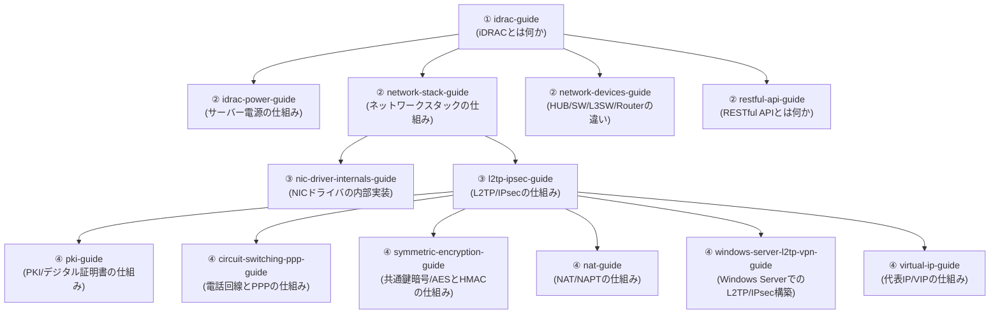

## このシリーズについて

このシリーズが目指しているのは、「AWSやGoogleのような最高峰のインフラ企業に在籍するインフラエンジニアの、さらに上位1%」の理解水準です。単なる操作手順の暗記ではなく、

- なぜそう設計されているのかという内部動作・設計思想
- 実務で起きるトラブルの切り分け方

までを、初心者からでも一歩ずつ登れるように徹底解説することを方針にしています。ボリュームが大きくなる場合は無理に1本にまとめず、テーマごとに記事を分割し、記事同士をリンクでつないでいます。このページは、その全記事の目次・読む順番のロードマップ・サイトマップです。新しいテーマの記事が増えるたびに、このページを更新していきます。

各記事はそれぞれ単体で読んでも完結するように書いています。深掘り系の記事（②③）から元になった記事（①）へ読者を差し戻すようなリンクは行わず、興味に応じて自由な順番で読めることを優先しています。逆に①側では、深掘りしたテーマがあれば②③へのリンクを埋め込んでいるので、より詳しく知りたい箇所があればそこから読み進めてください。

## 読む順番のおすすめ

まず①のiDRACの記事を起点に、興味・必要に応じて②の各深掘り記事（電源・ネットワーク・API）へ進む、という順番を想定しています。②の3本はそれぞれ独立して読める内容なので、順不同で構いません。③はネットワークスタックの記事からさらに一段深く掘り下げた発展編（NICドライバの内部実装、L2TP/IPsecの仕組み）で、②のネットワーク記事を読んだ後の実力試しとして読むのがおすすめです。④の6本は、いずれもL2TP/IPsecの記事で扱いきれなかったテーマを深掘りした発展編ですが、**すべて単体でも読める内容**です。PKI/デジタル証明書、共通鍵暗号(AES/HMAC)、NAT/NAPTの3本は、L2TP/IPsecに限らずTLS/SSHなど幅広い場面で使われる汎用的な技術テーマです。電話回線とPPPの記事は、L2TP/IPsecがなぜダイヤルアップ時代のPPPを流用しているのかという歴史的背景と、MS-CHAPv2認証の内部動作を扱っています。Windows Server(RRAS)でのL2TP/IPsec構築、代表IP(VIP)の記事は、実際にVPNサーバーを構築・運用する場面でぶつかる、より実装寄りのテーマを扱っています。

## シリーズ一覧

### iDRAC / BMC シリーズ

サーバーの帯域外管理（Out-of-Band管理）の仕組みを扱うシリーズです。

- [iDRACとは何か？その仕組みを『上位1%』の視点まで理解する](/articles/idrac-guide) — iDRAC（BMC）の全体像、電源設計、ライセンス、セキュリティ、障害対応までの本編。
- [サーバー電源の仕組みを『上位1%』の視点で理解する](/articles/idrac-power-guide) — iDRACの電源設計を掘り下げた、AC/DC変換・PSU冗長化（A/Bグリッド・ホットスペア）の深掘り記事（単体でも読めます）。

### ネットワーク基礎シリーズ

- [ネットワークスタックの仕組みを『上位1%』の視点で理解する](/articles/network-stack-guide) — NICドライバ・IP・TCP/UDP・アプリケーション層の階層構造の深掘り。
- [HUB・スイッチ(L2SW)・L3SW・ルーターの違いを『上位1%』の視点で理解する](/articles/network-devices-guide) — OSI階層と転送方式(MACアドレス表・VLAN・STP・ASIC/TCAM)による中継装置の使い分け。
- [NICドライバとLinuxカーネルのネットワーク処理を『上位1%』の視点で理解する](/articles/nic-driver-internals-guide) — 割り込み処理・DMA・オフロード機能・カーネルバイパスまでの発展編。
- [L2TP/IPsecの仕組みを『上位1%』の視点で理解する](/articles/l2tp-ipsec-guide) — L2TPとIPsecを組み合わせる理由、接続確立のシーケンス、NATトラバーサルまでの深掘り。
- [電話回線とIPネットワークの違いを『上位1%』の視点で理解する](/articles/circuit-switching-ppp-guide) — 回線交換とパケット交換の違い、PPPが生まれた歴史的背景からPPPoE/L2TPへの流用、CHAP/MS-CHAPv2のチャレンジレスポンス認証の内部動作までの深掘り（L2TP/IPsecのPPPの話から派生した発展編、単体でも読めます）。
- [NAT/NAPTの仕組みを『上位1%』の視点で理解する](/articles/nat-guide) — 変換テーブルの内部動作、NATの挙動によるタイプ分類、NAT-Tの仕組みまでの深掘り（L2TP/IPsecのNATトラバーサルから派生した発展編、単体でも読めます）。
- [代表IP(VIP)とNICチーミングの仮想IPの仕組みを『上位1%』の視点で理解する](/articles/virtual-ip-guide) — IPテイクオーバーとロードバランサーのNAT変換という2つの代表IP実現方式の違い、NICチーミングの仮想IPまでの深掘り（冗長化構成のIPアドレス管理から派生した発展編、単体でも読めます）。
- [Windows Server(RRAS)でのL2TP/IPsec VPN構築とIPアドレス管理を『上位1%』の視点で理解する](/articles/windows-server-l2tp-vpn-guide) — RRASのアドレスプール、なぜ同一セグメントなのにゲートウェイが必要なのかまでの深掘り（L2TP/IPsecのWindows Server実装編、単体でも読めます）。

### Web / API シリーズ

- [RESTful APIとは何か？HTTP・JSONの基礎から実務設計まで『上位1%』の視点で理解する](/articles/restful-api-guide) — HTTP・REST・JSON・認証・べき等性・ページネーションの深掘り。

### セキュリティ基礎シリーズ

- [PKIとデジタル証明書の仕組みを『上位1%』の視点で理解する](/articles/pki-guide) — 公開鍵暗号・Diffie-Hellman鍵交換・デジタル署名・CSR・証明書チェーンの検証までの深掘り（L2TP/IPsecの証明書認証からの発展編、単体でも読めます）。
- [共通鍵暗号(AES)とHMAC/AEADの仕組みを『上位1%』の視点で理解する](/articles/symmetric-encryption-guide) — ブロック暗号の仕組み、CBC/CTR/GCMといった暗号利用モードの違い、HMACによる改ざん検知までの深掘り（L2TP/IPsecのESP暗号化からの発展編、単体でも読めます）。

## 今後の展開予定

iDRAC関連のシリーズが一区切りついたあとは、別テーマ（未定）のシリーズを追加していく予定です。新しいシリーズを追加したら、`templates/article-prompt-template.md`のテーマ欄を書き換えて執筆に入り、完成したらこのページにも追記します。
